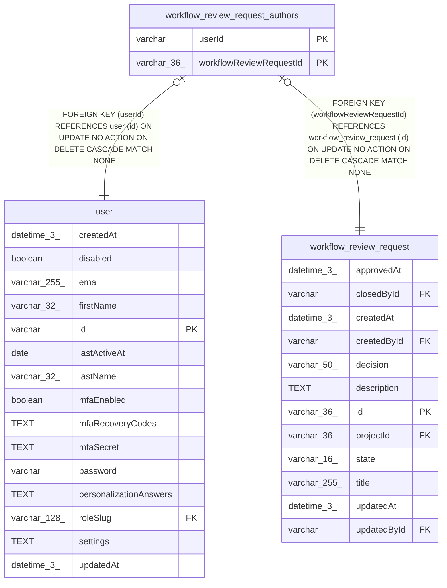

# workflow_review_request_authors

## Description

<details>
<summary><strong>Table Definition</strong></summary>

```sql
CREATE TABLE "workflow_review_request_authors" ("workflowReviewRequestId" varchar(36) NOT NULL, "userId" varchar NOT NULL, CONSTRAINT "FK_c255ae5087010c1ab73ac8684af" FOREIGN KEY ("workflowReviewRequestId") REFERENCES "workflow_review_request" ("id") ON DELETE CASCADE, CONSTRAINT "FK_a9c79ab0c352aa0496c39ea56a4" FOREIGN KEY ("userId") REFERENCES "user" ("id") ON DELETE CASCADE, PRIMARY KEY ("workflowReviewRequestId", "userId"))
```

</details>

## Columns

| Name | Type | Default | Nullable | Children | Parents | Comment |
| ---- | ---- | ------- | -------- | -------- | ------- | ------- |
| userId | varchar |  | false |  | [user](user.md) |  |
| workflowReviewRequestId | varchar(36) |  | false |  | [workflow_review_request](workflow_review_request.md) |  |

## Constraints

| Name | Type | Definition |
| ---- | ---- | ---------- |
| - (Foreign key ID: 0) | FOREIGN KEY | FOREIGN KEY (userId) REFERENCES user (id) ON UPDATE NO ACTION ON DELETE CASCADE MATCH NONE |
| - (Foreign key ID: 1) | FOREIGN KEY | FOREIGN KEY (workflowReviewRequestId) REFERENCES workflow_review_request (id) ON UPDATE NO ACTION ON DELETE CASCADE MATCH NONE |
| sqlite_autoindex_workflow_review_request_authors_1 | PRIMARY KEY | PRIMARY KEY (workflowReviewRequestId, userId) |
| userId | PRIMARY KEY | PRIMARY KEY (userId) |
| workflowReviewRequestId | PRIMARY KEY | PRIMARY KEY (workflowReviewRequestId) |

## Indexes

| Name | Definition |
| ---- | ---------- |
| sqlite_autoindex_workflow_review_request_authors_1 | PRIMARY KEY (workflowReviewRequestId, userId) |

## Relations



---

> Generated by [tbls](https://github.com/k1LoW/tbls)
