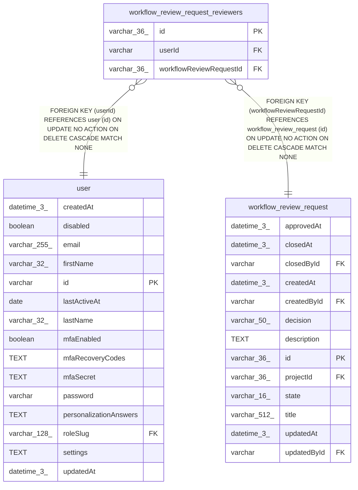

# workflow_review_request_reviewers

## Description

<details>
<summary><strong>Table Definition</strong></summary>

```sql
CREATE TABLE "workflow_review_request_reviewers" ("id" varchar(36) PRIMARY KEY NOT NULL, "workflowReviewRequestId" varchar(36) NOT NULL, "userId" varchar NOT NULL, CONSTRAINT "FK_ba29e1cc5cdba43ce7b810b3ddd" FOREIGN KEY ("workflowReviewRequestId") REFERENCES "workflow_review_request" ("id") ON DELETE CASCADE, CONSTRAINT "FK_81d0a2584aa4e8e5e0d6aa68f32" FOREIGN KEY ("userId") REFERENCES "user" ("id") ON DELETE CASCADE)
```

</details>

## Columns

| Name | Type | Default | Nullable | Children | Parents | Comment |
| ---- | ---- | ------- | -------- | -------- | ------- | ------- |
| id | varchar(36) |  | false |  |  |  |
| userId | varchar |  | false |  | [user](user.md) |  |
| workflowReviewRequestId | varchar(36) |  | false |  | [workflow_review_request](workflow_review_request.md) |  |

## Constraints

| Name | Type | Definition |
| ---- | ---- | ---------- |
| - (Foreign key ID: 0) | FOREIGN KEY | FOREIGN KEY (userId) REFERENCES user (id) ON UPDATE NO ACTION ON DELETE CASCADE MATCH NONE |
| - (Foreign key ID: 1) | FOREIGN KEY | FOREIGN KEY (workflowReviewRequestId) REFERENCES workflow_review_request (id) ON UPDATE NO ACTION ON DELETE CASCADE MATCH NONE |
| id | PRIMARY KEY | PRIMARY KEY (id) |
| sqlite_autoindex_workflow_review_request_reviewers_1 | PRIMARY KEY | PRIMARY KEY (id) |

## Indexes

| Name | Definition |
| ---- | ---------- |
| UQ_workflow_review_request_reviewers_request_user | CREATE UNIQUE INDEX "UQ_workflow_review_request_reviewers_request_user"<br />			ON "workflow_review_request_reviewers"("workflowReviewRequestId", "userId") |
| sqlite_autoindex_workflow_review_request_reviewers_1 | PRIMARY KEY (id) |

## Relations



---

> Generated by [tbls](https://github.com/k1LoW/tbls)
