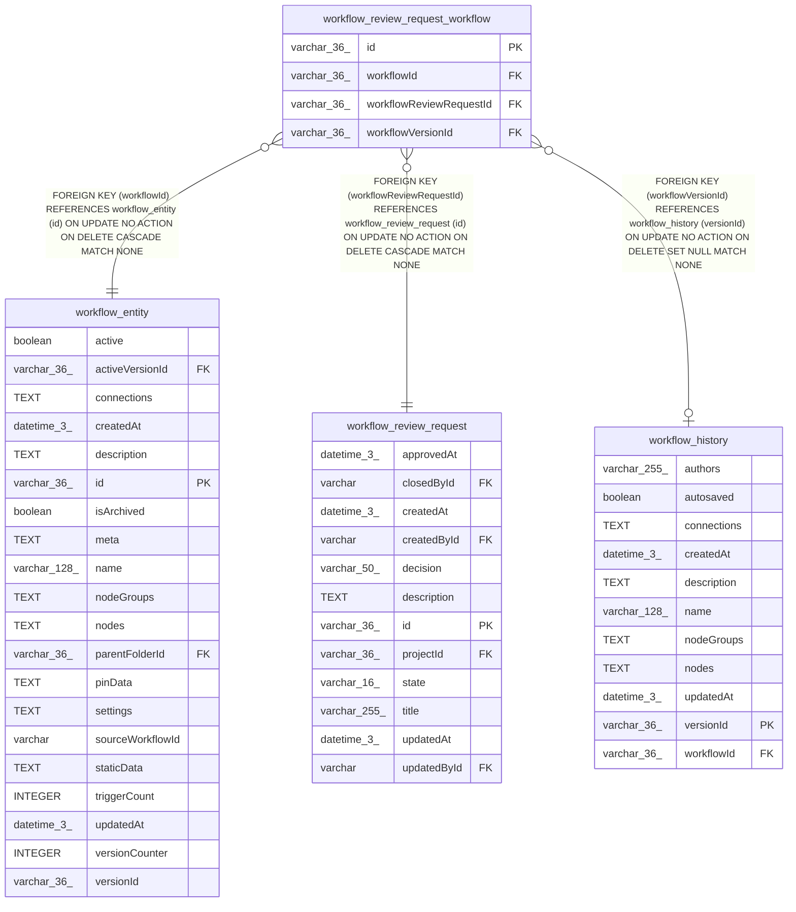

# workflow_review_request_workflow

## Description

<details>
<summary><strong>Table Definition</strong></summary>

```sql
CREATE TABLE "workflow_review_request_workflow" ("id" varchar(36) PRIMARY KEY NOT NULL, "workflowReviewRequestId" varchar(36) NOT NULL, "workflowId" varchar(36) NOT NULL, "workflowVersionId" varchar(36), CONSTRAINT "FK_e44b652e6dc99ef1364a2d85504" FOREIGN KEY ("workflowReviewRequestId") REFERENCES "workflow_review_request" ("id") ON DELETE CASCADE, CONSTRAINT "FK_619f5b0544bcec60c3387e82f2f" FOREIGN KEY ("workflowId") REFERENCES "workflow_entity" ("id") ON DELETE CASCADE, CONSTRAINT "FK_0f6f0f2c6d46b806fee02962ac2" FOREIGN KEY ("workflowVersionId") REFERENCES "workflow_history" ("versionId") ON DELETE SET NULL)
```

</details>

## Columns

| Name | Type | Default | Nullable | Children | Parents | Comment |
| ---- | ---- | ------- | -------- | -------- | ------- | ------- |
| id | varchar(36) |  | false |  |  |  |
| workflowId | varchar(36) |  | false |  | [workflow_entity](workflow_entity.md) |  |
| workflowReviewRequestId | varchar(36) |  | false |  | [workflow_review_request](workflow_review_request.md) |  |
| workflowVersionId | varchar(36) |  | true |  | [workflow_history](workflow_history.md) |  |

## Constraints

| Name | Type | Definition |
| ---- | ---- | ---------- |
| - (Foreign key ID: 0) | FOREIGN KEY | FOREIGN KEY (workflowVersionId) REFERENCES workflow_history (versionId) ON UPDATE NO ACTION ON DELETE SET NULL MATCH NONE |
| - (Foreign key ID: 1) | FOREIGN KEY | FOREIGN KEY (workflowId) REFERENCES workflow_entity (id) ON UPDATE NO ACTION ON DELETE CASCADE MATCH NONE |
| - (Foreign key ID: 2) | FOREIGN KEY | FOREIGN KEY (workflowReviewRequestId) REFERENCES workflow_review_request (id) ON UPDATE NO ACTION ON DELETE CASCADE MATCH NONE |
| id | PRIMARY KEY | PRIMARY KEY (id) |
| sqlite_autoindex_workflow_review_request_workflow_1 | PRIMARY KEY | PRIMARY KEY (id) |

## Indexes

| Name | Definition |
| ---- | ---------- |
| IDX_workflow_review_request_workflow_workflow_request | CREATE INDEX "IDX_workflow_review_request_workflow_workflow_request"<br />			ON "workflow_review_request_workflow"("workflowId", "workflowReviewRequestId") |
| UQ_workflow_review_request_workflow_request_workflow | CREATE UNIQUE INDEX "UQ_workflow_review_request_workflow_request_workflow"<br />			ON "workflow_review_request_workflow"("workflowReviewRequestId", "workflowId") |
| sqlite_autoindex_workflow_review_request_workflow_1 | PRIMARY KEY (id) |

## Relations



---

> Generated by [tbls](https://github.com/k1LoW/tbls)
