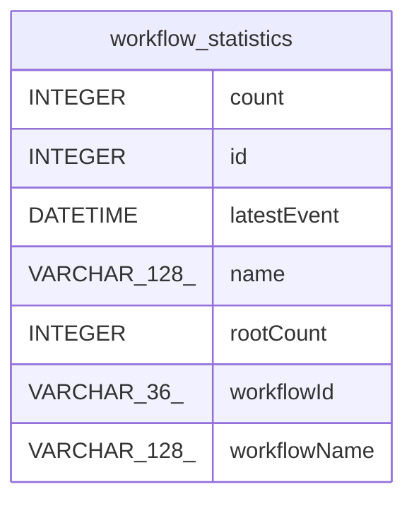

# workflow_statistics

## Description

<details>
<summary><strong>Table Definition</strong></summary>

```sql
CREATE TABLE "workflow_statistics" (
				"id" INTEGER PRIMARY KEY AUTOINCREMENT,
				"count" INTEGER DEFAULT 0,
				"latestEvent" DATETIME,
				"name" VARCHAR(128) NOT NULL,
				"workflowId" VARCHAR(36) NOT NULL,
				"workflowName" VARCHAR(128),
				"rootCount" INTEGER DEFAULT 0
			)
```

</details>

## Columns

| Name | Type | Default | Nullable | Children | Parents | Comment |
| ---- | ---- | ------- | -------- | -------- | ------- | ------- |
| count | INTEGER | 0 | true |  |  |  |
| id | INTEGER |  | true |  |  |  |
| latestEvent | DATETIME |  | true |  |  |  |
| name | VARCHAR(128) |  | false |  |  |  |
| rootCount | INTEGER | 0 | true |  |  |  |
| workflowId | VARCHAR(36) |  | false |  |  |  |
| workflowName | VARCHAR(128) |  | true |  |  |  |

## Constraints

| Name | Type | Definition |
| ---- | ---- | ---------- |
| id | PRIMARY KEY | PRIMARY KEY (id) |

## Indexes

| Name | Definition |
| ---- | ---------- |
| IDX_workflow_statistics_workflow_name | CREATE UNIQUE INDEX "IDX_workflow_statistics_workflow_name" ON "workflow_statistics" ("workflowId", "name") |

## Relations



---

> Generated by [tbls](https://github.com/k1LoW/tbls)
