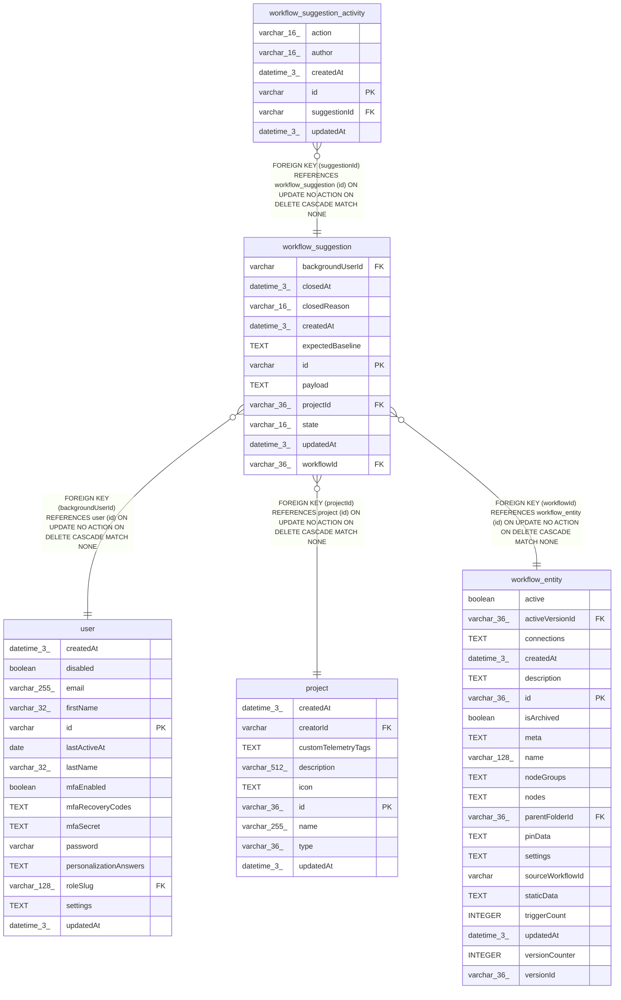

# workflow_suggestion

## Description

<details>
<summary><strong>Table Definition</strong></summary>

```sql
CREATE TABLE "workflow_suggestion" ("id" varchar PRIMARY KEY NOT NULL, "workflowId" varchar(36) NOT NULL, "projectId" varchar(36) NOT NULL, "backgroundUserId" varchar NOT NULL, "expectedBaseline" text NOT NULL, "state" varchar(16) NOT NULL, "closedReason" varchar(16), "closedAt" datetime(3), "payload" text NOT NULL, "createdAt" datetime(3) NOT NULL DEFAULT (STRFTIME('%Y-%m-%d %H:%M:%f', 'NOW')), "updatedAt" datetime(3) NOT NULL DEFAULT (STRFTIME('%Y-%m-%d %H:%M:%f', 'NOW')), CONSTRAINT "CHK_workflow_suggestion_state" CHECK ("state" IN ('pending', 'closed')), CONSTRAINT "CHK_workflow_suggestion_closedReason" CHECK ("closedReason" IN ('outdated', 'applied', 'discarded')), CONSTRAINT "FK_f6289858234727cdff168626dc9" FOREIGN KEY ("workflowId") REFERENCES "workflow_entity" ("id") ON DELETE CASCADE, CONSTRAINT "FK_0f273c2cd9e1a097a8ba044fe9a" FOREIGN KEY ("projectId") REFERENCES "project" ("id") ON DELETE CASCADE, CONSTRAINT "FK_b415d749769e092f51575def2d2" FOREIGN KEY ("backgroundUserId") REFERENCES "user" ("id") ON DELETE CASCADE)
```

</details>

## Columns

| Name | Type | Default | Nullable | Children | Parents | Comment |
| ---- | ---- | ------- | -------- | -------- | ------- | ------- |
| backgroundUserId | varchar |  | false |  | [user](user.md) |  |
| closedAt | datetime(3) |  | true |  |  |  |
| closedReason | varchar(16) |  | true |  |  |  |
| createdAt | datetime(3) | STRFTIME('%Y-%m-%d %H:%M:%f', 'NOW') | false |  |  |  |
| expectedBaseline | TEXT |  | false |  |  |  |
| id | varchar |  | false | [workflow_suggestion_activity](workflow_suggestion_activity.md) |  |  |
| payload | TEXT |  | false |  |  |  |
| projectId | varchar(36) |  | false |  | [project](project.md) |  |
| state | varchar(16) |  | false |  |  |  |
| updatedAt | datetime(3) | STRFTIME('%Y-%m-%d %H:%M:%f', 'NOW') | false |  |  |  |
| workflowId | varchar(36) |  | false |  | [workflow_entity](workflow_entity.md) |  |

## Constraints

| Name | Type | Definition |
| ---- | ---- | ---------- |
| - | CHECK | CHECK ("state" IN ('pending', 'closed')) |
| - | CHECK | CHECK ("closedReason" IN ('outdated', 'applied', 'discarded')) |
| - (Foreign key ID: 0) | FOREIGN KEY | FOREIGN KEY (backgroundUserId) REFERENCES user (id) ON UPDATE NO ACTION ON DELETE CASCADE MATCH NONE |
| - (Foreign key ID: 1) | FOREIGN KEY | FOREIGN KEY (projectId) REFERENCES project (id) ON UPDATE NO ACTION ON DELETE CASCADE MATCH NONE |
| - (Foreign key ID: 2) | FOREIGN KEY | FOREIGN KEY (workflowId) REFERENCES workflow_entity (id) ON UPDATE NO ACTION ON DELETE CASCADE MATCH NONE |
| id | PRIMARY KEY | PRIMARY KEY (id) |
| sqlite_autoindex_workflow_suggestion_1 | PRIMARY KEY | PRIMARY KEY (id) |

## Indexes

| Name | Definition |
| ---- | ---------- |
| IDX_0494cd7ecbc83cd7935d88b129 | CREATE INDEX "IDX_0494cd7ecbc83cd7935d88b129" ON "workflow_suggestion" ("state", "closedAt")  |
| IDX_0f273c2cd9e1a097a8ba044fe9 | CREATE INDEX "IDX_0f273c2cd9e1a097a8ba044fe9" ON "workflow_suggestion" ("projectId")  |
| IDX_b415d749769e092f51575def2d | CREATE INDEX "IDX_b415d749769e092f51575def2d" ON "workflow_suggestion" ("backgroundUserId")  |
| IDX_f6289858234727cdff168626dc | CREATE INDEX "IDX_f6289858234727cdff168626dc" ON "workflow_suggestion" ("workflowId")  |
| IDX_workflow_suggestion_workflowId | CREATE UNIQUE INDEX "IDX_workflow_suggestion_workflowId" ON "workflow_suggestion" ("workflowId") WHERE "state" = 'pending' |
| sqlite_autoindex_workflow_suggestion_1 | PRIMARY KEY (id) |

## Relations



---

> Generated by [tbls](https://github.com/k1LoW/tbls)
