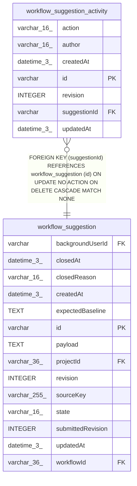

# workflow_suggestion_activity

## Description

<details>
<summary><strong>Table Definition</strong></summary>

```sql
CREATE TABLE "workflow_suggestion_activity" ("id" varchar PRIMARY KEY NOT NULL, "suggestionId" varchar NOT NULL, "action" varchar(16) NOT NULL, "author" varchar(16) NOT NULL, "revision" integer NOT NULL, "createdAt" datetime(3) NOT NULL DEFAULT (STRFTIME('%Y-%m-%d %H:%M:%f', 'NOW')), "updatedAt" datetime(3) NOT NULL DEFAULT (STRFTIME('%Y-%m-%d %H:%M:%f', 'NOW')), CONSTRAINT "CHK_workflow_suggestion_activity_action" CHECK ("action" IN ('submitted')), CONSTRAINT "CHK_workflow_suggestion_activity_author" CHECK ("author" IN ('assistant')), CONSTRAINT "FK_c9a28e6f7349dc4950aeb858692" FOREIGN KEY ("suggestionId") REFERENCES "workflow_suggestion" ("id") ON DELETE CASCADE)
```

</details>

## Columns

| Name | Type | Default | Nullable | Children | Parents | Comment |
| ---- | ---- | ------- | -------- | -------- | ------- | ------- |
| action | varchar(16) |  | false |  |  |  |
| author | varchar(16) |  | false |  |  |  |
| createdAt | datetime(3) | STRFTIME('%Y-%m-%d %H:%M:%f', 'NOW') | false |  |  |  |
| id | varchar |  | false |  |  |  |
| revision | INTEGER |  | false |  |  |  |
| suggestionId | varchar |  | false |  | [workflow_suggestion](workflow_suggestion.md) |  |
| updatedAt | datetime(3) | STRFTIME('%Y-%m-%d %H:%M:%f', 'NOW') | false |  |  |  |

## Constraints

| Name | Type | Definition |
| ---- | ---- | ---------- |
| - | CHECK | CHECK ("action" IN ('submitted')) |
| - | CHECK | CHECK ("author" IN ('assistant')) |
| - (Foreign key ID: 0) | FOREIGN KEY | FOREIGN KEY (suggestionId) REFERENCES workflow_suggestion (id) ON UPDATE NO ACTION ON DELETE CASCADE MATCH NONE |
| id | PRIMARY KEY | PRIMARY KEY (id) |
| sqlite_autoindex_workflow_suggestion_activity_1 | PRIMARY KEY | PRIMARY KEY (id) |

## Indexes

| Name | Definition |
| ---- | ---------- |
| IDX_a8ffa8017c56cb2920a47cc92a | CREATE UNIQUE INDEX "IDX_a8ffa8017c56cb2920a47cc92a" ON "workflow_suggestion_activity" ("suggestionId", "action")  |
| sqlite_autoindex_workflow_suggestion_activity_1 | PRIMARY KEY (id) |

## Relations



---

> Generated by [tbls](https://github.com/k1LoW/tbls)
