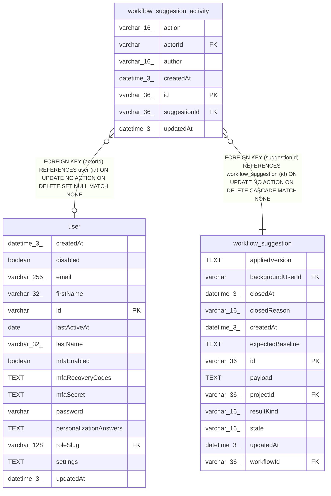

# workflow_suggestion_activity

## Description

<details>
<summary><strong>Table Definition</strong></summary>

```sql
CREATE TABLE "workflow_suggestion_activity" ("id" varchar(36) PRIMARY KEY NOT NULL, "suggestionId" varchar(36) NOT NULL, "action" varchar(16) NOT NULL, "author" varchar(16) NOT NULL, "createdAt" datetime(3) NOT NULL DEFAULT (STRFTIME('%Y-%m-%d %H:%M:%f', 'NOW')), "updatedAt" datetime(3) NOT NULL DEFAULT (STRFTIME('%Y-%m-%d %H:%M:%f', 'NOW')), "actorId" varchar, CONSTRAINT "CHK_workflow_suggestion_activity_action" CHECK (("action" IN ('submitted', 'applied', 'discarded', 'outdated', 'published', 'publish_failed'))), CONSTRAINT "CHK_workflow_suggestion_activity_author" CHECK (("author" IN ('assistant', 'human', 'system'))), CONSTRAINT "FK_c9a28e6f7349dc4950aeb858692" FOREIGN KEY ("suggestionId") REFERENCES "workflow_suggestion" ("id") ON DELETE CASCADE ON UPDATE NO ACTION, CONSTRAINT "FK_workflow_suggestion_activity_actor" FOREIGN KEY ("actorId") REFERENCES "user" ("id") ON DELETE SET NULL)
```

</details>

## Columns

| Name | Type | Default | Nullable | Children | Parents | Comment |
| ---- | ---- | ------- | -------- | -------- | ------- | ------- |
| action | varchar(16) |  | false |  |  |  |
| actorId | varchar |  | true |  | [user](user.md) |  |
| author | varchar(16) |  | false |  |  |  |
| createdAt | datetime(3) | STRFTIME('%Y-%m-%d %H:%M:%f', 'NOW') | false |  |  |  |
| id | varchar(36) |  | false |  |  |  |
| suggestionId | varchar(36) |  | false |  | [workflow_suggestion](workflow_suggestion.md) |  |
| updatedAt | datetime(3) | STRFTIME('%Y-%m-%d %H:%M:%f', 'NOW') | false |  |  |  |

## Constraints

| Name | Type | Definition |
| ---- | ---- | ---------- |
| - | CHECK | CHECK (("action" IN ('submitted', 'applied', 'discarded', 'outdated', 'published', 'publish_failed'))) |
| - | CHECK | CHECK (("author" IN ('assistant', 'human', 'system'))) |
| - (Foreign key ID: 0) | FOREIGN KEY | FOREIGN KEY (actorId) REFERENCES user (id) ON UPDATE NO ACTION ON DELETE SET NULL MATCH NONE |
| - (Foreign key ID: 1) | FOREIGN KEY | FOREIGN KEY (suggestionId) REFERENCES workflow_suggestion (id) ON UPDATE NO ACTION ON DELETE CASCADE MATCH NONE |
| id | PRIMARY KEY | PRIMARY KEY (id) |
| sqlite_autoindex_workflow_suggestion_activity_1 | PRIMARY KEY | PRIMARY KEY (id) |

## Indexes

| Name | Definition |
| ---- | ---------- |
| IDX_a8ffa8017c56cb2920a47cc92a | CREATE UNIQUE INDEX "IDX_a8ffa8017c56cb2920a47cc92a" ON "workflow_suggestion_activity" ("suggestionId", "action")  |
| IDX_workflow_suggestion_activity_actorId | CREATE INDEX "IDX_workflow_suggestion_activity_actorId" ON "workflow_suggestion_activity" ("actorId")  |
| sqlite_autoindex_workflow_suggestion_activity_1 | PRIMARY KEY (id) |

## Relations


```mermaid
erDiagram

"workflow_suggestion_activity" }o--o| "user" : "FOREIGN KEY (actorId) REFERENCES user (id) ON UPDATE NO ACTION ON DELETE SET NULL MATCH NONE"
"workflow_suggestion_activity" }o--|| "workflow_suggestion" : "FOREIGN KEY (suggestionId) REFERENCES workflow_suggestion (id) ON UPDATE NO ACTION ON DELETE CASCADE MATCH NONE"

"workflow_suggestion_activity" {
  varchar_16_ action
  varchar actorId FK
  varchar_16_ author
  datetime_3_ createdAt
  varchar_36_ id PK
  varchar_36_ suggestionId FK
  datetime_3_ updatedAt
}
"user" {
  datetime_3_ createdAt
  boolean disabled
  varchar_255_ email
  varchar_32_ firstName
  varchar id PK
  date lastActiveAt
  varchar_32_ lastName
  boolean mfaEnabled
  TEXT mfaRecoveryCodes
  TEXT mfaSecret
  varchar password
  TEXT personalizationAnswers
  varchar_128_ roleSlug FK
  TEXT settings
  datetime_3_ updatedAt
}
"workflow_suggestion" {
  TEXT appliedVersion
  varchar backgroundUserId FK
  datetime_3_ closedAt
  varchar_16_ closedReason
  datetime_3_ createdAt
  TEXT expectedBaseline
  varchar_36_ id PK
  TEXT payload
  varchar_36_ projectId FK
  varchar_16_ resultKind
  varchar_16_ state
  datetime_3_ updatedAt
  varchar_36_ workflowId FK
}
```

---

> Generated by [tbls](https://github.com/k1LoW/tbls)
