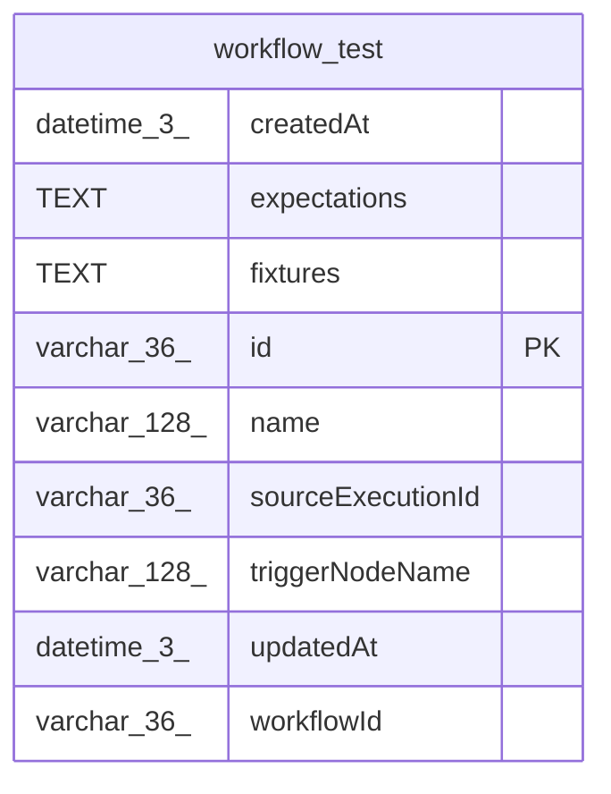

# workflow_test

## Description

<details>
<summary><strong>Table Definition</strong></summary>

```sql
CREATE TABLE "workflow_test" ("id" varchar(36) PRIMARY KEY NOT NULL, "name" varchar(128) NOT NULL, "workflowId" varchar(36) NOT NULL, "sourceExecutionId" varchar(36) NOT NULL, "triggerNodeName" varchar(128) NOT NULL, "fixtures" text NOT NULL, "expectations" text NOT NULL, "createdAt" datetime(3) NOT NULL DEFAULT (STRFTIME('%Y-%m-%d %H:%M:%f', 'NOW')), "updatedAt" datetime(3) NOT NULL DEFAULT (STRFTIME('%Y-%m-%d %H:%M:%f', 'NOW')))
```

</details>

## Columns

| Name | Type | Default | Nullable | Children | Parents | Comment |
| ---- | ---- | ------- | -------- | -------- | ------- | ------- |
| createdAt | datetime(3) | STRFTIME('%Y-%m-%d %H:%M:%f', 'NOW') | false |  |  |  |
| expectations | TEXT |  | false |  |  |  |
| fixtures | TEXT |  | false |  |  |  |
| id | varchar(36) |  | false |  |  |  |
| name | varchar(128) |  | false |  |  |  |
| sourceExecutionId | varchar(36) |  | false |  |  |  |
| triggerNodeName | varchar(128) |  | false |  |  |  |
| updatedAt | datetime(3) | STRFTIME('%Y-%m-%d %H:%M:%f', 'NOW') | false |  |  |  |
| workflowId | varchar(36) |  | false |  |  |  |

## Constraints

| Name | Type | Definition |
| ---- | ---- | ---------- |
| id | PRIMARY KEY | PRIMARY KEY (id) |
| sqlite_autoindex_workflow_test_1 | PRIMARY KEY | PRIMARY KEY (id) |

## Indexes

| Name | Definition |
| ---- | ---------- |
| IDX_d853ff88b7d1484b386d613043 | CREATE INDEX "IDX_d853ff88b7d1484b386d613043" ON "workflow_test" ("workflowId")  |
| sqlite_autoindex_workflow_test_1 | PRIMARY KEY (id) |

## Relations



---

> Generated by [tbls](https://github.com/k1LoW/tbls)
