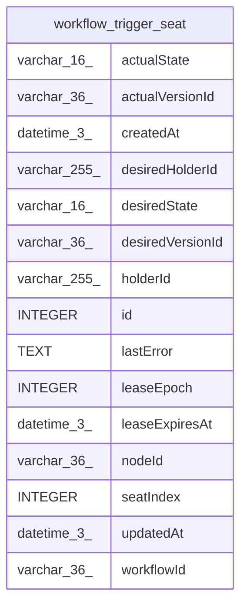

# workflow_trigger_seat

## Description

<details>
<summary><strong>Table Definition</strong></summary>

```sql
CREATE TABLE "workflow_trigger_seat" ("id" integer PRIMARY KEY NOT NULL, "workflowId" varchar(36) NOT NULL, "nodeId" varchar(36) NOT NULL, "seatIndex" integer NOT NULL, "desiredState" varchar(16) NOT NULL DEFAULT ('active'), "desiredVersionId" varchar(36) NOT NULL, "holderId" varchar(255), "leaseExpiresAt" datetime(3), "leaseEpoch" integer NOT NULL DEFAULT (0), "desiredHolderId" varchar(255), "actualState" varchar(16), "actualVersionId" varchar(36), "lastError" text, "createdAt" datetime(3) NOT NULL DEFAULT (STRFTIME('%Y-%m-%d %H:%M:%f', 'NOW')), "updatedAt" datetime(3) NOT NULL DEFAULT (STRFTIME('%Y-%m-%d %H:%M:%f', 'NOW')), CONSTRAINT "CHK_workflow_trigger_seat_desiredState" CHECK ("desiredState" IN ('active', 'inactive')), CONSTRAINT "CHK_workflow_trigger_seat_actualState" CHECK ("actualState" IN ('registered', 'closed', 'error')))
```

</details>

## Columns

| Name | Type | Default | Nullable | Children | Parents | Comment |
| ---- | ---- | ------- | -------- | -------- | ------- | ------- |
| actualState | varchar(16) |  | true |  |  |  |
| actualVersionId | varchar(36) |  | true |  |  |  |
| createdAt | datetime(3) | STRFTIME('%Y-%m-%d %H:%M:%f', 'NOW') | false |  |  |  |
| desiredHolderId | varchar(255) |  | true |  |  |  |
| desiredState | varchar(16) | 'active' | false |  |  |  |
| desiredVersionId | varchar(36) |  | false |  |  |  |
| holderId | varchar(255) |  | true |  |  |  |
| id | INTEGER |  | false |  |  |  |
| lastError | TEXT |  | true |  |  |  |
| leaseEpoch | INTEGER | 0 | false |  |  |  |
| leaseExpiresAt | datetime(3) |  | true |  |  |  |
| nodeId | varchar(36) |  | false |  |  |  |
| seatIndex | INTEGER |  | false |  |  |  |
| updatedAt | datetime(3) | STRFTIME('%Y-%m-%d %H:%M:%f', 'NOW') | false |  |  |  |
| workflowId | varchar(36) |  | false |  |  |  |

## Constraints

| Name | Type | Definition |
| ---- | ---- | ---------- |
| - | CHECK | CHECK ("desiredState" IN ('active', 'inactive')) |
| - | CHECK | CHECK ("actualState" IN ('registered', 'closed', 'error')) |
| id | PRIMARY KEY | PRIMARY KEY (id) |

## Indexes

| Name | Definition |
| ---- | ---------- |
| IDX_workflow_trigger_seat_desiredState | CREATE INDEX "IDX_workflow_trigger_seat_desiredState" ON "workflow_trigger_seat" ("desiredState")  |
| IDX_workflow_trigger_seat_workflowId_nodeId_seatIndex | CREATE UNIQUE INDEX "IDX_workflow_trigger_seat_workflowId_nodeId_seatIndex" ON "workflow_trigger_seat" ("workflowId", "nodeId", "seatIndex")  |

## Relations



---

> Generated by [tbls](https://github.com/k1LoW/tbls)
