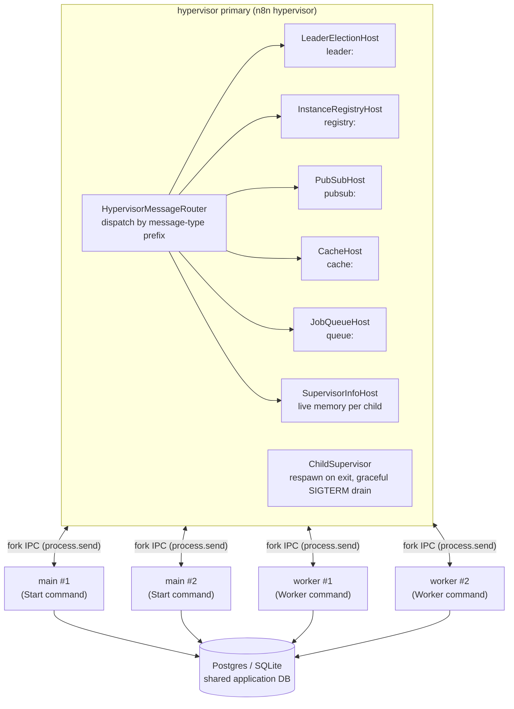
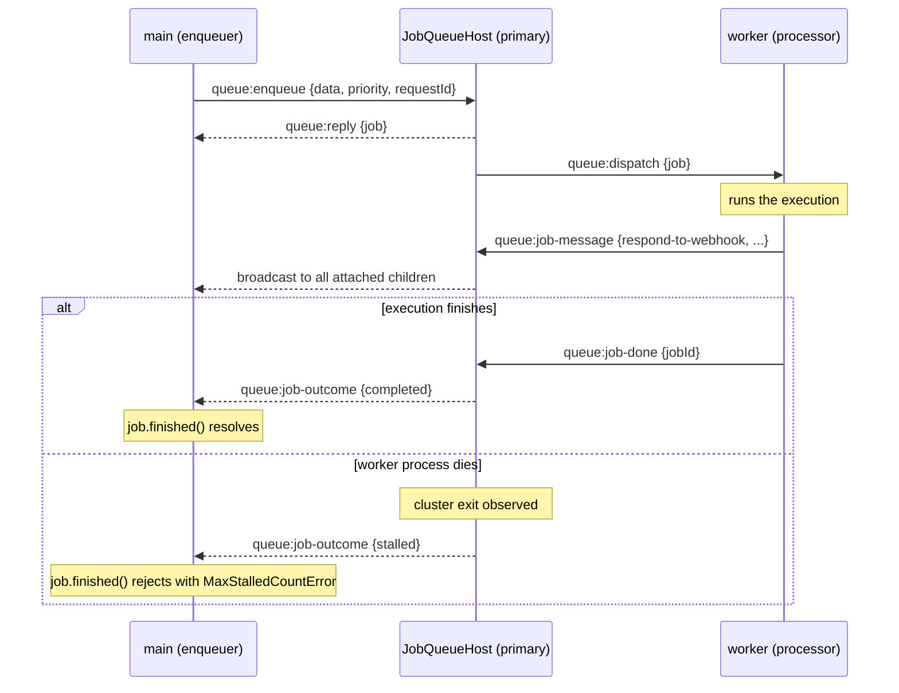

# Hypervisor: queue mode on one host without Redis

tl;dr: `n8n hypervisor` boots one supervisor process that forks 2 mains and 2 workers via `node:cluster` and hosts every coordination primitive (leader election, pubsub, instance registry, cache, execution queue) over the fork IPC channel. A workflow execution can only kill a worker child, which the supervisor respawns; HTTP and the sibling processes keep running. No Redis anywhere. Built during the Aug 2026 hackmation on branch `hackmation-unfied-mode`; PoC quality, gated behind the explicit `n8n hypervisor` command and `N8N_TRANSPORT_*` env flags, zero behavior change for every existing deployment.

Context: [Unify modes of operation RFC](https://app.notion.com/p/n8n/Unify-modes-of-operation-3225b6e0c94f809b8a9ff037adcde248). The RFC proposed a single unified operation mode with a transport abstraction (messaging + storage facets) selected by infrastructure. This branch implements that architecture end to end for a single host.

## Process topology

The primary never executes workflows. It forks the children, routes their IPC messages to per-feature hosts, respawns crashed children, and answers `/cluster-info` with live per-process stats. Mains share port 5678 through the cluster module's socket distribution.



Each child runs the ordinary `Start` or `Worker` command with `EXECUTIONS_MODE=queue`; the only difference is the env the primary forks it with:

```
N8N_HYPERVISOR_MODE=1
N8N_HYPERVISOR_ROLE=main|worker
N8N_TRANSPORT_LEADER_ELECTION=ipc
N8N_TRANSPORT_INSTANCE_REGISTRY=ipc
N8N_TRANSPORT_PUBSUB=ipc
N8N_TRANSPORT_CACHE=ipc
N8N_TRANSPORT_QUEUE=ipc
```

## Transport selection

`TransportModeService` (`packages/cli/src/scaling/transport-mode.service.ts`) is the single place that dictates which transport each subsystem uses. It only reads the explicit per-subsystem config; there is no detection and no fallback branch. `validateAtBoot()` rejects any `ipc` selection outside a hypervisor child, since only the fork channel makes ipc possible.

| Subsystem | Env flag | Default | ipc implementation | Redis implementation |
|---|---|---|---|---|
| Leader election | `N8N_TRANSPORT_LEADER_ELECTION` | `redis` | `HypervisorLeaderElection` + `LeaderElectionHost` (primary assigns leadership, heartbeat failover) | `MultiMainSetup` lease |
| Pub/sub | `N8N_TRANSPORT_PUBSUB` | `redis` | `HypervisorMessageTransport` + `PubSubHost` | `RedisMessageTransport` |
| Instance registry | `N8N_TRANSPORT_INSTANCE_REGISTRY` | `memory` | `IpcInstanceStorage` + `InstanceRegistryHost` | `RedisInstanceStorage` |
| Cache | `N8N_TRANSPORT_CACHE` | `memory` | `IpcCacheStore` + `CacheHost` (KV in the primary, writes visible to all children) | Redis backend |
| Execution queue | `N8N_TRANSPORT_QUEUE` | `redis` | `IpcJobQueue` + `JobQueueHost` | `BullJobQueue` (Bull, unchanged behavior) |

Every host follows the same pattern: it implements `HypervisorMessageHandler`, owns one message-type prefix, and gets `onMessage`, `onExit`, and `onTick` from the router. The primary is authoritative for liveness because it observes `cluster.on('exit')` directly; there are no TTLs or stale-member sweeps.

## The execution queue

`IJobQueue` (`packages/cli/src/scaling/queue/job-queue.interface.ts`) is the storage facet of the RFC's transport abstraction: enqueue, process with concurrency, counts, statuses, plus a job message channel (`QueueJob.sendMessage` / `IJobQueue.onMessage`) that carries the in-flight worker-to-main messages (`respond-to-webhook`, `job-finished`, `send-chunk`, `abort-job`, `mcp-response`). `ScalingService` selects the implementation via `resolve('queue')`; everything above the interface (`JobProcessor`, `WorkflowRunner`, webhook response relay) is implementation-agnostic.

Three implementations, one behavioral contract (`__tests__/job-queue.contract.ts` runs against all of them): single consumer per job, priority ordering, bounded per-worker concurrency, message broadcast to every attached process including the sender, and no automatic retries.

- `BullJobQueue`: today's production path, byte-for-byte (patched `bull@4.16.4`, `maxStalledCount: 0`, retention from `queueRetention`).
- `InMemoryJobQueue`: single-process reference implementation that carries the contract suite.
- `IpcJobQueue` + `JobQueueHost`: the hypervisor path. Queue state lives in the primary; children talk fire-and-forget for writes and requestId round-trips for reads, same as the instance registry.



Recovery semantics were decided deliberately: they mirror today's Bull configuration, not the RFC's aspiration. A job whose worker is lost fails immediately (as with `maxStalledCount: 0`); there is no re-delivery, and the leader main's existing queue-recovery DB-diff handles dangling executions. Re-delivery would re-run half-executed workflows, which n8n executions are not generally idempotent against.

## Crash recovery and memory limits

The `ChildSupervisor` in `commands/hypervisor.ts` tracks each child's role and env, respawns it identically on exit (infinite respawn, no backoff; PoC), classifies the crash for the log line (SIGKILL from the OS OOM-killer vs V8 heap OOM vs plain crash), and drives graceful shutdown: SIGTERM to each child triggers n8n's own drain, with a 10s SIGKILL backstop.

For the OOM demo, `N8N_HYPERVISOR_OOM_DEMO_HEAP_MB_WORKER` / `..._MAIN` heap-limit children per role via `--max-old-space-size`, and the limit survives respawn. A memory-hogging workflow kills only its worker: the execution fails fast via the stalled outcome, the other worker keeps processing, HTTP never blips, and the worker is back within seconds. That is the process-isolation claim of the RFC, demonstrated.

`SupervisorInfoHost` aggregates live per-child memory plus respawn counts, exposed for the demo cluster view.

## What still needs Redis (known gaps)

The queue was the last execution-critical subsystem; what remains is the KV/locking facet. Under the hypervisor these fall back to per-process behavior, explicitly guarded with `!TransportModeService.isUnderHypervisor()`:

- Cross-process locks: `base-command` normally swaps in `RedisLockService` for queue mode; hypervisor children keep the in-process provider. Lock scope is per-child until a lock host lands on the router.
- MCP session store: needs a shared KV (`Publisher`'s Redis-only key-value utils); skipped under ipc, so MCP triggers do not relay sessions across mains yet. The `CacheHost` KV is the natural future home.
- Chat-hub execution/stream stores: fall back to their existing in-memory path (per-process).

Multi-host stays Redis by design: the same code paths run with `N8N_TRANSPORT_*=redis` and nothing on this branch changes them.

## Open decisions

- JobMessage placement (tbd): both queue implementations currently carry the job message channel themselves (option B). Moving it onto `MessageTransport` (option A) would delete a small duplicated broadcast and open the path to dropping the pnpm patch on `bull/lib/job.js`, at the cost of the transport carrying webhook-sized payloads. Recommendation on record: keep B through the hackmation, adopt A afterwards. See `docs/generated/plans/job-message-placement-options.md` (local) for the full trade-off.
- Lock host and shared KV over the router (tbd): closes the three gaps above.
- Crash-loop backoff, execution recovery on respawn, and forcing `EXECUTIONS_MODE=queue` from the hypervisor (tbd): currently the operator sets queue mode in the shell env.

## Running it

```bash
pnpm build > build.log 2>&1
pnpm --filter n8n-containers services --services postgres   # no redis

EXECUTIONS_MODE=queue DB_TYPE=postgresdb \
  DB_POSTGRESDB_HOST=localhost DB_POSTGRESDB_PORT=<port> \
  DB_POSTGRESDB_DATABASE=n8n_db DB_POSTGRESDB_USER=n8n_user DB_POSTGRESDB_PASSWORD=<pw> \
  ./packages/cli/bin/n8n hypervisor
```

Checks that prove the interesting properties: run a workflow and watch a `[worker pid=...]` line pick it up; curl a webhook workflow with Respond to Webhook (response relayed worker to main over IPC); stop a running execution from the UI (abort over IPC); `kill -9` a busy worker and watch the execution fail fast while the instance survives and the worker respawns; `redis-cli keys 'bull:*'` against any Redis you have lying around stays empty because nothing connects to it.

## Commit map (hackmation-unfied-mode)

| Commit | What |
|---|---|
| `5af87ca` | Hypervisor command, `TransportModeService`, IPC leader election, instance registry extension |
| `f4e944c` / `9d51648` | Pub/sub behind swappable `MessageTransport`, reconciled with transport selection |
| `afec703` | Execution queue behind `IJobQueue` (Bull + in-memory + contract suite) |
| `edae34a` / `f8009f4` | Router + hosts refactor; pub/sub and registry over the cluster IPC channel |
| `b6a8166` | Cache over IPC (`IpcCacheStore` + `CacheHost`) |
| `b3548da` | `IpcJobQueue` + `JobQueueHost`; queue over IPC |
| `2c3eb1a` | Child supervisor: memory limits, crash classification, respawn, graceful shutdown |
| `bf0d27d` | No-Redis guards for locking, Publisher KV, chat-hub stores |
| `37537ce` | Cluster live view for the demo |
