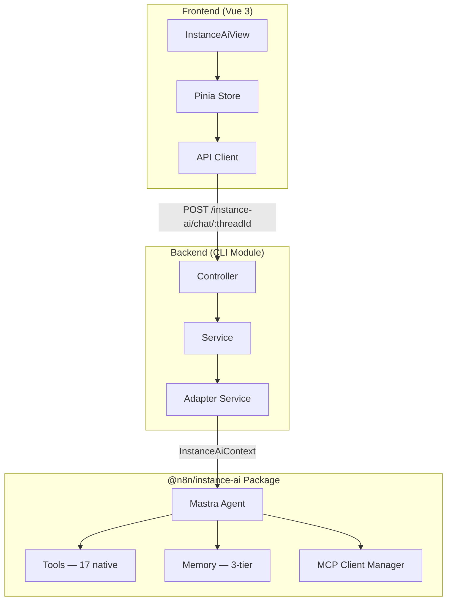
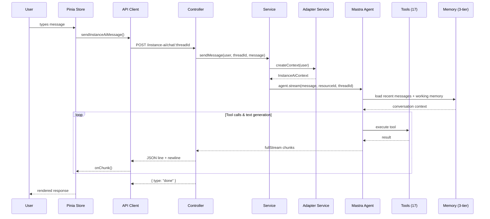

# Architecture

System design, package ownership, and data flow for Instance AI.

## Three-Layer Architecture



| Layer | Package | Responsibility |
|-------|---------|----------------|
| **Frontend** | `packages/frontend/.../instanceAi/` | Chat UI, streaming consumption, thread management |
| **Backend** | `packages/cli/src/modules/instance-ai/` | HTTP endpoint, agent lifecycle, n8n API bridge |
| **Agent** | `packages/@n8n/instance-ai/` | Agent orchestration, tools, memory, MCP |

## Package Map

```
packages/@n8n/instance-ai/          # Core agent (framework-agnostic)
├── src/agent/                       # Agent creation + system prompt
├── src/tools/                       # 17 native tool definitions
│   ├── workflows/                   # CRUD + activate/deactivate
│   ├── executions/                  # Run, status, debug
│   ├── credentials/                 # CRUD + test
│   └── nodes/                       # List + describe
├── src/memory/                      # Memory config + working memory template
├── src/mcp/                         # MCP client manager
└── src/types.ts                     # All interfaces and data models

packages/cli/src/modules/instance-ai/ # Backend integration
├── instance-ai.module.ts            # Module lifecycle
├── instance-ai.controller.ts        # HTTP streaming endpoint
├── instance-ai.service.ts           # Agent creation + config
└── instance-ai.adapter.service.ts   # n8n API → agent tool bridge

packages/frontend/.../instanceAi/    # Frontend UI
├── InstanceAiView.vue               # Main chat layout
├── instanceAi.store.ts              # Pinia store (streaming state)
├── instanceAi.api.ts                # API client
├── module.descriptor.ts             # Route + sidebar registration
└── components/                      # Message, input, thread list, tool call
```

## Data Flow

A user message flows through the system as follows:



## Dependency Inversion

The agent package defines interfaces; the CLI adapter implements them:

```
@n8n/instance-ai (defines interfaces)
    InstanceAiWorkflowService
    InstanceAiExecutionService
    InstanceAiCredentialService
    InstanceAiNodeService

packages/cli (implements interfaces)
    InstanceAiAdapterService.createContext()
        → createWorkflowAdapter()
        → createExecutionAdapter()
        → createCredentialAdapter()
        → createNodeAdapter()
```

The agent package has zero knowledge of n8n internals (TypeORM, Express,
services). It only knows the interfaces defined in `types.ts`. The CLI module
provides concrete implementations that delegate to real n8n services.

This means:
- The agent package is independently testable with mock services
- It could be reused outside n8n (e.g. in a standalone agent)
- Changes to n8n internals only require updating the adapter, not the agent

## Module System

Instance AI registers as an n8n backend module via `ModuleRegistry`:

```typescript
@BackendModule({ name: 'instance-ai', instanceTypes: ['main'] })
export class InstanceAiModule implements ModuleInterface { ... }
```

The module loads automatically as a **default module**. On startup:

1. `ModuleRegistry.loadModules()` dynamically imports the module
2. `init()` imports the controller to register HTTP routes
3. `settings()` checks if `N8N_INSTANCE_AI_MODEL` is set — returns `{ enabled }`
4. The frontend reads `isModuleActive('instance-ai')` to show/hide the sidebar item

The module only runs on `main` instance types (not workers or runners) and can
be disabled via `N8N_DISABLED_MODULES=instance-ai`.

## Related Docs

- [Configuration](./configuration.md) — environment variables and setup
- [Decision Log](./decisions.md) — rationale behind architectural choices
- [Backend Module](./internals/backend-module.md) — controller, service, adapter details
- [Frontend Module](./internals/frontend-module.md) — components, store, routing
