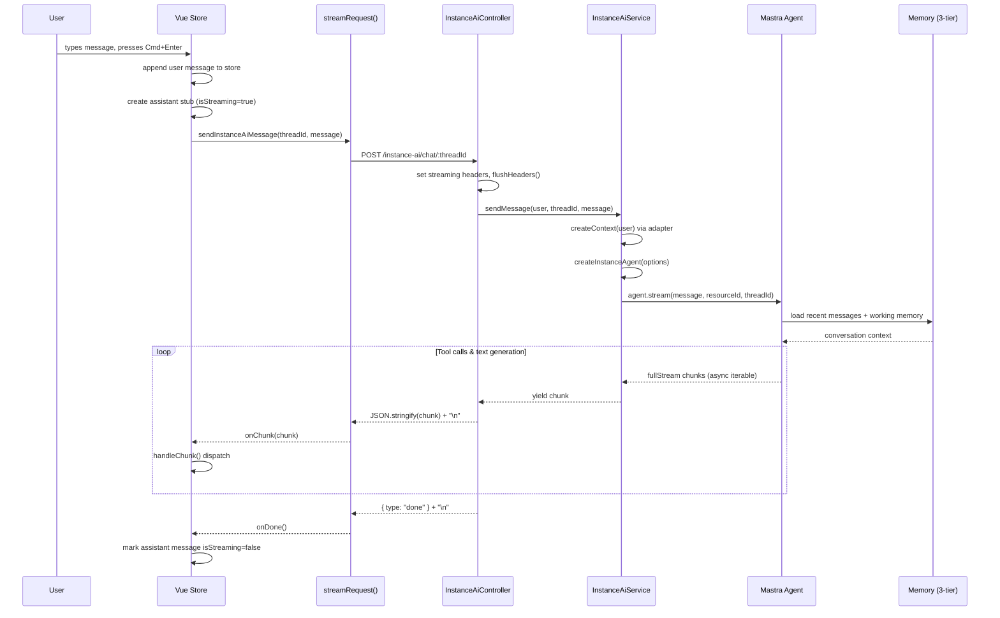

# Chat & Streaming

How a user message becomes a streamed AI response, end to end.

## Request Lifecycle



## Streaming Protocol

Responses stream as **newline-delimited JSON** (`\n`-separated). Each line is a
self-contained JSON object with a `type` field that determines how the frontend
processes it.

### Chunk Types

| Type | Payload | Description |
|------|---------|-------------|
| `text-delta` | `{ text: string }` | Incremental text token from the model |
| `reasoning-delta` | `{ text: string }` | Incremental reasoning/thinking token |
| `tool-call` | `{ toolCallId, toolName, args }` | Agent is invoking a tool |
| `tool-result` | `{ toolCallId, result, isError? }` | Tool execution completed |
| `tool-error` | `{ toolCallId, error }` | Tool execution failed |
| `error` | `{ content: string }` | Agent-level or system error |
| `done` | _(none)_ | Stream finished successfully |
| `finish` | _(none)_ | Alternative stream-end signal |

### Example Raw Stream

```
{"type":"reasoning-delta","payload":{"text":"The user wants to list"}}
{"type":"reasoning-delta","payload":{"text":" their workflows..."}}
{"type":"tool-call","payload":{"toolCallId":"tc_1","toolName":"list-workflows","args":{"limit":10}}}
{"type":"tool-result","payload":{"toolCallId":"tc_1","result":{"workflows":[{"id":"1","name":"My Workflow","active":true}]}}}
{"type":"text-delta","payload":{"text":"You have 1 workflow"}}
{"type":"text-delta","payload":{"text":": **My Workflow** (active)."}}
{"type":"done"}
```

## HTTP Response

### Headers

The controller sets these headers before streaming begins:

```
Content-Type: application/octet-stream
Cache-Control: no-cache
Connection: keep-alive
X-Accel-Buffering: no
```

| Header | Why |
|--------|-----|
| `Content-Type: application/octet-stream` | Signals a binary stream, prevents browser buffering |
| `Cache-Control: no-cache` | Prevents intermediary caching of partial responses |
| `Connection: keep-alive` | Keeps the TCP connection open for the full stream |
| `X-Accel-Buffering: no` | Disables nginx proxy buffering for real-time delivery |

Headers are flushed immediately with `res.flushHeaders()` so the client can
start receiving chunks before the full response is ready.

### Per-Chunk Flushing

After each chunk is written, the controller calls `res.flush?.()` to push it
through any compression or proxy middleware immediately.

## Abort / Cancellation

The store creates an `AbortController` per request. When the user clicks the
stop button:

1. `stopStreaming()` calls `abortController.abort()`
2. The `fetch` request in `streamRequest()` is cancelled
3. The `onError` handler receives an `AbortError` (which is silently ignored)
4. The last assistant message is marked `isStreaming = false`

On the backend, the stream iterator terminates when the client disconnects.

## Error Handling

### Network Errors

If the fetch fails or the connection drops, `onError` fires with the network
error. The store appends a user-visible error message to the assistant bubble.

### Pre-Headers Errors

If the controller encounters an error before `flushHeaders()` is called
(e.g. missing message body), it returns a standard JSON error response:

```json
{ "message": "Message is required" }
```

with HTTP status 400 or 500.

### Post-Headers Errors

If an error occurs after headers are already sent (stream in progress), the
controller writes an error chunk and ends the stream:

```
{"type":"error","content":"Internal server error"}
```

### Tool Errors

When a tool execution fails, the agent emits a `tool-error` or `tool-result`
chunk with `isError: true`. The frontend renders the error inside the
collapsible tool call card with a warning icon and danger-colored output.

## Related Docs

- [Frontend Module](../../internals/frontend-module.md) — component breakdown and store details
- [Backend Module](../../internals/backend-module.md) — controller and service implementation
- [Tool System](../tools/) — what happens inside tool calls
