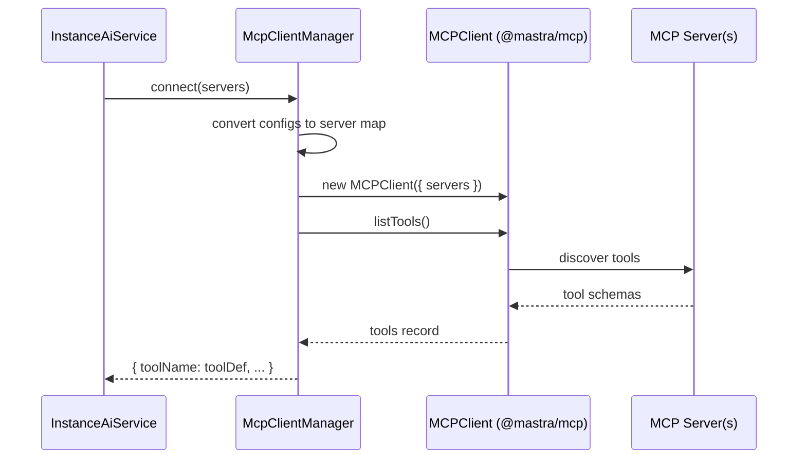

# MCP Integration

Extending the agent with external tool servers via the
[Model Context Protocol](https://modelcontextprotocol.io/).

## What is MCP?

MCP (Model Context Protocol) is an open standard for connecting AI agents to
external tool servers. An MCP server exposes a set of tools (with schemas) that
any MCP-compatible client can discover and invoke. This lets the Instance AI
agent use tools beyond its 17 built-in n8n tools — for example, a GitHub MCP
server for repository management or a database MCP server for direct queries.

## Configuration

MCP servers are configured via the `N8N_INSTANCE_AI_MCP_SERVERS` environment
variable using a comma-separated `name=url` format:

```bash
export N8N_INSTANCE_AI_MCP_SERVERS="github=https://mcp-github.example.com/sse,db=https://mcp-db.example.com/sse"
```

### Server Config Interface

```typescript
interface McpServerConfig {
  name: string;                        // Server identifier
  url?: string;                        // HTTP/HTTPS endpoint (URL-based)
  command?: string;                    // CLI command (command-based)
  args?: string[];                     // Command arguments
  env?: Record<string, string>;        // Command environment variables
}
```

Two connection modes:

| Mode | Fields | Example |
|------|--------|---------|
| **URL-based** | `name` + `url` | `{ name: "github", url: "https://mcp.github.com/sse" }` |
| **Command-based** | `name` + `command` + `args?` + `env?` | `{ name: "db", command: "mcp-db-server", args: ["--port", "3000"] }` |

The environment variable parser currently supports URL-based servers. Command-based
servers can be configured programmatically.

## McpClientManager

The `McpClientManager` class manages the lifecycle of MCP connections.

```typescript
class McpClientManager {
  async connect(servers: McpServerConfig[]): Promise<Record<string, unknown>>;
  async disconnect(): Promise<void>;
}
```

### Connect Flow



1. Returns empty `{}` if no servers are provided
2. Converts each `McpServerConfig` to the Mastra MCP format:
   - URL-based: `{ url: new URL(server.url) }`
   - Command-based: `{ command, args, env }`
3. Creates an `MCPClient` instance from `@mastra/mcp`
4. Calls `listTools()` to discover all available tools
5. Returns the tools record (keys = tool names)

### Disconnect Flow

Called during module shutdown:

1. Checks if an MCPClient instance exists
2. Calls `mcpClient.disconnect()`
3. Clears the reference

## Tool Merging

MCP tools merge transparently with native tools in the agent's tool dictionary:

```typescript
const nativeTools = createAllTools(context);   // 17 n8n tools
const mcpTools = await mcpClientManager.connect(servers);

new Agent({
  tools: { ...nativeTools, ...mcpTools },
});
```

From the agent's perspective, MCP tools are indistinguishable from native tools.
They appear in the same tool list, have the same schema format, and produce the
same chunk types (`tool-call`, `tool-result`) during streaming.

## Lifecycle

MCP connections are managed at the service level:

| Event | Action |
|-------|--------|
| Agent creation (per request) | `connect(servers)` loads MCP tools |
| Module shutdown | `disconnect()` closes all MCP connections |

The `McpClientManager` instance lives in `InstanceAiService` and is reused
across requests. Shutdown is triggered by the `@OnShutdown()` decorator on the
module.

## Example: Connecting a GitHub MCP Server

```bash
# 1. Set the MCP server URL
export N8N_INSTANCE_AI_MCP_SERVERS="github=https://mcp-github.example.com/sse"

# 2. Set the model (required)
export N8N_INSTANCE_AI_MODEL=anthropic/claude-sonnet-4-5

# 3. Start n8n
pnpm start
```

The agent can now use GitHub tools alongside n8n tools:

> **User:** "Create a GitHub issue for the bug in workflow 'Data Sync' and then
> deactivate that workflow."
>
> The agent will use the GitHub MCP tool to create the issue and the native
> `activate-workflow` tool to deactivate the workflow.

## Related Docs

- [Tool System](../tools/) — native tools and how MCP tools merge in
- [Configuration](../../configuration.md) — environment variable reference
- [Backend Module](../../internals/backend-module.md) — service-level MCP management
