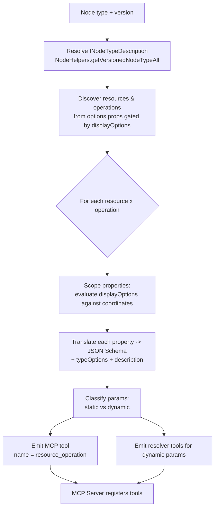
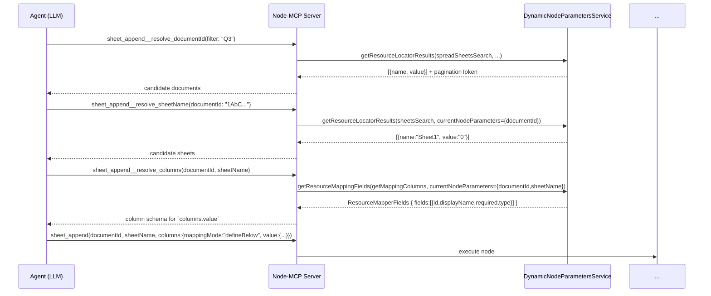

# RFC: Node-to-MCP Toolset

| | |
| --- | --- |
| **Status** | Draft |
| **Type** | Feature |
| **Scope** | `packages/workflow`, `packages/core`, `packages/cli`, `@n8n/nodes-langchain` |
| **Related** | `docs/project-node-mcp/node-property-types.md`, `docs/project-node-mcp/top-nodes.md` |

## 1. Summary

This RFC proposes a mechanism that converts any n8n node into a **Model Context
Protocol (MCP) toolset**: a set of MCP tools, one per
`resource`×`operation` combination the node exposes, each named
`<resource>_<operation>` (e.g. `message_send`, `sheet_append`). The tool's
input schema is derived by statically introspecting the node's
`INodeTypeDescription` — walking `INodeProperties`, evaluating `displayOptions`
to scope parameters to a single resource/operation, and translating each
`NodePropertyTypes` plus its `typeOptions` into JSON Schema with
LLM-legible descriptions.

Where a parameter's value space is only knowable at runtime (`loadOptionsMethod`,
`resourceLocator` search, `loadOptionsDependsOn` chains), the toolset exposes
companion **resolver tools** that wrap the existing dynamic-parameter machinery
(`DynamicNodeParametersController` / `DynamicNodeParametersService`) so an agent
can discover valid values across multiple tool-calling turns.

The result: the ~50 highest-traffic integrations (see
`docs/project-node-mcp/top-nodes.md`) become first-class MCP toolsets with
schemas an LLM can call correctly, without a human hand-authoring `$fromAI()`
placeholders per node (the mechanism used today by
`packages/core/src/execution-engine/node-execution-context/utils/create-node-as-tool.ts`).

## 2. Motivation

n8n already has two "node as a tool" surfaces:

1. **`createNodeAsTool`** (`packages/core/.../create-node-as-tool.ts`) — turns a
   single configured node into one `DynamicStructuredTool`. Its schema is not
   derived from the node description; it is reverse-engineered from `$fromAI()`
   expressions a human embedded in parameter values (`getSchema` → `traverseNodeParameters`
   → `generateZodSchema`). The node is *pre-configured*; the LLM only fills the
   placeholders the author chose to expose.
2. **`McpTrigger`** (`packages/@n8n/nodes-langchain/nodes/mcp/McpTrigger`) — hosts
   an MCP server (`@modelcontextprotocol/sdk`) that exposes *connected tool
   sub-nodes* over SSE / Streamable HTTP, serialising their schemas via
   `zodToJsonSchema` (`McpServer.ts`).

Neither turns a *bare node type* into a full, self-describing toolset. An agent
that wants to "send a Gmail message" has to be handed a node someone already
wired up. There is no path from `n8n-nodes-base.gmail` → a menu of callable,
fully-typed tools (`message_send`, `message_get`, `draft_create`, …).

This matters because:

- **Coverage.** The top-50 integrations (`top-nodes.md`) collectively expose
  hundreds of resource/operation pairs. Hand-authoring MCP wrappers per operation
  does not scale; the node descriptions already encode everything needed.
- **Correctness.** LLMs call tools well when the schema is explicit (enums,
  required fields, constraints, descriptions). Node descriptions carry exactly
  this (`options`, `required`, `typeOptions.minValue`, `description`), but it is
  currently locked inside UI-shaped metadata.
- **Consistency.** One deterministic transform means every node — including
  community nodes — becomes an MCP toolset for free, and stays in sync as node
  versions evolve.

### 2.1 Goals

- **G1.** For a given node type + version, emit **one MCP tool per
  `resource`×`operation`**, named `<resource>_<operation>`.
- **G2.** Derive each tool's input schema purely from the node's
  `INodeTypeDescription` (no execution, no node-side code changes).
- **G3.** Correctly scope parameters to a tool using `displayOptions`
  (`show`/`hide`, `@version`, `DisplayCondition`).
- **G4.** Map every `NodePropertyTypes` literal to a JSON Schema fragment, and
  honour the `typeOptions` that change the effective type or validation.
- **G5.** Produce parameter descriptions optimised for LLM comprehension.
- **G6.** Resolve dynamic values (`loadOptions*`, `resourceLocator` search,
  dependent options) through a multi-step resolver-tool protocol, respecting
  `loadOptionsDependsOn` ordering.

### 2.2 Non-goals

- **N1.** Not changing how nodes execute. Invocation reuses the existing
  execution engine / routing.
- **N2.** Not converting *trigger* nodes (`poll`/`trigger`/`webhook`). Toolsets
  cover action nodes only.
- **N3.** Not auto-configuring credentials. Credential selection remains the
  operator's responsibility (mirrors the `McpTrigger` credential-gate model).
- **N4.** Not supporting UI-only property types as inputs (`button`, `notice`,
  `callout`, `curlImport`, `hidden`, `icon`) — these are dropped from schemas.
- **N5.** Not replacing `$fromAI()` / `createNodeAsTool`; this is a complementary
  surface for un-configured node types.

## 3. Terminology

| Term | Meaning |
| --- | --- |
| **Toolset** | The set of MCP tools generated from one node type + version. |
| **Tool** | One MCP tool = one `resource`×`operation` pair. |
| **Scoped properties** | The subset of `INodeProperties` visible when `resource`/`operation` (and other display conditions) are fixed to a tool's coordinates. |
| **Resolver tool** | An auxiliary MCP tool that returns valid values for a dynamic parameter (options, RLC search results, mapper fields). |
| **Coordinates** | The `{ resource, operation, @version }` triple that identifies a tool. |

## 4. Architecture

### 4.1 High-level pipeline



The transform is a pure function of the description; it runs once per node
type+version and can be cached. Zod is the authoritative runtime input schema;
standard JSON Schema keywords are derived with `zodToJsonSchema`, followed by
an annotation pass for `x-*` metadata and selector-driven `if`/`then` branches
that Zod cannot represent. It is exposed as a new module
`packages/core/src/node-as-toolset/` (engine-side, reusing `NodeHelpers`), and
surfaced by an MCP server that reuses the `McpServer` plumbing already in
`@n8n/nodes-langchain/nodes/mcp/McpTrigger`.

### 4.2 Node versioning

A node type is not a single description. Light-versioned nodes carry
`version: [2, 2.1, 2.2]` on one `INodeTypeDescription` (Gmail v2 —
`GmailV2.node.ts` line 46); full-versioned nodes (`VersionedNodeType`, e.g.
`Set.node.ts`) hold a map of version → implementation, each with its own
description.

Rules:

- The toolset is generated **for a pinned version** (default: the node's
  `defaultVersion`). The version is part of the tool coordinates and is used
  when evaluating `@version` display conditions (§4.4).
- For full-versioned nodes, resolve the concrete `INodeTypeDescription` via the
  version registry (equivalent to `NodeHelpers.getVersionedNodeType`). Different
  versions can therefore produce **different toolsets** (operations added/removed
  between versions).
- The chosen version is emitted into every tool description (`Node: gmail
  (v2.2)`) so the agent and audit logs are unambiguous, and is echoed back to the
  execution engine on invocation so the same version runs.

### 4.3 Resource & operation discovery

Resources and operations are ordinary `options`-typed properties by convention:

- `resource` — an `options` property whose `options[].value` enumerate the
  resources. Some nodes have no `resource` (single-resource nodes); treat that as
  a single implicit resource `default`.
- `operation` — one or more `options` properties named `operation`, each gated by
  `displayOptions.show.resource` to a specific resource (Gmail
  `messageOperations` is shown only for `resource: ['message']` —
  `MessageDescription.ts` lines 6–71; Sheets `descriptions[0]` for
  `resource: ['sheet']` — `Sheet.resource.ts` lines 16–77).

Discovery algorithm:

```
resources := values of the `resource` options property (or [default])
for r in resources:
  operationProps := every property named `operation` whose displayOptions
                    are satisfied by { resource: r }   // usually exactly one
  operations := union of operationProps[].options[].value
  for o in operations:
    emit tool coordinates { resource: r, operation: o, version }
```

Operation option metadata is preserved: `INodePropertyOptions.action`
("Send a message"), `name`, and `description` seed the tool's top-level
description (§5.3). `SEND_AND_WAIT_OPERATION` and other operations that require a
resuming webhook are flagged and, by default, excluded (they don't fit a
request/response tool call) — configurable.

### 4.4 Scoping parameters with `displayOptions`

Given fixed coordinates `{ resource, operation, @version }`, a property belongs
to the tool iff its `displayOptions` are satisfied. `displayOptions` has `show`
and `hide` maps (`IDisplayOptions`, interfaces.ts line 1903); a property is
visible when **every** `show` key matches **and no** `hide` key matches.

Each key is a parameter name (or the specials `@version`, `@feature`, `@tool`)
whose value is an array of accepted `NodeParameterValue`s **or**
`DisplayCondition` objects (`{ _cnd: { gte: 4 } }`, `eq`, `not`, `between`,
`startsWith`, …; interfaces.ts lines 1884–1896).

Evaluation model — we partition display keys into three tiers:

1. **Coordinate keys** (`resource`, `operation`, `@version`). Known up front.
   A property is admitted only if these match. `@version` conditions are
   evaluated against the pinned version, e.g. Sheets `append` `columns`
   (resourceMapper) is shown for `@version: [{ _cnd: { gte: 4 } }]` while the
   legacy `fieldsUi` fixedCollection is `@version: [3]`
   (`append.operation.ts` lines 86–159) — a v3 toolset and a v4 toolset get
   structurally different `sheet_append` schemas.
2. **Intra-tool selector keys** — a display key that refers to *another scoped
   parameter* (e.g. Slack `text` is shown when `messageType: ['text']`;
   `MessageDescription.ts` lines 357–371). These do **not** exclude the property;
   instead they become **conditional subschemas** (§4.5) so the agent sees the
   dependency.
3. **`@feature` / env / deployment keys** — evaluated against instance config;
   properties gated off for the current instance are dropped.

The scoping pass yields, per tool, a tree of admitted `INodeProperties`
annotated with the selector conditions that gate them.

### 4.5 Conditional subschemas (selector-driven branches)

When a group of properties is gated by an intra-tool selector, we model it with
JSON Schema conditionals rather than flattening. For a selector `messageType`
with values `text | block`, where `text` gates `{ text }` and `block` gates
`{ blocksUi, text (notification) }`, we emit:

```jsonc
{
  "allOf": [
    { "if":   { "properties": { "messageType": { "const": "text" } } },
      "then": { "required": ["text"] } },
    { "if":   { "properties": { "messageType": { "const": "block" } } },
      "then": { "required": ["blocksUi"] } }
  ]
}
```

`required` is likewise conditional: a property with `required: true` becomes a
top-level `required` entry only if it is unconditionally visible; otherwise it is
lifted into the matching `then.required`. This keeps the schema honest — an agent
that picks `messageType: "block"` is told `blocksUi` is required, not `text`.

## 5. Parameter → JSON Schema translation

### 5.1 Type mapping

Each admitted property is translated by its `type`. Baseline (pre-`typeOptions`)
mapping of every `NodePropertyTypes` (interfaces.ts lines 1705–1729):

| `NodePropertyTypes` | JSON Schema | Notes |
| --- | --- | --- |
| `string` | `{ "type": "string" }` | `default` → `default`; `placeholder` → appended to description as `e.g. …`. |
| `number` | `{ "type": "number" }` | See §6.2 for `minValue`/`maxValue`/`numberPrecision`. |
| `boolean` | `{ "type": "boolean" }` | |
| `options` | `{ "type": "string", "enum": [values], "x-enumNames": [names] }` | `enum` from `options[].value`; option `description`s folded into the property description. If `loadOptionsMethod` present → **dynamic** (§7). |
| `multiOptions` | `{ "type": "array", "items": { "enum": [values] }, "uniqueItems": true }` | Array even though it is one control (§6.1). |
| `collection` | `{ "type": "object", "properties": {…}, "additionalProperties": false }` | Optional bag; sub-options recursed. No `required` (all optional by definition). |
| `fixedCollection` | object or array of objects | §6.4. |
| `dateTime` | `{ "type": "string", "format": "date-time" }` | `typeOptions.dateOnly` → `"format": "date"`. |
| `json` | `{ "type": ["object","array","string"] }` with `"contentMediaType": "application/json"` | Accept parsed JSON or a JSON string; describe expected shape. |
| `color` | `{ "type": "string", "pattern": "^#?[0-9A-Fa-f]{6}([0-9A-Fa-f]{2})?$" }` | Alpha allowed when `showAlpha`. |
| `resourceLocator` | `{ "oneOf": [ per-mode subschema ] }` with an `x-resource-locator` marker | §5.2 — carries `{ mode, value }`; list mode is **dynamic**. |
| `resourceMapper` | object (`{ mappingMode, value, schema }`) | §6.5 — schema is **dynamic**. |
| `filter` | structured condition object | §6.6. |
| `assignmentCollection` | array of assignment objects | §6.7. |
| `credentials` / `credentialsSelect` | **omitted** | Credentials are operator-configured (N3). |
| `workflowSelector` / `agentSelector` | `{ "type": "string" }` + `x-selector` | Instance-scoped id; typically resolved via resolver tool. |
| `curlImport`, `button`, `notice`, `callout`, `hidden`, `icon` | **omitted** | UI-only / non-input (N4). `hidden` values are re-applied server-side from `default`. |

`x-`-prefixed keywords are non-standard annotations MCP clients ignore but our
invocation layer uses to reconstruct the n8n-shaped parameter object (e.g.
rebuild `{ __rl: true, mode, value }` for a resource locator).

### 5.2 `resourceLocator` shape

A `resourceLocator` (interfaces.ts `INodePropertyMode`, lines 2004–2029) accepts
several modes (`list`, `id`, `url`, `name`, `username`, …). We emit a `oneOf`
over the modes, each requiring `mode` (const) and `value`:

```jsonc
{
  "description": "Google Sheets document. Provide { mode, value }.",
  "x-resource-locator": true,
  "oneOf": [
    { "title": "By ID",  "properties": { "mode": { "const": "id" },
      "value": { "type": "string", "pattern": "[a-zA-Z0-9\\-_]{2,}" } },
      "required": ["mode","value"] },
    { "title": "By URL", "properties": { "mode": { "const": "url" },
      "value": { "type": "string", "description": "A docs.google.com/spreadsheets URL" } },
      "required": ["mode","value"] },
    { "title": "From list", "properties": { "mode": { "const": "list" },
      "value": { "type": "string", "description": "Resource id; call resolver `sheet_append__resolve_documentId` to search" } },
      "required": ["mode","value"] }
  ]
}
```

Mode `id`/`url`/`name` validation `regex` (from `INodePropertyMode.validation`
and `extractValue`) becomes `pattern`. `list` mode is dynamic (§7). The RLC
`builderHint.propertyHint` (present on Sheets `documentId`/`sheetName`,
`Sheet.resource.ts` lines 84–87, 145–148) is a ready-made LLM instruction and is
copied verbatim into the `description`.

### 5.3 Descriptions for LLM callers

Tool-call accuracy is dominated by description quality, so we assemble
descriptions deterministically from fields already in the description:

**Tool-level description** = operation `action` (imperative, "Send a message")
+ operation `description` ("Create a new row in a sheet") + node
`description.description` + resolved version. Example for `sheet_append`:

> Append Row — Create a new row in a sheet. Node: Google Sheets (v4.5).
> Requires a `documentId` and `sheetName`; column values are provided via
> `columns`.

**Parameter-level description** is composed, in order, from:

1. `INodeProperties.description` (primary; strip HTML, keep prose — n8n
   descriptions contain `<a>` docs links, e.g. Gmail `sendTo` line 115).
2. `INodeProperties.hint` (secondary clarification).
3. `builderHint.propertyHint` when present (authored specifically to steer
   automated builders — richest signal).
4. Enum semantics: for `options`, append `One of: <value> (<name> — <description>)`
   per choice so the agent understands each enum member.
5. `placeholder` → `Example: <placeholder>`.
6. Requiredness / conditionality note ("Required when messageType = block").

We deliberately **prefer `builderHint` over `description`** where both exist,
because `builderHint` text is written for machine callers (see the Sheets RLC
hints warning "Never invent or fabricate a spreadsheet ID").

HTML is stripped; `<a href>` link targets are preserved as `(see: <url>)` so the
agent can still surface docs.

## 6. `typeOptions` that change type or validation

`INodePropertyTypeOptions` (interfaces.ts lines 1774–1820) can alter both the
effective type and the validation. Handling per option:

### 6.1 `multipleValues: true` and `multiOptions` (scalar/object → array)

- `multiOptions` is inherently an array of enum values → `{"type":"array",
  "items": { "enum": [...] }, "uniqueItems": true}` (Stripe `events`,
  node-property-types.md line 283; Slack `approvers` uses
  `multiOptions` + `loadOptionsMethod`, so `items.enum` is **dynamic**).
- `typeOptions.multipleValues: true` on any control wraps that control's base
  schema in an array:
  - on a `fixedCollection` entry → array of the entry object (Sheets
    `fieldsUi.fieldValues`, `append.operation.ts` lines 77–124, becomes
    `{"type":"array","items": {<Field object>}}`).
  - on a `collection`/`string`/`number` → array of that base schema.
- `multipleValueButtonText` / `sortable` are UI-only and dropped, except
  `sortable` sets `"x-ordered": true` (order is meaningful).

This is the single most important type-altering option: an input that is an
object or scalar in the single-value case becomes an **array** when
`multipleValues` is set, and the schema must reflect that or the agent will send
the wrong shape.

### 6.2 Numeric constraints (`minValue` / `maxValue` / `numberPrecision`)

For `type: number`:

- `minValue` → `"minimum"`, `maxValue` → `"maximum"` (Copper `limit`
  `{min:1,max:100}`, node-property-types.md lines 99–107 → `minimum:1,
  maximum:100`; Sheets `headerRow` `minValue:1` → `minimum:1`).
- `numberPrecision: 0` → `"type":"integer"`; `numberPrecision: n>0` →
  `"type":"number"` plus `"multipleOf": 10^-n` and a description note
  ("up to n decimal places").

### 6.3 `password` and editor variants (`type: string`)

- `password: true` → `{"type":"string","writeOnly":true,"x-sensitive":true}`.
  Value is never echoed in tool results/logs.
- `editor` (`sqlEditor`, `jsEditor`, `htmlEditor`, `cssEditor`,
  `codeNodeEditor`) → still `string`, with `contentMediaType`
  (`application/sql`, `text/html`, `application/javascript`, …) and
  `sqlDialect` mentioned in the description. `rows` and `editorIsReadOnly` are
  UI-only. A read-only editor is omitted from inputs.

### 6.4 `fixedCollection` structure

`fixedCollection` groups named sub-collections (`INodePropertyCollection`,
interfaces.ts 2070–2075). Each `options[]` entry has a `name` and a `values`
array of `INodeProperties`. Translation:

- Base: `{"type":"object","properties": { <entryName>: <entrySchema> }}`.
- `<entrySchema>` for one entry = `{"type":"object","properties": {…values…}}`.
- With `multipleValues: true` on the fixedCollection → the entry becomes
  `{"type":"array","items": {<entryObject>}}` (§6.1).
- `minRequiredFields` / `maxAllowedFields` → `minProperties` / `maxProperties`
  on the entry object.
- `hideOptionalFields`, `layout`, `itemTitle`, `addOptionalFieldButtonText`,
  `showEvenWhenOptional` are UI-only → dropped (but `required` sub-fields still
  drive `required`).

Sheets `fieldsUi` (v3 path) → `{"type":"object","properties":{"fieldValues":
{"type":"array","items":{"type":"object","properties":{"fieldId":{…dynamic
enum…},"fieldValue":{"type":"string"}}}}}}`.

### 6.5 `resourceMapper` shape

`resourceMapper` (typeOptions `resourceMapper: ResourceMapperTypeOptions`,
interfaces.ts 1822–1863; runtime fields `ResourceMapperField`, 3932–3955). The
value at runtime is `{ mappingMode, value, schema }`. We model it as:

```jsonc
{
  "type": "object",
  "x-resource-mapper": { "mode": "add", "resolver": "sheet_append__resolve_columns" },
  "properties": {
    "mappingMode": { "enum": ["defineBelow","autoMapInputData","nothing"] },
    "value": {
      "type": "object",
      "description": "Map of column id -> value. Keys/allowed columns come from the resolver.",
      "additionalProperties": true
    }
  },
  "required": ["mappingMode"]
}
```

The concrete column set (the `schema` array) is **dynamic** — obtained from
`resourceMapperMethod` (Sheets `getMappingColumns`, `append.operation.ts` lines
136–148) via the resolver (§7). Because `mode` is `add`, matching-column
keywords are irrelevant; for `update`/`upsert` we additionally surface a
`matchingColumns` array and mark `canBeUsedToMatch` fields. `required`
`ResourceMapperField`s become required keys of `value` once the schema is known;
until then the resolver's response documents them.

### 6.6 `filter` shape

`filter` (typeOptions `filter: FilterTypeOptions`, interfaces.ts 1869–1876). The
value is a condition tree. Schema:

```jsonc
{
  "type": "object",
  "properties": {
    "combinator": { "enum": ["and","or"] },        // constrained by allowedCombinators
    "conditions": {
      "type": "array",
      "maxItems": 10,                                 // typeOptions.filter.maxConditions
      "items": {
        "type": "object",
        "properties": {
          "leftValue":  { "type": "string" },         // fixed/omitted if typeOptions.filter.leftValue set
          "operator":   { "type": "string" },
          "rightValue": {}
        },
        "required": ["leftValue","operator"]
      }
    }
  }
}
```

- `allowedCombinators` → `combinator.enum`.
- `maxConditions` → `conditions.maxItems`.
- `leftValue` set → the left operand is fixed; drop `leftValue` from item schema
  and note it in the description.
- `typeValidation: 'strict'` → keep `rightValue` typed per operator; `'loose'`
  → `rightValue` untyped. `version` is pinned and echoed back on invocation.

### 6.7 `assignmentCollection` shape

`assignmentCollection` (typeOptions `assignment: AssignmentTypeOptions`,
interfaces.ts 1878–1882; Set node `manual.mode.ts`). Value is a list of
`{ name, type, value }`:

```jsonc
{
  "type": "array",
  "items": {
    "type": "object",
    "properties": {
      "name":  { "type": "string" },
      "type":  { "enum": ["string","number","boolean","array","object"] },
      "value": {}
    },
    "required": ["name","value"]
  }
}
```

- `defaultType` seeds `type.default`.
- `hideType`/`disableType` → `type` fixed to `defaultType` (const) and omitted
  from required.

### 6.8 Cross-cutting: `validateType` / `requiresDataPath`

`INodeProperties.validateType` (a `FieldType`) refines the JSON Schema
independent of the display `type` (e.g. a `string` field with
`validateType: 'dateTime'` gets `format: date-time`). `requiresDataPath` marks a
field as expecting a data path string; described as such.

## 7. Dynamic options and the resolver protocol

Many parameters cannot be enumerated statically:

- `options`/`multiOptions` with `loadOptionsMethod` (Slack `approvers` →
  `getUsers`) or declarative `loadOptions` routing.
- `resourceLocator` `list` mode with `searchListMethod` (Sheets
  `spreadSheetsSearch`/`sheetsSearch`; Slack `getChannels`/`getUsers`).
- `resourceMapper` fields via `resourceMapperMethod` (Sheets `getMappingColumns`).
- Any of the above gated by `loadOptionsDependsOn` (Sheets `sheetName` depends on
  `documentId.value`; `columns`/`fieldId` depend on `sheetName.value`).

These already have server-side machinery: `DynamicNodeParametersController`
(`packages/cli/src/controllers/dynamic-node-parameters.controller.ts`) exposes
`/options`, `/resource-locator-results`, `/resource-mapper-fields`,
`/local-resource-mapper-fields`, `/action-result`, backed by
`DynamicNodeParametersService`. **We wrap this, not reimplement it.**

### 7.1 Multi-step tool-calling flow

A parameter whose value space is dynamic is **not** turned into a static `enum`.
Instead:

1. Its schema is `{"type":"string"}` (or the appropriate base) annotated with
   `x-dynamic: { resolver: "<toolName>", dependsOn: [...] }`.
2. The toolset exposes resolver capabilities using one of the API designs in
   §7.3.
3. The description tells the agent which resolver capability to call first and
   which dependencies it must pass.

The following `sheet_append` sequence uses the per-parameter resolver design
from Option A:



The resolver returns not just values but the **effective schema fragment** for
the dependent parameter (e.g. the mapper's required columns), so the agent can
now fill the main tool correctly.

### 7.2 Dependency ordering (`loadOptionsDependsOn`)

`loadOptionsDependsOn` (interfaces.ts line 1788; also on the RLC via `typeOptions`)
declares which other parameters must be known before a value can be resolved.
Sheets encodes a chain:

```
documentId  (no deps)
  └─▶ sheetName        loadOptionsDependsOn: ['documentId.value']
        └─▶ columns    loadOptionsDependsOn: ['sheetName.value']
        └─▶ fieldId    loadOptionsDependsOn: ['sheetName.value']
```

We build a dependency DAG over the dynamic parameters (edge `X → Y` when
`Y.loadOptionsDependsOn` contains a path rooted at `X`) and **topologically
sort** it. The resolver tools:

- declare their dependencies in their input schema as `required` params (a
  resolver for `columns` requires `documentId` and `sheetName`);
- reject calls missing a dependency with an actionable error naming the resolver
  to call first;
- the toolset description lists resolvers in dependency order so the agent's
  natural reading order matches the required call order.

A dependency path like `documentId.value` is matched against the resolved value
of the resource locator (the `.value` sub-path), mirroring how the UI passes
`currentNodeParameters` to the controller.

### 7.3 Resolver API alternatives

Both options wrap the same compiled dependency graph and
`DynamicNodeParametersService` calls. They differ only in how those capabilities
are presented to MCP clients. The initial implementation should choose one
primary interface rather than registering both and presenting duplicate ways to
perform the same work.

#### Option A: one resolver tool per dynamic parameter

For each dynamic parameter `p` of tool `<resource>_<operation>`, register:

**Name:** `<resource>_<operation>__resolve_<paramPath>`
(e.g. `sheet_append__resolve_columns`).

**Input schema:** the topologically-prior dependencies of `p`, plus optional
`filter` (search text) and `paginationToken` where the underlying method
supports them (RLC search does; see controller `filter`/`paginationToken`).

**Output** (uniform envelope):

```jsonc
{
  "kind": "options" | "resourceLocator" | "resourceMapperFields",
  "values": [ { "name": "Human label", "value": "id", "description"?: "…" } ],
  "fields"?: [ { "id","displayName","required","type","canBeUsedToMatch" } ],
  "paginationToken"?: "…",
  "appliesTo": "columns",
  "next"?: "sheet_append__resolve_… (further dependent param, if any)"
}
```

For Google Sheets append, this produces:

```text
sheet_append__resolve_documentId
sheet_append__resolve_sheetName
sheet_append__resolve_columns
sheet_append
```

**Pros**

- Tool names state exactly what they resolve, making the intended next action
  easy for an LLM to discover.
- Every resolver has a narrow input schema containing only its actual
  dependencies, search text, and pagination token.
- MCP clients can validate each resolver call without interpreting n8n-specific
  metadata.
- Resolver descriptions can be highly specific: for example, “resolve the
  sheet after selecting `documentId`.”
- Traces and errors naturally identify the parameter being resolved.

**Cons**

- Every dynamic parameter adds another MCP tool. Large nodes and endpoints with
  multiple toolsets may produce an impractically large tool list.
- Tool catalogs and prompts repeat similar resolver schemas and descriptions.
- Adding or removing a dynamic parameter changes the MCP tool list, not just an
  operation schema.
- A generic MCP client still has to orchestrate dependency chains one resolver
  call at a time.
- Resolver names may approach MCP name-length limits for deeply nested
  parameter paths.

#### Option B: generic resolver with an optional batch operation

Register one resolver shared by the node toolset:

```text
resolve_tool_parameter
```

Its input identifies the operation tool and parameter path. The server finds
the corresponding resolver descriptor in the compiled plan; callers cannot
supply arbitrary node method names or credentials.

```jsonc
{
  "tool": "sheet_append",
  "parameter": "sheetName",
  "knownValues": {
    "documentId": {
      "mode": "list",
      "value": "1AbC..."
    }
  },
  "filter": "Orders",
  "paginationToken": null
}
```

The response uses the same uniform `options`, `resourceLocator`, or
`resourceMapperFields` envelope described above. If dependencies are missing,
it returns them explicitly instead of invoking the underlying method:

```jsonc
{
  "kind": "needsInput",
  "appliesTo": "sheetName",
  "missing": ["documentId.value"]
}
```

An optional second generic tool, `resolve_tool_parameters`, can advance all
currently unblocked parameters in topological order. It accepts known values
and optional search queries:

```jsonc
{
  "tool": "sheet_append",
  "knownValues": {
    "documentId": {
      "mode": "id",
      "value": "1AbC..."
    }
  },
  "queries": {
    "sheetName": "Orders"
  }
}
```

The batch resolver:

1. finds every unresolved parameter whose dependencies are satisfied;
2. resolves independent parameters at the same dependency depth in parallel;
3. records unambiguous results and continues to the next depth;
4. stops when the caller must choose between multiple results; and
5. returns `resolved`, `choicesRequired`, generated schema fragments, and
   `remaining`.

It must never silently select the first result. A value is unambiguous only
when the supplied exact value is validated or a search has exactly one valid
match under a documented policy.

**Pros**

- The tool count remains constant regardless of how many dynamic parameters a
  node contains.
- The same interface works for options, resource locators, resource mappers,
  and future resolver kinds.
- Resolver implementation and authorization are centralized.
- The optional batch operation can reduce round trips for long dependency
  chains such as `documentId → sheetName → columns`.
- Adding a dynamic parameter changes metadata rather than the MCP tool list.

**Cons**

- Names such as `resolve_tool_parameter` communicate less intent to an LLM than
  `sheet_append__resolve_sheetName`.
- Its input schema is broader and depends on `tool` and `parameter` strings,
  which introduces more opportunities for invalid combinations.
- Clients must read descriptions or `x-dynamic` metadata to discover valid
  parameter paths and call order.
- The batch behavior is more complex to specify, test, trace, and explain when
  multiple choices are possible.
- Automatically continuing after a unique result needs a strict policy to
  avoid surprising selections or hiding stale remote state.

#### Common backing calls and authorization

Whichever API is selected, resolver descriptors map to
`DynamicNodeParametersService` as follows:

| Dynamic param kind | Resolver backs onto |
| --- | --- |
| `options` w/ `loadOptionsMethod` | `getOptionsViaMethodName` |
| `options` w/ declarative `loadOptions` | `getOptionsViaLoadOptionsByPath` |
| RLC `list` w/ `searchListMethod` | `getResourceLocatorResults` (supports `filter`, `paginationToken`) |
| `resourceMapper` | `getResourceMappingFields` |
| local mapper | `getLocalResourceMappingFields` |

The resolver assembles `currentNodeParameters` from the dependency arguments
(so `getBase({ currentNodeParameters })` sees the same context the UI would
send), and the selected credential id for the node instance. This is a thin
adapter — all resolution logic stays in the existing service.

The server validates the tool and parameter against the compiled, version-pinned
plan before dispatch. The MCP caller never supplies an underlying method name,
credential type, or credential ID. Both options therefore have the same
authorization and method-invocation boundary.

### 7.4 `allowArbitraryValues`

Properties with `allowArbitraryValues: true` (interfaces.ts line 1974) keep the
base type without a hard `enum`, so the agent may supply a value outside the
resolved list (e.g. an expression-derived id). We still expose the resolver but
document that arbitrary values are accepted.

## 8. Worked examples

Derived from the live descriptions in the repo. `x-*` annotations elided for
brevity except where they carry meaning.

### 8.1 Simple — Gmail `message_send`

Source: `packages/nodes-base/nodes/Google/Gmail/v2/MessageDescription.ts`
(operation `send`, `Sheet.resource.ts`-style resource selector in
`GmailV2.node.ts` lines 97–111, version [2, 2.1, 2.2]). Scoped properties for
`{ resource: message, operation: send, @version: 2.2 }`: `sendTo` (req),
`subject` (req), `emailType` (options), `message` (req), `options` (collection).

```jsonc
{
  "name": "message_send",
  "description": "Send a message — send an email via Gmail. Node: Gmail (v2.2).",
  "inputSchema": {
    "type": "object",
    "additionalProperties": false,
    "properties": {
      "sendTo": {
        "type": "string",
        "description": "The email addresses of the recipients. Multiple addresses separated by a comma, e.g. jay@getsby.com, jon@smith.com. Example: info@example.com"
      },
      "subject": { "type": "string", "description": "Email subject. Example: Hello World!" },
      "emailType": {
        "type": "string",
        "enum": ["text", "html"],
        "default": "html",
        "description": "One of: text, html. Body content type."
      },
      "message": { "type": "string", "description": "The email body. Interpreted per emailType." },
      "options": {
        "type": "object",
        "additionalProperties": false,
        "description": "Optional extra fields.",
        "properties": {
          "ccList":     { "type": "string", "description": "CC recipients, comma-separated." },
          "bccList":    { "type": "string", "description": "BCC recipients, comma-separated." },
          "senderName": { "type": "string", "description": "Name shown in recipients' inboxes." },
          "replyTo":    { "type": "string", "description": "Reply-to address." },
          "appendAttribution": { "type": "boolean", "description": "Append 'sent automatically with n8n'." },
          "attachmentsUi": {
            "type": "object",
            "description": "Attachments to add to the message.",
            "properties": {
              "attachmentsBinary": {
                "type": "array",
                "items": { "type": "object", "properties": { "property": { "type": "string" } } }
              }
            }
          }
        }
      }
    },
    "required": ["sendTo", "subject", "message"]
  }
}
```

No dynamic params ⇒ no resolver tools. This is the archetypal simple case:
scalars + one enum + an optional bag.

### 8.2 Medium — Slack `message_post`

Source: `packages/nodes-base/nodes/Slack/V2/MessageDescription.ts`. Scoped for
`{ resource: message, operation: post }`: `select` (options channel|user),
`channelId` (RLC, shown when `select=channel`), `user` (RLC, shown when
`select=user`), `messageType` (options text|block), `text` (req when
`messageType=text`), `blocksUi` (req when `messageType=block`), notification
`text` (when `block`), `otherOptions` (collection).

Two selectors drive conditionals (`select`, `messageType`); `channelId`/`user`
`list` modes and `getChannels`/`getUsers` are dynamic.

```jsonc
{
  "name": "message_post",
  "description": "Send a message — post a message to a Slack channel or user. Node: Slack (v2.x). Resolve channel/user via message_post__resolve_channelId / __resolve_user.",
  "inputSchema": {
    "type": "object",
    "properties": {
      "select": { "type": "string", "enum": ["channel", "user"],
        "description": "Send the message to a channel or a user." },
      "channelId": {
        "x-resource-locator": true,
        "oneOf": [
          { "title": "By ID",   "properties": { "mode": { "const": "id" },
            "value": { "type": "string", "pattern": "^(?:[CGD][A-Z0-9]{2,}|#?[a-z0-9_\\-]{2,})$" } }, "required": ["mode","value"] },
          { "title": "By Name", "properties": { "mode": { "const": "name" },
            "value": { "type": "string", "description": "e.g. #general" } }, "required": ["mode","value"] },
          { "title": "From list","properties": { "mode": { "const": "list" },
            "value": { "type": "string", "description": "Channel id; call message_post__resolve_channelId to search." } }, "required": ["mode","value"] }
        ],
        "description": "The Slack channel to send to."
      },
      "user": { "x-resource-locator": true, "description": "The user to DM.", "oneOf": [ /* id | username | list (resolver getUsers) */ ] },
      "messageType": { "type": "string", "enum": ["text", "block"], "default": "text",
        "description": "One of: text (simple markdown), block (Slack Block Kit JSON)." },
      "text":    { "type": "string", "description": "Message text. Supports markdown." },
      "blocksUi":{ "type": "string", "contentMediaType": "application/json",
        "description": "Block Kit JSON from Slack's Block Kit Builder." },
      "otherOptions": { "type": "object", "description": "Other options (e.g. includeLinkToWorkflow, mrkdwn, threadTs).",
        "additionalProperties": false, "properties": { "includeLinkToWorkflow": { "type": "boolean", "default": true } } }
    },
    "required": ["select", "messageType"],
    "allOf": [
      { "if": { "properties": { "select": { "const": "channel" } } }, "then": { "required": ["channelId"] } },
      { "if": { "properties": { "select": { "const": "user" } } },    "then": { "required": ["user"] } },
      { "if": { "properties": { "messageType": { "const": "text" } } },  "then": { "required": ["text"] } },
      { "if": { "properties": { "messageType": { "const": "block" } } }, "then": { "required": ["blocksUi"] } }
    ]
  }
}
```

Companion resolver tools:

```jsonc
{ "name": "message_post__resolve_channelId",
  "description": "List Slack channels (searchListMethod getChannels). Use its value in channelId.value with mode 'list'.",
  "inputSchema": { "type": "object", "properties": {
    "filter": { "type": "string", "description": "Search text." },
    "paginationToken": { "type": "string" } } } }
```

`getUsers` resolver is analogous. Note `select`/`messageType` create the
conditional `required` — the agent is told exactly which of `channelId`/`user`
and `text`/`blocksUi` it must supply.

### 8.3 Complex — Google Sheets `sheet_append`

Source: `packages/nodes-base/nodes/Google/Sheet/v2/actions/sheet/Sheet.resource.ts`
+ `append.operation.ts`. Scoped for `{ resource: sheet, operation: append,
@version: 4.5 }`: `documentId` (RLC, req), `sheetName` (RLC, req, depends on
`documentId.value`), `columns` (resourceMapper, req, depends on
`sheetName.value`), `options` (collection). (`dataMode`/`fieldsUi` belong to the
`@version: [3]` toolset instead.)

Three chained dynamic params ⇒ a resolver DAG `documentId → sheetName → columns`.

```jsonc
{
  "name": "sheet_append",
  "description": "Append Row — create a new row in a Google Sheet (upsert-free). Node: Google Sheets (v4.5). Resolve in order: sheet_append__resolve_documentId → __resolve_sheetName → __resolve_columns.",
  "inputSchema": {
    "type": "object",
    "properties": {
      "documentId": {
        "x-resource-locator": true,
        "description": "The spreadsheet. Default to mode 'list' and call sheet_append__resolve_documentId to search; use mode 'id' only when a concrete spreadsheet ID is known. Never fabricate an ID.",
        "oneOf": [
          { "title": "By ID",  "properties": { "mode": { "const": "id" },  "value": { "type": "string", "pattern": "[a-zA-Z0-9\\-_]{2,}" } }, "required": ["mode","value"] },
          { "title": "By URL", "properties": { "mode": { "const": "url" }, "value": { "type": "string", "description": "docs.google.com/spreadsheets URL" } }, "required": ["mode","value"] },
          { "title": "From list", "properties": { "mode": { "const": "list" }, "value": { "type": "string" } }, "required": ["mode","value"] }
        ]
      },
      "sheetName": {
        "x-resource-locator": true,
        "x-dynamic": { "resolver": "sheet_append__resolve_sheetName", "dependsOn": ["documentId.value"] },
        "description": "The sheet/tab. Depends on documentId; call sheet_append__resolve_sheetName after choosing a document. mode 'list' expects a numeric gid; mode 'name' expects the tab title.",
        "oneOf": [
          { "title": "By ID",   "properties": { "mode": { "const": "id" },   "value": { "type": "string", "pattern": "((gid=)?[0-9]{1,})" } }, "required": ["mode","value"] },
          { "title": "By Name", "properties": { "mode": { "const": "name" }, "value": { "type": "string", "description": "e.g. Sheet1" } }, "required": ["mode","value"] },
          { "title": "From list","properties": { "mode": { "const": "list" }, "value": { "type": "string" } }, "required": ["mode","value"] }
        ]
      },
      "columns": {
        "type": "object",
        "x-resource-mapper": { "mode": "add", "resolver": "sheet_append__resolve_columns" },
        "x-dynamic": { "resolver": "sheet_append__resolve_columns", "dependsOn": ["sheetName.value"] },
        "description": "Row values keyed by column. Call sheet_append__resolve_columns to fetch the column schema, then fill `value` with { <columnId>: <cellValue> }.",
        "properties": {
          "mappingMode": { "enum": ["defineBelow", "autoMapInputData"], "default": "defineBelow" },
          "value": { "type": "object", "additionalProperties": true,
            "description": "Column id -> cell value. Allowed ids and which are required come from the resolver." }
        },
        "required": ["mappingMode"]
      },
      "options": {
        "type": "object",
        "additionalProperties": false,
        "properties": {
          "cellFormat": { "type": "string", "description": "How values are interpreted (RAW / USER_ENTERED)." },
          "useAppend":  { "type": "boolean" },
          "locationDefine": { "type": "object", "properties": {
            "values": { "type": "object", "properties": {
              "headerRow": { "type": "integer", "minimum": 1, "default": 1,
                "description": "1-based index of the header row." } } } } }
        }
      }
    },
    "required": ["documentId", "sheetName", "columns"]
  }
}
```

Resolver chain:

```jsonc
{ "name": "sheet_append__resolve_documentId",
  "description": "Search Google Sheets documents (spreadSheetsSearch). Returns { name, value=spreadsheetId }.",
  "inputSchema": { "type": "object", "properties": { "filter": { "type": "string" }, "paginationToken": { "type": "string" } } } }

{ "name": "sheet_append__resolve_sheetName",
  "description": "List sheets/tabs in a document (sheetsSearch). Requires documentId (choose it first).",
  "inputSchema": { "type": "object", "required": ["documentId"],
    "properties": { "documentId": { "type": "string", "description": "spreadsheetId from resolve_documentId" } } } }

{ "name": "sheet_append__resolve_columns",
  "description": "Fetch the column schema for the chosen sheet (getMappingColumns). Requires documentId and sheetName. Returns fields:[{id, displayName, required, type}] to fill columns.value.",
  "inputSchema": { "type": "object", "required": ["documentId", "sheetName"],
    "properties": { "documentId": { "type": "string" }, "sheetName": { "type": "string", "description": "sheet gid or name from resolve_sheetName" } } } }
```

`resolve_columns` returns the `ResourceMapperFields` shape
(`{ fields: [{ id, displayName, required, type, canBeUsedToMatch }] }`), from
which the agent knows required columns and their types before calling
`sheet_append`.

## 9. Invocation

On `CallTool`:

1. Reconstruct the n8n parameter object from the tool args: accept agent-facing
   resource locators as `{ mode, value }` and rebuild the internal
   `{ __rl: true, mode, value }` shape, re-inject the tool coordinates
   (`resource`, `operation`, `@version`) and any omitted `hidden`/default values,
   and place `x-resource-mapper` values into `{ mappingMode, value, schema }`
   using the schema captured by the last resolver call.
2. Validate against the generated JSON Schema (including the conditional
   `allOf`), returning MCP tool errors with the offending path.
3. Execute via the existing single-node execution path used by tool sub-nodes
   (the same coordinator the `McpTrigger`/`createNodeAsTool` invocation uses),
   with the operator-selected credential.
4. Return the node output as the tool result; sensitive (`x-sensitive`) fields
   are redacted from echoes.

Server registration reuses `McpServer` (`ListToolsRequestSchema` /
`CallToolRequestSchema`, `zodToJsonSchema`); tools may be filtered per toolset
config (e.g. only expose `message_send`, hide destructive `message_delete`).

## 10. Security & safety considerations

- **Credentials never in schema** (N3): `credentials`/`credentialsSelect`
  omitted; auth handled by the operator-selected credential, gated like the
  `McpTrigger` credential-gate flow.
- **`password`/`x-sensitive`** values are `writeOnly` and redacted from results
  and logs.
- **Destructive operations** (`delete`, `remove`, `clear`) are surfaced with a
  `x-destructive` marker and can be excluded/allow-listed per toolset.
- **Prototype-pollution-safe reconstruction**: dynamic-key writes (e.g.
  `columns.value[<columnId>]`) go through the safe-property helpers
  (`setSafeObjectProperty`) per nodes-base security guidance — column ids are
  agent-controlled.
- **Resolver scoping**: resolvers run under the same user/project context as the
  invoking session (`getBase({ userId, projectId })`), so an agent cannot enumerate
  resources it lacks access to.

## 11. Rollout

1. Land the pure transform (`node-as-toolset`) + unit tests over Gmail, Slack,
   Sheets descriptions (snapshot the generated schemas).
2. Add the resolver adapter over `DynamicNodeParametersService`.
3. Expose via an MCP server surface (new node or endpoint), reusing `McpServer`.
4. Enable for the top-N nodes behind a flag; expand to all action nodes.

### 11.1 Development reference implementation

The current reference implementation lives in
`packages/cli/src/modules/node-mcp-poc/`. It exercises Gmail, Slack, and Google
Sheets with the three resolver presentation variants while the open questions
in §12 are evaluated. It is not enabled by default and is never loaded in
production.

To use it locally:

1. Replace the project, user, and credential placeholders in
   `node-mcp-poc.config.ts`.
2. Set `N8N_NODE_MCP_POC_ENABLED=true`.
3. Set `N8N_NODE_MCP_POC_TOKEN` to a strong local-only bearer token.
4. Connect to `/node-mcp-poc/<endpoint>/http` with
   `Authorization: Bearer <token>`.

The loopback restriction is defense in depth, not authentication. The bearer
token is required because a development server can sit behind a local reverse
proxy, in which case the proxy's socket address is loopback even for a remote
caller. A production surface must instead use the instance MCP OAuth middleware
and derive user/project context from the authenticated request; it must not
promote the static development bindings.

## 12. Open questions

- **Q1. Toolset granularity vs. tool-count explosion.** A node like Google Sheets
  or Notion can yield 8–15 tools; a workspace with many nodes could exceed
  practical MCP tool-list sizes. Do we page/namespace tools per node, or expose a
  meta "list operations" tool and lazily materialise schemas?
- **Q2. Version selection UX.** Should the agent be able to target a specific node
  version, or is `defaultVersion` always used? Multi-version toolsets multiply
  tool counts.
- **Q3. Resolver latency & caching.** RLC search / mapper-field calls hit live
  APIs. What is the caching/TTL story, and how do we express staleness
  (`refreshStaleSchemaOnOpen`) to the agent?
- **Q4. Expressions.** Node parameters routinely hold n8n expressions
  (`={{ ... }}`). Should tools accept expression strings (power, but unsafe) or
  literal values only? `createNodeAsTool` sidesteps this via `$fromAI`.
- **Q5. `collection`/`fixedCollection` optional-field discoverability.** Deeply
  nested optional bags can bloat schemas. Do we inline all options, or expose an
  "options catalog" resolver?
- **Q6. Non-`resource`/`operation` nodes.** Declarative/simple nodes without the
  resource/operation convention (or with atypical selector names) need a fallback
  discovery heuristic — how do we detect the selector properties robustly?
- **Q7. `send-and-wait` / HITL operations.** These need a resuming webhook and
  don't fit request/response tool semantics; excluded for now — is a
  callback-token tool contract worth designing?
- **Q8. Overlapping display keys.** Some properties use `DisplayCondition`
  ranges on non-coordinate keys; confirm the conditional-subschema model covers
  all `_cnd` operators (`between`, `regex`, …) without combinatorial blowup.
