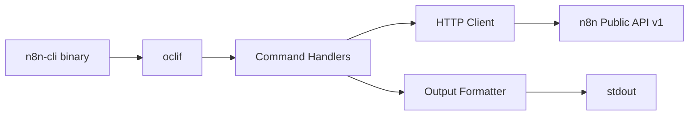
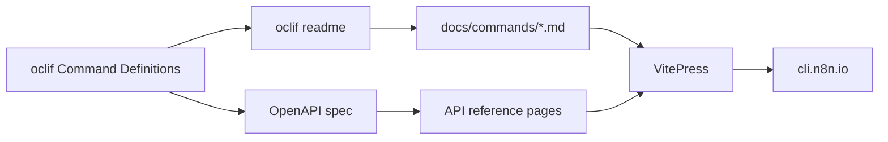

# RFC: n8n Client CLI for AI Agents

**Status**: Proposed
**Date**: 2026-03-04

---

## Context

AI coding agents (Claude Code, Cursor, Windsurf, etc.) are becoming the primary
way developers interact with tools. These agents excel when they can use CLI
tools — LLMs are trained on billions of CLI interactions and instinctively
understand `--help`, flags, and piping. GitHub's `gh` CLI is the canonical
example: it's why AI agents handle GitHub operations so well.

n8n currently has no client-side CLI. The existing `n8n` CLI in `packages/cli`
is a **server CLI** — it boots the full application (database, ORM, migrations,
Sentry, DI container) to run commands. This makes it unsuitable as a lightweight
client tool.

Meanwhile, n8n already has a comprehensive Public API v1 with full CRUD for
workflows, executions, credentials, tags, projects, users, variables, and data
tables. All that's missing is a thin client wrapper.

## Problem Statement

**AI agents cannot efficiently interact with n8n instances today.** The gaps:

1. **No CLI exists** — agents must craft raw HTTP requests with `curl`, requiring
   knowledge of the API URL structure, auth headers, pagination handling, and
   response parsing. This wastes context window tokens on boilerplate.

2. **MCP alone is insufficient** — while n8n could expose an MCP server, CLI is
   strictly more universal:
   - Every AI tool can run bash; not every tool supports MCP
   - CLI output pipes through `grep`, `jq`, `head` — only relevant data enters
     the context window
   - Zero ceremony: no handshake, no JSON-RPC, no persistent connection
   - Battle-tested pattern with decades of ecosystem support

3. **The existing server CLI can't be repurposed** — `packages/cli`'s
   `BaseCommand.init()` boots the full DB, ORM migrations, and DI container.
   It requires `@n8n/db`, `n8n-core`, TypeORM, and `reflect-metadata` as
   transitive dependencies. This is irrelevant and prohibitively heavyweight
   for an HTTP client.

## Decision

Create a **new standalone package** `@n8n/cli` that wraps the n8n Public API v1
as a developer-friendly CLI tool. It follows the pattern established by
`@n8n/fs-proxy` — zero n8n server dependencies, plain `tsc` build, standalone
`npx` usage.

### Why a Standalone Package

| Concern | Extending `packages/cli` | New `@n8n/cli` package |
|---------|--------------------------|------------------------|
| Dependencies | Full n8n server stack | `@oclif/core` + native `fetch` |
| Boot time | Seconds (DB, ORM, DI) | Milliseconds (HTTP client) |
| Install size | Hundreds of MB | < 1 MB |
| Distribution | Only via n8n server install | `npx @n8n/cli`, standalone binary |
| Context | Server-side, requires DB access | Client-side, needs only API URL + key |

## Command Surface (V1 Scope)

The CLI wraps the existing Public API v1 endpoints. Every command maps 1:1 to
an API call.

### Global Flags

```
--url, -u       n8n instance URL (or N8N_URL env var)
--api-key, -k   API key (or N8N_API_KEY env var)
--format, -f    Output format: table (default), json, id-only
--quiet, -q     Suppress non-essential output
```

### Configuration

```bash
# Store connection details (saved to ~/.n8n-cli/config.json)
n8n-cli config set-url https://my-n8n.app.n8n.cloud
n8n-cli config set-api-key n8n_api_...
n8n-cli config show
```

### Workflows

```bash
# List workflows (with filtering)
n8n-cli workflow list
n8n-cli workflow list --active
n8n-cli workflow list --tag=production
n8n-cli workflow list --format=json | jq '.[].name'

# Get a specific workflow
n8n-cli workflow get <id>
n8n-cli workflow get <id> --format=json > workflow.json

# Create workflow from JSON
n8n-cli workflow create --file=workflow.json
cat workflow.json | n8n-cli workflow create --stdin

# Update workflow
n8n-cli workflow update <id> --file=workflow.json

# Activate / Deactivate
n8n-cli workflow activate <id>
n8n-cli workflow deactivate <id>

# Delete
n8n-cli workflow delete <id>

# Tags
n8n-cli workflow tags <id>
n8n-cli workflow tags <id> --set=tag1,tag2

# Transfer to project
n8n-cli workflow transfer <id> --project=<projectId>
```

### Executions

```bash
# List executions
n8n-cli execution list
n8n-cli execution list --workflow=<id>
n8n-cli execution list --status=error --limit=10

# Get execution details
n8n-cli execution get <id>

# Retry a failed execution
n8n-cli execution retry <id>

# Stop a running execution
n8n-cli execution stop <id>

# Delete an execution
n8n-cli execution delete <id>
```

### Credentials

```bash
# List credentials
n8n-cli credential list
n8n-cli credential list --type=notionApi

# Get credential (metadata only — no secrets)
n8n-cli credential get <id>

# Get credential schema
n8n-cli credential schema <typeName>

# Create credential
n8n-cli credential create --type=notionApi --name="My Notion" --data='{"apiKey":"..."}'

# Delete credential
n8n-cli credential delete <id>

# Transfer to project
n8n-cli credential transfer <id> --project=<projectId>
```

### Tags

```bash
n8n-cli tag list
n8n-cli tag create --name="production"
n8n-cli tag update <id> --name="staging"
n8n-cli tag delete <id>
```

### Projects

```bash
n8n-cli project list
n8n-cli project get <id>
n8n-cli project create --name="AI Workflows"
n8n-cli project update <id> --name="New Name"
n8n-cli project delete <id>

# Project members
n8n-cli project members <id>
n8n-cli project add-member <projectId> --user=<userId> --role=editor
n8n-cli project remove-member <projectId> --user=<userId>
```

### Variables

```bash
n8n-cli variable list
n8n-cli variable create --key=API_ENDPOINT --value=https://api.example.com
n8n-cli variable update <id> --value=https://new-api.example.com
n8n-cli variable delete <id>
```

### Data Tables

```bash
# Tables
n8n-cli data-table list
n8n-cli data-table get <id>
n8n-cli data-table create --name="Inventory"
n8n-cli data-table delete <id>

# Rows
n8n-cli data-table rows <tableId>
n8n-cli data-table add-rows <tableId> --file=rows.json
n8n-cli data-table update-rows <tableId> --file=rows.json
n8n-cli data-table upsert-rows <tableId> --file=rows.json
n8n-cli data-table delete-rows <tableId> --ids=row1,row2
```

### Users

```bash
n8n-cli user list
n8n-cli user get <id>
```

### Source Control

```bash
n8n-cli source-control pull
```

### Audit

```bash
n8n-cli audit
```

## Package Structure

```
packages/@n8n/cli/
  package.json
  tsconfig.json
  tsconfig.build.json
  src/
    cli.ts                  # Entrypoint (#!/usr/bin/env node)
    client.ts               # HTTP client wrapping Public API v1
    config.ts               # Config file management (~/.n8n-cli/)
    output.ts               # Output formatters (table, json, id-only)
    commands/
      workflow/
        list.ts             # workflow list
        get.ts              # workflow get <id>
        create.ts           # workflow create --file
        update.ts           # workflow update <id> --file
        delete.ts           # workflow delete <id>
        activate.ts         # workflow activate <id>
        deactivate.ts       # workflow deactivate <id>
        tags.ts             # workflow tags <id>
        transfer.ts         # workflow transfer <id> --project
      execution/
        list.ts             # execution list
        get.ts              # execution get <id>
        retry.ts            # execution retry <id>
        stop.ts             # execution stop <id>
        delete.ts           # execution delete <id>
      credential/
        list.ts             # credential list
        get.ts              # credential get <id>
        create.ts           # credential create --type --name --data
        delete.ts           # credential delete <id>
        schema.ts           # credential schema <typeName>
        transfer.ts         # credential transfer <id> --project
      tag/
        list.ts             # tag list
        create.ts           # tag create --name
        update.ts           # tag update <id> --name
        delete.ts           # tag delete <id>
      project/
        list.ts             # project list
        get.ts              # project get <id>
        create.ts           # project create --name
        update.ts           # project update <id>
        delete.ts           # project delete <id>
        members.ts          # project members <id>
        add-member.ts       # project add-member <id> --user --role
        remove-member.ts    # project remove-member <id> --user
      variable/
        list.ts             # variable list
        create.ts           # variable create --key --value
        update.ts           # variable update <id> --value
        delete.ts           # variable delete <id>
      data-table/
        list.ts             # data-table list
        get.ts              # data-table get <id>
        create.ts           # data-table create --name
        delete.ts           # data-table delete <id>
        rows.ts             # data-table rows <tableId>
        add-rows.ts         # data-table add-rows <tableId> --file
        update-rows.ts      # data-table update-rows <tableId> --file
        upsert-rows.ts      # data-table upsert-rows <tableId> --file
        delete-rows.ts      # data-table delete-rows <tableId> --ids
      user/
        list.ts             # user list
        get.ts              # user get <id>
      source-control/
        pull.ts             # source-control pull
      audit/
        index.ts            # audit
      config/
        set-url.ts          # config set-url <url>
        set-api-key.ts      # config set-api-key <key>
        show.ts             # config show
  docs/                     # Documentation site (VitePress)
    .vitepress/
      config.ts
    index.md
    getting-started.md
    commands/               # Auto-generated by `oclif readme`
    guides/
      ai-agents.md
      ci-cd.md
    api-reference.md
```



### `package.json` (sketch)

```json
{
  "name": "@n8n/cli",
  "version": "0.1.0",
  "description": "Client CLI for n8n — manage workflows, executions, and credentials from the terminal",
  "bin": {
    "n8n-cli": "dist/cli.js"
  },
  "files": ["dist/**/*"],
  "scripts": {
    "build": "tsc -p tsconfig.build.json",
    "typecheck": "tsc --noEmit",
    "lint": "eslint . --quiet",
    "test": "vitest run",
    "docs:generate": "oclif readme --output-dir=docs/commands --no-aliases",
    "docs:dev": "vitepress dev docs",
    "docs:build": "pnpm docs:generate && vitepress build docs"
  },
  "oclif": {
    "bin": "n8n-cli",
    "commands": {
      "strategy": "explicit",
      "target": "./dist/index.js",
      "identifier": "commands"
    },
    "topicSeparator": " "
  },
  "dependencies": {
    "@oclif/core": "^4.5.2"
  },
  "devDependencies": {
    "@n8n/typescript-config": "workspace:*",
    "@types/node": "catalog:",
    "vitepress": "^1.6.0"
  }
}
```

Key design choice: **minimal runtime dependencies**. Node.js 18+ has native
`fetch`, so no HTTP library is needed. This keeps install size minimal and
`npx @n8n/cli` fast.

## Technology Stack

### CLI Framework: oclif

**oclif** (by Salesforce) over Commander.js or other alternatives because:

- **Already used in the monorepo** — `@n8n/node-cli` uses oclif, so the team
  has existing familiarity, patterns, and shared config
- **First-class TypeScript** — type-safe command definitions, args, and flags
- **Auto-generated help** — every command and subcommand gets `--help` for free,
  critical for AI agent discoverability
- **Built-in testing harness** — `@oclif/test` for command integration tests
- **Proven at scale** — powers Heroku CLI, Salesforce CLI, Shopify CLI
- **Plugin system** — enables future extensibility without core changes
- **Topic-based command grouping** — `n8n-cli workflow list` maps naturally to
  oclif's topic/command model

### HTTP Client: Native `fetch`

Node.js 18+ provides native `fetch`. No HTTP library dependency needed.

### Build: Plain `tsc`

Following the `@n8n/fs-proxy` pattern — simple TypeScript compilation,
no bundler, no extra build tooling.

## Documentation Site

The CLI ships with an **auto-generated documentation site** built with oclif's
README generation and **VitePress** for the hosted site.

### Why Auto-Generation Matters

Manual docs drift from the actual CLI. The documentation pipeline is fully
automated — command definitions are the single source of truth:



### Generation Pipeline

1. **oclif generates command reference** — `oclif readme` introspects every
   command class and produces markdown with usage, flags, arguments, and
   examples. This runs as a build step, so docs always match the code.

2. **VitePress renders the site** — the generated markdown files are dropped
   into a VitePress project that adds navigation, search, and theming.

3. **OpenAPI spec generates API reference** — the existing `openapi.yml` is
   rendered alongside CLI docs so users can see both the CLI command and the
   underlying API endpoint it wraps.

### Why VitePress

- **Vue ecosystem** — n8n's frontend is Vue, team knows the tooling
- **Markdown-first** — auto-generated markdown from oclif drops in directly
- **Built-in search** — local search out of the box, Algolia optional
- **Fast** — Vite-powered dev server and static build
- **Vue components in markdown** — interactive examples if needed later

### Documentation Structure

```
packages/@n8n/cli/
  docs/
    .vitepress/
      config.ts             # VitePress config (nav, sidebar, theme)
    index.md                # Landing page
    getting-started.md      # Install, configure, first command
    commands/               # Auto-generated by oclif readme
      workflow.md
      execution.md
      credential.md
      tag.md
      project.md
      variable.md
      data-table.md
      user.md
      config.md
    guides/
      ai-agents.md          # How to use with Claude Code, Cursor, etc.
      ci-cd.md              # Using n8n-cli in CI/CD pipelines
    api-reference.md        # Generated from openapi.yml
```

### Build Commands

```bash
# Regenerate command docs from oclif definitions
pnpm docs:generate    # runs: oclif readme --output-dir=docs/commands

# Dev server
pnpm docs:dev         # runs: vitepress dev docs

# Build static site
pnpm docs:build       # runs: vitepress build docs
```

### CI Integration

The docs build runs in CI to catch drift:

```yaml
# In the package's CI step
- run: pnpm docs:generate
- run: git diff --exit-code docs/commands/  # Fail if docs are stale
```

If a developer adds a command or flag but forgets to regenerate docs, CI
catches it. This keeps documentation permanently in sync with the code.

## Key Design Decisions

### Authentication

The CLI uses the same API key mechanism as the Public API:

```bash
# Via flag (highest priority)
n8n-cli --api-key=n8n_api_xxx workflow list

# Via environment variable
export N8N_API_KEY=n8n_api_xxx
n8n-cli workflow list

# Via config file (lowest priority)
n8n-cli config set-api-key n8n_api_xxx
```

Resolution order: `--api-key` flag > `N8N_API_KEY` env var > `~/.n8n-cli/config.json`.

The config file stores the API key with file permissions restricted to the
current user (`0600`).

### Output Formats

Three output modes serve different consumers:

| Format | Flag | Use Case |
|--------|------|----------|
| Table | `--format=table` (default) | Human-readable, terminal display |
| JSON | `--format=json` | Piping to `jq`, programmatic use, AI agents |
| ID-only | `--format=id-only` | Piping to `xargs`, scripting |

```bash
# Human reads a table
n8n-cli workflow list
# ID    NAME              ACTIVE  UPDATED
# wf1   Email Campaign    true    2h ago
# wf2   Data Sync         false   3d ago

# AI agent gets structured data
n8n-cli workflow list --format=json | jq '.[] | select(.active) | .id'

# Script pipes IDs
n8n-cli workflow list --format=id-only | xargs -I{} n8n-cli workflow deactivate {}
```

### Pagination

The Public API uses cursor-based pagination. The CLI handles it transparently:

```bash
# Fetches all pages automatically (default)
n8n-cli workflow list

# Limit results
n8n-cli workflow list --limit=10

# Manual pagination (for large datasets)
n8n-cli workflow list --cursor=<nextCursor> --page-size=20
```

### Discoverability for AI Agents

The CLI is designed to be self-teaching:

1. **`--help` at every level** — auto-generated by oclif, teaches all
   commands and flags
2. **Consistent patterns** — every resource follows `list`, `get`, `create`,
   `update`, `delete` — once an agent learns one, it knows all
3. **One line in `CLAUDE.md`** — all an AI agent needs:
   ```
   Use `n8n-cli` to manage n8n workflows, executions, and credentials.
   Run `n8n-cli --help` to see available commands.
   ```
4. **Meaningful exit codes** — `0` success, `1` error, `2` auth failure — agents
   can branch on `$?`
5. **Errors on stderr, data on stdout** — clean piping without error messages
   contaminating data streams

### Error Handling

```bash
# Clear, actionable error messages
$ n8n-cli workflow get nonexistent
Error: Workflow not found (404)

$ n8n-cli --url=https://unreachable.example workflow list
Error: Could not connect to n8n at https://unreachable.example
Hint: Check the URL and ensure the instance is running

$ n8n-cli workflow list
Error: No API key configured
Hint: Run 'n8n-cli config set-api-key <key>' or set N8N_API_KEY
```

## Distribution Strategy

### Phase 1: Monorepo Package
- Lives at `packages/@n8n/cli` within the n8n monorepo
- Published to npm as `@n8n/cli`
- Usable via `npx @n8n/cli` with zero install

### Phase 2: Global Install
- `npm install -g @n8n/cli` for persistent installation
- Provides `n8n-cli` in `$PATH`

### Phase 3: Standalone Binaries (stretch)
- Use `pkg` or `bun build --compile` to produce single-file binaries
- Distribute via GitHub Releases for environments without Node.js
- Enables `brew install n8n-cli` via Homebrew tap

## Consequences

### Positive
- AI agents get a first-class, zero-friction interface to n8n
- The CLI is trivially scriptable — CI/CD pipelines can manage workflows
- Community can build tooling on top (VS Code extensions, Raycast plugins)
- Low implementation cost — thin HTTP wrapper over existing API
- Independent release cycle from the n8n server

### Negative
- Another package to maintain in the monorepo
- Must stay in sync with Public API changes (mitigated by OpenAPI codegen)
- Naming overlap with the existing server CLI (`n8n` vs `n8n-cli`) requires
  clear documentation

### Risks
- If the Public API changes significantly, the CLI must track those changes
- Users may confuse `n8n-cli` (client) with the `n8n` server CLI

## References

| Resource | Location |
|----------|----------|
| Public API OpenAPI spec | `packages/cli/src/public-api/v1/openapi.yml` |
| Standalone package pattern | `packages/@n8n/fs-proxy/package.json` |
| CLI entrypoint pattern | `packages/@n8n/fs-proxy/src/cli.ts` |
| oclif framework usage | `packages/@n8n/node-cli/package.json` |
| Server CLI (for contrast) | `packages/cli/src/commands/list/workflow.ts` |
| ADR format reference | `packages/@n8n/instance-ai/docs/decisions.md` |
| API auth mechanism | `X-N8N-API-KEY` header (`openapi.yml` securitySchemes) |
