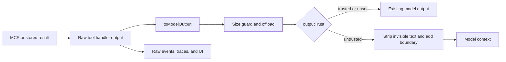

# External tool result boundaries

## Context

Instance AI can call tools supplied by connected MCP servers. The server configuration is
administrator-controlled, but a tool result can contain data relayed from another system. The model
currently receives some MCP result shapes without the same explicit data boundary used for other
external content.

MCP results are not limited to text blocks. A result can also contain structured content, resources,
metadata, media, extension fields, or a server-authored error. Large results can be truncated or
stored in the workspace and read back in pages.

## Decision

Put the trust decision on the built tool and enforce it at the runtime seam that creates the final
model-facing result.

- Add an optional `outputTrust: 'untrusted'` property to `BuiltTool`.
- Add `Tool.untrustedOutput()` so SDK-defined tools can opt in without rebuilding the tool object.
- Mark connected MCP tools, local gateway MCP tools, and `workspace_read_tool_result` as untrusted.
- Keep raw handler results unchanged for lifecycle events, traces, UI consumers, and returned tool
  entries. Persist the protected representation in model conversation history.
- Apply size guarding first. Then serialize and boundary-wrap the final model-facing value. This
  prevents truncation or offloading from splitting the boundary.
- Apply the same treatment to custom messages derived with `toMessage` and to errors returned by an
  untrusted-output tool.
- Keep server connection and tool-listing failure details inside a separate data boundary within the
  model-facing status note.
- Preserve media parts. Wrap every textual part and add a model-facing trust marker when a result or
  custom message contains only media.
- Strip invisible Unicode from model-facing untrusted text and escape closing boundary tags.
- Wrap each page returned by `workspace_read_tool_result` so stored result pagination cannot remove
  the trust marker.

The runtime interface stays small: tool authors only declare output trust. Serialization, size
handling, message handling, media handling, and error handling stay inside the runtime.

## Data flow

## Error handling

Handler, validation, and transform errors continue through the existing error path. If the resolved
tool declares untrusted output, the final bounded error text receives the same data boundary. Errors
for an unknown tool keep their current representation because no tool trust declaration is available.

## Compatibility

The property is optional, so existing tools do not change. The existing MCP media conversion remains
responsible for provider-compatible content parts. Approval, deferred-tool, tracing, and replay
wrappers already preserve built-tool properties with object spread; tests verify that the trust
declaration reaches execution.

## Verification

Regression coverage must include:

- text and text-resource results with invisible Unicode and boundary-like text;
- structured content, metadata, resource links, and additional root fields;
- mixed text/media and media-only model outputs and custom messages;
- successful `isError` MCP result objects and server-thrown errors;
- connection and tool-listing failure details placed in the system status note;
- raw event output remaining unchanged;
- approval and wrapped-tool execution preserving the trust declaration;
- oversized results and every page returned from stored-result inspection;
- the Instance AI prompt doctrine naming all MCP result forms as external reference material.

## Related implementation

Draft PR [#37305](https://github.com/n8n-io/n8n/pull/37305) implements the ticket's original
field-level approach. It centralizes the text helpers and handles MCP text blocks and text resources.
It does not protect the complete model-visible result: structured content, metadata, resource-link
fields, additional result fields, and server-authored errors can use different model paths. It also
adds the boundary before size handling, so later truncation or stored-result paging can separate data
from its marker. This design moves the decision to the final runtime seam so all representations use
one policy.

## Out of scope

MCP integrations that do not use `BuiltTool` or `ToolCallExecutor` need separate product-specific
review and compatibility testing.
