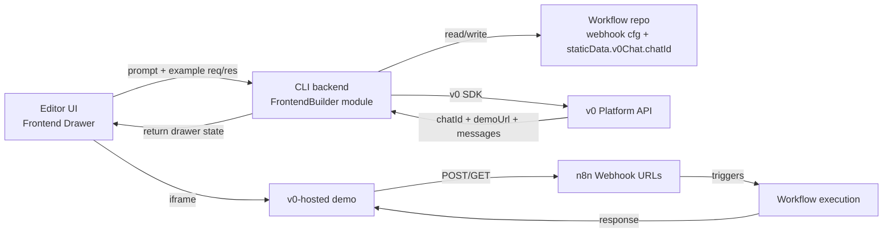

# v0 Integration PoC — Design

**Status:** Draft spec (brainstormed 2026-04-22)
**Owner:** Danny Martini
**Context doc:** [Notion — Spike on Vercel's v0](https://www.notion.so/33b5b6e0c94f803e8d01faf2600e95d5)
**Budget:** ~2 weeks (≈1.5 weeks build, ≈0.5 weeks investigations + report)

## 1. Goal

Answer the Notion spike's questions by building an end-to-end PoC that:

1. Lets a user generate a custom frontend for an n8n workflow by writing a prompt.
2. Iterates on that frontend by sending follow-up messages, feeding v0 real request/response examples from the workflow.
3. Produces a working demo against a real, running workflow.
4. Produces a written report on integration surface, lock-in/ejectability, CORS, auth, pricing, and iteration-UX trade-offs.

Not in scope to ship: a productionised feature, a Frontends list view, Vercel deployment linking, Instance AI (superagent) integration, or ejection tooling.

## 2. North-star flow

1. User builds a workflow containing one or more Webhook Triggers.
2. User activates (publishes) the workflow.
3. User runs the workflow once (manual execution in the editor) so that request + response examples are loaded in the editor's run-data state.
4. User clicks **Frontend** on the canvas (sibling of the Execute Workflow button) → drawer opens.
5. User types: *"A form with order number, customer email and notes; POSTs to my workflow and shows the returned ticket id on success."*
6. Backend composes a v0 prompt from the payload, calls `v0.chats.create`, stashes the returned `chatId` into `workflow.staticData`, returns the `demoUrl` and assistant response.
7. Drawer renders the iframe pointing at `demoUrl`. User interacts with the generated FE; the FE calls the workflow's webhook(s) directly. Workflow executions are visible in the normal executions list.
8. User re-runs the workflow in the editor with a different payload, pins the interesting execution in run-data, then sends a follow-up message: *"Render the response as a table of line-items, using the customer's full name (firstName + lastName)."* v0 receives the new example response and refines the FE.
9. State persists on the workflow; reopening the drawer restores the chat from v0.

## 3. Architecture



### Responsibility line (the question the Notion doc asks us to draw)

- **v0 owns:** generated FE code, hosting (`demoUrl`), chat iteration state, source-file access (the `files[]` on each version).
- **n8n owns:** the API contract (webhook triggers), example request/response data (from the editor's loaded run data), the generation entry point (drawer), persistence of `chatId`, and the escape hatch (report-only for this spike).
- **Intentionally open in the PoC:** memory/storage for the generated FE (v0 demos are stateless — fine for demo), auth on webhooks called by the generated FE (punted, documented as a finding), custom domains / Vercel-project linking (investigation only).

## 4. Scope

Built and demoed:

- Canvas-level **Frontend** button (sibling of Execute Workflow), enabled iff the workflow has ≥1 Webhook Trigger.
- Drawer UI: chat message list + textarea + iframe preview.
- Backend module that composes prompts, talks to v0, persists `chatId` in `staticData.v0Chat`.
- Multi-endpoint support: every Webhook Trigger in the workflow is forwarded as a separate endpoint context to v0.
- State rehydration: on drawer open, v0 is the source of truth for messages and `demoUrl`.

Out of built scope (report-only investigations):

1. **Ejectability** — what `chat.latestVersion.files` contains, whether it compiles standalone, dependency footprint, hosting on n8n infra.
2. **Vercel project linking / custom domains.**
3. **CORS** between v0's preview origin and n8n webhook responses. Pulled into scope only if it blocks the demo.
4. **Auth on webhooks** called by a generated FE. Pulled into scope only if needed for the demo use case.
5. **Pricing / rate limits / credit model.**
6. **Iteration UX optimisation** — three options evaluated with effort estimates: (a) persistent test webhooks during drawer session, (b) auto-pin latest execution when sending a follow-up, (c) live execution view during drawer session.
7. **Persistent state** for the generated FE (localStorage, backend store).
8. **Instance AI integration outline** — how the same backend endpoint becomes a tool for the superagent.

## 5. PoC preconditions (documented limitations)

- **Workflow must be activated.** The generated FE in the iframe makes real requests; we rely on production webhooks because they stay live. Test webhooks are one-shot and would break after the first call; reworking the test-webhook lifecycle is its own spike and is captured in investigation #6 above.
- **Example data comes from the editor's in-memory run data**, not the executions DB. The user controls what the FE sees by choosing what to pin or load in the editor before sending a message.
- **Iteration has friction.** After running the workflow, the user must pin the new execution's data in the editor before sending the next message. This is the central UX pain point and is the subject of investigation #6.
- **Mid-iframe call transparency is out of scope.** Each call from the iframe becomes an execution in the executions list, but we don't animate them on the canvas.

## 6. Data flow (message lifecycle)

### Opening the drawer

- FE reads `workflow.staticData.v0Chat?.chatId`.
- If present → `GET /rest/workflows/:id/frontend`. Backend calls `v0Client.getChat(chatId)`, returns `{ chatId, demoUrl, messages }`. Drawer renders history + iframe.
- If absent → empty drawer, no backend call.

### Sending a message (first or Nth)

- FE gathers, from local `workflowsStore` state only:
  - `prompt` (textarea value)
  - `endpoints[]` — for each Webhook Trigger node: `{ nodeName, method, url, requestExample?, responseExample? }` from the editor's loaded run data.
- `POST /rest/workflows/:id/frontend/messages` with that payload.
- Backend:
  1. Load workflow; verify caller can edit it; verify ≥1 webhook trigger.
  2. Compose the v0 prompt via `core/build-v0-prompt.ts` (pure function).
  3. If `staticData.v0Chat.chatId` exists → `v0Client.sendMessage({ chatId, message })`, else → `v0Client.create({ message })`.
  4. Persist `chatId` to `staticData.v0Chat` if newly created. Save workflow.
  5. Return `{ chatId, demoUrl, assistantMessage }`.
- FE appends assistant message, swaps iframe `src`.

### v0 prompt template (sketch)

```
You are building a single-page frontend that talks to these n8n workflow endpoints:

{#each endpoints}
- {method} {url}  (node: "{nodeName}")
  {?requestExample} Example request body: {requestExample}{/?}
  {?responseExample} Example response: {responseExample}{/?}
{/each}

User request: {prompt}

Constraints:
- Use fetch() directly; no separate backend.
- If a response example is missing, treat the shape as unknown and render received data as JSON for now.
- Handle network errors gracefully.
```

### Iframe interactions

Out-of-band for our code. The iframe is on v0's preview domain; it calls the n8n webhook URLs directly. n8n records each as an execution in the normal way.

### Closing / reopening the drawer

No teardown needed. `staticData.v0Chat.chatId` persists. Reopen = the "opening" flow above.

## 7. Persistence

```ts
// workflow.staticData.global.v0Chat
type V0ChatStaticData = {
  chatId: string;
};
```

Minimal on purpose — v0 owns messages and `demoUrl`. `staticData` already travels with workflow export/import; we note this in the report as a finding (export of a workflow carries the `chatId`; re-import on another instance would require either carrying the v0 auth along or re-generating — almost certainly re-generating is the right behaviour long-term).

## 8. API surface

Two endpoints, both under the existing workflow-edit authorization.

```
GET /rest/workflows/:workflowId/frontend
  → { chatId, demoUrl, messages[] } | { chatId: null } if no chat yet

POST /rest/workflows/:workflowId/frontend/messages
  body: {
    prompt: string;
    endpoints: Array<{
      nodeName: string;
      method: "GET" | "POST" | "PUT" | "PATCH" | "DELETE";
      url: string;
      requestExample?: unknown;
      responseExample?: unknown;
    }>;
  }
  → { chatId, demoUrl, assistantMessage }
```

Shared types live in `packages/@n8n/api-types/src/frontend-builder/`.

## 9. Code layout (Functional Core, Imperative Shell)

```
packages/cli/src/modules/frontend-builder/
├── frontend-builder.module.ts          // DI wiring (shell)
├── frontend-builder.controller.ts      // HTTP (shell)
├── frontend-builder.service.ts         // orchestration (shell, thin)
├── v0-client.ts                        // injectable boundary around v0-sdk (shell)
├── v0-client.interface.ts              // IV0Client — contract for fakes
├── core/                               // pure, no I/O
│   ├── build-v0-prompt.ts
│   ├── sanitize-endpoint-examples.ts
│   └── derive-drawer-state.ts
└── __tests__/
    ├── core/                                   // unit tests, small set
    ├── frontend-builder.integration.test.ts    // main coverage
    └── v0-client.test.ts                        // boundary smoke test
```

### The v0 boundary

```ts
// v0-client.interface.ts
export interface IV0Client {
  create(input: { message: string }): Promise<V0ChatResult>;
  sendMessage(input: { chatId: string; message: string }): Promise<V0ChatResult>;
  getChat(chatId: string): Promise<V0ChatResult>;
}

export type V0ChatResult = {
  chatId: string;
  demoUrl: string | null;
  messages: Array<{ role: 'user' | 'assistant'; content: string; createdAt: string }>;
};
```

`V0Client` is the only class importing `v0-sdk`. A `FakeV0Client` is used in integration tests. Nothing else is mocked.

### Frontend

```
packages/frontend/editor-ui/src/features/workflows/canvas/components/elements/buttons/
└── CanvasCreateFrontendButton.vue      // sibling of CanvasRunWorkflowButton

packages/frontend/editor-ui/src/features/frontend-builder/
├── components/
│   ├── FrontendBuilderDrawer.vue
│   ├── FrontendBuilderMessageList.vue
│   ├── FrontendBuilderPromptInput.vue
│   └── FrontendBuilderIframe.vue
└── composables/
    └── useFrontendBuilder.ts            // state + API client
```

The composable reads endpoint examples from `workflowsStore` at send time; nothing else in the store knows the drawer exists.

## 10. Testing strategy

Functional Core, Imperative Shell:

- **Pure unit tests** (small set): `build-v0-prompt`, `sanitize-endpoint-examples`, `derive-drawer-state`.
- **Integration tests** (main coverage): controller + service + DB + repos wired up with real DI; only `V0Client` replaced by `FakeV0Client`. Scenarios:
  - First message: `FakeV0Client.create` called with correct prompt; `staticData.v0Chat.chatId` persisted.
  - Subsequent message: `sendMessage` called with persisted `chatId`.
  - Re-open: `getChat` called; returned state matches `derive-drawer-state` output.
  - Authorization: user without workflow edit access → 403.
  - Missing config: `V0_API_KEY` unset → 503.
  - Validation: workflow has no Webhook Trigger → 400.
  - Error: v0 client throws → 502 with retryable hint.
- **E2E smoke (one Playwright test)**: open drawer, send prompt, iframe populates, reload, drawer rehydrates. v0 stubbed at network layer via `page.route()`.
- **No v0 network calls in CI.** Manual smoke-test checklist in the module README for local dev; each generation costs credits.

## 11. Feature gating

- Backend env: `V0_API_KEY` (secret) and `N8N_FRONTEND_BUILDER_ENABLED=true` (bool).
- Frontend settings expose a matching `frontendBuilderEnabled` flag; `CanvasCreateFrontendButton` is hidden when false.
- No Posthog experiment for the spike — internal-demo-only.

## 12. Error handling

| Case | Response |
|---|---|
| `V0_API_KEY` unset | 503 `"Frontend builder not configured on this instance"` |
| Workflow has no Webhook Trigger | 400 `"Workflow needs at least one Webhook Trigger"` |
| Workflow not activated | 400 with explicit copy: *"Activate this workflow so the generated frontend can call its webhooks."* |
| v0 API 4xx | Surface `{ code, message }` to FE; FE shows inline error. |
| v0 API 5xx / network | 502; FE shows retry affordance. |
| User lacks edit permission on workflow | 403 (normal `@Scoped` guard). |

## 13. Report deliverable

Structure:

1. What we built + video walkthrough.
2. Responsibility line between v0 and n8n as drawn in the PoC.
3. Ejectability investigation: what `files[]` contains, dependency footprint, standalone compile result, options for hosting on n8n infra.
4. Deployment investigation: Vercel project linking, custom domains, viable productionisation paths.
5. CORS findings.
6. Auth findings for webhooks called by the FE.
7. Pricing / rate-limit observations.
8. Iteration-UX analysis: current friction, three optimisation options with effort estimates, recommendation.
9. Persistent-state needs for real FEs.
10. Instance AI integration outline.
11. Go/no-go recommendation.

## 14. Milestones (~2 weeks)

Non-binding sequence; real plan produced by writing-plans next.

- **Day 1–2:** backend module skeleton + `IV0Client` boundary + prompt builder (pure) + integration test harness with `FakeV0Client`.
- **Day 3–4:** integration tests green for create/continue/rehydrate; `staticData` persistence wired.
- **Day 5–7:** frontend drawer (button + drawer shell + iframe + message list + composable) with a real backend; manually-driven happy path working against the real v0 API with one sample workflow.
- **Day 8:** smoke E2E, hardening, feature-flag gating, copy polish.
- **Day 9–10:** investigations (ejectability, CORS if blocking, pricing sanity, iteration-UX options) and written report.

## 15. Open implementation details (to be confirmed during build)

- The exact v0-sdk method name for "get chat including messages" — docs show `GET /v1/chats/:id/messages`; if the SDK exposes this as `v0.chats.getById` / `v0.chats.messages.list` / something else, we confirm on day 1 and adapt `IV0Client.getChat`. The *interface* stays as specified.
- Whether `demoUrl` is returned on `sendMessage` or must be read via `getChat`. If the former, we return it directly; if the latter, we do an extra `getChat` call after `sendMessage`. Impact: one extra round-trip in the worst case.

---
