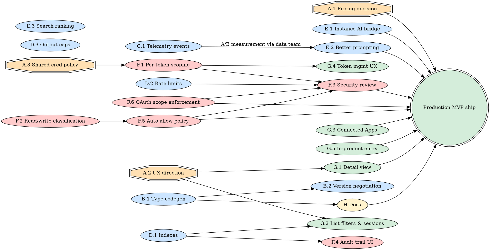

# n8n Hub — Production MVP gaps

## What this document is

A gap analysis between the hackathon implementation and a **production MVP** — defined here as "release to the full user base, behind a feature flag, with no embarrassments." Not GA-quality, not multi-quarter polish, but defensible: we can point new users at it, support engineers can debug it, finance can bill for it, and security can stand behind it.

This is distinct from the "experiment MVP" framing from the prior brainstorming session (cohort of 5–10 design partners, opt-in, accepted rough edges). Production MVP is the next stop: same surface, harder to ship.

The gaps below were drawn from (a) the original design's "Path to production" list, (b) the production handoff's known shortcuts, (c) a follow-up review covering analytics, prompting, shared credentials, Instance AI integration, codegen, indexes, UX, pricing, docs, rate limits, and auto-allow policy.

### Estimate calibration — AI-assisted startup pace

All numbers in this doc are calibrated for **n8n's pace**: AI-augmented engineers, low ceremony, willingness to ship behind feature flags and iterate. The hackathon shipped ~38 new files + 37 modified + ~1,482 tests green in **~1 engineer-week**. That's the unit of work this plan is denominated in, not traditional sprint velocity.

Concretely:
- **Routine plumbing** (endpoints, DTOs, tests, simple UI): ~2–3× faster than non-AI baseline
- **Complex architecture** (type codegen, search ranking, security design): ~1.5–2× faster
- **People-bound work** is *unchanged* by AI: leadership decisions, design-partner interviews, security review wall-clock, cross-team negotiations. Don't compress these.
- **Documentation drafting** is heavily AI-assisted (~3× faster); editing/review is people-bound.

If you're reading this from a slower-cadence org, multiply by ~2.

---

## Reading guide — gap categories

The review's 11 gaps cluster into 6 categories. Two more (output limits, security baseline) appear from the handoff. Each section explains the gap, why it matters for production, the rough shape of the fix, and an effort estimate.

| # | Category | Gaps |
|---|---|---|
| A | Product decisions (block engineering) | Pricing, UX direction, shared credentials policy |
| B | Type system & SDK DX | Instance type codegen, fully-typed SDK, version negotiation |
| C | Product analytics & telemetry | Usage events, success rates, caller attribution |
| D | Performance & scale | Indexes for grouping, rate limits, output payload caps |
| E | AI integration quality | Instance AI ↔ Hub bridge, prompting, tool search ranking |
| F | Security baseline | Per-token scoping, read/write classification, threat-model sign-off, audit trail, auto-allow policy, OAuth scope persistence + per-tool enforcement |
| G | UX completion | Single-node detail view, filters, Connected Apps |
| H | Documentation | SDK reference, MCP setup, onboarding |

Within each category items are ordered by what unblocks what.

---

## A. Product decisions — must precede engineering

These are not engineering work, but until they're decided everything downstream churns.

### A.1 Pricing — do node calls count toward execution quotas?

**The question:** when an SDK or MCP call hits `POST /executions/node`, does it consume a workflow execution from the customer's quota, or is it a separate meter?

**Why it blocks production:**
- The hackathon path reuses the workflow-execution meter (Option A in the design doc). A chatty agent burns a month's quota in minutes. We can't put this in front of paying cloud users without a decision.
- Self-hosted is unaffected — but the cloud answer also drives the public marketing pitch ("call your stack from anywhere"). Pricing IS the marketing.

**Options (reproduced from design doc):**
- **A.** Reuse workflow execution meter. Simple. Uncompetitive for AI use cases.
- **B.** Separate cheaper "node call" tier. Fairer; two meters to manage. Billing changes.
- **C.** Free tier + paid SDK/MCP. Lowest adoption friction; revenue modeling unclear.

**Recommendation:** **B with a free tier.** Separate node-call meter at ~10× cheaper than workflow executions. Generous free tier (e.g., 5,000 calls/mo on free plan, 50,000 on Starter). Enterprise add-on for high-volume.

**Decision owner:** product + finance leadership. ~1 day of meeting/spreadsheet time. **No engineering until this lands.**

**Engineering implication once decided:**
- If A: zero change.
- If B: new meter in the billing service (`@n8n/billing` or equivalent), separate quota check in `ExecuteNodeService`, separate Stripe SKU. ~2–3 days.
- If C: B + a free-tier ceiling enforcement (already in place for workflows; reuse). ~2–3 days.

### A.2 UX direction for the executions side

**The question:** what does the executions list become when ~30–80% of executions are no longer workflows?

Current state: single-node executions show up in the same list with a different sub-line and an optional caller chip. The 2026-05-13 sessions design proposes grouping by session. Neither is the final answer. Open product calls:

| Decision | Today | Production options |
|---|---|---|
| Should single-node executions live in the main list? | Yes, mixed in | (a) Mixed with a chip filter (b) Separate "Node calls" tab (c) Default-hidden, surfaced via session grouping |
| What does the detail page look like? | Currently broken (see G.1) | (a) Reuse workflow execution detail (b) Custom panel — no canvas, just input/output/credential/duration |
| How do we surface caller identity? | "via <caller>" sub-line + chip | (a) Caller column (b) Caller-as-filter (c) Caller-as-grouping (sessions design) |
| Where do sessions fit? | Designed, not implemented | (a) Default view (b) Toggle (c) Power-user feature in filters |

**Recommendation:** spike with 5 design partners, A/B test in product. Engineering can prototype any of these in ~3–5 days per direction once chosen.

**Decision owner:** product + design. ~3–5 days of design work + partner interviews (interview wall-clock is people-bound). Blocks G.1–G.4.

### A.3 Shared credentials — policy + permissions

**The question:** when User A's credential is shared with User B (existing workflow-sharing primitive), can User B's SDK/MCP token use that credential?

**Today's behavior:** unclear — the hackathon code resolves credentials via the existing `CredentialsService`, which honors workflow-sharing rules. So *technically yes*, but we never designed for this and the failure modes are untested.

**Production needs to decide:**
- Default policy: shared credentials are usable via Hub by sharees, OR shared credentials are workflow-only by default with an explicit "allow in Hub" opt-in?
- Audit: when a Hub call uses a shared credential, who's accountable in the audit log — the credential owner, the token holder, or both?
- Revocation: if the owner unshares the credential mid-session, what happens to in-flight calls? To the next call from the same token?

**Recommendation:** **opt-in per shared credential**, with a `hub:allow` flag added to the credential-sharing record. Default-off. Audit log shows both owner and caller. In-flight calls complete; next call returns 403.

**Effort once policy is decided:** ~2–3 days (DB column, sharing UI checkbox, middleware check, audit-log adjustment).

**Decision owner:** product + security. ~1–2 days.

---

## B. Type system & SDK DX

The hackathon SDK is a runtime proxy. It works, but autocomplete is dead and consumers cast their way through (`as unknown as DemoApi`). For a production MVP we need types.

### B.1 Instance node-type codegen

**What's missing:** the design called for `npx @n8n/sdk pull --instance https://...` — fetch the running instance's `nodes.json`, emit `.d.ts` files, ship per-instance types. The hackathon stubbed `scripts/generate-types.ts` and `pull.ts` but neither does anything yet.

**Why production-grade:**
- Without types, backend developers (one of the three target audiences) won't adopt. The SDK loses to `googleapis` / `slack-web-api` / vendor SDKs the moment a developer has to read `nodes.json` to know what fields exist.
- With types, the SDK is *better* than vendor SDKs — one install, one auth, one type system across 400+ services.
- It's also load-bearing for documentation: typed signatures = generated reference docs.

**Shape of the work:**
1. `scripts/generate-types.ts` consumes `nodes.json`, produces:
   - `types/<node>.d.ts` per node (e.g., `types/slack.d.ts` with `SlackSendMessageInput`, `SlackSendMessageOutput`)
   - `types/index.d.ts` aggregating into the `N8nClient` proxy surface
   - `registry.json` mapping `slack.message.send` → `(nodeType, operation, version)` for runtime dispatch
2. `pull` command in `@n8n/cli`: fetch `https://<instance>/types/nodes.json`, write into the consumer's `node_modules/@n8n/sdk/types/<instance-hash>/`, expose via `import { createClient } from '@n8n/sdk/<instance-hash>'`.
3. Property converter — reuse `@n8n/workflow-sdk`'s `INodeProperties → TypeScript` translator if reusable (the design noted this could shave weeks; needs a 1-day spike to confirm).
4. Output normalization — the SDK already unwraps single-item arrays at runtime; the types need to match. Today the runtime + type story diverge.

**Edge cases the converter must handle:**
- `displayOptions` (conditional fields) → optional fields in TS, with `@deprecated`/JSDoc warnings for invalid combos. JSON Schema can't express it cleanly but TS unions can.
- `loadOptions` → companion enum tools at SDK level (`n8n.slack.channels.list()`) — types reflect "you must call this first" via a `LoadedOptions<...>` brand type.
- `resourceLocator` → discriminated union `{ mode: 'id', value: string } | { mode: 'url', value: string }`.
- `resourceMapper` → defer; expose runtime-only with `unknown` typing + warning. Document as a v1 gap.

**Versioning:** types are pinned to (instance URL + n8n version). Consumer regenerates on `n8n upgrade`. SDK validates instance version at `createClient` time; warns on mismatch. Server side, the executor accepts requests against older type versions for at least N major versions — defer the exact policy.

**Effort:** **~4–6 days** for one engineer. The converter is the hard part; the rest is plumbing.

**Dependencies:** none — can run in parallel with everything else.

### B.2 Version negotiation

**What's missing:** an SDK generated against Slack v2.2 calls an instance running Slack v2.4. What happens?

Today: silent breakage if a field was renamed; success-but-wrong if a field was repurposed.

**Production needs:**
- `POST /executions/node` accepts an optional `sdkVersion` field. If a known-incompatible (nodeType, version) pair is requested, return a typed `N8nVersionDriftError` with structured info (which fields changed) rather than runtime garbage.
- SDK surfaces this as a clear error pointing at `npx @n8n/sdk pull` to refresh types.
- Server logs version drift events (analytics).

**Effort:** ~1 day. Largely glue between the executor and the existing node-version registry.

---

## C. Product analytics — telemetry events only

Scope: **plug the events.** Dashboards, KPI definitions, retention models, and any cross-event analysis are owned by the data team and explicitly out of this plan.

### C.1 Telemetry event taxonomy

Eng deliverable: a stable, well-named set of events the data team can build on. We agree the schema with them, fire the events, and stop there.

**What to instrument:**

| Event | Fired when | Properties |
|---|---|---|
| `hub.token.created` | Token is minted (PAT or OAuth) | `userId`, `tokenType`, `scopes`, `clientId?` |
| `hub.token.revoked` | Token revoked | `userId`, `tokenAge` |
| `hub.search.run` | `n8n_search_tools` called | `userId`, `query`, `resultsCount`, `clickedRank?` |
| `hub.node.executed` | `POST /executions/node` completes (success or failure) | `userId`, `nodeType`, `operation`, `caller.kind`, `caller.clientId?`, `credentialOwnerSameAsCaller`, `latencyMs`, `outputBytes`, `status`, `errorClass?` |
| `hub.session.started` | First execution from a (token, clientId) tuple in 30min | `userId`, `caller.kind`, `caller.clientId?` |
| `hub.session.ended` | 30min of inactivity OR explicit close | `userId`, `executionsInSession`, `uniqueNodesInSession`, `successRate`, `durationSec` |
| `hub.error.raised` | Server returns 4xx/5xx | `errorClass`, `nodeType?`, `httpStatus` |

**Wiring:** add a `HubAnalyticsService` that lifecycle hooks call. PostHog backend (already used in the codebase). Property names following existing conventions in `packages/cli/src/telemetry/`.

**Effort:** ~1–2 days for the event plumbing + ~1 day agreeing the schema with the data team. Their dashboard work runs in parallel and is not part of this plan.

---

## D. Performance & scale

The hackathon code works for hackathon-scale traffic. Three things will fall over under production load.

### D.1 Indexes for grouping

**Today:** the sessions feature (designed in `2026-05-13-n8n-hub-sessions-design.md`) groups executions by `(callerClientId, startedAt)` ranges. With no index, this is a full-table scan on `ExecutionEntity`, joined with `ExecutionMetadata`.

**Production needs:**
- Composite index on `ExecutionEntity (mode, startedAt DESC)` for the "single-node executions, recent first" list.
- Composite index on `ExecutionMetadata (key, value)` where `key IN ('callerClientId', 'callerKind', 'callerNodeType')` for the grouping queries.
- Possible separate denormalized `single_node_execution_summary` table if `ExecutionMetadata` joins prove too expensive. Decide based on staging benchmarks.

**Effort:** ~1 day for the indexes + a staging benchmark. ~2–3 days if we end up needing the denormalized table.

**Risk:** migration time on large self-hosted DBs. Use `CREATE INDEX CONCURRENTLY` (Postgres) and ship as a non-blocking migration with progress log. Sqlite users get a full table rebuild — usually fine.

### D.2 Rate limits

**Today:** none on `POST /executions/node`.

**Production needs:**

| Limit | Default | Configurable per |
|---|---|---|
| Per-token requests/min | 60 | Token |
| Per-credential concurrent requests | 5 | Credential |
| Per-user requests/min across all tokens | 600 | Instance |
| Server-wide circuit breaker on Hub endpoints | 5,000/min | Instance |

Reuse the existing `Throttle` decorator. Add a `RateLimitService` for the per-token + per-credential limits (decorator doesn't reach those granularities).

**Effort:** ~1–2 days for the limits + tests. ~half a day for an admin UI to view current limit hits.

### D.3 Output payload caps + streaming

**Today:** full output buffered and returned, no size cap. A Postgres query returning 100k rows would OOM the server or the client.

**Production needs:**
- Hard cap on synchronous response (e.g., 5 MB). If exceeded, return `{ executionId, status: 'truncated', outputUrl: '/rest/executions/<id>/output' }` — the URL streams the full payload.
- Streaming response option (SSE) for long-running nodes — opt-in via `Accept: text/event-stream`. Important for AI agents that want to render output incrementally. Defer to post-MVP if engineering capacity is tight; the truncation path makes the cap safe without streaming.

**Effort:** ~2–3h for the cap, ~2–3 days for SSE streaming.

---

## E. AI integration quality

The Hub's centerpiece is the MCP server. Two integration gaps are visible from the agent's side.

### E.1 Instance AI ↔ Hub bridge

**Today:** Instance AI (the "AI Assistant" in the UI) builds workflows but can't run node calls against the user's real data during the build session. This makes "let me check what your Slack channels look like before I build this" impossible.

**What changes for production:**

Instance AI calls the same `n8n_search_tools` / `n8n_execute_tool` primitives the MCP server exposes, but with two differences:

1. **In-session credential context.** When the user is editing a workflow with `slackCred_A` selected, the AI's Hub calls default to that credential. No `credentialId` to copy/paste.
2. **Preview-mode executions.** Hub calls from Instance AI are tagged `caller.kind = 'instance-ai-preview'`. Optional: don't count toward billing; flag them clearly in the executions list ("AI preview run").

**Sample improved interactions:**

- User: "Build a workflow that summarizes my busiest Slack channel." AI: calls `slack.channels.list` via Hub, picks top-3 by message count, shows the user, then builds the workflow.
- User: "What does my Linear data look like?" AI: calls `linear.issues.list` with `limit: 5`, renders the shape, asks "OK, should it group by team?"

This is the moment Instance AI stops being "code generator" and becomes "active collaborator with your real data."

**Effort:** ~1 week. Most of the cost is product/UX (when to call vs. when to ask) and the preview-execution distinction. The infrastructure exists.

**Dependencies:** C (analytics) helps measure success. A.1 (pricing) determines whether preview runs are free.

### E.2 Better prompting

**Today:** `n8n_search_tools` returns nodes ranked by keyword match. `n8n_execute_tool` takes the `inputSchema` from `INodeTypeDescription` and hopes the LLM figures it out. Two problems:

1. **Schemas are written for humans editing a workflow**, not for LLMs picking fields. Field names like `additionalFields.attachments.image_url.0.url` lose context when copy-pasted into a prompt.
2. **No "how to use this together"** — the agent doesn't know that to send a Slack DM you need to `users.lookupByEmail` first.

**Production needs:**

| Improvement | Effort | Impact |
|---|---|---|
| Per-operation `aiDescription` field added to node descriptions, LLM-friendly | ~3–5 days (AI-drafted across the catalog, human-reviewed) | High — directly affects success rate |
| Per-node "common combinations" hints surfaced in `n8n_search_tools` (e.g., "Slack DM requires looking up user by email first") | ~1 day | Medium |
| Embedding-based search ranking instead of keyword (design doc lists as post-launch; production MVP probably wants it) | ~2–3 days | Medium-high |
| Few-shot examples in `n8n_search_tools` response payload (for common nodes) | ~1–2 days authoring + half-day plumbing | Medium |

**Measurement:** the data team's dashboards (built on C.1 events) tell us success rate by node × operation × caller. We A/B test prompts; they read the result.

**Effort total:** **~1–1.5 weeks across product, DevRel, eng.** Mostly content work — the eng changes are small.

### E.3 Tool search ranking

The handoff doc dropped `categories` and `score` from `searchNodesStructured`. Production needs them back, plus credential-availability boosting (nodes the user has credentials for rank higher).

**Effort:** ~half a day.

---

## F. Security baseline

This is the production blocker that has nothing to do with engineering velocity and everything to do with whether the security team will sign off.

### What's already fixed on this branch (2026-05-14 review)

A targeted security review of the branch surfaced two findings. One is fixed in-tree; the other is captured below as F.6.

**Fixed — privilege-escalation chokepoint (`packages/cli/src/executions/execute-node.service.ts`):**
The REST entrypoint `POST /rest/executions/node` was correctly gated by `@GlobalScope('node:execute')`, but the MCP `n8n_execute_tool` and Instance AI action-adapter paths reached the same `ExecuteNodeService.execute()` without re-asserting the scope. A GLOBAL_MEMBER could mint an MCP API key, call `n8n_execute_tool` with `id: "code"` and arbitrary `jsCode`, and execute JavaScript in the n8n worker process — full bypass of the role gate. Fixed by hoisting the scope check into `ExecuteNodeService.execute()` as a chokepoint; all current and future callers (REST, MCP, Instance AI, SDK, CLI) now inherit it. Two negative tests added to lock the behavior in.

### F.1 Per-token credential scoping

**Today:** every Hub token has access to every credential the user owns. Token theft = silent multi-credential exfiltration.

**Production needs:**
- `allowedCredentialIds: string[] | null` field on the token entity (`null` = all; specific list = scoped).
- Token-creation UI lets the user check the credentials they want this token to access. Default: all, with a "scope this token" affordance.
- Middleware check: `POST /executions/node` rejects with 403 if the requested `credentialId` isn't in the token's scope.
- MCP scopes get a new `credential:scope:<id>` mechanism (OAuth scope per credential), exposed via `.well-known/oauth-authorization-server`.

**Effort:** **~1 week.** This is the single largest production gap and the biggest concentrated chunk of eng work in the plan.

### F.2 Read/write classification per operation

**What:** tag every node operation as `read` or `write` in `INodeTypeDescription`. Tokens can then be scoped to `node:execute:read` only.

**Why production-MVP** (was previously listed as post-MVP): coupled with F.5 (auto-allow policy), this delivers a much stronger safety story without forcing users to manage scoped tokens. Without F.2 there's no signal to base F.5 on.

**Effort:** ~2–3 days to AI-classify + spot-check the 400+ node operations.

### F.3 Threat-model sign-off

The Hub changes n8n's threat surface in a meaningful way (multi-credential exfiltration path via stolen token). Security team needs to:

- Review the auth model (`mcp-oauth-service.ts`, the new `node:execute` scope).
- Review the credential-resolution path in `ExecuteNodeService` (does any credential material leak to logs? to error payloads? to the audit metadata?).
- Approve the per-token scoping design (F.1).
- Sign off on rate limits (D.2) as adequate brute-force protection.

**Wall-clock:** ~1–2 weeks (security team's cadence is people-bound, can't be AI-compressed). ~1–1.5 eng-days of work to prep + support the review.

### F.4 Audit trail completeness

The handoff doc says caller metadata is written to `ExecutionMetadata`. Production needs an admin-accessible view of the audit trail:

- Per-token: every call made by this token.
- Per-credential: every Hub call that used this credential.
- Filter by time, by user, by node, by status.

**Effort:** ~2–3 days. Reuses the existing executions list infra (D.1 indexes help).

### F.5 Auto-allow policy — reads execute, writes ask

**What:** per-token policy that controls which operations execute silently versus which require explicit user approval.

Default policy: **reads auto-allow, writes require approval.** A "write" — defined by F.2's classification — pauses the call, surfaces a notification in the n8n UI ("Claude wants to send a Slack message to #engineering — approve?"), and only proceeds on accept. Reads (`slack.channels.list`, `linear.issues.get`, `postgres.select`) execute immediately.

**Why this matters more than scoped tokens for MVP:** asking users to pre-design token scopes is high friction. Asking them to approve writes as they happen is natural — it matches the mental model of "I'm letting an AI use my account." Production launch is dramatically more defensible with this in place.

**Policy options per token:**

| Policy | Reads | Writes |
|---|---|---|
| `auto-all` | auto | auto |
| `ask-writes` (default) | auto | approval required |
| `ask-all` (paranoid mode) | approval required | approval required |
| `reads-only` | auto | rejected |

**Shape of the work:**
1. Add `approvalPolicy` column to the token entity (default `'ask-writes'`).
2. Middleware on `POST /executions/node`: look up the operation's read/write class (F.2), apply the token's policy. If approval needed, persist a `PendingApproval` row, return 202 with `{ approvalId, approvalUrl }`, and don't dispatch the execution.
3. SDK/MCP clients: surface 202 responses cleanly. For MCP, return an in-band "waiting for user approval" message so the agent can tell the user. For SDK, expose `await pending.waitForApproval({ timeout })`.
4. In-product approval surface: a notification badge + drawer in the editor UI listing pending approvals with accept/reject. Show the operation, parameters, caller, and credential.
5. Mobile/email notification for approvals (post-MVP) — not in this scope, but design the data model to allow it.
6. Audit: every approval decision recorded (`approved_by`, `approved_at`) in the execution metadata.

**Defaults to be cautious about:**
- Auto-approval cache: once a user approves "Slack send to #engineering" once, do we silently approve identical calls for 5 minutes? Probably yes for UX, but make it a per-token setting. Default: 5 min cache for identical (operation, credential, params-hash); never cache cross-credential or destructive ops (`delete`, `drop`).
- Timeout behavior: pending approval that's not answered in 5 min auto-rejects. Avoid leaving agents hanging.
- Idempotency: a re-tried request after rejection shouldn't bypass.

**Effort:** ~1 week.
- Server-side (policy + middleware + 202 path + audit): ~3–4 days
- UI (approval drawer + notification surface): ~2–3 days
- SDK/MCP client handling of 202: ~1 day

**Dependencies:** **F.2 is a prerequisite.** Without read/write classification there's no signal to base policy on.

**Why it's a production MVP item, not post-MVP:**
- It de-risks the launch optics enormously (the security narrative becomes "your AI can browse but it asks before doing")
- It composes with F.1 (scoping) into a layered safety model
- The infrastructure mirrors workflow HITL primitives — we're not inventing approval flows from scratch

### F.6 OAuth scope persistence + per-tool enforcement

**Surfaced by the 2026-05-14 review (Vuln 2).** The handoff doc listed "per-tool MCP scope enforcement" as a ~2h fix. That estimate is wrong — the real fix is ~3–5 days because the scope-persistence layer underneath doesn't exist.

**What's broken today:**
- `McpOAuthTokenService.verifyAccessToken` hardcodes `scopes: []` on the returned `AuthInfo`, discarding any scopes the OAuth client requested or the user approved during consent.
- No entity persists granted scopes (`oauth-access-token`, `oauth-authorization-code`, `oauth-user-consent` have no `scopes` column).
- `SUPPORTED_SCOPES` advertises `['tool:listWorkflows', 'tool:getWorkflowDetails', 'node:execute', 'credential:read', 'tool:search']` via `.well-known/oauth-authorization-server` and consent, but no per-tool enforcement exists anywhere.
- Net effect: the consent UI lies. A user grants a third-party MCP client `tool:search` only; the issued token can call every registered tool that user could call, including `n8n_execute_tool`.

**Why production-MVP, not post-MVP:**
The chokepoint fix (above) closes the worst exploit (member privilege escalation via MCP), but the consent-integrity failure is a separate problem: even if the role-scope check were perfect, a *malicious or compromised third-party MCP client* still receives broader authority than the consent dialog represented. That's a confused-deputy / OAuth-2.1 scope-integrity defect, and "your consent screen tells the truth" is a baseline expectation for any OAuth provider we publish.

**Shape of the work:**
1. **Schema** — add a `scopes` column (string array or JSON) to:
   - `oauth-authorization-code.entity.ts`
   - `oauth-access-token.entity.ts`
   - (optional) `oauth-user-consent.entity.ts` if we want to remember the last-approved scope set per user/client pair
2. **OAuth flow plumbing** — persist `intersection(client.allowed_scopes, request.scope)` at three points:
   - `/authorize` — when minting the authorization code
   - `/token` — when exchanging the code for an access token
   - Refresh-token flow — narrowing-only, never widening
3. **`verifyAccessToken`** — return the persisted scopes in `AuthInfo.scopes` instead of `[]`.
4. **Tool→scope mapping** — a static map covering all ~20 registered MCP tools. Where today only 5 scopes are advertised, expand the map (e.g. `n8n_search_workflows → tool:listWorkflows`, `n8n_get_workflow → tool:getWorkflowDetails`, `n8n_search_tools → tool:search`, `n8n_execute_tool → node:execute`, `n8n_list_credentials → credential:read`, others mapped explicitly). Audit each registration.
5. **Per-tool enforcement** — middleware/wrapper at MCP tool dispatch that rejects with OAuth 2.0 `insufficient_scope` if the token's persisted scopes don't include the tool's required scope.
6. **Consent screen** — validate that any granted scope is in `SUPPORTED_SCOPES` AND in `client.allowed_scopes` before showing it to the user. (Largely defensive — these should already be in sync, but a strict check prevents drift.)
7. **Tests** — at minimum: scoped-token-can-call-allowed-tool ✓; scoped-token-rejected-on-out-of-scope-tool ✓; legacy tokens (issued before the migration) treated as full-scope OR forced to re-authorize (decide policy).

**Effort:** ~3–5 days at AI-assisted pace.
- Schema migration + entity updates: ~half a day
- OAuth flow plumbing (3 mint sites): ~1 day
- `verifyAccessToken` + tool→scope map: ~half a day
- Per-tool middleware + integration with `McpServerMiddlewareService`: ~1 day
- Consent-screen validation: ~half a day
- Tests + integration test against `tools/call`: ~1 day

**Dependencies:** none — can land in parallel with everything else.

**Risks:**
- Legacy-token policy: tokens issued before the migration have no persisted scopes. Two choices: (a) treat them as full-scope and let them age out, (b) force re-authorization. (a) is operationally easier; (b) is safer. Recommendation: (b) for any token >7 days old at migration time; rely on (a) for fresh ones. Document the decision.
- Refresh-token narrowing edge case: clients are allowed to request a narrower scope on refresh. Allow that; reject any widening.

**Why this is the right MVP gate:**
The combination of F.5 (auto-allow policy: writes pause for user approval) and F.6 (consent-honest OAuth: token can't exceed granted scopes) gives the launch a defensible security story:
- F.1 — token scoped to specific credentials
- F.2 — read/write classification on operations
- F.5 — writes require interactive approval
- F.6 — third-party clients can't exceed what the user approved

That stack is the production-MVP minimum. Anything weaker invites a Trail of Bits–style writeup.

---

## G. UX completion

Items from the handoff doc plus the follow-up review. Mostly small, but each is visible to users.

### G.1 Detail view for single-node executions

**Today:** clicking a single-node row in the executions list may render an empty panel or 500 (the loader assumes `workflowId` exists). This is the **most embarrassing UX gap** — it makes the feature look half-finished.

**Production needs:** a custom panel:
- Header: "Node call: `<displayName>`" + caller chip + duration + status
- Body: input parameters, credential used (linked), output (with the truncation-aware viewer)
- No canvas, no "back to workflow" link
- "Re-run with same input" button (calls Hub again, opens new execution)

**Effort:** ~half a day.

### G.2 Filters & grouping in the executions list

- Mode-filter chip ("Workflows" / "Node calls" / "All").
- Caller dropdown (when filtering to node calls).
- Session grouping (per `2026-05-13-n8n-hub-sessions-design.md`).

**Effort:** ~3–5 days total (sessions UI is the big chunk).

### G.3 Connected Apps page

**Why production-grade:** users need a way to see "Claude Desktop is authorized," "Cursor is authorized," and revoke any of them. Today nothing.

**Shape:**
- Settings → Connected Apps
- Per-app card: name, scopes granted, first-authorized date, last-used date, revoke button
- Reuses MCP OAuth client management already in place

**Effort:** ~2–3 days.

### G.4 Token-management UX

Companion to G.3 but for API tokens (vs OAuth clients):
- Settings → API Tokens
- Create/list/revoke
- Per-token credential scoping UI (depends on F.1)
- Last-used timestamp
- Usage badge (calls/day)

**Effort:** ~2–3 days (after F.1 lands).

### G.5 In-product entry point

**Today:** the Hub is invisible to existing users. There's no "Connect to your AI agent" affordance.

**Production needs:**
- Home page / sidebar tile: "Use your credentials in Claude / Cursor"
- One-click installer for Claude Desktop (deeplink that writes the MCP config)
- "Connected Apps" deeplink

**Effort:** ~3 days including design.

---

## H. Documentation

Production MVP needs three docs to exist, well-written:

| Doc | Audience | Length | Effort |
|---|---|---|---|
| **SDK reference** (`docs.n8n.io/sdk`) | Backend devs | ~30 pages incl. per-node reference (auto-generated from types) | ~2–3 days first pass + ongoing |
| **MCP setup guide** | AI builders | ~5 pages: install in Claude Desktop / Cursor / Continue / Zed | ~1 day |
| **Hub conceptual overview** | All audiences | ~10 pages: what is it, when to use it vs workflows, pricing, scopes, FAQ | ~2 days |

Plus:
- Updated `README.md` for `@n8n/sdk` (currently thin)
- A "Hub" section in the main n8n docs sidebar
- One blog post for launch (out of MVP scope but flag the dependency)

**Total effort:** ~1 week of DevRel time, AI-assisted drafting + human editing pass. Can run in parallel with engineering.

**Critical detail:** the SDK reference needs per-node pages auto-generated from the types codegen (B.1). Without it, manually documenting 400+ nodes is a non-starter.

---

## Sequencing & critical path

Engineering effort summed at n8n AI-assisted startup pace: roughly **~6–8 engineer-weeks** if everything is built sequentially (F.2 + F.5 + F.6 add ~2.5 weeks of new work compared to the earlier draft; the chokepoint fix from the 2026-05-14 review already landed). With two engineers running in parallel + a half-PM, this compresses to **~3–4 calendar weeks** wall-clock for production MVP. The wall-clock floor is set by the human-bound items (security review, pricing decision turnaround, design-partner interviews), not by engineering throughput — which is why adding more engineers past two doesn't help.

**Color key:** orange = product decisions (block engineering), blue = engineering, red = security-related (blocks ship via review), green = UX completion, yellow = docs.

**Critical path (longest chain):**
A.1 (1 day, leadership) → F.1 per-token scoping (1 week) → F.3 security review (1–2 weeks wall-clock, people-bound) → ship. **~2.5–3 weeks** floor regardless of how fast engineering goes.

**Parallelizable tracks (run from day 1):**
- B.1 types codegen (1.5–2w) — unblocks B.2 + H
- D.1 indexes + D.2 rate limits + D.3 output caps (~1.5w combined)
- C.1 telemetry (4 days) — unblocks measurement of E.2
- G.1 detail view (1 day) + G.5 entry point (1w)
- A.2 UX direction (1w product) — unblocks G.2/G.3/G.4
- H Docs — starts after B.1 lands, runs alongside engineering

---

## Team shape for production MVP

**Core team: 2–3 people.**

| Role | Allocation | What they do |
|---|---|---|
| **Engineer (lead)** | 1.0 × 3–4w | F.1 per-token scoping, F.2 read/write classification, F.5 auto-allow policy (server-side), F.6 OAuth scope persistence + per-tool enforcement, D.1–D.3 perf/limits, B.1 type codegen, B.2 version negotiation, C.1 telemetry events, E.1 Instance AI bridge (server), E.3 search ranking. Prep for F.3 security review. |
| **Engineer** | 1.0 × 3–4w | G.1–G.5 entire UX completion track, F.5 approval-drawer UI, B.1 codegen pipeline output (types into the SDK), E.2 prompting content (AI-drafted descriptions across ~400 nodes, sanity-checked). |
| **Product manager (optional 3rd)** | 0.5 × 3–4w | A.1 pricing, A.2 UX direction, A.3 shared creds, design-partner interviews, success metrics. Optional if one of the engineers can carry product context. |

That's it for headcount. Two engineers and a half-PM ship this. With AI-assisted engineering, the engineers wear the designer and DevRel hats end-to-end and route only specific deliverables (visual review, doc editing pass) to those teams.

**Total:** ~9–11 person-weeks of core-team effort over 3–4 weeks wall-clock.

### Consulted stakeholders (not on the team, not in headcount)

These people review work but aren't allocated against the project:

- **Designer** — one ~half-day visual review of frontend's mockups during A.2. Beyond that, the design system carries the load.
- **DevRel** — one editing pass on AI-drafted docs from H (~1–2 days of their time across the project).
- **Security team** — F.3 sign-off (~1–2 weeks wall-clock on their cadence; ~1 day of their work).
- **Data team** — C.1 event schema review (~half-day); they build dashboards on their own track.
- **Leadership** — A.1 pricing decision (~1 day of meeting time).

### Why not more engineers

A 3rd engineer doesn't shorten the wall-clock meaningfully. The floor is **security review (F.3) + pricing decision (A.1)**, not engineering throughput. Past 2 engineers in parallel, the extra capacity has nothing to do — the critical path is people-bound.

If you have a 3rd engineer to spend, the higher-leverage uses are:
- Build the data-team dashboards in parallel (not in this plan but adjacent)
- Start the GTM/Anthropic partnership work in parallel (also not in this plan)
- Pre-build the post-MVP features (F.2 read/write scopes, HITL, streaming) so the next release is queued

### Don't compress these

- Security review (F.3) wall-clock — security team's calendar, not yours.
- Pricing decision (A.1) turnaround — leadership cadence.
- Design-partner interviews (A.2) — wall-clock-bound by partner availability.
- Production deploy + observation period before broadening the feature flag.

---

## What we're explicitly NOT doing in production MVP

To prevent scope creep:

- **Full HITL (workflow-style approval flows for nodes inside workflows)** — post-MVP. F.5 covers the Hub-side approval flow; reuse workflow HITL primitives later.
- **Streaming responses (full SSE)** — post-MVP. Output cap (D.3 first half) covers the safety case.
- **Anthropic MCP directory listing** — adjacent to MVP, owned by marketing.
- **Public SDK npm release** — soft launch first (private npm or git-installable URL), broad release after measurement.
- **Embedding-based search** — keyword + credential-boost ranking is good enough for MVP. Re-evaluate from telemetry.
- **Analytics dashboards or in-product success-rate widgets** — data team's track. We only ship the events (C.1).
- **Trigger nodes** — Hub remains action-nodes-only.
- **Mobile/extension installers** — Claude Desktop / Cursor / Continue / Zed only.

If any of these creep into the MVP plan, the timeline above is wrong.

---

## Open questions

1. **Cloud-first or self-hosted-first launch?** Self-hosted is the bigger early prize per the design doc, but cloud is where we measure. Default: ship to both at the feature-flag stage, gather cloud telemetry, GA on cloud first, self-hosted GA 2–4 weeks later.
2. **Codegen approach for B.1.** Reuse `@n8n/workflow-sdk`'s converters, or build fresh? A 1-day spike answers this.
3. **Pricing model finalization timing.** Can finance commit to A.1 in 1 day, or does it need a quarterly planning cycle? If the latter, MVP slips by however long that takes.
4. **A.3 shared credentials default — opt-in or opt-out?** Recommendation above is opt-in; needs PM ratification.
5. **Should `'single-node'` execution mode survive as a distinct mode?** Production handoff §7 raises the option of demoting it to a metadata flag (`executionKind: 'single-node'`, `mode: 'manual'`). 1-day refactor; worth it before broader rollout to simplify the matrix.

---

## Appendix — gaps not raised in the review but added here

| Source | Gap | Why included |
|---|---|---|
| Handoff §5.1 | Output payload caps + streaming (D.3) | Real failure mode under load |
| Handoff §5.2 | Detail view for single-node executions (G.1) | Currently broken UX, embarrassing |
| Handoff §5.2 | Connected Apps page (G.3) | Required for users to manage/revoke OAuth clients |
| Handoff §3 | Version negotiation (B.2) | Companion to types codegen — without it, types lie |
| Design doc | F.3 Threat-model sign-off | Not engineering, but required before ship |
| Design doc | G.5 In-product entry point | "Without it, the feature is invisible to existing users" — design doc's words |
| Review note | Better caller attribution / sessions UX (G.2) | Companion to "UX decision on executions side" — concrete deliverable |
| 2026-05-14 security review | OAuth scope persistence + per-tool enforcement (F.6) | Vuln 2 from the targeted security review — consent UI currently lies about granted scopes; sized correctly here vs the handoff's optimistic "~2h" |

If any of these aren't actually blocking, strike them from the plan.

