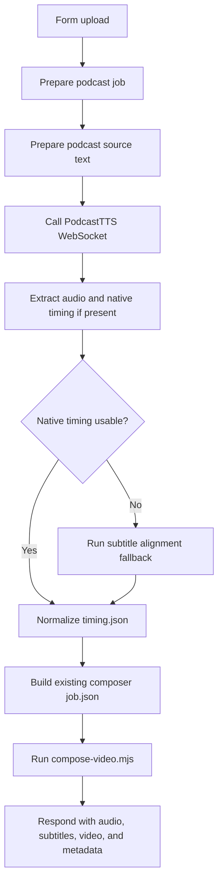

# AI Podcast Video Workflow Design

## Goal

Create a new importable n8n workflow that keeps the current edited-video experience but replaces the ordinary segmented TTS audio path with Doubao/Volcengine PodcastTTS.

The existing `workflows/video-clip-tts-workflow.json` remains stable and unchanged by this design. The new workflow will be added as `workflows/video-clip-ai-podcast-workflow.json`.

## Background And Feasibility

Doubao has a product-level AI podcast feature that turns uploaded PDFs or links into natural two-speaker podcast audio. Volcengine's current Doubao Voice documentation also exposes a dedicated "语音播客 / 播客API-websocket-v3协议" entry, so this can be treated as an API-backed capability rather than only a consumer-app feature.

The public API surface discovered for PodcastTTS is:

- Endpoint: `wss://openspeech.bytedance.com/api/v3/sami/podcasttts`
- Resource ID: `volc.megatts.podcast` according to public API mirrors; actual local value will remain configurable through env.
- Input shape includes `input_id`, `input_text`, `action`, `use_head_music`, `audio_config`, and `speaker_info`.
- Speaker mode supports two speakers, e.g. official podcast voices such as `zh_male_dayi_v2_saturn_bigtts` and `zh_female_mizai_v2_saturn_bigtts`.

This is feasible because the current video composer already consumes a stable local contract:

- `audioPath`: final MP3 audio
- `ttsTimingPath`: timing metadata used to write subtitles
- uploaded cover image, screenshot, and background video

Therefore the PodcastTTS workflow only needs to produce `audio.mp3` and `timing.json` compatible with `tools/video-composer/compose-video.mjs`. The existing three-stage video layout and FFmpeg renderer can be reused.

## New Workflow Scope

The new workflow accepts the same visual inputs:

- `cover_image`
- `proof_screenshot`
- `background_video`
- `viewpoint`

It also accepts podcast-specific controls:

- `podcast_speaker_a`: host voice preset
- `podcast_speaker_b`: guest voice preset
- `podcast_style`: default `podcast_interview`
- `use_head_music`: default `false` for short-video compatibility

The workflow does not expose the old single/dialogue TTS mode fields. PodcastTTS is always treated as a two-speaker podcast audio generator.

## Architecture



## Components

### 1. Podcast Source Text Builder

This node takes the user's viewpoint and turns it into a clean input text for PodcastTTS. It should not generate a full manually timed script. Instead, it should generate a compact podcast brief:

- topic title
- core viewpoint
- key facts or claims to discuss
- desired tone: conversational, concise, short-video friendly
- required opening: a natural podcast-style setup such as "今天我们聊一个很容易被忽略的话题..."

This keeps PodcastTTS responsible for natural turn-taking, interjections, hesitations, and pacing.

### 2. PodcastTTS Client Script

Add a focused local script, proposed path:

`tools/video-composer/podcast-tts-client.mjs`

Responsibilities:

- Open WebSocket connection to `DOUBAO_PODCAST_TTS_URL`
- Send PodcastTTS request using app credentials and resource ID
- Parse Volcengine binary WebSocket frames
- Save audio chunks to `tts/audio.mp3`
- Save raw frames and final response metadata for debugging
- Extract any native sentence/word timing if returned

The n8n Code node should call this script via `spawnSync` or `spawn` rather than implementing binary WebSocket frame parsing inline.

### 3. Subtitle Alignment Strategy

The workflow must support two subtitle paths:

Native path:

- If PodcastTTS frames include sentence, word, alignment, timestamp, or comparable timing fields, normalize them into the current `timing.json` shape.
- Use the exact generated podcast audio as the timing source.

Fallback path:

- If PodcastTTS returns audio only, run an alignment step after audio generation.
- Preferred fallback: Volcengine ASR or subtitle/auto-alignment API if credentials are available.
- Local fallback: Whisper or another local ASR tool if installed and configured.
- The fallback output is converted to the same `timing.json` shape before video rendering.

If neither fallback is configured, the workflow should fail clearly with:

`PodcastTTS did not return usable timestamps and no subtitle alignment fallback is configured.`

This avoids silently producing an unsubtitled video.

### 4. Video Composer Reuse

The new workflow keeps the existing visual behavior:

1. From `0s`, background video, PodcastTTS audio, and subtitles start together.
2. `0s - 3s`: cover image centered.
3. `3s - 7s`: proof screenshot centered.
4. `7s - end`: cover and screenshot move to top-left/top-right with the existing softened treatment.
5. Final duration follows the PodcastTTS audio duration.

No AI-generated video frames are introduced. The result remains a clipped/composited video built from uploaded media, generated audio, and subtitles.

## Environment Variables

Add these env variables to `.env.video-clip.example` during implementation:

```bash
DOUBAO_PODCAST_TTS_URL=wss://openspeech.bytedance.com/api/v3/sami/podcasttts
DOUBAO_PODCAST_TTS_API_KEY=
DOUBAO_PODCAST_TTS_APP_ID=
DOUBAO_PODCAST_TTS_APP_KEY=
DOUBAO_PODCAST_TTS_RESOURCE_ID=volc.megatts.podcast
DOUBAO_PODCAST_TTS_SPEAKER_A=zh_male_dayi_v2_saturn_bigtts
DOUBAO_PODCAST_TTS_SPEAKER_B=zh_female_mizai_v2_saturn_bigtts

# Optional subtitle fallback.
VIDEO_CLIP_SUBTITLE_FALLBACK=volc_asr
DOUBAO_ASR_URL=
DOUBAO_ASR_API_KEY=
DOUBAO_ASR_RESOURCE_ID=
```

Existing `DOUBAO_LLM_*` variables can still be used for creating the podcast source brief. Existing `DOUBAO_TTS_*` variables remain for the old workflow.

## Data Contract

The PodcastTTS step writes:

```json
{
  "audioPath": "/.../tts/audio.mp3",
  "podcastRawResponsePath": "/.../tts/podcast-response.binlog",
  "podcastMetadataPath": "/.../tts/podcast-metadata.json",
  "ttsTimingPath": "/.../tts/timing.json",
  "subtitleSource": "podcast_native|volc_asr|local_asr"
}
```

`timing.json` should preserve the current high-level structure:

```json
{
  "frames": [],
  "duration": 120.5,
  "source": "podcast_native"
}
```

The composer should not need to know whether timing came from PodcastTTS or fallback alignment.

## Error Handling

- Missing PodcastTTS credentials: fail before WebSocket connection.
- WebSocket connection failure: write connection details without secrets into `podcast-metadata.json`.
- Empty audio: fail and keep raw frame log.
- Unsupported frame shape: fail only after checking fallback alignment availability.
- No native timing and no fallback: fail clearly, do not create final video.
- Fallback alignment creates empty subtitles: fail clearly.
- Composer failure: preserve current `ffmpeg.log` behavior.

## Validation Plan

Static validation:

- JSON parse the new workflow.
- Parse all Code node JavaScript with `AsyncFunction`.
- Unit test PodcastTTS binary frame parsing using fixture frames.
- Unit test native timing normalization.
- Unit test fallback ASR-to-`timing.json` conversion.

Runtime validation:

- Import `workflows/video-clip-ai-podcast-workflow.json`.
- Submit the same cover, screenshot, and background video used by the stable workflow.
- Verify `tts/audio.mp3` exists and has non-zero duration.
- Verify `tts/timing.json` exists and contains subtitle events.
- Verify `render/final.mp4` duration follows podcast audio duration.
- Inspect the video for:
  - background video plays from the beginning
  - subtitles appear from the beginning
  - cover/screenshot timeline matches the current stable workflow
  - audio sounds like a natural two-speaker podcast

## Implementation Boundary

This design intentionally avoids modifying the existing stable workflow. Shared improvements can be placed in local scripts and utility helpers only when they do not alter current behavior.

The first implementation pass should stop at a working MVP:

- New workflow import file
- PodcastTTS WebSocket audio generation
- Native timestamp extraction when available
- One configured subtitle fallback
- Existing video composer reuse
- n8n response with previewable audio and video binaries

## Sources

- Volcengine Doubao Voice product documentation lists "语音播客 / 播客API-websocket-v3协议" under development references.
- Public API mirrors document `wss://openspeech.bytedance.com/api/v3/sami/podcasttts` and a two-speaker request shape.
- Public reports describe Doubao AI Podcast as a two-speaker natural podcast generator for PDFs and links.
