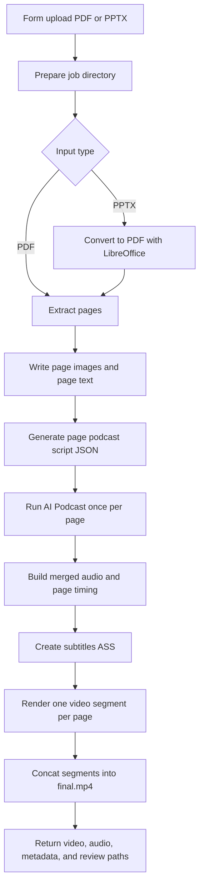

# Presentation AI Podcast Workflow Design

## Goal

Create a new importable n8n workflow that turns a user-uploaded presentation into a full-screen page-by-page podcast explanation video.

The user uploads one `PDF` or `PPTX` file and can optionally add audience or viewpoint context. The workflow extracts each page, generates a podcast-style explanation for each page, creates one AI Podcast audio segment per page, then composes a final video where the displayed page always matches the page currently being explained.

This is a new workflow. It does not modify the existing edited-video workflows:

- `workflows/video-clip-tts-workflow.json`
- `workflows/video-clip-ai-podcast-workflow.json`

## MVP Scope

### Inputs

- `presentation_file`: required upload, supported extensions are `.pdf` and `.pptx`
- `extra_context`: optional text for audience, viewpoint, teaching focus, or speaking constraints
- `podcast_speaker_a`: optional host voice selection
- `podcast_speaker_b`: optional guest voice selection
- `podcast_style`: optional, default `podcast_interview`

### Outputs

All review artifacts are written under the project-local job directory:

`tmp/n8n-video-jobs/{jobId}`

The workflow response includes:

- `finalVideo`: binary `final.mp4`
- `podcastAudio`: binary `merged-audio.mp3`
- `reviewDir`
- `videoPath`
- `audioPath`
- `pageScriptPath`
- `pageTimingPath`
- `subtitlePath`
- `costPath`
- `cost`

The workflow writes these files:

- `presentation/source.pdf` or `presentation/source.pptx`
- `presentation/source.converted.pdf` for PPTX inputs
- `pages/page-001.png`, `pages/page-002.png`, and so on
- `pages/page-001.txt`, `pages/page-002.txt`, and so on
- `script/page-script.json`
- `audio/page-001.mp3`, `audio/page-002.mp3`, and so on
- `audio/merged-audio.mp3`
- `timing/page-001.json`, `timing/page-002.json`, and so on
- `timing/page-timing.json`
- `render/segment-001.mp4`, `render/segment-002.mp4`, and so on
- `render/subtitles.ass`
- `render/final.mp4`
- `render/ffmpeg.log`
- `cost.json`

## Architecture



## Page Extraction

The workflow normalizes both supported file types into a page list.

For `PDF`:

- Keep the uploaded PDF as the source document.
- Render each page to a high-resolution PNG.
- Extract text per page when available.

For `PPTX`:

- Convert the uploaded file to PDF through LibreOffice.
- Render each converted PDF page to PNG.
- Extract text per page from the converted PDF.

The page extraction output is `pages.json`:

```json
{
  "sourceType": "pdf",
  "pageCount": 3,
  "pages": [
    {
      "pageNumber": 1,
      "imagePath": "/.../pages/page-001.png",
      "textPath": "/.../pages/page-001.txt",
      "text": "Page text...",
      "isTextSparse": false
    }
  ]
}
```

If a page has little or no extracted text, the workflow marks it as `isTextSparse: true` and still generates a speaker prompt using the page number, neighboring page context, and `extra_context`. OCR is out of MVP scope.

## Page Script Generation

The script generation step calls the configured Doubao or Volcengine LLM and writes `script/page-script.json`.

It generates one page-bound podcast prompt per slide or PDF page:

```json
{
  "title": "Presentation title",
  "summary": "Short overview",
  "audience": "Derived or user-provided audience",
  "pages": [
    {
      "pageNumber": 1,
      "pageTitle": "Opening topic",
      "speakerPrompt": "Podcast prompt for page 1",
      "spokenSummary": "Clean transcript summary for review",
      "targetSeconds": 35
    }
  ]
}
```

Generation requirements:

- The script is page-bound. `pages[n].pageNumber` must match the extracted page number.
- The first page must open like a podcast, for example with a natural setup such as "今天我们要聊的话题是..." or an equivalent topic hook.
- Later pages must bridge naturally from the previous page, for example "接下来这一页其实是在回答...".
- The style is a blog or podcast interview, not a plain slide reading.
- The prompt must explain the slide in spoken language, including context, examples, and practical interpretation.
- `targetSeconds` is estimated automatically from content volume, usually 20 to 45 seconds per page.
- The LLM response must be strict JSON and must not include Markdown fences in the saved script file.

The `speakerPrompt` is sent to the AI Podcast service. Subtitles are not taken from raw prompts. Subtitles come from the generated podcast transcript or the cleaned fallback transcript only.

## AI Podcast Per Page

Each page is synthesized independently through the AI Podcast capability.

For page `N`, the workflow writes:

- `audio/page-NNN.mp3`
- `timing/page-NNN.json`
- `transcript/page-NNN.txt`
- `audio/page-NNN-metadata.json`
- `audio/page-NNN-response.binlog`

Per-page synthesis has one main advantage: the page display duration can be based on that page's real audio duration. This makes page-to-audio alignment deterministic.

The workflow should reuse the existing AI Podcast client shape where possible, but add a page-aware wrapper that can:

- pass `pageNumber`
- write page-specific artifact paths
- collect per-page token usage
- report failures with page context, for example `AI podcast failed on page 4: ...`

## Timing And Subtitles

The workflow builds `timing/page-timing.json` after every page audio segment exists.

Each page entry contains:

```json
{
  "pageNumber": 1,
  "pageImage": "/.../pages/page-001.png",
  "audioPath": "/.../audio/page-001.mp3",
  "start": 0,
  "end": 34.8,
  "duration": 34.8,
  "transcript": "Clean spoken transcript",
  "subtitleEvents": [
    {
      "start": 0.5,
      "end": 3.2,
      "text": "..."
    }
  ]
}
```

Timing rules:

- The real audio duration of each page is authoritative.
- The final video duration is the sum of all page audio durations plus configured page pauses.
- A short page pause, default `0.3s`, is inserted between pages to reduce abrupt audio transitions.
- Subtitle events from page `N` are offset by the cumulative duration of all earlier pages and pauses.
- Subtitles start at the beginning of the final video.
- Subtitle styling is white text with transparent background, matching the current video composer behavior.

Subtitle source priority:

1. Use native AI Podcast timing if the service returns usable sentence, word, alignment, timestamp, or round timing fields.
2. If native timing is missing, estimate subtitle timing from the clean transcript and the page audio duration.
3. If transcript is empty, fail the page instead of writing subtitles from prompts.

Subtitle cleanup rules:

- Remove Markdown fences.
- Remove JSON keys and wrapper text.
- Remove system instructions, model instructions, and prompt-only phrasing.
- Keep only spoken Chinese transcript content.

## Audio Assembly

The workflow creates `audio/merged-audio.mp3` from the page audio files in page order.

Implementation approach:

- Generate a short silence file for the page pause.
- Use FFmpeg concat demuxer or filter concat to join:
  - `page-001.mp3`
  - pause
  - `page-002.mp3`
  - pause
  - ...
- Do not add a trailing pause after the final page unless needed by FFmpeg for clean muxing.

The merged audio is returned in the workflow response as `podcastAudio`.

## Video Composition

This new workflow uses a dedicated presentation video composer, not the existing three-stage cover/screenshot/background-video composer.

Output format:

- Resolution: `1920x1080`
- Frame rate: `30`
- Video codec: `libx264`
- Audio codec: `aac`

Visual rules:

- The current page is the main visual for the whole segment.
- If a page is 16:9, it fills the canvas.
- If a page is not 16:9, the full page remains visible and is centered on a white 16:9 canvas.
- Page content must not be cropped.
- MVP uses hard cuts between pages for stability.

Rendering strategy:

1. Render one segment per page:
   - `page-001.png + page-001.mp3 -> segment-001.mp4`
   - `page-002.png + page-002.mp3 -> segment-002.mp4`
2. Burn or overlay the page's subtitle events during the segment render.
3. Concatenate all segments into `render/final.mp4`.

Segment-based rendering is preferred over one large FFmpeg filter graph because it is easier to debug and review. If page 5 has an issue, the user can inspect `segment-005.mp4`, `page-005.mp3`, `page-005.json`, and `page-005.txt` directly.

## n8n Workflow Nodes

Proposed workflow file:

`workflows/presentation-ai-podcast-workflow.json`

Proposed workflow name:

`MVP - Presentation AI Podcast Video Composer`

Proposed form path:

`presentation-ai-podcast-upload`

Node sequence:

1. `Form Trigger`
   - collects upload and optional controls
2. `Prepare Job`
   - creates job directories under `tmp/n8n-video-jobs/{jobId}`
   - saves the uploaded file
   - loads `.env.video-clip` into `process.env`
3. `Convert Presentation`
   - runs the local conversion and extraction script
   - writes `pages.json`
4. `Generate Page Podcast Script`
   - calls the LLM helper
   - writes `page-script.json`
5. `Run Page AI Podcast`
   - loops through pages and calls the AI Podcast client per page
   - writes page audio, transcript, timing, and cost artifacts
6. `Build Page Timeline`
   - merges audio
   - builds subtitle ASS and `page-timing.json`
7. `Run Presentation Composer`
   - renders page segments
   - concatenates final MP4
8. `Prepare Response`
   - attaches `finalVideo` and `podcastAudio`
   - returns review paths and cost metadata
9. `Respond to Webhook`
   - returns the final response

## Error Handling

- Unsupported file type: fail with `Only PDF and PPTX files are supported.`
- PPTX conversion unavailable: fail with `LibreOffice is required to convert PPTX. Upload PDF or install LibreOffice.`
- Page extraction failure: fail with the source file path and converter stderr.
- Empty document: fail if `pageCount` is zero.
- LLM returns invalid JSON: keep the raw response and fail with `Page script generation returned invalid JSON.`
- Script page count mismatch: fail if the script does not contain exactly one entry per extracted page.
- AI Podcast failure: fail with the page number and keep page-specific raw response logs.
- Missing page audio: fail with page number.
- Missing transcript and missing native timing: fail instead of using prompts as subtitles.
- FFmpeg failure: keep `render/ffmpeg.log` and return its path in the error message when possible.

## Cost Tracking

The workflow aggregates per-page cost into `cost.json`.

The cost file includes:

- LLM script-generation usage when available
- AI Podcast token usage per page when available
- total tokens
- configured price per million tokens
- estimated total cost
- page count
- total audio duration

If a provider does not return usage, the workflow records `usageUnavailable: true` for that component instead of guessing silently.

## Validation Plan

Static validation:

- JSON parse `workflows/presentation-ai-podcast-workflow.json`.
- Parse all workflow Code node JavaScript with `AsyncFunction`.
- Unit test page script JSON validation and cleanup.
- Unit test page timing offset generation.
- Unit test subtitle event merging and prompt-leak cleanup.
- Unit test FFmpeg command generation for page segments.

Runtime validation:

- Upload a 2 to 3 page PDF and generate `final.mp4`.
- Upload a 2 to 3 page PPTX and generate `final.mp4`.
- Confirm each page appears in order.
- Confirm when page `N` is being spoken, page `N` is displayed.
- Confirm subtitles start from the beginning and do not contain prompts, Markdown, or JSON keys.
- Confirm `merged-audio.mp3` duration matches the sum of page audio plus pauses.
- Confirm `final.mp4` duration matches `page-timing.json`.
- Confirm `reviewDir` contains page images, page text, page audio, page timing, segment videos, final video, subtitles, and cost file.

## Implementation Boundary

The first implementation pass should stop at a working MVP:

- PDF and PPTX input support
- page image and page text extraction
- page-bound podcast script generation
- per-page AI Podcast audio generation
- merged audio
- page timing JSON
- white transparent subtitles
- full-screen page video rendering
- n8n response with video, audio, and review paths

Out of scope for MVP:

- OCR for image-only slides
- manual page timing editor
- visual preview UI
- background video
- cover/screenshot three-stage layout
- slide animations
- speaker diarization beyond what the AI Podcast service provides
