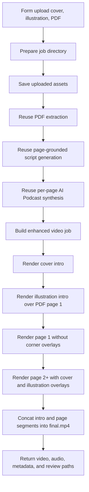

# Enhanced PDF AI Podcast Workflow Design

## Goal

Create a new importable n8n workflow that reuses the existing AI PDF page-by-page
podcast workflow and adds a richer video package around it.

The user uploads:

- a video cover image
- an illustration image
- one PDF file

The workflow parses the PDF into page images and page text, generates rigorous
page-grounded two-speaker AI Podcast explanations, synthesizes one audio segment
per page, and renders a final video with a cover intro, an illustration intro,
and page-by-page explanation.

This is a new workflow. It must not change the behavior of the existing
`workflows/presentation-ai-podcast-workflow.json`.

## MVP Scope

### Inputs

- `cover_image`: required upload, supported extensions are `.png`, `.jpg`,
  `.jpeg`, and `.webp`
- `illustration_image`: required upload, supported extensions are `.png`,
  `.jpg`, `.jpeg`, and `.webp`
- `pdf_file`: required upload, supported extension is `.pdf`
- `extra_context`: optional text for audience, viewpoint, teaching focus, or
  speaking constraints
- `podcast_speaker_a`: required host voice selection
- `podcast_speaker_b`: required guest voice selection
- `podcast_style`: optional, default `podcast_interview`

### Outputs

All review artifacts are written under the project-local job directory:

`tmp/n8n-video-jobs/{jobId}`

The workflow response includes:

- `finalVideo`: binary `final.mp4`
- `podcastAudio`: binary `merged-audio.mp3`
- `reviewDir`
- `videoPath`
- `audioPath`
- `coverImagePath`
- `illustrationImagePath`
- `pagesManifestPath`
- `pageScriptPath`
- `pageTimingPath`
- `subtitlePath`
- `costPath`
- `ffmpegLog`
- `cost`

The workflow writes these files:

- `inputs/cover.png`, `inputs/cover.jpg`, or matching uploaded extension
- `inputs/illustration.png`, `inputs/illustration.jpg`, or matching uploaded
  extension
- `presentation/source.pdf`
- `pages/page-001.png`, `pages/page-002.png`, and so on
- `pages/page-001.txt`, `pages/page-002.txt`, and so on
- `pages.json`
- `script/page-script.json`
- `audio/page-001.mp3`, `audio/page-002.mp3`, and so on
- `audio/merged-audio.mp3`
- `timing/page-001.json`, `timing/page-002.json`, and so on
- `timing/page-timing.json`
- `render/intro-cover.mp4`
- `render/intro-illustration.mp4`
- `render/segment-001.mp4`, `render/segment-002.mp4`, and so on
- `render/subtitles.ass`
- `render/final.mp4`
- `render/ffmpeg.log`
- `cost.json`

## Architecture



## Reused Components

The workflow reuses the existing AI PDF workflow pipeline wherever possible:

- `tools/video-composer/extract-presentation.mjs`
- `tools/video-composer/extract-pdf-pymupdf.py`
- `tools/video-composer/presentation-script-client.mjs`
- `tools/video-composer/pdf-to-podcast-script/SKILL.md`
- `tools/video-composer/presentation-podcast-client.mjs`
- `tools/video-composer/presentation-utils.mjs`
- existing AI Podcast environment variables
- existing transcript cleanup, subtitle timing fallback, and cost aggregation

The PDF parsing and rigorous page-grounded explanation behavior should remain
the source of truth. This workflow is a visual packaging extension, not a new
PDF understanding engine.

## New Components

### Workflow JSON

Add a new workflow file:

`workflows/pdf-enhanced-ai-podcast-workflow.json`

Proposed workflow name:

`MVP - Enhanced PDF AI Podcast Video Composer`

Proposed form path:

`pdf-enhanced-ai-podcast-upload`

### Enhanced Composer

Add a focused video composer:

`tools/video-composer/compose-enhanced-pdf-video.mjs`

This composer should share small utilities with `compose-presentation-video.mjs`
when practical, but it must not change the current presentation composer
behavior.

The enhanced composer accepts a job JSON with:

```json
{
  "jobId": "20260601-120000-abcdef",
  "coverImagePath": "/.../inputs/cover.png",
  "illustrationImagePath": "/.../inputs/illustration.png",
  "pagesManifestPath": "/.../pages.json",
  "pageAudioManifestPath": "/.../audio/page-audio.json",
  "pageTimingPath": "/.../timing/page-timing.json",
  "subtitlePath": "/.../render/subtitles.ass",
  "renderDir": "/.../render",
  "outputVideoPath": "/.../render/final.mp4",
  "outputAudioPath": "/.../audio/merged-audio.mp3",
  "ffmpegLogPath": "/.../render/ffmpeg.log",
  "introCoverSeconds": 4,
  "introIllustrationSeconds": 4,
  "pagePauseSeconds": 0.3,
  "overlayWidth": 260,
  "width": 1920,
  "height": 1080,
  "fps": 30
}
```

## PDF Parsing

The workflow accepts only PDF in MVP scope.

PDF extraction is the same as the current presentation workflow:

- Save the uploaded PDF as `presentation/source.pdf`.
- Render each page to a high-resolution PNG.
- Extract text per page when available.
- Write `pages.json`.
- Preserve `isTextSparse` for pages with little extracted text.

If a page has little or no extracted text, the existing script-generation rules
still apply: the script should be shorter, cautious, and grounded in available
page titles, neighboring page context, and `extra_context`. OCR and multimodal
visual analysis are not part of this MVP.

## Rigorous Page Explanation

The existing `pdf-to-podcast-script` behavior remains the baseline:

- The current PDF page is the source of truth.
- The script must not invent topics absent from the page text and user context.
- Dense pages should be reduced to one to three useful points.
- Sparse pages should not be expanded into unrelated lessons.
- Academic and science content should avoid overclaiming.

For papers and rigorous science explainers, the generated two-speaker content
should make these distinctions clear:

- what this page is trying to answer
- what evidence, terms, labels, figures, formulas, or claims appear on the page
- what the page directly supports
- what the page does not prove by itself
- how a general audience should understand the page without losing precision

Speaker A acts as the careful explainer. Speaker B acts as a listener proxy who
asks short questions, restates possible misunderstandings, and gives Speaker A a
chance to correct overinterpretation.

The new workflow should add this emphasis through its own job context before
calling the existing script client. It should not modify the current
presentation workflow's default prompt behavior in MVP scope.

## Video Timeline

Default output format:

- Resolution: `1920x1080`
- Frame rate: `30`
- Video codec: `libx264`
- Audio codec: `aac`

Default intro settings:

- `introCoverSeconds`: `4`
- `introIllustrationSeconds`: `4`

### Stage 1: Cover Intro

Time: `0s` to `4s`

Visual rules:

- The uploaded cover image is the main visual.
- It is adapted to the 16:9 canvas without distorting aspect ratio.
- The MVP uses centered fit on a white canvas; the image should remain legible
  and must not be stretched.

Audio and subtitles:

- Silent audio.
- No subtitles.

Output artifact:

- `render/intro-cover.mp4`

### Stage 2: Illustration Intro

Time: `4s` to `8s`

Visual rules:

- PDF page 1 is the background.
- The uploaded illustration image is centered as the main foreground visual.
- PDF page 1 must remain recognizable as the background.
- The illustration must not be cropped or distorted.

Audio and subtitles:

- Silent audio.
- No subtitles.

Output artifact:

- `render/intro-illustration.mp4`

### Stage 3: Page 1 Explanation

Time: starts after the two intro segments.

Visual rules:

- Show only PDF page 1.
- Do not show the cover corner overlay.
- Do not show the illustration corner overlay.

Audio and subtitles:

- Use the page 1 AI Podcast audio.
- Burn page 1 subtitle events.
- Subtitle event times are offset by the total intro duration.

Output artifact:

- `render/segment-001.mp4`

### Stage 4: Page 2 And Later Explanation

Visual rules:

- Show the current PDF page as the main visual.
- Place the cover image in the lower-left corner.
- Place the illustration image in the lower-right corner.
- Corner overlays should use stable dimensions, defaulting to `overlayWidth:
  260`.
- Overlays should have enough contrast to remain readable, for example by using
  a subtle border or padded backing.
- Page content must remain the main focus and should not be cropped.

Audio and subtitles:

- Use each page's AI Podcast audio.
- Burn page subtitle events.
- Subtitle events are offset by the intro duration and cumulative prior page
  durations.
- Subtitle margin may be raised enough to avoid collision with lower-corner
  overlays.

Output artifacts:

- `render/segment-002.mp4`
- `render/segment-003.mp4`
- and so on

## Timing And Subtitles

The existing `buildPageTiming()` result remains the page-audio authority.

The enhanced composer adds:

```json
{
  "introDuration": 8,
  "pageTimingOffset": 8
}
```

The page timing file preserves existing page timings. The enhanced composer
applies the intro offset only while rendering subtitles and concatenating
segments. This avoids changing shared consumers of `timing/page-timing.json`.

## n8n Workflow Nodes

Node sequence:

1. `Form Trigger`
2. `Prepare Enhanced PDF Job`
3. `Extract PDF Pages`
4. `Generate Page Podcast Script`
5. `Run Page AI Podcast`
6. `Build Enhanced PDF Video Job`
7. `Run Enhanced PDF Composer`
8. `Prepare Response`
9. `Respond to Webhook`

The workflow should mirror the current `presentation-ai-podcast-workflow.json`
node style so local debugging stays familiar.

## Error Handling

The workflow should fail with clear messages for:

- missing `cover_image`
- unsupported cover image type
- missing `illustration_image`
- unsupported illustration image type
- missing `pdf_file`
- non-PDF upload
- PDF extraction producing no pages
- script generation returning the wrong page count
- AI Podcast failure on a specific page
- final video missing or empty
- merged audio missing or empty

Errors from reused scripts should preserve their page or file context.

## Testing

Add focused Node tests for the new enhanced composer:

```bash
node --test tools/video-composer/compose-enhanced-pdf-video.test.mjs
```

Test coverage should include:

- enhanced job validation rejects missing cover, illustration, and page paths
- cover intro FFmpeg arguments map the cover image to `intro-cover.mp4`
- illustration intro uses PDF page 1 as background
- page 1 segment renders without corner overlays
- page 2 and later segments render with cover and illustration overlays
- subtitle events are offset by `introCoverSeconds + introIllustrationSeconds`
- concat list orders intro cover, intro illustration, page 1, page 2, and later
  segments

Run existing related tests:

```bash
node --test tools/video-composer/presentation-utils.test.mjs
node --test tools/video-composer/presentation-script-client.test.mjs
node --test tools/video-composer/presentation-podcast-client.test.mjs
node --test tools/video-composer/compose-presentation-video.test.mjs
```

## Acceptance Criteria

- The new workflow JSON imports into n8n.
- The existing presentation workflow remains unchanged.
- A PDF plus cover and illustration can produce a final MP4.
- The final MP4 starts with a silent cover intro.
- The next intro segment shows the illustration over PDF page 1.
- Page 1 explanation shows only PDF page 1.
- Page 2 and later explanations show the current PDF page with cover lower-left
  and illustration lower-right.
- Audio remains the existing two-speaker AI Podcast output.
- Subtitles line up with spoken audio after the intro offset.
- Review artifacts include page images, page text, page scripts, page audio,
  timing JSON, segment videos, final video, subtitles, cost file, and FFmpeg log.
- No OCR, multimodal visual analysis, or behavior change to existing workflows
  is required for MVP.
