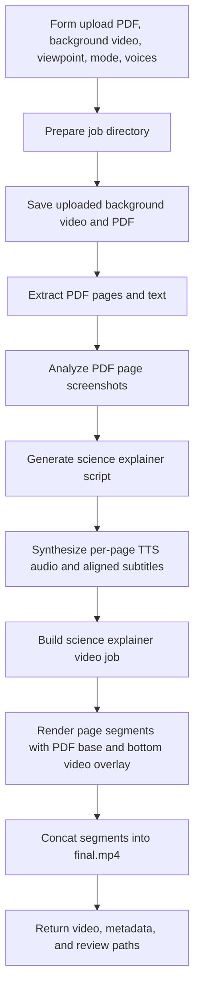

# PDF Science Explainer Video Workflow Design

## Goal

Create a new importable n8n workflow that turns a user-uploaded PDF,
background video, and user viewpoint into a science explainer video.

The workflow is separate from the existing presentation, enhanced PDF, and
video clip workflows. It reuses their proven PDF extraction, TTS voice
parameters, subtitle alignment, job-directory conventions, page timing, and
FFmpeg composition patterns wherever possible.

The default output is a `9:16` vertical short-form video. Users can switch the
output to `16:9` horizontal mode from the upload form.

## MVP Scope

### Inputs

- `background_video`: required video upload, used as a bottom overlay layer.
- `pdf_file`: required PDF upload.
- `viewpoint`: optional user opinion, angle, or claim. The workflow is designed
  for this to guide the explainer, even though the field may be empty.
- `narration_mode`: optional, default `single_speaker`; supported values are
  `single_speaker` and `two_speaker`.
- `voice`: required for single-speaker mode.
- `voice_a`: required for two-speaker mode.
- `voice_b`: required for two-speaker mode.
- `aspect_ratio`: optional, default `9:16`; supported values are `9:16` and
  `16:9`.

### Outputs

All review artifacts are written under the project-local job directory:

`tmp/n8n-video-jobs/{jobId}`

The workflow response includes:

- `finalVideo`: binary `final.mp4`
- `reviewDir`
- `videoPath`
- `audioPath`
- `pagesManifestPath`
- `pageVisualAnalysisPath`
- `pageScriptPath`
- `pageTimingPath`
- `subtitlePath`
- `costPath`
- `ffmpegLog`
- `cost`

The workflow writes these files:

- `inputs/background.mp4`, or the uploaded extension when supported
- `presentation/source.pdf`
- `pages/page-001.png`, `pages/page-002.png`, and so on
- `pages/page-001.txt`, `pages/page-002.txt`, and so on
- `pages.json`
- `analysis/page-visual-analysis.json`
- `script/science-explainer-script.json`
- `audio/page-001.mp3`, `audio/page-002.mp3`, and so on
- `audio/page-audio.json`
- `audio/merged-audio.mp3`
- `timing/page-001.json`, `timing/page-002.json`, and so on
- `timing/page-timing.json`
- `render/page-001.ass`, `render/page-002.ass`, and so on
- `render/subtitles.ass`
- `render/segment-001.mp4`, `render/segment-002.mp4`, and so on
- `render/final.mp4`
- `render/ffmpeg.log`
- `cost.json`

## Non-Goals

- Do not analyze the uploaded background video content. It is only a visual
  material layer.
- Do not create a custom frontend upload page.
- Do not implement a video editor.
- Do not generate new PDF page artwork.
- Do not replace the existing TTS and subtitle alignment implementation.
- Do not change existing workflows:
  - `workflows/presentation-ai-podcast-workflow.json`
  - `workflows/pdf-enhanced-ai-podcast-workflow.json`
  - `workflows/video-clip-tts-workflow.json`
  - `workflows/video-clip-ai-podcast-workflow.json`

## Architecture



## Reused Components

The workflow should reuse existing implementation shapes wherever practical:

- PDF page rendering and text extraction from the presentation workflows.
- `pages.json` page manifest structure.
- Existing TTS voice parameter handling.
- Existing TTS timing and subtitle alignment behavior.
- `page-timing.json` as the source of truth for page audio durations and
  subtitle events.
- The `tmp/n8n-video-jobs/{jobId}` review directory convention.
- FFmpeg helper patterns from the existing video composers.

The new workflow adds only the missing pieces: PDF page visual analysis,
science-explainer script generation, and the bottom-video overlay composer.

## Workflow Nodes

Add a new workflow file:

`workflows/pdf-science-explainer-video-workflow.json`

Proposed workflow name:

`MVP - PDF Science Explainer Video Composer`

Proposed form path:

`pdf-science-explainer-upload`

Node sequence:

1. `Upload Science Explainer Assets`
2. `Prepare Science Explainer Job`
3. `Extract PDF Pages`
4. `Analyze PDF Page Visuals`
5. `Generate Science Explainer Script`
6. `Run Page TTS`
7. `Build Science Explainer Video Job`
8. `Run Science Explainer Composer`
9. `Prepare Response`
10. `Respond to Webhook`

The workflow should mirror the style of
`workflows/pdf-enhanced-ai-podcast-workflow.json` so debugging and artifact
inspection stay familiar.

## PDF Parsing

The workflow accepts only PDF in MVP scope.

PDF extraction follows the current presentation workflow:

- Save the uploaded PDF as `presentation/source.pdf`.
- Render each page to a high-resolution PNG.
- Extract text per page when available.
- Write `pages.json`.
- Preserve sparse text signals for pages with little extracted text.

The base `pages.json` remains a document extraction manifest. Visual analysis
is written separately to avoid mixing extraction output with model
interpretation.

## Page Visual Analysis

The workflow analyzes each rendered PDF page screenshot. It does not analyze the
background video.

The visual analysis step reads:

- `pages.json`
- `pages/page-NNN.png`
- `pages/page-NNN.txt`
- `viewpoint`

It writes:

`analysis/page-visual-analysis.json`

Example shape:

```json
{
  "pages": [
    {
      "pageNumber": 1,
      "visualNotes": "Page has a large title, two highlighted callout boxes, and a U-shaped chart.",
      "layoutNotes": "The page is structured as a short-form infographic with numbered sections.",
      "evidenceNotes": "The visible chart supports a cautious claim about an optimum range, but not a universal rule.",
      "uncertaintyNotes": "Axis labels are visible, but exact source methods are not established by this page alone."
    }
  ]
}
```

Rules:

- Describe visible page structure, labels, tables, diagrams, charts, callouts,
  emphasis, and hierarchy.
- Do not invent chart values or scientific conclusions that are not visible in
  the page screenshot or extracted text.
- Use visual understanding to support or limit the user's viewpoint, not to
  replace the PDF.
- If a page screenshot is mostly blank or unreadable, say so and let the script
  generator produce a cautious, shorter segment.

## Science Explainer Script Rules

Keep the science explainer prompt rules inline in:

`tools/video-composer/science-explainer-utils.mjs`

Purpose:

Generate concise Chinese science explainer content for a short-form video. The
script is viewpoint-led and PDF-checked.

The script generator reads:

- `pages.json`
- `analysis/page-visual-analysis.json`
- `viewpoint`
- `narration_mode`
- target aspect ratio and approximate pacing settings

It writes:

`script/science-explainer-script.json`

Example shape:

```json
{
  "title": "视频标题",
  "summary": "一句话摘要",
  "mode": "single_speaker",
  "pages": [
    {
      "pageNumber": 1,
      "pageTitle": "本页主题",
      "visualNotes": "从页面截图识别出的图表、重点框、布局或表格信息",
      "evidenceNotes": "本页支持或限制用户观点的证据",
      "speakerPrompt": "可直接用于 TTS 的中文口播内容",
      "targetSeconds": 35
    }
  ]
}
```

Script rules:

- The user's viewpoint guides the narrative.
- The PDF page text and visual analysis constrain the narrative.
- If a page does not support the viewpoint, the script must weaken or qualify
  the claim.
- Each page should choose a small number of useful points instead of reading
  every line.
- Single-speaker mode is the default and should sound like a natural science
  explainer short video.
- Two-speaker mode should use short question-answer turns and stay concise.
- The output must be strict JSON with no Markdown fences.
- `pages.length` must equal the extracted PDF page count.

## TTS And Subtitle Alignment

TTS and subtitle alignment are reused from the previously implemented
workflows. This workflow should not introduce a separate alignment engine.

Single-speaker mode:

- Use `voice`.
- Generate one spoken Chinese segment per page.
- Subtitles omit speaker labels by default.

Two-speaker mode:

- Use `voice_a` and `voice_b`.
- Generate short dialogue-style page segments.
- MVP subtitles should use cleaned spoken text without visually noisy labels
  unless the reused TTS path already requires speaker labels.

Timing rules:

- The real audio duration of each page is authoritative.
- `page-timing.json` binds each PDF page, page audio file, transcript, and
  subtitle events.
- Subtitle events are rendered relative to the page segment when producing each
  page video.
- A global `render/subtitles.ass` may also be written for review.
- Existing fallback alignment behavior is reused when native TTS timestamps are
  missing.

## Video Composer

Add a focused composer:

`tools/video-composer/compose-science-explainer-video.mjs`

The composer accepts a job JSON like:

```json
{
  "jobId": "20260601-120000-abcdef",
  "aspectRatio": "9:16",
  "backgroundVideoPath": "/.../inputs/background.mp4",
  "pagesManifestPath": "/.../pages.json",
  "pageAudioManifestPath": "/.../audio/page-audio.json",
  "pageTimingPath": "/.../timing/page-timing.json",
  "subtitlePath": "/.../render/subtitles.ass",
  "renderDir": "/.../render",
  "outputVideoPath": "/.../render/final.mp4",
  "outputAudioPath": "/.../audio/merged-audio.mp3",
  "ffmpegLogPath": "/.../render/ffmpeg.log",
  "pagePauseSeconds": 0.3,
  "bottomVideoHeightRatio": 0.2,
  "width": 1080,
  "height": 1920,
  "fps": 30
}
```

The composer should follow the structure of
`tools/video-composer/compose-enhanced-pdf-video.mjs`:

- Validate required fields.
- Validate the page manifest.
- Build or read page timing.
- Generate page-level ASS subtitle files.
- Render one segment per PDF page.
- Insert optional pause segments.
- Concatenate all segments into `final.mp4`.
- Write FFmpeg commands and errors to `render/ffmpeg.log`.

## Video Layout

The layout is:

```text
PDF page: full-canvas base layer
Background video: bottom overlay layer, height about 20% of canvas
Subtitles: above the bottom video overlay
```

Default `9:16` output:

- Canvas: `1080x1920`.
- PDF page fills the canvas without distortion. Empty space is padded white.
- Bottom video overlay height: `384px`.
- Background video is cropped to cover the bottom overlay area.
- Background video loops when shorter than the final segment or full video.
- Subtitles sit above the bottom overlay safe area.

Optional `16:9` output:

- Canvas: `1920x1080`.
- PDF page fills the canvas without distortion. Empty space is padded white.
- Bottom video overlay height: `216px`.
- The same subtitle and timing rules apply.

Per-page segment:

```text
segment-N:
  duration = page-N audio duration
  visual = PDF page N full-canvas base + background video bottom overlay + page-N subtitles
  audio = page-N TTS audio
```

Final video:

```text
segment-001.mp4
+ optional pause
+ segment-002.mp4
+ optional pause
+ ...
= final.mp4
```

The reference cover layout is represented by the default vertical composition:
the PDF page stays visually dominant, while the bottom video overlay occupies
roughly the lower fifth of the screen.

## Error Handling

The workflow should fail with clear messages for:

- missing `background_video`
- unsupported or unreadable background video
- missing `pdf_file`
- non-PDF upload
- `aspect_ratio` other than `9:16` or `16:9`
- `narration_mode` other than `single_speaker` or `two_speaker`
- single-speaker mode without `voice`
- two-speaker mode without `voice_a` or `voice_b`
- PDF extraction producing no pages
- visual analysis returning a page count that does not match the PDF
- script generation returning a page count that does not match the PDF
- TTS failure on a specific page
- final video missing or empty
- merged audio missing or empty

Errors from reused scripts should preserve file or page context.

## Testing

Before implementation, confirm exact unit test cases with the user, per repo
guidance.

Expected focused tests for the new composer:

```bash
node --test tools/video-composer/compose-science-explainer-video.test.mjs
```

Coverage should include:

- required job field validation
- accepted aspect ratios are only `9:16` and `16:9`
- default `9:16` dimensions are `1080x1920`
- `16:9` dimensions are `1920x1080`
- bottom video overlay height is derived from `bottomVideoHeightRatio`
- subtitles are placed above the bottom video overlay
- page 1 and later pages use the same layout contract
- concat list preserves page order and pause order
- unsupported background video paths fail clearly before final response

Related regression tests to consider:

```bash
node --test tools/video-composer/presentation-utils.test.mjs
node --test tools/video-composer/compose-enhanced-pdf-video.test.mjs
node --test tools/video-composer/compose-video.test.mjs
```

## Acceptance Criteria

- The new workflow JSON imports into n8n.
- Existing workflows remain unchanged.
- A PDF, background video, viewpoint, voice choice, and default settings can
  produce a final MP4.
- Default output is `9:16`.
- Users can choose `16:9`.
- PDF pages are full-canvas base layers.
- Background video appears as a bottom overlay occupying about one fifth of the
  canvas height.
- The background video loops or crops cleanly for all page segments.
- The script is viewpoint-led and PDF-checked.
- PDF page screenshot visual analysis informs the script.
- Single-speaker mode is the default.
- Two-speaker mode is available.
- Existing TTS voice parameters are reused.
- Existing subtitle alignment behavior is reused.
- Subtitles are aligned with spoken audio and placed above the bottom video
  overlay.
- Review artifacts include PDF page images, page text, visual analysis, page
  scripts, page audio, timing JSON, subtitle files, segment videos, final video,
  cost file, and FFmpeg log.
