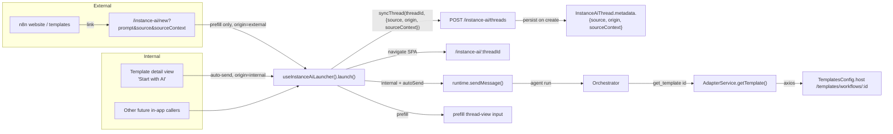

# Instance AI — Launch a thread from anywhere

**Date:** 2026-06-05
**Status:** Design approved, ready for implementation plan
**Author:** Filipe Tavares

## Summary

Make Instance AI startable from anywhere — both **internally** (other parts of
the editor, instant, no page reload) and **externally** (a link from the n8n
website, e.g. the templates page). Every launched thread records **where it
started** so future experiments can branch on the source of the first message.

This is **core** Instance AI functionality, not an experiment. Experiments are
expected to layer on top later — gated either by feature-flag assignment or by
reading the persisted `source` of the first message. This spec deliberately
designs **no specific experiment**.

The first concrete integrations shipped with this work:

- An external `/instance-ai/new` route the n8n website can link to.
- A "Start with AI" trigger on the in-app template detail view.
- A new agent tool, `get_template`, so the template flow works end to end.

## Goals

- One programmatic way to open Instance AI with a prefilled or auto-sent prompt.
- A dedicated external entry route that survives login and leaves no prompt in
  the browser URL/history.
- Persist the thread's origin (`source` + optional `sourceContext`) as core data.
- Telemetry covering both auto-send and prefill launches.
- A working template-view → assistant chain, including the agent's ability to
  load a template by id.

## Non-goals (explicitly out of scope)

- Resolving **which** instance a website link points to — the website owns that.
- Attachments on external links (links carry text only).
- Embedded / non-editor surfaces.
- Template **search** from the agent (`get_template` by id only for now).
- Any specific experiment built on `source`.
- External auto-send (see Security).

## Settled decisions

| Decision | Choice |
|---|---|
| Trigger behaviour | Configurable per trigger: both auto-send and prefill supported |
| External entry | Dedicated route `/instance-ai/new` (not query params on arbitrary routes) |
| External auto-send | **Never.** Auto-send is a trusted internal-only capability |
| Source persistence | `metadata.source` (string) + optional `metadata.sourceContext` (object) on `InstanceAiThread`, set only on creation |
| Unknown source | Falls back to a default value; allowlist of known sources is a maintained constant |
| Origin | `internal` \| `external` persisted alongside `source` — the real experiment guard (so a cohort can require `origin: 'internal' AND source: 'template-view'`) |
| Surface | **Full-page thread view only** (`/instance-ai/:threadId`). Instance AI has no docked panel; both internal and external launches navigate there via SPA client-side nav (no browser reload) |
| Idempotency | Not guarded; URL is cleared after read so back-button doesn't return to the param'd URL |
| `source` in launcher API | **Required** (TS-enforced) so every entry point is attributed |
| Template integration | Agent loads the template via new `get_template` tool; no pre-import step |

## Architecture



### Component boundaries

| Unit | Responsibility | Depends on |
|---|---|---|
| `ensureThread` (backend) | Persist `source`/`sourceContext` into thread metadata on creation | `InstanceAiThread` entity, Zod schema in `@n8n/api-types` |
| `useInstanceAiLauncher` (frontend) | Single chokepoint: create thread, choose surface, prefill vs auto-send, enforce external-never-auto-send | instance-ai store, chat-panel store, router |
| `/instance-ai/new` route | Parse external params, survive login, fallback when disabled, clear URL, delegate to launcher | launcher, router, settings |
| `get_template` tool | Thin wrapper: load a template by id for the agent | `AdapterService.getTemplate` |
| `AdapterService.getTemplate` | Fetch template JSON from the templates host | `TemplatesConfig` (via `GlobalConfig`), axios |
| Template-view "Start with AI" | Call launcher with template source/context | launcher, templates store |

## Detailed design

### 1. Backend — source persistence

- `POST /instance-ai/threads` (`ensureThread`) request body gains optional
  `source: string`, `origin: 'internal' | 'external'`, and
  `sourceContext?: Record<string, unknown>`.
- On **thread creation**, persist them into `InstanceAiThread.metadata` as
  `{ source, origin, sourceContext }`. **Set on creation only** — `saveThread`
  already merges metadata for an existing thread rather than overwriting, and the
  controller only forwards these fields when the thread is new. Source/origin
  describe where the *first* message came from.
- Validate in `@n8n/api-types` with Zod: `source` a bounded-length string,
  `sourceContext` a shallow JSON object with a size cap (untrusted-input hygiene
  — the external route feeds this).
- No new endpoint. No migration (the `metadata` JSON column already exists).
- Experiments read `thread.metadata.source` — no new read surface required.

### 2. Frontend — `useInstanceAiLauncher()`

The single entry point both surfaces use:

```ts
launch({
  message: string,
  source: InstanceAiSource,        // required → every entry attributed
  sourceContext?: Record<string, unknown>,
  autoSend?: boolean,              // forced false when origin === 'external'
  origin: 'internal' | 'external',
})
```

Flow: generate `threadId` (uuid) → `syncThread(threadId, { source, origin, sourceContext })`
→ `getOrCreateRuntime(threadId)` → navigate (SPA `router.push`/`replace`) to
`INSTANCE_AI_THREAD_VIEW` → either auto-send the first message (internal only) or
hand the prefill text to the thread view's input.

The `origin === 'external'` branch **cannot** auto-send — enforced inside the
launcher, not at the call site. This is the security chokepoint.

`InstanceAiSource` is a maintained allowlist constant (e.g. `'external-link'`,
`'template-view'`). Unknown values fall back to a default (e.g. `'unknown'`) so
experiment cohorts stay clean and spoofed values can't pollute a real source.

### 3. External route `/instance-ai/new`

- Parses `prompt`, `source`, `sourceContext` from the query string.
- **Survives login:** registered as a valid post-login redirect target with its
  query intact, so logged-out website visitors don't lose the prompt across the
  login round-trip.
- **Feature off:** if Instance AI is unavailable for this instance/user,
  redirect to home (with i18n fallback messaging where relevant).
- **Source attribution:** forces `origin: 'external'` **and** forces
  `source: 'external-link'` regardless of the query `source` param — an external
  link cannot name a trusted internal source (e.g. `template-view`). If external
  sub-sourcing is ever needed, add an external-only allowlist; for now the single
  external value is forced. (`origin` is the real experiment guard regardless.)
- Calls `launch({ origin: 'external', autoSend: false })`. (The route survives
  login automatically: the `authenticated` middleware captures the full
  `pathname + search` as the `redirect` query and the signin flow round-trips it,
  so `?prompt=…&source=…` is preserved.)
- **Clears the URL:** `router.replace` to the clean thread view after reading, so
  the prompt does not linger in history and back-button doesn't return to the
  param'd URL.

### 4. Telemetry

- `'User launched Instance AI thread'` — fired in the launcher with
  `{ thread_id, instance_id, source, origin, auto_send }`. (n8n uses
  human-readable event names, e.g. `'User sent builder message'`.) Covers both
  auto-send and prefill launches.
- Existing `trackUserMessageSent(isFirstMessage)` continues to fire when a
  message actually sends. So both launch intent and send are observable.

### 5. Template tool + template-view trigger

**Agent tool** `templates.tool.ts` (in `packages/@n8n/instance-ai/src/tools/`):

- `get_template(templateId)` → template metadata + workflow JSON
  (nodes/connections). By id only.
- **Wiring (respects layer boundaries):**
  - The existing `context.templatesService` is `BuilderTemplatesService`, which
    only fetches a CDN bundle (`getBundle`/`getVersion`) — **no per-id fetch**.
    So this is net-new; do **not** extend `BuilderTemplatesService`.
  - New cli service `WorkflowTemplatesService` (mirrors
    `DynamicTemplatesService`): `@Service()`, injects `Logger` + `GlobalConfig`,
    `axios.get` against `globalConfig.templates.host` (e.g.
    `${host}templates/workflows/${id}`) with the existing 5s timeout, guards on
    `globalConfig.templates.enabled` + a valid `host`.
  - New interface `InstanceAiWorkflowTemplateService` (in instance-ai
    `types.ts`) with `getTemplate(id)`, added to `InstanceAiContext` as
    `workflowTemplateService`.
  - `InstanceAiAdapterService` (in cli) injects `WorkflowTemplatesService` and
    exposes it on the context via a `createWorkflowTemplateAdapter`.
  - The tool is a thin wrapper: zod input `{ templateId }` → calls
    `context.workflowTemplateService.getTemplate(templateId)` → returns it.
  - Register the tool: add `TEMPLATES: 'templates'` to `DOMAIN_TOOL_IDS` and to
    `ALWAYS_LOADED_TOOL_NAMES` in `tool-ids.ts`; add a `lazyMod` loader and a
    `[DOMAIN_TOOL_IDS.TEMPLATES, …]` entry to **both** `createAllTools` and
    `createOrchestratorDomainTools` in `tools/index.ts`.
- **`TemplatesConfig`** is the existing `@n8n/config` class
  (`packages/@n8n/config/src/configs/templates.config.ts`), read via
  `GlobalConfig`. Holds `enabled` (`N8N_TEMPLATES_ENABLED`), `host`
  (`N8N_TEMPLATES_HOST`, default `https://api.n8n.io/api/`),
  `dynamicTemplatesHost`. Reuses the same host the frontend uses — no new config.
- **Validates config before use:** if `enabled` is false or `host` is invalid,
  the service returns a clean "templates unavailable" result rather than
  requesting.

**Template-view "Start with AI" trigger:** the button calls `launch()` with an
auto-sent message — *"Help me build a workflow starting from the '{name}'
template (template id: {id})."* — `source: 'template-view'`,
`sourceContext: { templateId, templateName }`, `origin: 'internal'`,
`autoSend: true`. This navigates to the full-page Instance AI thread view (SPA,
no reload). The agent calls `get_template` to load it, then builds via existing
workflow tools. No pre-import step.

The button is shown only when **both** gates pass (see Gating & availability):
templates enabled (it already lives on a templates route) **and** Instance AI
enabled.

### 6. Gating & availability

The template detail view lives at `/templates/:id` (`VIEWS.TEMPLATE` →
`TemplatesWorkflowView.vue`, `src/app/router.ts:212`). Every templates route
carries `meta.templatesEnabled: true`; availability is driven by
`settingsStore.isTemplatesEnabled` (`settings.templates.enabled`, default on)
plus a reachable `templatesHost`. Available on cloud and self-hosted wherever
templates are enabled.

| Surface | Condition |
|---|---|
| "Start with AI" button on template view | `isTemplatesEnabled` (already, it's a templates route) **AND** `!instanceAiSettings.isInstanceAiDisabled` (`instanceAiSettings.store.ts:80`) |
| `get_template` tool (backend) | `globalConfig.templates.enabled === true` and a valid `host`; else returns "templates unavailable" |
| `/instance-ai/new` route | Instance AI enabled for this instance/user; else redirect home |

## Security

- **External input is untrusted.** The `/instance-ai/new` route's `prompt` and
  `sourceContext` are attacker-controllable.
- **External never auto-sends** — preserves the human-in-the-loop checkpoint
  exactly where the input is untrusted. The user always sees the prompt before
  it runs. Enforced in the launcher, not the call site.
- **Source spoofing contained** — external links are namespaced/forced to
  `origin: 'external'` and unknown sources fall back, so a crafted link can't
  trip an internal-only experiment cohort or impersonate a trusted source.
- **Input bounds** — Zod caps on `source` length and `sourceContext` shape/size.
- **No open redirect** — the route only navigates to the internally-created
  thread; it accepts no arbitrary redirect target.

Per the repo principle "security must not degrade the building experience":
prefill is already an excellent external experience, so the human-in-the-loop
checkpoint costs nothing in the common case.

## URL length

Practical safe full-URL ceiling is ~2,000 chars across browsers/proxies/CDNs.
After origin + path + `source` (~150 chars) and URL-encoding inflation, the
prompt budget is ~1,300–1,500 chars of plain text (~200–250 words) — comfortably
multi-line. Recommend the website cap prompts at ~1,300 chars. Since external is
prefill-only, any truncation is visible to the user before sending.

**Decision: do nothing now.** External prompts are prefill-only CTAs that fit
comfortably. We are not adding any encoding/decoding scheme. Note for the future:
base64 does **not** help (it inflates payloads ~33%); if long external prompts
ever become a real need, prefer stateless **compression** (e.g. LZ-string →
URL-safe) first, and only a **server-stored prompt token** (`?p=<id>`) if
payloads get genuinely large. Neither is built now.

## Testing

- **Launcher (unit):** external origin can never auto-send; unknown source →
  fallback; `source`/`sourceContext` passed to `syncThread`; surface/mode
  defaults applied.
- **External route:** param parse → launch call with `origin: 'external'`,
  `autoSend: false` → URL cleared; feature-off → redirect home; login round-trip
  preserves params.
- **Backend `ensureThread`:** persists `source`/`sourceContext` into metadata on
  create only, never overwrites; Zod bounds enforced.
- **Template tool:** `get_template` returns workflow JSON; respects
  `TemplatesConfig.enabled`; adapter hits the correct host endpoint.
- **Template view:** "Start with AI" calls launch with `source: 'template-view'`
  and correct `sourceContext`.
- **E2E:** button → launcher → thread + source persisted → auto-send → agent
  loads template via `get_template` → builds. (Local-build mode against real
  Anthropic API per instance-ai E2E docs.)

## Open questions

None blocking. Source taxonomy beyond the initial `external-link` and
`template-view` values is intentionally deferred — adding a source later is a
one-line constant change, no migration.
