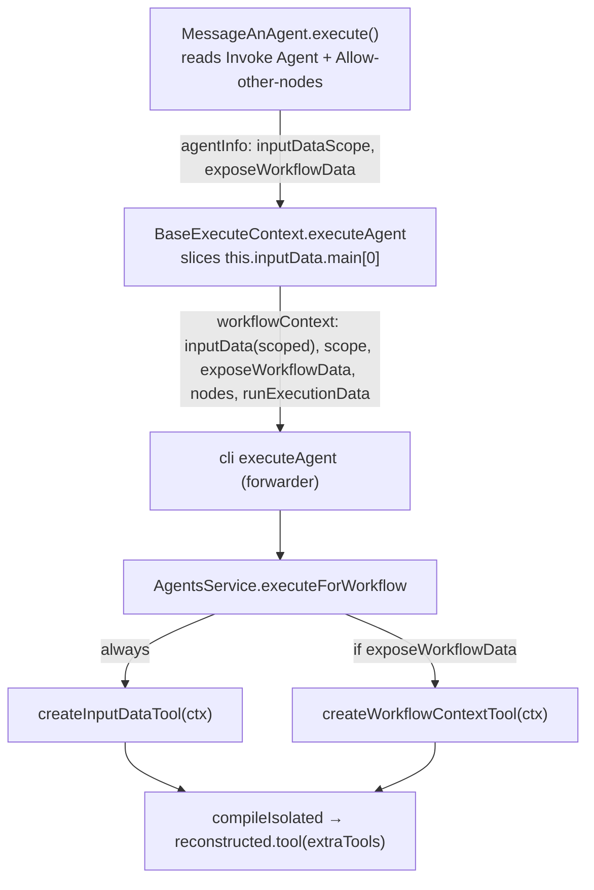

# Agent data access: input-data tool + opt-in workflow context + JMESPath retrieval

**Date:** 2026-06-11
**Status:** Approved design
**Builds on:** `2026-06-11-message-an-agent-workflow-context-design.md` (the original always-on `fetch_workflow_context` POC). This iteration refines it after hands-on use.

## Problem

The first POC gave a workflow-invoked agent a single always-on `fetch_workflow_context` tool covering *any* node's execution data. Playing with it surfaced three refinements:

1. The most common need is the agent's **own input data**, which deserves a dedicated, always-available tool — and its scope should follow how the node runs (per item vs once for the whole batch).
2. Access to *other* nodes' data is broader and privacy-relevant; it should be **opt-in, off by default**, not always-on.
3. The size caps protect context but are **lossy** — the agent needs a way to retrieve a specific part **untrimmed** when it genuinely needs it.

## Decisions

| Question | Decision |
| --- | --- |
| Invocation mode | New node param **"Invoke Agent"**: *Once Per Item* (default) or *Once for All Items*. Controls the node's own execute loop. NOT n8n's native Execute Once (which slices input to item 0 before `execute()` and would defeat the all-items tool). The engine calls `execute()` once and hands the node all items (`workflow-execute.ts:1050`); the per-item loop is ours, so the branch is fully internal. |
| All-items invocation | Single `executeAgent` call; per-item expressions (`message`, `agentId`, `outputSchema`, `sessionId`) resolve against **item 0**; output is one item. |
| Input-data tool | Always attached when invoked from the node. Argless (plus optional `query`). Returns the node's input scoped by mode: current item (per item) or all items (once for all). |
| Other-nodes tool | The existing `fetch_workflow_context`, now **opt-in** via a top-level boolean **"Allow agent to access other nodes' data"** (default off). |
| Targeted retrieval | Optional **JMESPath `query`** argument on *both* tools (not a third tool). JMESPath chosen because it is already a `packages/workflow` dependency and exposed as `$jmespath()` in expressions (`workflow-data-proxy.ts:763`), with a reusable security guard. |

## Tool contracts

### `fetch_input_data` (always-on when invoked from the node)

Input: `{ query?: string }`.

- **Without `query`** — returns the scoped input, trimmed: `{ scope: 'item' | 'all', totalItems, items, truncated }`. Trimming = 20-item cap, 50KB serialized cap, binary→key-name stubs, `jsonPreview` substitute for an oversized first item (shared with the existing tool).
- **With `query`** — `jmespath.search(fullScopedInput, query)` against the **full, untrimmed** scoped items; returns `{ query, result, truncated }`. Exempt from the item-count cap and preview substitution; still bounded by the 50KB ceiling (a hard limit on what enters context always holds). Invalid query / no match → `{ error }` payload; never throws. Reuses the jmespath security guard.

### `fetch_workflow_context` (opt-in via the boolean)

Input: `{ nodeName?: string, query?: string }`.

- Unchanged overview / per-node behavior from the original design.
- New `query` (JMESPath) evaluates against the named node's **full, untrimmed** last-run output, same semantics and ceiling as above.

## Architecture / plumbing

**Type changes (`packages/workflow/src/interfaces.ts`):**
- `ExecuteAgentInfo` += `inputDataScope?: 'item' | 'all'`, `exposeWorkflowData?: boolean`.
- `ExecuteAgentWorkflowContext` += `inputData: INodeExecutionData[]`, `inputDataScope: 'item' | 'all'`, `exposeWorkflowData: boolean`.

**`BaseExecuteContext.executeAgent`:** reads the two flags from `agentInfo`; builds `inputData` from `this.inputData?.main?.[0] ?? []` — all items when scope `'all'`, else `[itemIndex]`'s item; passes the new fields into the context. Node stays thin.

**`AgentsService.executeForWorkflow`:** with `workflowContext` present → always push `createInputDataTool(ctx)`; push `createWorkflowContextTool(ctx)` only when `ctx.exposeWorkflowData`. Pass the array to `compileIsolated` (existing injection point).

**Node `execute()`:** branch on Invoke Agent mode. *Per item* → existing loop, `inputDataScope:'item'`. *Once for all items* → single call, params resolved at item 0, `inputDataScope:'all'`. Both set `exposeWorkflowData` from the boolean param.

**Refactor:** extract shared helpers (`toSafeItem`, last-run item access, item/size caps, `jsonPreview`, new `evaluateQuery`) from `workflow-context-tool.ts` into `tools/agent-data-utils.ts`; both tools import them. New file `tools/input-data-tool.ts` exports `createInputDataTool(ctx): BuiltTool`.

## System prompts

- The "You were invoked from workflow '<name>' by node '<node>'" framing **moves to `fetch_input_data`** (always present). It instructs: read this step's input (current item / all N items); pass a JMESPath `query` for a specific part of large data.
- `fetch_workflow_context`'s instruction (present only when opt-in) narrows to "inspect data produced by *other earlier* nodes" + the `query` arg.
- Both merge coherently into the runtime's `<built_in_rules>` block.

## Error handling & safety

- Tool handlers return `{ error }` payloads, never throw (consistent with the existing tool).
- JMESPath: reuse the existing property-access security guard from `workflow-data-proxy`; invalid expressions and no-match return `{ error }`.
- 50KB ceiling is absolute — query cannot exceed it; it only chooses *which* slice.
- No `workflowContext` (other callers) → no tools attached; behavior identical to today.
- In-memory input/run data passed by reference; safe because nodes execute sequentially while the agent call awaits.

## Testing

- `input-data-tool` unit tests: scope item vs all; caps/binary/preview; query valid / invalid / no-match / security guard.
- `workflow-context-tool`: add query cases; updated instruction wording; existing cases still green.
- `agent-data-utils`: covered via the two tools (no separate suite unless a helper warrants it).
- `agents.service`: input tool always injected when context present; context tool only when `exposeWorkflowData`; both when true; neither without context.
- `base-execute-context`: per-item (scoped to current item) and once-for-all (all items); both forward `inputDataScope` and `exposeWorkflowData`.
- `MessageAnAgent.node`: per-item → N invocations with scope `'item'`; once-for-all → single invocation with scope `'all'`; `exposeWorkflowData` flows into `agentInfo`.

## Out of scope

- Node-level per-node allow-list for the other-nodes tool (the boolean is all-or-nothing for now).
- Pagination/cursoring of input items beyond the cap + query.
- Sub-agent propagation; cross-execution context; `usableAsTool`.
- Surfacing in the UI what the agent fetched (beyond the existing `toolCalls` output).
