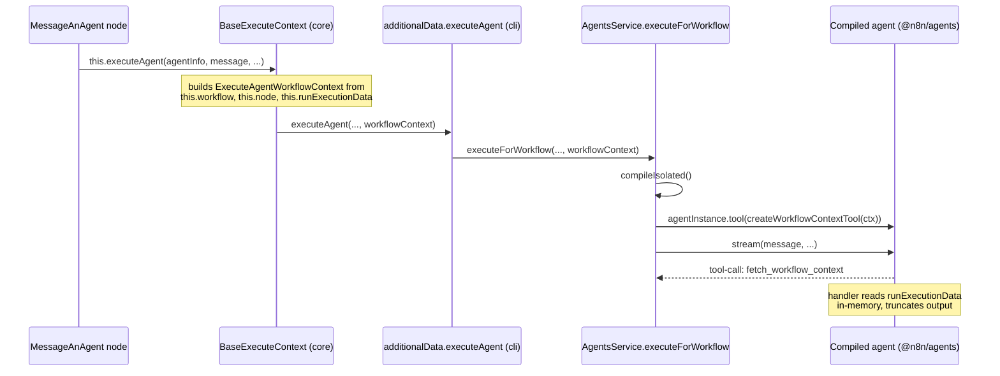

# POC: Workflow execution context for agents invoked via "Message an n8n Agent"

**Date:** 2026-06-11
**Status:** Approved design (POC scope)

## Problem

When a workflow calls an agent through the `Message an n8n Agent` node, the agent
only receives the message string. It has no way to see what the parent workflow
has done so far — which nodes ran and what data they produced — even though that
context is often exactly what the message refers to ("summarize the data the
previous node fetched").

## Goal

Give the agent an on-demand `fetch_workflow_context` tool (plus system-prompt
guidance on how to use it) that exposes the parent workflow's execution data for
the current execution. POC scope: always-on, no node or agent configuration.

## Decisions made

| Question | Decision |
| --- | --- |
| Tool shape | Two-step explore: list executed nodes, then fetch one node's output on demand. One-shot dumps risk blowing the context window on real workflows. |
| Opt-in vs always-on | Always-on for the POC. A node-level toggle is the likely product shape but is out of scope here. |
| Data source | In-memory `runExecutionData` threaded through the `executeAgent` call chain. A DB lookup (`ExecutionPersistence`) only has mid-execution data when `saveExecutionProgress=true`, so it is unreliable for this purpose. |
| Injection point | Inject the tool into the compiled agent instance after `compileIsolated()` in `AgentsService.executeForWorkflow`. The compiled agent is per-invocation (not cached), so the tool is scoped to that run. No `@n8n/agents` SDK changes needed. |
| Prompt plumbing | None needed: a `BuiltTool`'s `.systemInstruction(...)` is automatically merged into the system prompt's `<built_in_rules>` block by `composeEffectiveInstructions()` (`packages/@n8n/agents/src/runtime/agent-runtime.ts`). |

## Architecture



## Tool contract

Name: `fetch_workflow_context`. Input: `{ nodeName?: string }`.
Built per-invocation via the `@n8n/agents` `Tool` builder in a new factory.

**Without `nodeName` — overview:**

```json
{
	"workflow": { "id": "abc", "name": "Order processing" },
	"invokedBy": "Message an Agent",
	"executedNodes": [
		{
			"name": "Webhook",
			"type": "n8n-nodes-base.webhook",
			"status": "success",
			"runs": 1,
			"items": 3
		}
	]
}
```

Built from `runExecutionData.resultData.runData` (names, status, run/item counts)
joined with the workflow's node list for types. The calling node is mid-execution
and therefore not in `runData` yet — naturally excluded.

**With `nodeName` — node output:**

- Last run, main output branch, `json` only.
- Binary data replaced with key-name stubs.
- Caps: 20 items / ~50KB serialized, `"truncated": true` flag when capped.
- Unknown node name → `{ error }` payload listing available node names so the
  model can self-correct. The handler never throws.

**System instruction** (interpolated at tool build time, merged into
`<built_in_rules>` automatically):

> You were invoked from the n8n workflow '\<name\>' by node '\<node\>'. To inspect
> data produced by earlier workflow nodes, call fetch_workflow_context with no
> arguments to list executed nodes, then with a nodeName to read that node's
> output. Use it when the message references workflow data.

## Changes (file-by-file)

| File | Change |
| --- | --- |
| `packages/workflow/src/interfaces.ts` | New `ExecuteAgentWorkflowContext` interface: `{ workflowId, workflowName, callingNodeName, nodes: Array<{ name, type }>, runExecutionData }`. Add a trailing optional `workflowContext` param to the `executeAgent` fn type on `IWorkflowExecuteAdditionalData` (~line 3265). |
| `packages/core/src/execution-engine/node-execution-context/base-execute-context.ts` (~line 160) | Build the context object from `this.workflow` / `this.node` / `this.runExecutionData` and pass it through. |
| `packages/cli/src/workflow-execute-additional-data.ts` (~line 316) | Forward `workflowContext` to `agentsService.executeForWorkflow`. |
| `packages/cli/src/modules/agents/tools/workflow-context-tool.ts` *(new)* | `createWorkflowContextTool(ctx): BuiltTool` — handler, truncation, binary stripping. |
| `packages/cli/src/modules/agents/agents.service.ts` | `executeForWorkflow` accepts `workflowContext?`; after `compileIsolated()` succeeds, inject the tool on the compiled instance. `compileIsolated` stays untouched. |

`MessageAnAgent.node.ts` needs zero changes — always-on, threading happens below it.

## Error handling & safety

- No `workflowContext` provided (other callers of `executeForWorkflow`) → no tool
  injected; behavior identical to today.
- Tool handler returns `{ error }` payloads instead of throwing, so the model can
  read and recover.
- Mutation safety: n8n executes nodes sequentially, so while the node awaits the
  agent, `runExecutionData` is not mutated. Passing the reference (not a copy) is
  safe and cheap for large executions; truncation happens only at read time.
- Queue mode: the node and `AgentsService` run in the same worker process, so the
  in-memory reference works there too.

## Testing

Unit tests (test cases to be confirmed before writing, per repo convention):

- Tool factory: overview shape, node detail, item/size truncation, binary
  stripping, unknown-node error payload.
- `agents.service`: tool injected when `workflowContext` is provided; absent
  otherwise; tool round-trips surface in the node's `toolCalls` output.

Manual demo: local dev → workflow `Manual Trigger → HTTP Request (or Set with
sample data) → Message an Agent` with a message like "Summarize the data the
previous node fetched"; verify `toolCalls` in the node output shows
`fetch_workflow_context` round-trips.

## Out of scope

- Node-level opt-in toggle ("Provide workflow context to agent").
- Propagating the tool to sub-agents.
- Cross-execution context (e.g. parent of a sub-workflow chain) — the tool only
  exposes the current execution.
- `MessageAnAgent` used as a tool by another AI Agent node (`usableAsTool`).
