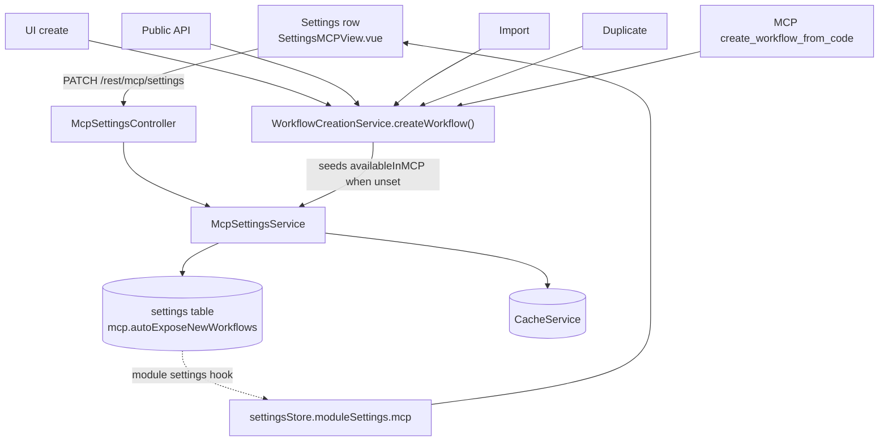

# MCP-22 — Auto-expose new workflows to MCP

Design spec. [Ticket](https://linear.app/n8n/issue/MCP-22) · milestone *P2 - Settings page consolidation*

Product decisions come from [MCP-22-discussion.md](../../../MCP-22-discussion.md) and are not
re-litigated here. This document records the technical design, the codebase
findings that shaped it, and what is deliberately out of scope.

---

## Goal

A settings row on the MCP settings page:

> **Auto-expose new workflows**
> Automatically expose newly created workflows to connected clients

When on, every workflow created from then on has `settings.availableInMCP = true`
seeded at creation. Owners/admins only, behind the existing
`095_expose_all_workflows_to_mcp` experiment flag, defaults to off. Existing
workflows are untouched (that is MCP-7).

## Architecture



One seeding point, five callers. That is the whole design.

## Codebase findings that shaped this

Verified against the tree at time of writing. Three points where the original
notes were wrong or incomplete:

**1. There is no `GET /rest/mcp/settings`.** The setting reaches the frontend
through the backend module's `settings()` hook
([mcp.module.ts:32](../../../packages/cli/src/modules/mcp/mcp.module.ts)), which
returns `{ mcpAccessEnabled, mcpManagedByEnv, serverUrl }`; the store reads
`settingsStore.moduleSettings.mcp`
([mcp.store.ts:67](../../../packages/frontend/editor-ui/src/features/ai/mcpAccess/mcp.store.ts)).
So: add a field to `settings()` and to the existing PATCH. No new endpoint.

**2. The PATCH DTO makes `mcpAccessEnabled` required** and the handler calls
`setEnabled(dto.mcpAccessEnabled)` unconditionally. Adding a second field
naively means toggling auto-expose also rewrites the master switch. Both fields
must become optional with each write guarded on presence.

**3. Neither existing toggle component fits.** `McpAccessToggle.vue` emits a
payload-less `disableMcpAccess` (it is the one-way master kill switch) and
`McpStatusControl.vue` is a dropdown. "Reuse, don't add a component" is
satisfied by composing `ElSwitch` + `N8nText` in the view — the same primitives
those two use — not by adapting either one.

## Backend

### The setting

`mcp.settings.service.ts` gains `getAutoExposeNewWorkflows()` /
`setAutoExposeNewWorkflows()` on key `mcp.autoExposeNewWorkflows`, mirroring
`getEnabled` / `setEnabled` exactly: `SettingsRepository` + `CacheService`,
`loadOnStartup: true`, absent row reads as `false`.

### Transport

Extend the existing `PATCH /rest/mcp/settings` rather than adding a dedicated
endpoint. Both fields are instance-level MCP settings and the frontend already
has a single `updateMcpSettings` call. (The rejected alternative — a separate
endpoint mirroring `PATCH /oauth/allowed-redirect-uris` — would avoid touching
the existing DTO contract but adds a third settings endpoint to the same
controller.)

- `update-mcp-settings.dto.ts` — make both fields optional. `Z.class` takes a
  `ZodRawShape`, so it cannot carry an object-level refinement ("at least one of
  these two fields") — do **not** reassign the class's static `parse`/
  `safeParse` with a `.refine()`d schema to work around that; an early attempt
  did exactly this and it was rejected as a hack (it monkey-patches a class
  after definition and is silently bypassed by any caller that reaches for
  `.schema.safeParse()` directly).
- `mcp.settings.controller.ts` — enforce "at least one field present" as the
  handler's **first statement**, throwing `BadRequestError` before the
  `mcpManagedByEnv` check. Then write each field only when present. Keep the
  existing `mcpManagedByEnv` guard and the `refreshModuleSettings('mcp')` call.
  Keep emitting `mcp-access-updated` only when `mcpAccessEnabled` was present.
- `mcp.module.ts` `settings()` — add `autoExposeNewWorkflows`.

**Why the guard lives in the handler, not the DTO.** `mcpAccessEnabled` is
currently required, so an empty `{}` body is rejected today. Making both fields
optional silently converts that 400 into a 200-that-does-nothing unless
something still enforces the non-empty constraint. Verified against zod
directly:

| Enforcement point | `{}` |
|---|---|
| Today (`mcpAccessEnabled` required) | rejected |
| Naive both-optional DTO, no handler guard | accepted → silent no-op |
| Both-optional DTO + explicit handler guard | rejected |

Because rejection now lives in the handler rather than the DTO, the test for it
must assert at the handler level (and a real-HTTP test must cover the 400
through the actual Express stack) — a DTO-only unit test would pass vacuously,
since the DTO itself now accepts `{}` by design.

### Where seeding happens

`WorkflowCreationService.createWorkflow()`, inside the create transaction,
alongside `resolveRedactionPolicyOnCreate()` — the exact precedent for reading an
instance-level policy and seeding it into `settings`.

It is chosen because it is the single funnel for every creation path: UI,
public API, import, duplicate, and MCP's own `create_workflow_from_code`.
Seeding in the controller — or in the frontend store — leaves the non-UI paths on
the old default.

Note that the frontend store is *not* a narrower funnel for UI-side creation:
duplicate, extract-to-subworkflow, share-as-new, templates, and several
experiment stores all reach `createNewWorkflow()` too
([DuplicateWorkflowDialog.vue:118](../../../packages/frontend/editor-ui/src/app/components/DuplicateWorkflowDialog.vue)
→ `saveAsNewWorkflow()` →
[useWorkflowSaving.ts:472](../../../packages/frontend/editor-ui/src/app/composables/useWorkflowSaving.ts)).
So the store's hardcoded `false` currently suppresses exposure on *all* of those,
not just blank-canvas creates — which is why deleting it matters more than the
single call site suggests, and why the backend remains the only correct seeding
point regardless.

**Precedence: default-only.** Seed only when the caller did not specify
`availableInMCP`:

```ts
if (newWorkflow.settings?.availableInMCP === undefined && await getAutoExposeNewWorkflows()) {
  // seed true
}
```

This respects deliberate callers and matches the ticket's "new workflows"
framing. Instance-always-wins would override explicit intent.

Two existing hardcoded writes to reconcile, in opposite directions:

| Site | Writes | Action |
|---|---|---|
| [workflows.store.ts:302](../../../packages/frontend/editor-ui/src/app/stores/workflows.store.ts) | `false` | **delete** — an explicit `false` from the client defeats default-only seeding on every UI-created workflow |
| [create-workflow-from-code.tool.ts:295](../../../packages/cli/src/modules/mcp/tools/workflow-builder/create-workflow-from-code.tool.ts) | `true` | leave — a client that just built a workflow must keep working on it. Add a comment pointing at the new setting |

**Reads stay untouched.** Exposure remains the stored per-workflow flag. This
keeps per-workflow opt-out working, keeps the settings table accurate, and avoids
"flag OR setting" logic across the 3 backend and 4 frontend read sites.

## Frontend

- **Delete [workflows.store.ts:302](../../../packages/frontend/editor-ui/src/app/stores/workflows.store.ts)** (`sendData.settings.availableInMCP = false`).
  Without this the feature is inert for UI-created workflows. Verified as the
  only write in the store, and no store reads the value optimistically before
  the POST response — the response carries the saved `settings`, so the client
  uses what it is given.
- Settings row on `SettingsMCPView.vue` — the top-level `/settings/mcp` page,
  **not** `SettingsMCPWorkflowsView.vue` (a drill-down sub-page reached by
  clicking "Workflows exposed"; an early attempt built the row there by
  mistake and it had to be moved). Placed as a new `N8nSettingsRowGroup` inside
  the existing "Access" section, after the "Workflows/Agents exposed" group and
  before "Allowed callback URLs" — matching the page's existing
  `N8nSettingsRow` + `#action` pattern (an `ElSwitch` in the action slot, like
  `McpStatusControl` above it), not a bespoke layout.
- Gated on `mcp:manage`; disabled with the existing `managedByEnv` tooltip when
  `mcpManagedByEnv`; rendered only under `EXPOSE_ALL_WORKFLOWS_TO_MCP_EXPERIMENT`.
- Store action in `mcp.store.ts` + field in `mcp.api.ts`.
- All copy via `@n8n/i18n`. No hardcoded spacing — CSS variables only.
- `data-test-id` single-valued, e.g. `mcp-auto-expose-toggle`.

## Flag

Reuse `EXPOSE_ALL_WORKFLOWS_TO_MCP_EXPERIMENT` (`095_expose_all_workflows_to_mcp`);
store and modal already exist under `src/experiments/exposeAllWorkflowsToMcp/`.
No new flag.

Note the split of responsibilities: the **flag** decides whether the row is
visible (evaluated per browser); the **setting** decides what happens at
creation (per instance). Gating the seeding behaviour on the flag would let two
admins on one instance create workflows with different exposure from the same
toggle state — which is why seeding is backend-side and flag-independent.

## Telemetry

One event: **toggle changed**, carrying the resulting state (not "was toggled",
so enable and disable are distinguishable) plus the experiment variant.
Registered through the `@n8n/telemetry` registry.

Success — "did the toggle achieve anything" — is measured by **cohort
comparison**, not per-workflow provenance: compare MCP action rates on workflows
created after a toggle-on against the variant's control group, using the
`USER_CALLED_MCP_TOOL_EVENT` data that already flows from every tool.

This deliberately rejects stamping provenance (e.g. `settings.mcpExposureSource`)
on each auto-exposed workflow. That would add a permanent field to
`IWorkflowSettings` — a shared type crossing the public API, export/import, and
checksums — to answer a temporary experiment question, and would need its own
rule for manual toggle-off-then-on. If cohort resolution proves too coarse
against real data, deriving a flag at action time (comparing workflow
`createdAt` to the setting's changed-at) is a strictly additive follow-up.

Count actions, not reads: `update_workflow`, `publish_workflow`,
`execute_workflow`, `test_workflow`, `archive_workflow`. Workflow *listing* is
excluded — unexposed workflows already appear in `search_workflows`, so counting
it would score a hit for every auto-exposed workflow immediately and read as
success while nothing changed.

## Testing

| Unit | Assertion |
|---|---|
| `mcp.settings.service` | get/set round-trip; cache hit path; absent row → `false` |
| `update-mcp-settings.dto` | `{}` rejected; either field alone accepted; both together accepted |
| `mcp.settings.controller` | patching one field leaves the other untouched (guards finding #2); env guard still rejects; `mcp-access-updated` not emitted for an auto-expose-only patch |
| `workflow-creation.service` | seeds `true` when `availableInMCP` unset and setting on; respects explicit `false`; respects explicit `true`; no seed when setting off |
| `mcp.module` | `settings()` includes `autoExposeNewWorkflows` |
| `SettingsMCPView` | row renders for `mcp:manage` + experiment on; hidden for member; hidden without the experiment flag; disabled (not hidden) under `managedByEnv` |

Mock external dependencies; reuse hoisted `mock<T>()` fixtures. `packages/cli`
tests use `createVitestConfigWithDecorators`.

## Out of scope

| Item | Why |
|---|---|
| Bulk-exposing existing workflows | MCP-7 |
| Agents | Workflows only, per ticket |
| `search_workflows` exposure filtering | Pre-existing behaviour, unchanged here |
| Per-workflow exposure provenance | Rejected above in favour of cohort measurement |
| Not-yet-runnable workflows | No behaviour change; a trigger-less workflow is exposed like any other and fails the existing trigger check on run |
