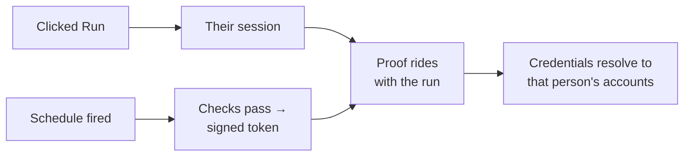

# Workflow catalog

Run a workflow someone else built, on your own accounts, without opening the
editor — once now, or on a schedule of your own.

---

## The problem

A workflow is built once and used by many people. Today those people have two
bad options.

**Open the editor.** The canvas is built for authoring, not for running. Someone
who just needs "generate this week's report" is handed a graph, a node panel and
an execute button somewhere in the corner. They also need read access to the
workflow to get there, which means handing out the graph to everyone who needs
the outcome.

**Ask the builder to schedule it.** A Schedule Trigger belongs to the workflow,
not to a person. One schedule serves everyone, so "run mine at 07:00 and hers at
09:00" needs two workflows. Worse, it runs on **the builder's** connected
accounts: the report is pulled from the builder's Google Drive and posted to
Slack as the builder, no matter who it is for.

That second point is the real one. Automation people want is often
*personal* — my calendar, my inbox, my drive — and n8n's unit of sharing is the
workflow, not the identity it runs as.

## What it does

A **Run a workflow** tab, listing the workflows a person may run. Each is a card
with its name, description, how many inputs it takes and — if they have one —
when it next runs for them.

From a card they can:

- **Run it now.** If the workflow declares input fields, a form is built from
  them. If it declares none, the button just runs it.
- **Put it on their own schedule.** Hourly, daily or weekly, at a time they
  pick, with their own values for the inputs. Several people can hold different
  schedules for the same workflow, and one person can hold several.
- **See past runs**, by jumping to that workflow's execution list.

Every one of those runs — attended or not — acts with **that person's** connected
accounts.

## The decision that shapes everything

The builder authors **one** workflow, with an Execute Workflow Trigger and no
schedule of its own. Its declared input schema doubles as the contract a run
form is built from.

The obvious alternative — generate a wrapper workflow per subscriber, a Schedule
Trigger wired to an Execute Workflow node — was rejected:

1. **Two executions per run.** The consumer sees both and can't tell which is
   theirs, which is a regression in the exact experience being built. Retention
   and quotas double-count.
2. **Clutter is a permanent tax.** Hiding generated workflows means remembering
   a filter in every list, search, export, source-control sync and insights
   query — including the ones written next year.
3. Caller policy denies it by default (`workflowsFromSameOwner`), versions drift
   across N wrappers, and people can open and break their own wrapper.
4. **It doesn't solve the hard part anyway.** A cron at 3am has no session to
   take an identity from, wrapper or not.

Instead: a subscription row, provisioned into n8n's existing durable scheduler.

---

## How it works

### Which workflows appear

A workflow is listed when all three hold:

| | |
| --- | --- |
| The person has **`workflow:execute`** on it | Scoped to workflows shared with them, not everything a global scope permits |
| It has a **start node** | An Execute Workflow Trigger, or a Manual Trigger |
| It has **no Schedule Trigger** | It already runs on its own clock; per-person runs would double up |

The listing returns names, descriptions and the declared fields — never `nodes`
or `connections`. Execute access must not become a way to read the graph.

**Scheduling asks for more:** an Execute Workflow Trigger specifically. Running
something once with the person watching is bounded, and anyone with execute
access could have done it from the editor anyway. A schedule is unattended,
recurring, and acts with their accounts for as long as it stands — too large a
commitment to infer from a Manual Trigger, which says the opposite ("a human
presses play here"). Those workflows stay runnable and carry an
**On demand only** badge.

### Identity

Every run carries proof of who it is for. There are two ways to get that proof.



**Clicked Run** — the person is there, so their session is the proof.

**Schedule fired** — nobody is there, so n8n signs a short-lived token naming
them and the run carries that instead.

A token says who the person was when it was written, and nothing about now. So
before each scheduled run the handler checks what a request would have checked:
the account is still active, consent still stands, execute access is still
there. If one of those changed the run is skipped and logged — expected, not a
failure. People leave teams and change their minds.

Expired OAuth tokens are not a special case. n8n's normal refresh saves the new
token to that person's own store whenever the run carries an identity.

### Storage

Two tables, because the keys differ.

```
workflow_credential_binding          -- consent: "run as me"
  PK (workflowId, userId)            -- one grant per pair
  status 'active' | 'revoked'        -- revoking keeps the row for audit
  consentAt

workflow_subscription                -- a personal schedule, N per grant
  id PK
  (workflowId, userId) FK → binding ON DELETE CASCADE
  cronExpression, timezone, inputs (json), enabled
```

Consent is one grant per (workflow, person). Schedules are not: one person may
want two. So the subscription hangs off the grant by composite foreign key, and
withdrawing consent takes the schedules with it.

**Manual runs need no grant** — the person is present, and their session is the
identity.

### Scheduling

Subscriptions ride n8n's durable scheduler rather than a mechanism of their own.
That scheduler already solves cron, IANA timezones, misfire policy, retries,
leasing, reaping and multi-main — so workflow activation and leadership are out
of scope entirely.

One thing had to give. A scheduled job was identified by
`(workflowId, nodeId)` — what provisioning diffs and deprovisioning deletes by —
and a per-person schedule has no node. `scheduled_job` gained a nullable, opaque
**`ownerId`** that the scheduler pairs with `taskType` and never interprets, so a
feature can own jobs without the scheduler learning about the feature.

Owner-scoped jobs record no `workflowId`: that column is a foreign key onto the
published version, meaning "belongs to a published trigger", which these do not.

**The trap this creates:** nothing in the database removes those jobs when their
owner goes. `ownerId` carries no foreign key, and the cascade from the grant
reaches the subscription rows but not the scheduler. Every path therefore
deprovisions *before* it deletes, and treats a failed provision as a reason to
put the row back rather than leave the two stores disagreeing.

### API

| | |
| --- | --- |
| `GET /rest/catalog/workflows` | What I can run, with each contract |
| `POST /rest/catalog/workflows/:id/run` | Run it now |
| `GET /rest/catalog/subscriptions` | My schedules |
| `POST /rest/catalog/workflows/:id/subscriptions` | Take one on (records consent) |
| `PATCH /rest/catalog/subscriptions/:id` | Change or pause one |
| `DELETE /rest/catalog/subscriptions/:id` | Drop one |
| `DELETE /rest/catalog/workflows/:id/consent` | Stop using my accounts, and take every schedule with it |

Input values are filtered against the declared contract on every path, so a
field the builder later removes stops reaching the workflow.

---

## Verified

Walked end to end on a live instance with the durable scheduler on: migrations
apply, the listing returns contracts without the graph, a manual run executes in
production mode with undeclared keys dropped, a subscription provisions one job,
**the schedule fires** and produces a second execution with the stored inputs and
the right attribution, pausing removes the job and keeps the row, and revoking
consent takes both down.

Not covered: the real OAuth path (behind `LICENSE_FEATURES.DYNAMIC_CREDENTIALS`
plus `N8N_ENV_FEAT_DYNAMIC_CREDENTIALS`, needs a live account), and multi-user
scoping, which needs sharing or projects — both licensed.

## Known gaps

Ordered by how much they'd hurt.

1. **Input values are all strings.** Six types can be declared on the trigger;
   the form renders one text box for each and sends the text through unchanged.
   A `number` field arrives as `"42"`. Worse for schedules, where a wrong value
   is stored and replayed daily with nobody watching.
2. **The minted token's 15-minute life caps the whole execution's access**, not
   just the handoff — credentials are resolved on every read, and the check
   includes expiry. An execution that runs longer, or waits that long in a
   queue, loses access mid-flight.
3. **Wait nodes lose the identity entirely.** Resuming rebuilds the run data
   without the credential context, so it silently falls back to static
   credentials. Pre-existing behaviour of dynamic credentials, not specific to
   the catalog, but it means "wait an hour, then use my Slack" will not work.
4. **Nobody is asked for consent out loud.** It is recorded implicitly when the
   first schedule is set up. The endpoint to withdraw it exists; nothing calls it.
5. **`N8N_SCHEDULER_ENABLED` defaults to off.** Subscriptions are still created
   and their jobs written — they simply never fire, silently.
6. **The 200-candidate cap is applied before eligibility filtering**, and the
   finder has no `ORDER BY`, so on a large instance an arbitrary subset is
   described.
7. Archived workflows are not filtered out of the listing.
8. The execution list a card links to needs `workflow:read`, which the catalog
   itself deliberately does not require.
