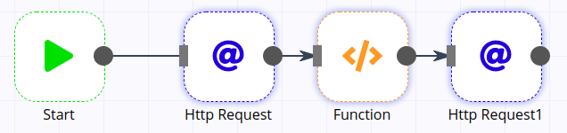
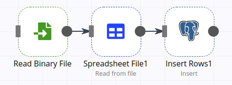
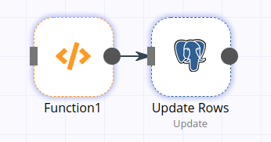

	
	 
	 
	 

 

Awesome n8n workflows collection
================================

You will find here a collection of n8n worflow examples that can be easily imported in n8n.

## Contents

- [For loop](#for-loop) - how to iterate over an JSON array
- [Excel to Postgres](#excel-to-postgres) - how to migrate data from Excel to PostgreSQL
- [Postgres to Excel](#postgres-to-excel) - how to migrate data from Postgres to Excel
- [Update Postgres rows](#update-postgres-rows) - how to update PostreSQL rows

## For loop

1. Make an HTTP request that responds with a JSON array
1. For each item in the response array, make an HTTP request

[Download workflow](for-loop.json)

## Excel to Postgres

1. Read XLS from file
1. convert it to JSON 
1. insert it in Postgres

[Download workflow](excel-to-postgres.json)

## Postgres to Excel

1. Read data from Postgres
1. Converting it to XLS 
1. save it to disk

[Download workflow](postgres-to-excel.json)

## Update Postgres rows

- Simple update of data

[Download workflow](update-postgres-rows.json)
