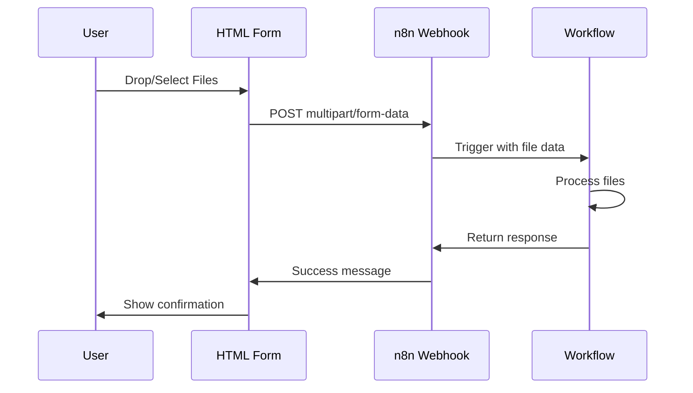

# File Upload Quick Start Guide

Get a working file upload system running in **5 minutes**!

## What You Get

- 🌐 Beautiful drag-and-drop upload form
- 📤 Multiple file uploads
- ⚡ Real-time progress tracking
- ✅ Instant validation and feedback
- 🔒 Optional authentication
- 📱 Mobile-friendly interface

## Quick Setup

### Step 1: Import Workflow (2 minutes)

1. Open your n8n instance
2. Click **"Add Workflow"** → **"Import from File"**
3. Select `file-upload-workflow.json` from this directory
4. Click **"Activate"** to enable the workflow

**Your webhook URLs:**
- Test: `http://your-n8n-domain/webhook-test/file-upload`
- Production: `http://your-n8n-domain/webhook/file-upload`

### Step 2: Configure Upload Form (1 minute)

1. Open `file-upload-form.html` in a text editor
2. Find this line (around line 151):
   ```javascript
   const WEBHOOK_URL = 'http://localhost:5678/webhook-test/file-upload';
   ```
3. Replace with your actual webhook URL
4. Save the file

### Step 3: Test It! (2 minutes)

1. Open `file-upload-form.html` in your web browser
2. Drag and drop a file or click to browse
3. Click "Upload Files"
4. Check your n8n workflow execution log

**Success!** 🎉 Your file upload system is working!

## What Happens When You Upload?



## Next Steps

### Add File Storage

**Save to Google Drive:**
1. Add "Google Drive" node after "Process Files"
2. Configure authentication
3. Set action to "Upload"
4. Map `$binary.data` to the file input

**Save to AWS S3:**
1. Add "AWS S3" node after "Process Files"
2. Configure credentials
3. Set action to "Upload"
4. Map `$binary.data` to the file input

**Save to Dropbox:**
1. Add "Dropbox" node after "Process Files"
2. Configure OAuth credentials
3. Set action to "Upload"
4. Map `$binary.data` to the file input

### Add File Validation

**Validate file types:**
```javascript
// Add IF node after "Files Received?"
{{ $json.binary.file0.mimeType.includes('image/') }}
```

**Validate file size (max 10MB):**
```javascript
// Add IF node after "Files Received?"
{{ $json.binary.file0.fileSize <= 10485760 }}
```

### Add Security

**Option 1: API Key Authentication**

In `file-upload-form.html`:
```javascript
const API_KEY = 'your-secret-key-here';
```

In n8n Webhook node:
1. Set Authentication → Header Auth
2. Name: `X-API-Key`
3. Value: `your-secret-key-here`

**Option 2: Basic Authentication**

In n8n Webhook node:
1. Set Authentication → Basic Auth
2. Configure username/password
3. Update HTML form to include credentials

### Customize Response

Edit the "Success Response" node:

```javascript
{
  "success": true,
  "message": "Files processed successfully!",
  "files": [
    {
      "name": "{{ $json.fileName }}",
      "size": "{{ $json.fileSize }}",
      "url": "https://your-storage.com/{{ $json.fileName }}"
    }
  ],
  "timestamp": "{{ $now }}"
}
```

## Example Use Cases

### 1. Resume/CV Upload for Job Applications

```
Webhook (receive resume)
  ↓
Extract Text from PDF
  ↓
OpenAI (analyze skills)
  ↓
Airtable (save candidate data)
  ↓
Email (notify HR team)
```

### 2. Document Processing System

```
Webhook (receive documents)
  ↓
Google Drive (store original)
  ↓
Cloudinary (create thumbnails)
  ↓
PostgreSQL (save metadata)
  ↓
Slack (notify team)
```

### 3. Image Upload Gallery

```
Webhook (receive images)
  ↓
Cloudinary (optimize & resize)
  ↓
MongoDB (save image URLs)
  ↓
Respond (return CDN URLs)
```

## Troubleshooting

### Files Not Uploading

**Problem:** Upload fails or shows error

**Solutions:**
1. Check webhook URL is correct in HTML form
2. Verify workflow is **activated** (not just saved)
3. Open browser console (F12) to see error messages
4. Test webhook with curl:
   ```bash
   curl -X POST http://your-webhook-url \
     -F "file=@/path/to/test.pdf"
   ```

### Large Files Fail

**Problem:** Uploads work for small files but fail for large ones

**Solutions:**
1. Increase n8n payload limit:
   ```bash
   # In .env file or environment variables
   N8N_PAYLOAD_SIZE_MAX=100  # MB
   ```
2. Increase server timeout settings
3. Consider chunked upload for very large files

### CORS Errors

**Problem:** Browser blocks requests with CORS error

**Solutions:**
1. n8n webhooks should handle CORS automatically
2. Check your reverse proxy (nginx/apache) CORS settings
3. For development, test without HTTPS first

### No Response After Upload

**Problem:** Files upload but form shows no feedback

**Solutions:**
1. Check "Response Mode" in Webhook node is set correctly
2. Verify "Respond to Webhook" node is connected
3. Look for errors in n8n execution log

## Testing Checklist

- [ ] Single file upload works
- [ ] Multiple file upload works
- [ ] Progress bar shows correctly
- [ ] Success message displays
- [ ] Error handling works (try uploading without files)
- [ ] File appears in workflow execution data
- [ ] Response contains correct data
- [ ] Works on mobile devices
- [ ] Authentication works (if enabled)
- [ ] Large files upload successfully

## Production Deployment

### 1. Use HTTPS

**Critical for security!** Configure SSL/TLS on your n8n server.

### 2. Enable Authentication

Always use authentication on public webhooks to prevent abuse.

### 3. Add Rate Limiting

Prevent abuse by limiting uploads per IP:
- Use nginx rate limiting
- Or add rate limit logic in n8n workflow

### 4. Monitor & Log

Track uploads for security and debugging:
```javascript
// Add in workflow after webhook
{
  "event": "file_upload",
  "timestamp": "{{ $now }}",
  "ip": "{{ $json.headers['x-forwarded-for'] }}",
  "fileCount": "{{ Object.keys($json.binary).length }}",
  "totalSize": "{{ $json.totalBytes }}"
}
```

### 5. Host Upload Form

**Options:**
- Static hosting: Vercel, Netlify, GitHub Pages
- Your own web server
- CDN: CloudFlare, AWS CloudFront
- Embed in existing app

### 6. Backup & Recovery

- Regularly backup n8n workflows
- Test restore procedures
- Monitor webhook availability

## Advanced Features

### Real-time Virus Scanning

Add VirusTotal or ClamAV node to scan uploads.

### Image Recognition

Use Google Vision, AWS Rekognition, or OpenAI Vision to analyze images.

### Automatic File Organization

Route files to different storage based on type/content.

### Email Notifications

Alert team members when important files are uploaded.

### Database Integration

Store file metadata in PostgreSQL, MySQL, or MongoDB.

## Support & Resources

- **Full Documentation:** `FILE_UPLOAD_MODULE.md`
- **Example Form:** `file-upload-form.html`
- **Workflow Template:** `file-upload-workflow.json`
- **n8n Docs:** https://docs.n8n.io
- **Community:** https://community.n8n.io

## What's Next?

Now that you have file uploads working, explore:

1. **Workflow Colors & Folders** - Organize your n8n workspace
2. **Custom Logo** - Brand your n8n instance
3. **Data Tables Import** - Import CSV/Excel uploads to database
4. **API Integration** - Connect to your custom APIs

---

**Questions?** Check `FILE_UPLOAD_MODULE.md` for detailed documentation!
