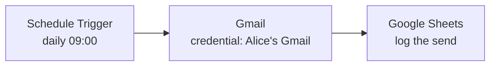

# Showcases: "only me" vs end-user credentials

Demo scenarios for the [credential-level "only me" restriction](./granular-credential-sharing.md).
Each one is runnable on the POC branch. Use them to show what the two features do
differently, and where end-user credentials cannot stand in for "only me".

---

## The difference in one line

| | End-user credentials | "Only me" |
|---|---|---|
| Whose account runs the node | **each** executing user's own | the owner's, **always** |
| How many identities | N, one per user | exactly 1 |
| When the identity is decided | at run time, from the trigger | at publish time |
| Each user must connect their own account | yes | no |
| Works on schedule / polling | **no — publish is refused** | yes |

Read it as two different questions:

- End-user credentials answer *"act as whoever is running this."*
- "Only me" answers *"act as me, and only me, no matter who runs it."*

A schedule has nobody to be, so only the second question is answerable there.

---

## Which triggers each feature supports

End-user credentials can only be published when **every** trigger in the workflow
supplies an identity. The qualifying set (`classifyTriggerIdentity` in
`packages/workflow/src/trigger-identity.ts`):

| Trigger | Qualifies for end-user? |
|---|---|
| Manual Trigger | ✅ |
| Execute Sub-workflow Trigger | ✅ |
| Chat Trigger, available in Chat Hub | ✅ |
| Chat Trigger, hosted mode + n8n user auth | ✅ |
| MCP Trigger with `n8nOAuth2` auth | ✅ |
| Webhook with `n8nOAuth2` ("n8n User Auth") | ✅ |
| Form Trigger with `n8nUserAuth` | ✅ |
| **Schedule Trigger** | ❌ never |
| **Any polling trigger** (Gmail Trigger, RSS, …) | ❌ never |
| Webhook with no auth / basic / header auth | ❌ |
| Form Trigger without user auth | ❌ |
| Chat / MCP Trigger in any other configuration | ❌ |
| Error Trigger, n8n Trigger | ❌ |

"Only me" works on **all** of them. So end-user credentials cover a strict subset
of the triggers "only me" covers.

Note the boundary follows **configuration, not node type**: the same Webhook node
qualifies or not depending on its auth setting.

---

## Section A — both features "work", but they answer differently

These are the cases people assume are interchangeable. They are not.

### A1. The report that must come from the company address

**Setup.** Team project *Marketing*. Alice owns the `press@acme.com` Gmail
credential. Workflow: Manual Trigger → Gmail "send press release".

| | What happens when Bob runs it |
|---|---|
| End-user credential | Sends **from Bob's own mailbox**. Bob must have connected his Google account first, or the run fails. |
| "Only me" | Bob **cannot run it at all**. Clear error naming the credential and Alice. |

**The point.** End-user credentials do not protect a shared identity — they
*remove* it. If the business rule is "this always goes out from `press@acme.com`",
end-user credentials cannot express it, even on a manual trigger where they are
technically allowed. This is the showcase that kills "just use end-user
credentials instead".

### A2. Chat agent over a team knowledge base

**Setup.** Chat Trigger in Chat Hub → Google Drive node reading a shared drive.

- **End-user**: each person's chat reads the drive as themselves. Good when
  per-user permissions in Drive are the point.
- **Only me**: everybody's chat reads as Alice. Good when the drive is a single
  service account nobody else can connect to.

**The point.** Here the choice is a genuine product decision, not a technical
constraint. Both are valid; they give different answers.

---

## Section B — where end-user credentials cannot replace "only me"

### B1. Daily scheduled report ← the flagship demo

**Setup.** Team project *Marketing*. Alice owns the Gmail credential.
Workflow: **Schedule Trigger** (daily 09:00) → Gmail "send report".

**With an end-user credential — publish is refused:**

```
Cannot publish workflow: end-user credentials ("Gmail") are only supported with
manual and sub-workflow triggers, chat triggers available in n8n Chat Hub or
using n8n user authentication in hosted chat mode, and MCP, form, or webhook
triggers with n8n user authentication. To use another trigger, switch the
credential to Fixed.
```

There is no configuration that fixes this. A schedule has no user to resolve to.

**With "only me" — it works, and stays restricted:**

1. Alice creates the Gmail credential in *Marketing* with **"Only I can use this
   credential"** on.
2. She publishes the workflow. It runs daily **as Alice**, because the run is
   attributed to the person who published it.
3. Bob (project admin) opens the workflow. He sees the credential's **name and
   type** on the Gmail node, and which workflows use it — so he can diagnose a
   failure and knows who to ask.
4. Bob can rename nodes, change the logic, and **save**.
5. Bob **cannot**:
   - run it manually — `Node "Send report" uses the credential "Gmail", which you cannot use`
   - **publish** it — `Cannot publish workflow: you cannot use the credentials ("Gmail") it references. A published workflow runs as its publisher, so ask their owner to publish it or to give you access.`
   - bind the credential to a **new** node (it is not offered in the picker)
   - see the **data** the runs returned (execution data is redacted for him, and
     the `execution:reveal` permission does not override it)

Step 5's publish block is the one that matters: without it Bob could not run the
workflow himself, but he could publish it and let the schedule run it for him.

### B2. Polling a specific mailbox

**Setup.** Gmail Trigger polling `alerts@acme.com` → Slack.

End-user credentials are not just refused here, they are **conceptually
undefined**: a poll has no "whoever is running this" to resolve to. Whose inbox
would it watch?

"Only me" polls Alice's mailbox, as Alice, and the team can still maintain the
downstream logic.

### B3. Third-party webhook

**Setup.** Webhook (no auth — Stripe calls it) → Gmail "send receipt".

The caller is Stripe. It has no n8n identity, so end-user publish is refused.
Adding n8n OAuth2 auth to the webhook would qualify it — but then Stripe can no
longer call it. The requirement and the fix are mutually exclusive.

"Only me" works: the run acts as whoever published.

### B4. A corporate account nobody else can connect to

**Setup.** One company Stripe key. One `finance@acme.com` mailbox. There is no
"your own account" for a colleague to connect.

End-user credentials require every executing user to connect their own account,
so everyone except the single account holder is stuck — and on a schedule it
cannot be published at all.

"Only me" is the natural fit: one owner, visible to the team for audit and
maintenance.

### B5. Error workflows

**Setup.** Error Trigger → Gmail "notify on-call".

An Error Trigger never carries an identity. End-user credentials cannot be
published. "Only me" runs as the publisher.

---

## Section C — where "only me" cannot replace end-user credentials

Included so the comparison is fair. These are end-user credentials' home turf.

### C1. Each salesperson emails from their own mailbox

Form Trigger (n8n user auth) → Gmail. 30 salespeople, one workflow, 30 mailboxes.
"Only me" would send every email from one person — the wrong outcome.

### C2. Per-user permissions must be respected downstream

A chat agent that must only surface documents **the asking user** is allowed to
see. Only end-user credentials preserve that, because the identity reaching the
third party is the asker's.

### C3. Avoiding a human bottleneck

Onboarding 50 people who each connect their own account, with nobody in the
middle. "Only me" concentrates everything on one owner.

---

## A single demo you can run end to end

One workflow, two settings, three roles. Shows the whole story in ~5 minutes.



**Cast.** Alice (project admin, owns the credential), Bob (project admin),
Carol (project viewer), Dave (instance admin).

| Step | Action | Expected |
|---|---|---|
| 1 | Alice creates the Gmail credential in *Marketing*, **"Only me" on** | Two grants written: owner → Alice's personal project, viewer → *Marketing* |
| 2 | Alice toggles the credential to **end-user** in the same modal | Toggle refuses — the two are mutually exclusive, and the UI says why |
| 3 | Alice publishes the workflow | Succeeds. Runs daily as Alice |
| 4 | Bob opens the workflow | Sees the Gmail node with the credential's **name and type**; the node is read-only with an explanation |
| 5 | Bob renames a node and saves | Succeeds — editing is allowed |
| 6 | Bob adds a new Gmail node and picks the credential | The credential is **not in the picker** |
| 7 | Bob clicks Execute | Blocked, error names the credential, the node, and Alice |
| 8 | Bob clicks Publish | Blocked, error explains a published workflow runs as its publisher |
| 9 | Bob opens yesterday's execution | Sees the run happened; the **data is redacted** |
| 10 | Dave (instance admin) opens the same execution | Also redacted — ownership beats the reveal permission, and the attempt is audited |
| 11 | Alice switches the workflow's Schedule Trigger to a Manual Trigger and the credential to end-user | Now publishable — but Bob's runs send from **Bob's** mailbox, not `press@acme.com` (showcase A1) |
| 12 | Alice turns **"Only me" off** | *Marketing*'s grant upgrades from view to use; Bob can now run and publish |

Step 11 is the pivot: it is the only step where end-user credentials become an
option, and it changes what the workflow *does*.

---

## Section D — can fixed credentials + sharing cover any of this?

Worth answering directly, because it is the first thing anyone asks.

Today's sharing has exactly **two** states for a project member, and the feature
adds a third:

| State | Knows it exists | Can use it |
|---|---|---|
| No grant | ✗ | ✗ |
| Grant (`credential:user`) | ✓ | ✓ |
| **View-level grant** *(new)* | ✓ | ✗ |

So fixed + sharing covers the two extremes and cannot express the middle.

### What fixed + sharing genuinely does cover

Be honest about this — it is a large class of cases:

- **The team never needs to see the credential or the workflow.** Keep both in
  Alice's personal project and share nothing. Works today, no feature needed.
  *"Just keep it private" is a real answer* whenever visibility is not required.
- **The team may use the credential.** Share it normally. Status quo, fine.

The restriction only earns its place when **visibility is load-bearing**: audit,
diagnosing a failure, picking up a workflow while its owner is away (§2 of the
spike). That is the requirement enterprise customers actually brought.

### Why the three obvious workarounds fail

**Attempt 1 — keep the credential private, put the workflow in the team project.**

The workflow does not run at all:

```
Node "Send report" does not have access to the credential
```

The execution gate asks whether the credential is shared with a project the
workflow belongs to. It is not. So this is not a restriction, it is a broken
workflow.

**Attempt 2 — share the credential with the team project.**

Now it runs, and **every project member can use it**. Bob can send mail as
`press@acme.com`. This is precisely the accidental impersonation the feature
exists to prevent.

**Attempt 3 — a separate project containing only Alice, with the workflow shared
out to Marketing as editor.**

This is the clever one, and it is the most dangerous, because it *looks* like a
restriction and is not one:

- `findProjectsWorkflowIsIn` returns **both** projects the workflow is shared into
- the credential is shared with Alice's project, which is one of them, so the
  project-based check **passes**
- that check never asks who started the run
- `WORKFLOW_SHARING_EDITOR_SCOPES` carries both `workflow:execute` **and**
  `workflow:publish`

→ Bob opens the shared workflow, clicks Execute, and it sends as Alice. He can
also publish it. The project boundary bought nothing.

### The caveat to state out loud

That leak is **pre-existing and this feature does not close it for ordinary
credentials** — see T4's *Not in scope*. The execution gate ignoring the acting
user is a real defect in its own right, and fixing it across the board would
change behaviour for every install (triggered runs would start depending on the
publisher still having access; workflows shared into several projects would lose
the union of those projects). That needs fleet measurement first and is tracked
separately.

What this feature closes is the leak **for credentials somebody deliberately
restricted** — where the blast radius is exactly the set they opted into.

---

## What to say if someone asks "why not both?"

They contradict each other and are enforced as mutually exclusive (**D7** in the
spike): an end-user credential resolves to whoever is running the workflow, while
"only me" fixes it to one person. A credential cannot be both. The POC refuses the
combination at creation and again at publish.
