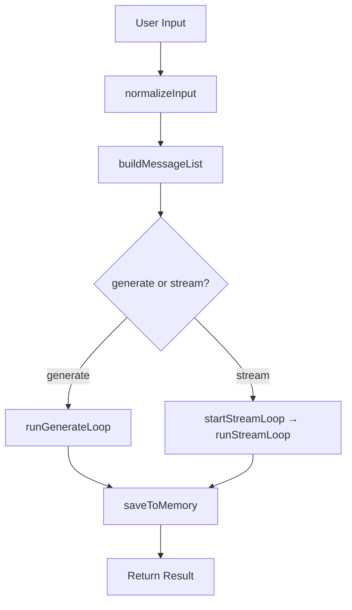
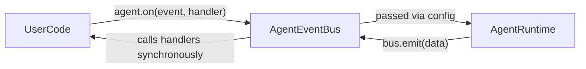
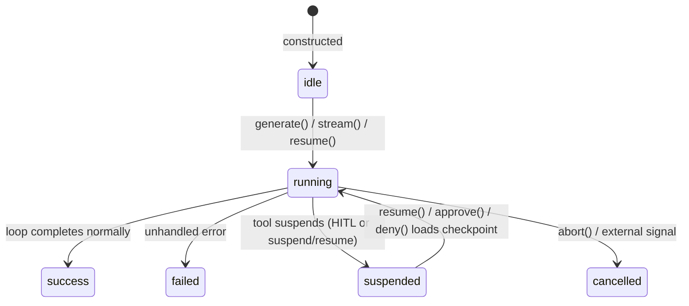
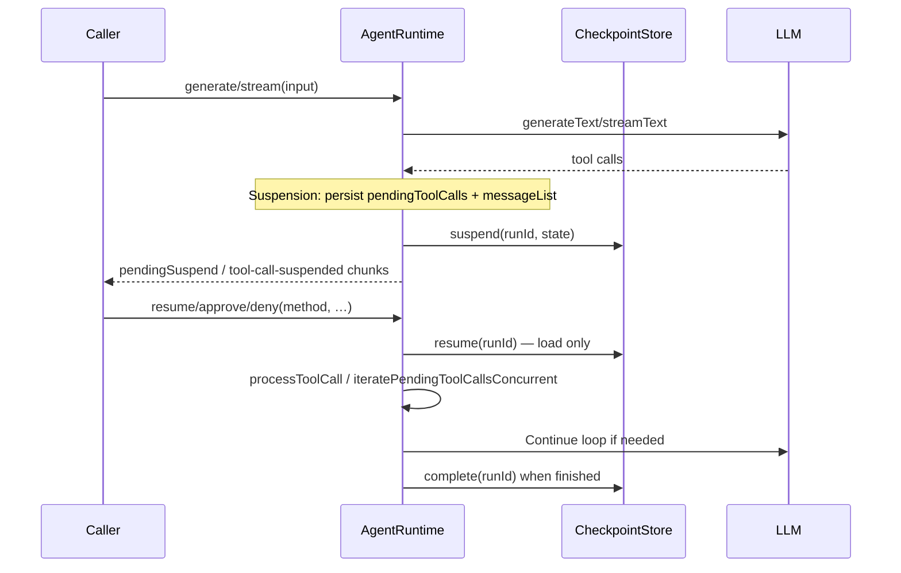

# Agent Runtime Architecture

This document describes the internal architecture of the `@n8n/agents` agent
runtime — the execution engine that drives a single agent turn from input to
final response.

---

## Overview

`AgentRuntime` (`src/runtime/agent-runtime.ts`) is the core execution engine
for a single agent turn. It uses the Vercel AI SDK directly (`generateText` /
`streamText`) and is responsible for:

- Building the LLM message context (memory history, semantic recall, working
  memory in the system prompt, user input)
- Stripping orphaned tool-call/tool-result pairs before LLM calls
  (`stripOrphanedToolMessages`)
- Running the agentic tool-call loop (default **20** iterations,
  `MAX_LOOP_ITERATIONS`)
- **Configurable tool-call concurrency** — tools in one LLM turn run in batches
  of `toolCallConcurrency` (default `1`; `Infinity` runs all executable calls
  in parallel)
- Suspending and resuming runs for Human-in-the-Loop (HITL) **and** for tools
  that return a branded suspend result (`suspendSchema` / `resumeSchema`)
- Persisting new messages to a memory store at the end of each completed turn,
  optionally saving **embeddings** for semantic recall
- Extracting and persisting **working memory** from assistant output when
  configured
- Optional **structured output** (`Output.object` + Zod), **thinking** /
  reasoning provider options, **title generation**, and **telemetry** (AI SDK
  `experimental_telemetry`)
- **Token usage and cost** (catalog pricing via `getModelCost` / `computeCost`)
- Emitting lifecycle events via `AgentEventBus`
- Tracking run state (`idle` → `running` → `success / failed / suspended / cancelled`)

There are two parallel execution paths — non-streaming (`generate`) and
streaming (`stream`) — that mirror each other in structure.



---

## Public API — BuiltAgent

`Agent` implements `BuiltAgent`, which exposes the full public surface:

| Method | Description |
|--------|-------------|
| `generate(input, options?)` | Non-streaming run; returns `GenerateResult` (errors often surface as `finishReason: 'error'` and `error` instead of throwing) |
| `stream(input, options?)` | Streaming run; returns `StreamResult` with `runId` and `stream` |
| `resume(method, data, options)` | Resume a suspended tool with payload `data`; `options` must include `runId` and `toolCallId` |
| `approve(method, options)` | HITL approval — calls `resume` with `{ approved: true }` |
| `deny(method, options)` | HITL decline — calls `resume` with `{ approved: false }` |
| `on(event, handler)` | Register a lifecycle event handler |
| `abort()` | Cancel the currently running agent |
| `getState()` | Return the latest `SerializableAgentState` snapshot |
| `asTool(description)` | Wrap the agent as a `BuiltTool` for multi-agent composition |

`ExecutionOptions` includes `abortSignal?: AbortSignal`, forwarded into
`AgentEventBus.resetAbort()` so callers can cancel via an external signal as
well as `agent.abort()`.

---

## Event system

### AgentEventBus

`AgentEventBus` (`src/runtime/event-bus.ts`) is the internal publish/subscribe
channel shared between `Agent` (registers handlers via `on()`) and
`AgentRuntime` (emits events during the loop). A single bus instance is created
when the SDK wires the runtime and passed in via `AgentRuntimeConfig`.



Handlers have the signature `(data: AgentEventData) => void` — there is **no**
separate “controls” object; cancellation is done with `agent.abort()` on the
same bus that holds the `AbortController`.

`AgentMiddleware` in `types/runtime/event.ts` is a small alias type
(`on` mirrors the agent) for future middleware-style composition.

### Event types

| Event | When emitted | Payload |
|-------|----------------|---------|
| `AgentStart` | Start of `initRun`, right after `status: running`; before `ensureModelCost` / `buildMessageList` | — |
| `AgentEnd` | Successful completion after persistence / cleanup; payload is assistant-facing messages (`finalized.messages` in `generate`, `list.responseDelta()` in `stream`) | `{ messages }` |
| `TurnStart` | Top of each loop iteration, before the LLM call | — |
| `TurnEnd` | After tool calls for the iteration are processed; requires an assistant message in the new messages | `{ message, toolResults }` |
| `ToolExecutionStart` | Before `processToolCall` runs the handler | `{ toolCallId, toolName, args }` |
| `ToolExecutionEnd` | After the tool returns, errors, or is satisfied from an existing AI SDK tool-result | `{ toolCallId, toolName, result, isError }` |
| `Error` | Unhandled failures (not user **abort**); also emitted on some stream failures | `{ message, error }` |

---

## abort()

`agent.abort()` synchronously aborts the internal `AbortController`. The
resulting signal is passed to `generateText` / `streamText` as `abortSignal`
so in-flight HTTP cancels promptly. The loop also checks `bus.isAborted` at
batch boundaries.

`AgentEventBus.resetAbort(externalSignal?)` runs at the start of each run: it
replaces the controller and, if `ExecutionOptions.abortSignal` is set, forwards
that signal’s abort to the internal controller.

### Abort behaviour

| Mode | Behaviour on abort |
|------|-------------------|
| `generate` | Catches abort and returns `{ runId, messages, finishReason: 'error', ... }` without emitting `AgentEvent.Error` |
| `stream` | Writes `{ type: 'error', error }` then finishes / closes cleanly |

State becomes `cancelled`. `resetAbort()` supplies a fresh controller per run
so the same `Agent` instance can run again.

---

## getState()

`agent.getState()` returns a shallow copy of `SerializableAgentState`. Before
the first `generate()` / `stream()`, the `Agent` builder returns a minimal idle
state with an empty `messageList` (`messages`, `historyIds`, `inputIds`,
`responseIds` all empty).

### State machine



### AgentRunState values

| Status | Meaning |
|--------|---------|
| `idle` | No run yet (or builder before first lazy build) |
| `running` | Loop in progress |
| `success` | Turn finished and checkpoint cleaned up when applicable |
| `failed` | Unrecoverable error path |
| `suspended` | Awaiting resume (checkpoint stored under `runId`) |
| `cancelled` | Aborted |
| `waiting` | Reserved |

### SerializableAgentState

Important fields (see `types/sdk/agent.ts`):

```typescript
interface SerializableAgentState {
  persistence?: AgentPersistenceOptions; // threadId + resourceId when using memory
  status: AgentRunState;
  messageList: SerializedMessageList;
  resumeData?: AgentResumeData;
  pendingToolCalls: Record<string, PendingToolCall>;
  finishReason?: FinishReason;
  usage?: TokenUsage;
  executionOptions?: PersistedExecutionOptions; // maxIterations only — persisted on suspend
}
```

`PendingToolCall` distinguishes tools already suspended (`suspended: true`,
`suspendPayload`, `resumeSchema`) from calls not yet executed (`suspended:
false`) when a batch stops at the first suspension.

---

## asTool()

`agent.asTool(description)` wraps the agent as a `BuiltTool`. The handler calls
`agent.generate(input, { telemetry: ctx.parentTelemetry })`, collects assistant
text, and returns `{ result: string }`. When the sub-run produces usage,
results are wrapped so the parent runtime can merge **`SubAgentUsage`** and
**`totalCost`** into the parent `GenerateResult` / stream `finish` chunk.

---

## Message types

| Type | Definition | Purpose |
|------|------------|---------|
| `AgentMessage` | `Message \| CustomMessage` | Internal representation; custom messages are UI-facing |
| `ModelMessage` (AI SDK) | Roles wired to the provider | LLM-facing; custom messages never appear here |

**Custom messages** are stripped for the model via `filterLlmMessages()` before
`toAiMessages()`.

`messages.ts` provides `toAiMessages`, `fromAiMessages`, and consumers rely on
`filterLlmMessages` from `sdk/message.ts`.

**Tool results vs model:** optional `BuiltTool.toModelOutput` maps the stored /
event result before building the `tool-result` the LLM sees; `toMessage` still
uses the raw result for custom DB messages.

---

## AgentMessageList

`AgentMessageList` (`src/runtime/message-list.ts`) is the central structure for
one turn. It keeps a single append-only array and **three Sets** for
provenance: history, input, response.

### Sources

| Source | Added by | `turnDelta()` | `responseDelta()` | `forLlm()` |
|--------|----------|---------------|-------------------|------------|
| **history** | `addHistory()` | No | No | Yes (after filters) |
| **input** | `addInput()` | Yes | No | Yes (after filters) |
| **response** | `addResponse()` | Yes | Yes | Yes (after filters) |

### Key methods

```
forLlm(baseInstructions, instructionProviderOptions?)
  → [system + working memory block, ...toAiMessages(filterLlm(stripOrphaned(all)))]
turnDelta()      → input ∪ response messages (memory persistence)
responseDelta()  → response only (user-facing / GenerateResult.messages)
serialize()      → { messages, historyIds, inputIds, responseIds }
deserialize()    → restores all three sets via stable message ids
```

### Serialization

Serialized state stores **message id arrays** per set (`historyIds`,
`inputIds`, `responseIds`), not a single `historyCount`. After a round-trip,
history / input / response classification is fully restored — required for
correct `turnDelta()` after suspend/resume.

`stripOrphanedToolMessages` runs on loaded history and inside `forLlm()` so
incomplete tool pairs do not reach the model.

---

## Agentic loop

Both `runGenerateLoop` and `runStreamLoop` follow the same high-level pattern:
emit `TurnStart`, call the model with `list.forLlm(...)`, append assistant /
tool traffic via `addResponse`, process tool calls through
`iterateToolCallsConcurrent` (batched by `toolCallConcurrency`), handle
suspension / persistence, repeat until finish or max iterations.

### Tool execution and concurrency

- Executable tool calls (non–provider-executed) are processed in windows of size
  `this.concurrency` (`toolCallConcurrency ?? 1`).
- Each window uses `Promise.allSettled` so all tools in the batch settle; a
  suspension in the batch stops **subsequent** batches and records remaining
  calls in `pending` without `suspendPayload`.
- **HITL** and **suspend/resume** flows share the same pending-map machinery;
  `processToolCall` validates JSON Schema or Zod **input** schemas (Ajv / Zod)
  before invoking the handler.

### Loop invariants

1. **Single list** — `addResponse` accumulates assistant, tool, and custom
   messages for the turn.
2. **System prompt** — rebuilt each call via `forLlm`; working memory content
   is injected there, not as separate list rows.
3. **Suspension preserves pending calls** — remaining calls in the batch and
   later calls are recorded for resume.
4. **Max iterations** — default 20 (`MAX_LOOP_ITERATIONS`).
5. **Abort** — checked between batches; signal passed into AI SDK calls.

### Non-streaming vs streaming

| Aspect | `runGenerateLoop` | `runStreamLoop` |
|--------|-------------------|-----------------|
| AI SDK | `generateText()` | `streamText()` |
| Output | `GenerateResult` | `StreamChunk`s via `WritableStream` |
| Errors | Returned on `GenerateResult` (`error`, `finishReason: 'error'`) for many paths | Error chunks + `closeStreamWithError` |
| Suspension | `pendingSuspend` array on `GenerateResult` | `tool-call-suspended` chunks, then `finish` |

---

## HITL and suspend/resume

**HITL (approval):** tools can require approval (`requiresApproval` /
`needsApprovalFn`). The runtime treats approval outcomes like resume data:
`approve()` / `deny()` delegate to `resume()` with `{ approved: true | false }`.

**Programmatic suspend:** tools can return a branded suspend object; the runtime
requires `resumeSchema` (Zod → JSON Schema for clients) and validates
`suspendPayload` when `suspendSchema` is set.



With **concurrency > 1**, multiple tools may suspend in the same turn; the
stream can emit **multiple** `tool-call-suspended` chunks, and `GenerateResult`
can carry **`pendingSuspend`** with multiple entries.

---

## RunStateManager

`RunStateManager` (`src/runtime/run-state.ts`) persists suspended runs through
a **`CheckpointStore`**:

- Default: in-memory `MemoryCheckpointStore` when `checkpointStorage` is
  `'memory'` or omitted.
- Custom: pass a `CheckpointStore` implementation for durability.

`suspend(runId, state)` writes the state. `resume(runId)` **loads** the state
and returns it with `status: 'running'`; it does **not** delete the key.
`complete(runId)` deletes the checkpoint when the run finishes without remaining
suspensions.

### Known limitations

In-memory checkpoints grow until `complete()` runs. Production stores should
implement TTL or eviction as needed.

---

## Memory persistence

At end of turn, `saveToMemory()` uses `list.turnDelta()` and
`saveMessagesToThread`. If **semantic recall** is configured with an embedder
and `memory.saveEmbeddings`, new messages are embedded and stored.

**Working memory:** when configured, the runtime parses `<working_memory>` …
`</working_memory>` regions from assistant text, validates structured JSON if a
schema exists, strips the tags from the visible message, and asynchronously
persists via `memory.saveWorkingMemory`.

**Thread titles:** `titleGeneration` triggers `generateThreadTitle` (fire-and-forget)
after a successful save when persistence and memory are present.

---

## Stream architecture

The streaming path uses a `TransformStream`: `startStreamLoop` returns the
readable side immediately; the loop writes chunks in the background.

`stream.ts` **`convertChunk`** maps AI SDK v6 `TextStreamPart` values to our
`StreamChunk` union (including `finish-step` / `finish` consolidation).

### StreamChunk types (representative)

| Type | Content |
|------|---------|
| `text-delta` | Incremental text |
| `reasoning-delta` | Thinking / reasoning text |
| `tool-call-delta` | Streaming tool name / arguments |
| `message` | Full assistant or tool message |
| `tool-call-suspended` | Suspension: `runId`, `toolCallId`, tool metadata, optional `resumeSchema`, `suspendPayload` |
| `finish` | `finishReason`, `usage` (with optional **cost**), `model`, optional **`structuredOutput`**, **`subAgentUsage`**, **`totalCost`** |
| `error` | Failure or abort |

---

## File map

```
src/
  runtime/
    agent-runtime.ts              — AgentRuntime (generate/stream/resume loops, HITL, state)
    event-bus.ts                  — AgentEventBus + AbortController
    message-list.ts               — AgentMessageList
    run-state.ts                  — RunStateManager, generateRunId
    memory-store.ts               — saveMessagesToThread helper
    messages.ts                   — AI SDK message conversion
    model-factory.ts              — createModel / createEmbeddingModel
    tool-adapter.ts               — buildToolMap, executeTool, toAiSdkTools, suspend / agent-result guards
    stream.ts                     — convertChunk, toTokenUsage
    runtime-helpers.ts            — normalizeInput, usage merge, stream error helpers, …
    working-memory.ts             — instruction text, parse/filter for working_memory tags
    strip-orphaned-tool-messages.ts
    title-generation.ts
    logger.ts
  types/
    sdk/agent.ts                  — BuiltAgent, GenerateResult, StreamChunk, SerializableAgentState, …
    sdk/tool.ts, sdk/memory.ts, … — Public SDK contracts
    runtime/event.ts              — AgentEvent enum + AgentEventData
    runtime/message-list.ts       — SerializedMessageList
    telemetry.ts                  — BuiltTelemetry shape
```

---

## Design decisions (selected)

### Set-based message list + id serialization

Three Sets plus stable **`id` on each message** allow `turnDelta()` /
`responseDelta()` without losing custom tool messages, and checkpointed runs
restore history vs turn data correctly after resume.

### `responseDelta()` vs `turnDelta()`

User input must not appear in `GenerateResult.messages`; memory persistence
must store the full turn including input — hence two views over the same list.

### Concurrency preserves suspension semantics

Batches run in parallel when configured, but the first suspension still
captures **unexecuted** tool calls in `pending` so nothing is dropped. Approval
tools and programmatic suspends use the same pending-map format.

### Why one event bus per agent

The bus is shared between `Agent` and `AgentRuntime` so `on()` registrations and
`abort()` always target the controller used by the active loop.

### Why `AbortSignal`

Signals cancel HTTP immediately in the AI SDK and compose with caller-provided
`abortSignal` via `resetAbort`.
