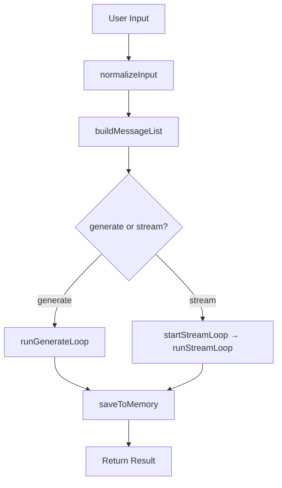
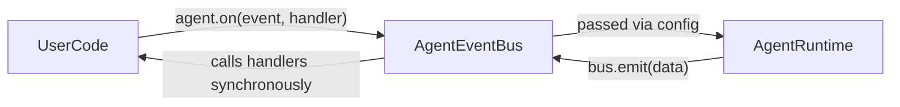
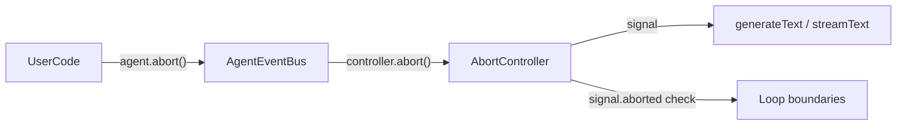
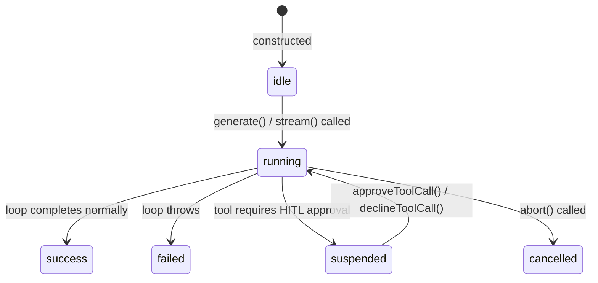
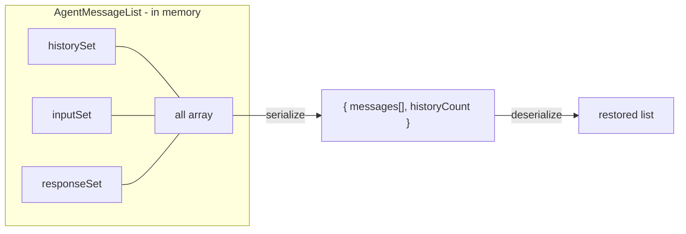
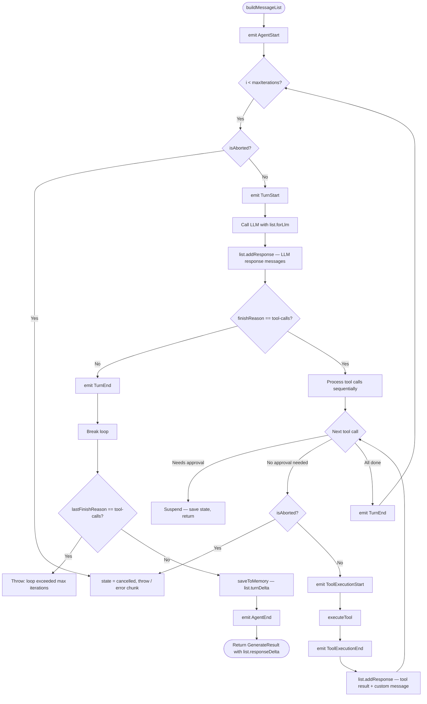
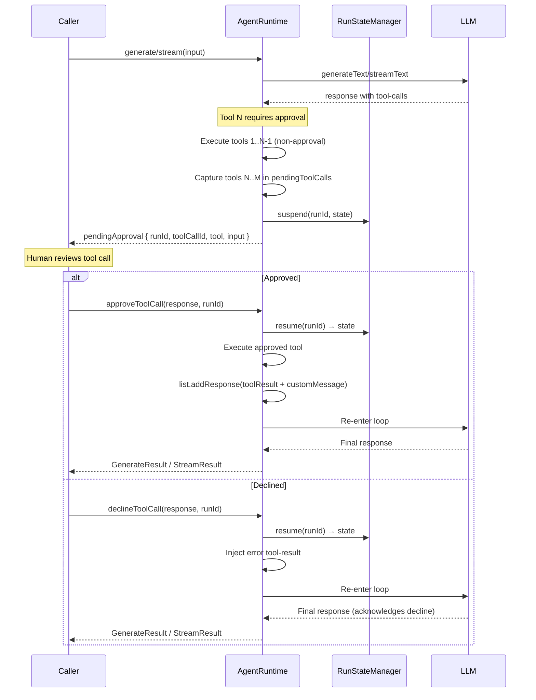
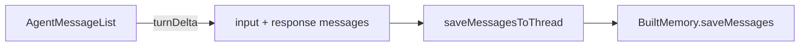
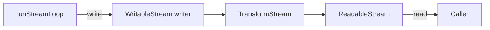

# Agent Runtime Architecture

This document describes the internal architecture of the `@n8n/agents` agent
runtime — the execution engine that drives a single agent turn from input to
final response.

---

## Overview

`AgentRuntime` (`src/runtime/agent-runtime.ts`) is the core execution engine
for a single agent turn. It uses the Vercel AI SDK directly (`generateText` /
`streamText`) and is responsible for:

- Building the LLM message context (memory history + user input)
- Running the agentic tool-call loop (up to 20 iterations)
- Suspending and resuming runs for Human-in-the-Loop (HITL) tool approval
- Persisting new messages to a memory store at the end of each turn
- Emitting lifecycle events via `AgentEventBus`
- Tracking run state (`idle` → `running` → `success / failed / suspended / cancelled`)

There are two parallel execution paths — non-streaming (`generate`) and
streaming (`stream`) — that mirror each other in structure.



---

## Public API — BuiltAgent

`Agent` implements `BuiltAgent`, which exposes the full public surface:

| Method | Description |
|---|---|
| `generate(input, options?)` | Non-streaming run; returns `GenerateResult` |
| `stream(input, options?)` | Streaming run; returns `StreamResult` |
| `on(event, handler)` | Register a lifecycle event handler |
| `abort()` | Cancel the currently running agent |
| `getState()` | Return the latest `SerializableAgentState` snapshot |
| `asTool(description)` | Wrap the agent as a `BuiltTool` for multi-agent composition |
| `approveToolCall(response, runId, toolCallId?)` | Resume a HITL-suspended run after approval |
| `declineToolCall(response, runId, toolCallId?)` | Resume a HITL-suspended run after decline |

---

## Event System

### AgentEventBus

`AgentEventBus` (`src/runtime/event-bus.ts`) is the internal publish/subscribe
channel shared between `Agent` (registers handlers via `on()`) and
`AgentRuntime` (emits events during the loop). A single bus instance is created
at agent construction time and passed into the runtime via config.



The bus constructs an `AgentEventControls` object on each `emit()` call.
Handlers receive both the event data and the controls, so they can call
`controls.abort()` to cancel the run from inside a handler.

### Event Types

| Event | When emitted | Payload |
|---|---|---|
| `AgentStart` | Before `buildMessageList` in `generate()` / `stream()` | — |
| `AgentEnd` | After `saveToMemory`, before returning result | `{ messages }` |
| `TurnStart` | Top of each loop iteration, before LLM call | — |
| `TurnEnd` | After all tool calls in one iteration are processed | `{ message, toolResults }` |
| `ToolExecutionStart` | Before `executeTool()` | `{ toolCallId, toolName, args }` |
| `ToolExecutionEnd` | After `executeTool()` returns or throws | `{ toolCallId, toolName, result, isError }` |
| `Error` | When the loop throws or is cancelled | `{ message, error }` |

### AgentEventControls

Each handler receives controls alongside the event data:

```typescript
interface AgentEventControls {
  abort(params?: unknown): Promise<void>;  // sets abort flag on the bus
  pause(params?: unknown): Promise<void>;  // not yet supported
}
```

Calling `controls.abort()` is equivalent to calling `agent.abort()` — both
set the same flag on the shared `AgentEventBus`.

### Usage Example

```typescript
const agent = new Agent('assistant')
  .model('openai/gpt-4o-mini')
  .instructions('...');

agent.on(AgentEvent.ToolExecutionStart, (data) => {
  console.log(`Running tool: ${data.toolName}`, data.args);
});

agent.on(AgentEvent.TurnEnd, (data) => {
  console.log('Turn complete:', data.message);
});
```

---

## abort()

`agent.abort()` cancels the currently running agent. The call is synchronous —
it triggers the underlying `AbortController`, which the AI SDK uses to cancel
the in-flight HTTP request immediately rather than waiting for the current LLM
call to finish.

### Mechanism

`AgentEventBus` owns an `AbortController`. `agent.abort()` calls
`controller.abort()`. The resulting `AbortSignal` is:

1. **Passed to `generateText` / `streamText`** as `abortSignal` — the AI SDK
   cancels the HTTP fetch immediately when the signal fires.
2. **Checked at loop boundaries** as a fast-path — before each LLM call and
   after each tool execution — so abort is also detected between async
   operations even if no HTTP call is in progress.



### Abort Checkpoints in the Loop

| Where | How abort is detected |
|---|---|
| Before each LLM call | `if (bus.isAborted)` — fast-path |
| During LLM call | `AbortSignal` cancels the HTTP fetch; AI SDK throws |
| After each tool execution | `if (bus.isAborted)` — fast-path |
| Mid-stream iteration | `for await` throws when signal fires; caught and handled |

### Abort Behaviour

| Mode | Behaviour on abort |
|---|---|
| `generate` | Throws `Error('Agent run was aborted')` |
| `stream` | Writes `{ type: 'error', error }` chunk then `{ type: 'finish' }`, then closes the stream cleanly |

In both modes, state transitions to `cancelled`. `AgentEvent.Error` is **not**
emitted for aborts (to distinguish intentional cancellation from unexpected
failures).

### Reusability

`resetAbort()` creates a fresh `AbortController` at the start of each
`generate()` / `stream()` call. Since `AbortController` is one-shot (once
aborted it cannot be reset), a new one is required for each run. This keeps
the same agent instance reusable after cancellation.

---

## getState()

`agent.getState()` returns a snapshot of the latest `SerializableAgentState`.
The runtime updates `currentState` at every status transition.

### State Machine



### AgentRunState Values

| Status | Meaning |
|---|---|
| `idle` | Agent has not run yet |
| `running` | Loop is in progress |
| `success` | Loop completed and memory saved |
| `failed` | Loop threw an unhandled error |
| `suspended` | Paused awaiting HITL tool approval |
| `cancelled` | Cancelled via `abort()` |
| `waiting` | Reserved for future use |

### SerializableAgentState

```typescript
interface SerializableAgentState {
  resourceId: string;
  threadId: string;
  status: AgentRunState;
  messageList: SerializedMessageList;  // { messages, historyCount }
  pendingToolCalls: Record<string, PendingToolCall>;
  usage?: TokenUsage;
}
```

Before the agent runs, `getState()` returns a minimal state with
`status: 'idle'` and an empty `messageList`. No runtime is built until the
first `generate()` / `stream()` call.

---

## asTool()

`agent.asTool(description)` wraps the agent as a `BuiltTool` that another
agent can call. This enables multi-agent composition — a coordinator agent can
delegate to specialist sub-agents as if they were regular tools.

```typescript
const specialist = new Agent('specialist')
  .model('openai/gpt-4o-mini')
  .instructions('You are a specialist.');

const coordinator = new Agent('coordinator')
  .model('openai/gpt-4o-mini')
  .instructions('Route tasks to specialists.')
  .tool(specialist.asTool('A specialist for complex questions'));
```

### Tool Contract

| Property | Value |
|---|---|
| Name | The agent's `name` |
| Description | The `description` argument |
| Input schema | `z.object({ input: z.string() })` |
| Handler | Calls `agent.generate(input)`, extracts assistant text, returns `{ result: string }` |

---

## Message Types

There are two distinct message flavours in this codebase:

| Type | Definition | Purpose |
|---|---|---|
| `AgentMessage` | `Message \| CustomMessage` | Internal representation. Can carry a `type: 'custom'` payload for UI-only data |
| `ModelMessage` (AI SDK) | `UserMessage \| AssistantMessage \| ToolMessage \| SystemMessage` | Wire format for the LLM. Custom messages do not exist here |

**Custom messages** have `type: 'custom'`. They are injected by tools (via
`BuiltTool.toMessage()`) to carry structured display data back to the UI (e.g.
an image preview, a diff view). They are stored in memory and surfaced to
consumers but are **never sent to the LLM**.

`filterLlmMessages()` strips custom messages before any LLM call.

Conversion between the two formats is handled by `messages.ts`:

| Function | Direction |
|---|---|
| `toAiMessages()` | `AgentMessage[]` → `ModelMessage[]` |
| `fromAiMessages()` | `ModelMessage[]` → `AgentMessage[]` |
| `filterLlmMessages()` | `AgentMessage[]` → `Message[]` (custom stripped) |

---

## AgentMessageList

`AgentMessageList` (`src/runtime/message-list.ts`) is the central data
structure for a single agent turn. It holds one flat append-only array and uses
**Sets of object references** to track each message's provenance.

### Three Named Sources

| Source | Added by | Included in `turnDelta()` | Included in `responseDelta()` | Included in `forLlm()` |
|---|---|---|---|---|
| **history** | `addHistory()` — memory messages from previous turns | No (already persisted) | No | Yes (filtered) |
| **input** | `addInput()` — caller's raw input for this turn | Yes | No | Yes (filtered) |
| **response** | `addResponse()` — LLM replies, tool results, custom tool messages | Yes | Yes | Yes (filtered) |

### Key Methods

```
forLlm(systemInstruction)   → [system, ...filtered(all)]     — for generateText/streamText
turnDelta()                  → [input ∪ response]              — for memory persistence
responseDelta()              → [response only]                 — for GenerateResult.messages
serialize()                  → { messages, historyCount }      — for checkpoint storage
AgentMessageList.deserialize(data) → restored list             — on resume
```

### Serialization

The list serializes as a flat array plus a `historyCount` integer. Because the
array is append-only and history is always added first, positional
reconstruction is unambiguous without message IDs. After deserialization the
input/response distinction is lost — both merge into `responseSet` — but this
is correct because both belong to the turn delta that memory needs.



---

## The Agentic Loop

Both `runGenerateLoop` and `runStreamLoop` follow the same pattern:



### Loop Invariants

1. **Single message list** — the loop mutates one `AgentMessageList` via
   `addResponse()`. No parallel arrays.
2. **System prompt not stored** — `list.forLlm(instructions)` prepends the
   system prompt fresh at every LLM call. It is never in the list itself.
3. **Sequential tool execution** — tool calls within a single LLM response are
   processed left-to-right. Non-approval tools execute immediately; the first
   approval tool suspends the run.
4. **Max iterations guard** — the loop runs at most `maxIterations` times
   (default 20).
5. **Abort is checked eagerly** — `signal.aborted` is tested before each LLM
   call and after each tool execution. Mid-LLM abort is handled by the
   `AbortSignal` propagated to `generateText` / `streamText`, which cancels
   the in-flight HTTP request immediately.

### Non-Streaming vs Streaming

| Aspect | `runGenerateLoop` | `runStreamLoop` |
|---|---|---|
| AI SDK call | `generateText()` | `streamText()` |
| Output | Returns `GenerateResult` | Writes `StreamChunk`s to a `WritableStream` |
| Stream setup | N/A | `startStreamLoop()` creates a `TransformStream`, runs the loop in background |
| Error handling | Throws directly | Calls `writer.abort(error)` (swallows double-abort) |
| Abort output | Throws `Error('Agent run was aborted')` | Writes `{ type: 'error' }` chunk then closes |
| Memory save | `saveToMemory()` then return | `saveToMemory()` in a `try/finally` block around `writer.close()` |

---

## HITL Tool Approval Flow

When a tool is flagged as requiring human approval
(`BuiltTool.requiresApproval()`):



### Suspension Details

1. **All remaining tool calls are captured.** When tool N in a batch of M tool
   calls requires approval, tools 1..N-1 have already executed, and tools
   N..M are all saved in `pendingToolCalls`. This prevents silently losing
   tool calls that the LLM issued after the blocking one.

2. **State serialization.** The full `AgentMessageList` is serialized via
   `list.serialize()` into `SerializableAgentState.messageList`. On resume,
   `AgentMessageList.deserialize()` reconstructs the list and the loop
   continues from where it left off.

3. **Custom tool messages survive.** The approved tool's `toMessage()` output
   is added to the list via `addResponse()` both in the initial loop and in
   `approveToolCall()`, so custom messages are never lost across
   suspend/resume cycles.

---

## RunStateManager

`RunStateManager` (`src/runtime/run-state.ts`) manages the lifecycle of
suspended agent runs.

### Storage Layers

```
┌──────────────┐     ┌─────────────────┐
│   inFlight   │ ──► │ CheckpointStore  │  (optional, durable)
│  (Map, sync) │     │ (async, extern)  │
└──────────────┘     └─────────────────┘
```

- **`inFlight` Map** — same-process lookup. Synchronous reads prevent TOCTOU
  races within a single process.
- **`CheckpointStore`** — optional external store for durable persistence
  across process restarts. Implementations must provide atomic
  compare-and-delete for multi-process safety.

### Suspend / Resume Contract

| Operation | Behaviour |
|---|---|
| `suspend(runId, state)` | Shallow-copies the state with `status: 'suspended'`, stores in both `inFlight` and `CheckpointStore` |
| `resume(runId)` | Loads from `inFlight` (or falls back to `CheckpointStore`), removes from `inFlight`, best-effort deletes from store, returns state with `status: 'running'` |
| `generateRunId()` | Returns `run_<crypto.randomUUID()>` — safe across process restarts |

### Known Limitations

- **Stale state cleanup.** Suspended runs that are never resumed accumulate in
  `inFlight` indefinitely. A TTL-based eviction mechanism is not yet
  implemented.
- **Multi-process TOCTOU.** The `load` → `delete` sequence on an external
  store is not atomic. Two concurrent resume calls can both receive the same
  state. The `CheckpointStore` interface documents that implementations must
  provide atomic compare-and-delete for distributed use.

---

## Memory Persistence

Memory stores the **full turn delta** (user input + LLM responses + tool
results + custom messages) at the end of each completed turn.



- `saveToMemory()` calls `list.turnDelta()` to get all non-history messages
  from this turn, then delegates to `saveMessagesToThread()` which ensures the
  thread exists before saving.
- Memory is saved **after** the loop completes but **before** the stream
  closes — consumers see `done=true` only after persistence is guaranteed.
- In the streaming path, `writer.close()` is in a `finally` block to ensure
  the stream closes even if `saveToMemory()` throws.

---

## Stream Architecture

The streaming path uses a `TransformStream` to decouple the async loop from
the consumer:



`startStreamLoop()` returns the readable side immediately. The loop runs in
the background and writes `StreamChunk`s to the writable side. Error handling:

- If the loop throws, `writer.abort(error)` signals the consumer. A nested
  `.catch()` swallows the abort-after-close case.
- If `saveToMemory()` throws after the finish chunk is written,
  `writer.close()` still executes via `finally`.

### StreamChunk Types

| Type | Content |
|---|---|
| `text-delta` | Incremental text from the LLM |
| `reasoning-delta` | Thinking/reasoning text (for reasoning models) |
| `tool-call-delta` | Streaming tool call arguments |
| `message` | Complete message (tool-call, tool-result, or custom) |
| `tool-call-approval` | Suspension event — contains `runId`, `toolCallId`, `tool`, `input` |
| `finish` | End-of-stream — contains `finishReason` and optional `usage` |
| `error` | Error event — emitted on abort or unhandled loop error |

---

## File Map

```
src/
  runtime/
    agent-runtime.ts   — AgentRuntime class (generate + stream loops, HITL approval, events, state)
    event-bus.ts       — AgentEventBus (on/emit/abort, shared between Agent and AgentRuntime)
    message-list.ts    — AgentMessageList (Set-based message tracking)
    run-state.ts       — RunStateManager (suspend/resume checkpoint storage)
    memory-store.ts    — InMemoryMemory + saveMessagesToThread helper
    messages.ts        — toAiMessages / fromAiMessages / filterLlmMessages
    model-factory.ts   — createModel (maps model string to AI SDK provider)
    tool-adapter.ts    — buildToolMap, executeTool, needsApproval, toAiSdkTools
    stream.ts          — convertChunk, toTokenUsage, createStreamTransformer
  types/
    agent.ts           — BuiltAgent, SerializableAgentState, GenerateResult, RunOptions, etc.
    event.ts           — AgentEvent, AgentEventData, AgentEventControls, AgentEventHandler
    tool.ts            — BuiltTool, ToolContext
    memory.ts          — BuiltMemory, CheckpointStore, Thread
    stream.ts          — StreamChunk, TokenUsage, FinishReason
```

---

## Key Design Decisions

### Why Set-based tracking instead of array indices

The previous design used two parallel arrays (`messages` and
`accumulatedMessages`) that diverged because `filterLlmMessages` stripped
custom messages from the LLM context. Custom messages emitted by tools were
pushed only into `accumulatedMessages`, so they could be lost if the run
suspended and resumed between emission and the final memory save.

`AgentMessageList` solves this with one flat array and three Sets. Every
message is always in the array (so `forLlm()` sees it after filtering), and
its provenance is tracked by Set membership. `turnDelta()` and
`responseDelta()` are just filtered views — no data can be silently lost.

### Why `responseDelta()` exists separately from `turnDelta()`

`GenerateResult.messages` should contain only LLM-produced messages — not the
user's input echoed back. `responseDelta()` returns only `responseSet`
messages. `turnDelta()` returns both `inputSet` and `responseSet` and is used
exclusively for memory persistence where the full turn must be saved.

### Why tools execute sequentially within a batch

When the LLM returns multiple tool calls in one response, they are processed
left-to-right. This preserves the existing behaviour where non-approval tools
auto-execute before an approval tool causes suspension. All remaining tool
calls (from the first approval tool onward) are captured in `pendingToolCalls`
to prevent silent data loss.

### Why the event bus is shared — not created per-call

A single `AgentEventBus` instance is created when the `Agent` is constructed
and passed into the `AgentRuntime` at build time. This means handlers
registered via `agent.on()` before the first call work correctly, and
`agent.abort()` can reference the same bus that the running loop holds. If the
bus were re-created per `generate()` / `stream()` call, pre-registered handlers
and external abort calls would target a different object than the one driving
the loop.

### Why abort uses AbortSignal rather than a plain boolean flag

Abort is implemented via `AbortController` / `AbortSignal` rather than a
boolean for two reasons:

1. **Immediate HTTP cancellation.** Passing the signal to `generateText` /
   `streamText` lets the AI SDK cancel the underlying fetch as soon as
   `abort()` is called, without waiting for the current LLM response to
   complete. A boolean flag can only be checked at explicit checkpoints
   *between* async calls, so the in-flight request would always run to
   completion even after the caller requested cancellation.

2. **Standard interop.** `AbortSignal` is the platform standard for
   cooperative cancellation. Any code that accepts an `AbortSignal` (fetch,
   AI SDK, future utilities) composes naturally.

The loop still checks `signal.aborted` at boundaries (before each LLM call,
after each tool) as a fast-path for the case where abort is called while no
HTTP request is active.
