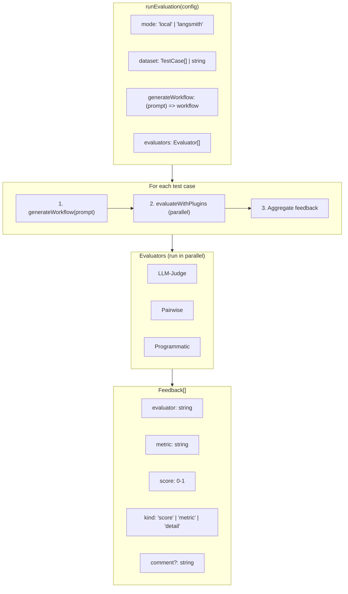

# Evaluations (v2 harness)

Internal evaluation harness for the AI Workflow Builder. Supports local CLI runs and LangSmith-backed runs, using the same evaluators.

## Quick Start

Run from the package directory:

```bash
pushd packages/@n8n/ai-workflow-builder.ee

# Local: run against default prompts (fixtures/default-prompts.csv)
pnpm eval --verbose

# Local: single prompt
pnpm eval --prompt "Create a workflow that..." --verbose

# Local: custom CSV file
pnpm eval --prompts-csv path/to/prompts.csv --verbose

# Local: pairwise + programmatic
pnpm eval:pairwise --prompt "Create a workflow that..." --dos "Must use Slack" --donts "No HTTP Request node" --verbose

# LangSmith: LLM-judge + programmatic
pnpm eval:langsmith --dataset "workflow-builder-canvas-prompts" --name "my-exp" --concurrency 10 --max-examples 20 --verbose

# LangSmith: pairwise + programmatic
pnpm eval:pairwise:langsmith --dataset "notion-pairwise-workflows" --name "pairwise-exp" --filter "technique:content_generation" --max-examples 50 --verbose

popd
```

## Prerequisites

- **LLM key** (required for generation and any LLM-based evaluators):
  - `N8N_AI_ANTHROPIC_KEY` (see `evaluations/support/environment.ts`)
- **Node definitions** (required for workflow generation, and used by evaluators):
  - `evaluations/.data/nodes.json` (see `evaluations/support/load-nodes.ts`)
  - Optional: `N8N_EVALS_DISABLED_NODES="n8n-nodes-base.httpRequest,..."` to exclude specific nodes from generation.
- **LangSmith** (only for `--backend langsmith` runs):
  - `LANGSMITH_API_KEY`
  - `LANGSMITH_TRACING=true` (the harness sets this in LangSmith mode, but exporting it is fine)
  - Optional: `LANGSMITH_MINIMAL_TRACING=false` to disable trace filtering (useful when debugging traces; default is filtered)

## Mental Model



## Key Concepts

### Evaluator

A function that takes a workflow and returns feedback:

```typescript
interface Evaluator<TContext = EvaluationContext> {
  name: string;
  evaluate(workflow: SimpleWorkflow, ctx: TContext): Promise<Feedback[]>;
}
```

Evaluators are:
- **Independent** - no dependencies between evaluators
- **Parallel** - all evaluators run concurrently
- **Error-tolerant** - if one fails, others continue

### Feedback

The universal output format from all evaluators:

```typescript
interface Feedback {
  evaluator: string; // e.g., "llm-judge", "pairwise"
  metric: string;    // e.g., "functionality", "judge1", "efficiency.nodeCountEfficiency"
  score: number;    // 0.0 to 1.0
  comment?: string; // Optional explanation/violations
  kind: 'score' | 'metric' | 'detail';
}
```

`kind` is used by the harness scoring logic:
- `score`: the evaluator’s single overall score (preferred for scoring)
- `metric`: stable per-category metrics (useful to show, but not necessarily used for scoring if a `score` exists)
- `detail`: verbose/unstable metrics and details (never used for scoring when a `score` is present)

### Lifecycle Hooks

Centralized logging via hooks (not per-evaluator logging):

```typescript
interface EvaluationLifecycle {
  onStart(config): void;
  onExampleStart(index, total, prompt): void;
  onWorkflowGenerated(workflow, durationMs): void;
  onEvaluatorComplete(name, feedback): void;
  onEvaluatorError(name, error): void;
  onExampleComplete(index, result): void;
  onEnd(summary): void;
}
```

### Context

Evaluators receive context from multiple sources:

```
globalContext (from RunConfig.context)
       +
testCase.context (per-test-case overrides)
       +
prompt (always included)
       =
Final context passed to evaluators
```

## Local vs LangSmith Mode

### Local Mode

```typescript
import { createLogger } from './harness/logger';

const logger = createLogger(true); // verbose output

const config: RunConfig = {
  mode: 'local',
  dataset: [
    { prompt: 'Create a workflow...', context: { dos: '...' } },
  ],
  generateWorkflow,
  evaluators: [llmJudge, programmatic],
  lifecycle: createConsoleLifecycle({ verbose: true, logger }),
  logger,
};

await runEvaluation(config);
```

- Processes test cases sequentially (examples), but LLM-bound work is capped via `llmCallLimiter` (see `evaluations/harness/runner.ts`)
- Results logged to console via lifecycle hooks
- The harness returns a `RunSummary`; the CLI decides exit codes

### LangSmith Mode

```typescript
import { createLogger } from './harness/logger';

const logger = createLogger(false); // non-verbose output

const config: RunConfig = {
  mode: 'langsmith',
  dataset: 'my-dataset-name',  // LangSmith dataset
  generateWorkflow,
  evaluators: [llmJudge, programmatic],
  logger,
  langsmithOptions: {
    experimentName: 'experiment-1',
    repetitions: 1,
    concurrency: 4,
  },
};

await runEvaluation(config);
```

If you want *no output* (e.g. unit tests), use `createQuietLifecycle()` (or pass a stub logger) instead of relying on a "silent logger".

**Architecture:** The target function does ALL work (generation + evaluation). The LangSmith evaluator just extracts pre-computed feedback.
The runner flushes pending trace batches before returning, so traces/results reliably show up in LangSmith.

```typescript
// Inside runLangsmith():

// IMPORTANT: Create traceable wrapper ONCE outside the target function
// to avoid context leaking in concurrent scenarios. Pass params explicitly.
const traceableGenerateWorkflow = traceable(
  async (args: { prompt: string; genFn: Function }) => {
    return await args.genFn(args.prompt);
  },
  { name: 'workflow_generation', run_type: 'chain', client: lsClient }
);

const target = async (inputs) => {
  const { prompt } = inputs;
  // Call the pre-created wrapper with explicit params (no closures)
  const workflow = await traceableGenerateWorkflow({
    prompt,
    genFn: generateWorkflow,
  });
  const feedback = await evaluateWithPlugins(workflow, evaluators);
  return { workflow, prompt, feedback };  // Pre-computed!
};

// LangSmith evaluator converts internal `{ evaluator, metric }` into `{ key, score, comment? }`:
const feedbackExtractor = (run) => run.outputs.feedback.map(toLangsmithEvaluationResult);
```

## LangSmith Tracing

- **Do not** wrap the `target` function with `traceable()` — `evaluate()` handles that automatically
- **Do** create `traceable` wrappers **once** outside the target function (not inside concurrent code)
- **Do** pass all parameters explicitly to avoid closure-based context leaking
- **Do** use `getTracingCallbacks()` to bridge traceable context to LangChain calls (pass callbacks to `agent.chat()` or chain's `invoke()`)

## Available Evaluators

### LLM-Judge

Uses an LLM to evaluate workflow quality across multiple dimensions:

```typescript
import { createLLMJudgeEvaluator } from './evaluators';

const evaluator = createLLMJudgeEvaluator(llm, nodeTypes);
```

**Evaluator:** `llm-judge`

**Metrics:** `functionality`, `connections`, `expressions`, `nodeConfiguration`, `efficiency`, `dataFlow`, `maintainability`, `overallScore`

**Context required:** `{ prompt: string }`

### Pairwise

Uses a panel of judges to evaluate against dos/donts criteria:

```typescript
import { createPairwiseEvaluator } from './evaluators';

const evaluator = createPairwiseEvaluator(llm, { numJudges: 3 });
```

**Evaluator:** `pairwise`

**Metrics:**
`pairwise_primary`, `pairwise_diagnostic`, `pairwise_judges_passed`, `pairwise_total_passes`, `pairwise_total_violations`

Additional per-judge details may also be emitted (e.g. `judge1`, `judge2`).

**Context required:** `{ dos?: string, donts?: string }`

### Programmatic

Rule-based checks without LLM calls:

```typescript
import { createProgrammaticEvaluator } from './evaluators';

const evaluator = createProgrammaticEvaluator(nodeTypes);
```

**Evaluator:** `programmatic`

**Metrics:** `overall`, `connections`, `trigger`, `agentPrompt`, `tools`, `fromAi` (optional: `similarity`)

**Context required:** None

## Metric Naming (LangSmith compatibility)

LangSmith metric keys are derived from `Feedback` in `evaluations/harness/feedback.ts`:
- `llm-judge`: **unprefixed** (e.g. `overallScore`, `maintainability.workflowOrganization`)
- `programmatic`: **prefixed** (e.g. `programmatic.trigger`)
- `pairwise`: v1-compatible keys stay **unprefixed** (e.g. `pairwise_primary`); non-v1 details are namespaced (e.g. `pairwise.judge1`)

## CLI Usage

### NPM Scripts

```bash
# Local mode with LLM-judge evaluator
pnpm eval --prompt "Create a workflow..." --verbose

# LangSmith mode (results in LangSmith dashboard)
pnpm eval:langsmith --name "my-experiment" --verbose

# Pairwise mode (local)
pnpm eval:pairwise --prompt "..." --dos "Must use Slack" --donts "No HTTP"

# Pairwise mode with LangSmith
pnpm eval:pairwise:langsmith --name "pairwise-exp" --verbose
```

Notes:
- In `--backend langsmith` mode, the CLI requires `--dataset` and rejects `--prompt`, `--prompts-csv`, and `--test-case`.
- `--output-dir` only applies to local mode (it writes artifacts to disk).

### Common Flags

```bash
--suite <llm-judge|pairwise|programmatic|similarity>
--backend <local|langsmith>   # Or `--langsmith` as a shortcut
--verbose, -v       # Enable verbose output
--name <name>       # Experiment name (LangSmith mode)
--dataset <name>    # LangSmith dataset name
--max-examples <n>  # Limit number of examples to evaluate
--concurrency <n>   # Max concurrent evaluations (default: 5)
--repetitions <n>   # Number of repetitions per example
--test-case <id>    # Run a predefined test case (local)
--prompts-csv <path># Load prompts from CSV (local)
--prompt <text>     # Single prompt for local testing
--dos <text>        # Pairwise: things the workflow should do
--donts <text>      # Pairwise: things the workflow should not do
--output-dir <dir>  # Local mode: write artifacts (one folder per example + summary.json)
--template-examples # Enable template examples feature flag
--webhook-url <url> # Send results to webhook URL on completion (HTTPS only)
--webhook-secret <s> # HMAC-SHA256 secret for webhook authentication (min 16 chars)
```

### CSV Format

`--prompts-csv` supports optional headers. Recognized columns:
- `prompt` (required)
- `id` (optional)
- `dos` / `do` (optional)
- `donts` / `dont` (optional)

Example:

```csv
id,prompt,dos,donts
pw-001,"Create a workflow to sync Gmail to Notion","Must use Notion","No HTTP Request node"
```

### Direct Usage

```bash
# Local mode (default)
tsx evaluations/cli/index.ts --prompt "Create a workflow..." --verbose

# LangSmith mode
tsx evaluations/cli/index.ts --backend langsmith --name "my-experiment" --verbose

# Pairwise mode
tsx evaluations/cli/index.ts --suite pairwise --prompt "..." --dos "Must use Slack"
```

## Components & Where Things Live

This directory is intentionally split by responsibility:

- `evaluations/cli/`: CLI entrypoint and input parsing (`cli/index.ts`, `cli/argument-parser.ts`, `cli/csv-prompt-loader.ts`, `cli/webhook.ts`)
- `evaluations/harness/`: orchestration, scoring, logging, and artifact writing (`harness/runner.ts`, `harness/lifecycle.ts`, `harness/score-calculator.ts`, `harness/output.ts`)
- `evaluations/evaluators/`: evaluator factories used by the harness (LLM-judge, pairwise, programmatic, similarity)
- `evaluations/judge/`: the LLM-judge “engine” (schemas + category evaluators + `judge/workflow-evaluator.ts`)
- `evaluations/langsmith/`: LangSmith-specific helpers (`langsmith/trace-filters.ts`, `langsmith/types.ts`)
- `evaluations/support/`: environment setup, node loading, report generation, and test-case generation
- `evaluations/programmatic/`: programmatic evaluator implementation (TypeScript) + `programmatic/python/` (kept separate)

## Extending

### Adding a new evaluator

Add an evaluator by implementing the `Evaluator` interface and returning `Feedback[]`:
- Put evaluator factories under `evaluations/evaluators/<name>/`
- Make sure you emit at least one `kind: 'score'` item (the harness scoring prefers this)
- If you need custom context, extend via `Evaluator<MyContext>` and validate required fields at runtime (keep the base context cast-free)
- If you want stable LangSmith keys, update `evaluations/harness/feedback.ts`

### Adding a new “runner” (backend)

The harness runner is `evaluations/harness/runner.ts`. Today it supports:
- `mode: 'local'` (local dataset array + optional artifacts)
- `mode: 'langsmith'` (LangSmith dataset or preloaded examples)

To add a new backend, keep evaluators backend-agnostic and extend the runner with a new `RunConfig['mode']` branch.

## File Structure

```
evaluations/
├── __tests__/               # Unit tests
├── cli/                     # CLI entry + arg parsing + CSV loader
├── evaluators/              # Evaluator factories
│   ├── llm-judge/
│   ├── pairwise/
│   ├── programmatic/
│   └── similarity/
├── harness/                 # Runner + lifecycle + scoring + artifacts
├── fixtures/                # Local fixtures (tracked)
│   └── reference-workflows/
├── judge/                   # LLM-judge internals (schemas + judge evaluators)
├── langsmith/               # LangSmith-specific helpers (types + trace filters)
├── programmatic/            # Programmatic evaluation logic
├── support/                 # Environment + node loading + reports + test case gen
├── index.ts                 # Public exports
└── README.md                # This file
```

## Error Handling

The harness uses "skip and continue" error handling:

- If an evaluator throws, it returns error feedback and continues
- If workflow generation fails, the example is marked as error and continues
- Other evaluators still run even if one fails

```typescript
// Error feedback format:
{ evaluator: 'evaluator-name', metric: 'error', score: 0, kind: 'score', comment: 'Error message' }
```

## Testing

From `packages/@n8n/ai-workflow-builder.ee`:

```bash
pnpm test:eval
```

## CI Integration

### Automated Eval Runs

Evaluations run automatically via GitHub Actions:

| Trigger | Reps | Judges | Dataset | When |
|---------|------|--------|---------|------|
| Push to master | 1 | 1 | `workflow-builder-canvas-prompts` | On changes to `ai-workflow-builder.ee/` |
| Scheduled | 3 | 3 | `prompts-v2` | Saturdays 22:00 UTC |
| Minor release | 2 | 3 | `workflow-builder-canvas-prompts` | On `vX.Y.0` releases |
| Manual dispatch | Configurable | Configurable | Configurable | Via GitHub Actions UI |

### Skipping Evals on Merge

To skip eval runs when merging a PR that doesn't affect prompts/AI behavior, use any of:

- **PR label**: Add `no-prompt-changes` label to the PR
- **PR title**: Include `(no-prompt-changes)` in the PR title
- **Commit message**: Include `(no-prompt-changes)` in the merge commit message

### Experiment Naming Convention

LangSmith experiments follow this naming pattern:

| Source | Format | Example |
|--------|--------|---------|
| Branch with ticket | `{TICKET-ID}_{YYYY_MM_DD}` | `AI-1234_2026_01_20` |
| Branch without ticket | `CI_{branch}_{YYYY_MM_DD}` | `CI_master_2026_01_20` |
| Scheduled run | `CI_scheduled_{YYYY_MM_DD}` | `CI_scheduled_2026_01_20` |
| Minor release | `CI_vX.Y_{YYYY_MM_DD}` | `CI_v1.70_2026_01_20` |
| Manual dispatch | `CI_manual_{YYYY_MM_DD}` | `CI_manual_2026_01_20` |

### CI Metadata

All LangSmith experiments include metadata to distinguish CI runs from local development:

```json
{
  "source": "ci",
  "trigger": "push",
  "commitSha": "abc123...",
  "branch": "master",
  "runId": "12345678"
}
```

Local runs show `"source": "local"` with no other CI fields.

### Webhook Notifications

The CLI supports sending evaluation results to a webhook URL when evaluations complete. This enables integrations with Slack, Discord, or custom notification systems.

```bash
pnpm eval:langsmith --dataset "my-dataset" --webhook-url "https://hooks.slack.com/services/..."
```

**Why custom webhooks?**

LangSmith's `evaluate()` function does not provide native webhook support for experiment run notifications. LangSmith offers webhooks via:
- **Trace Rules** — triggered on individual traces, not experiment completions
- **API endpoint webhooks** — for specific API events, but not for `evaluate()` completions
- **API polling** — requires external orchestration to detect when experiments finish

Since none of these approaches support the "notify on experiment completion" use case for the `evaluate()` SDK function, we implemented a custom webhook system that fires after all evaluations complete, sending a summary payload with experiment metadata.

**Payload format:**

```json
{
  "suite": "llm-judge",
  "summary": {
    "totalExamples": 50,
    "passed": 45,
    "failed": 5,
    "errors": 0,
    "averageScore": 0.87
  },
  "evaluatorAverages": {
    "llm-judge": 0.85,
    "programmatic": 0.92
  },
  "totalDurationMs": 120000,
  "metadata": {
    "source": "ci",
    "trigger": "push",
    "runId": "12345678"
  },
  "langsmith": {
    "experimentName": "AI-1234_2026_01_20",
    "experimentId": "48660e0e-0ed5-4e32-9e04-88803d7c161f",
    "datasetId": "b04d1ce8-8e3f-455a-818c-ee2c7e14c458",
    "datasetName": "workflow-builder-canvas-prompts"
  }
}
```

The `langsmith` object (only present in LangSmith mode) contains IDs and names for constructing comparison URLs.

**Security:**
- Only HTTPS URLs are allowed
- Localhost and private/internal IPs are blocked (SSRF prevention)
- DNS resolution validates that hostnames don't resolve to private IPs
- Webhook URLs are masked in logs to protect embedded tokens
- HMAC-SHA256 signature for request authentication (optional but recommended)

#### Webhook Authentication (HMAC Signature)

For production use, authenticate webhook requests using HMAC-SHA256 signatures:

```bash
# Generate a secret (run once, store securely)
openssl rand -hex 32

# Use with the CLI
pnpm eval:langsmith --dataset "my-dataset" \
  --webhook-url "https://your.endpoint/webhook" \
  --webhook-secret "your-64-char-hex-secret"
```

When a secret is provided, requests include:
- `X-Signature-256`: HMAC-SHA256 signature (`sha256=<hex>`)
- `X-Timestamp`: Unix timestamp in milliseconds

**How it works:**

```
Sender:
1. payload = JSON.stringify(body)
2. signatureInput = `${timestamp}.${payload}`
3. signature = HMAC-SHA256(signatureInput, secret)
4. Send with headers: X-Signature-256, X-Timestamp

Receiver:
1. Extract X-Signature-256 and X-Timestamp headers
2. Check timestamp is recent (< 5 minutes old)
3. Recreate: signatureInput = `${timestamp}.${rawBody}`
4. Compute expected = HMAC-SHA256(signatureInput, secret)
5. Compare signatures (timing-safe)
```

**Verifying in an n8n workflow:**

Use a Code node after the Webhook trigger:

```javascript
const crypto = require('crypto');

// Get from webhook input (adjust based on your webhook node config)
const signature = $input.first().json.headers['x-signature-256'];
const timestamp = $input.first().json.headers['x-timestamp'];
const rawBody = $input.first().json.rawBody ?? $input.first().json.body;
const body = typeof rawBody === 'string' ? rawBody : JSON.stringify(rawBody);

// Your secret (use n8n credentials or environment variable)
const secret = $env.WEBHOOK_SECRET;

// Verify timestamp (reject requests older than 5 minutes)
const MAX_AGE_MS = 5 * 60 * 1000;
const age = Date.now() - parseInt(timestamp, 10);
if (!signature || !timestamp) throw new Error('Missing signature headers');
if (age > MAX_AGE_MS) throw new Error('Request too old');

// Compute and compare signature
const payload = `${timestamp}.${body}`;
const expected = 'sha256=' + crypto.createHmac('sha256', secret)
  .update(payload, 'utf8').digest('hex');

if (signature.length !== expected.length || !crypto.timingSafeEqual(Buffer.from(signature), Buffer.from(expected))) {
  throw new Error('Invalid signature');
}

// Valid! Return parsed payload
return [{ json: JSON.parse(body) }];
```

**CI Configuration:**

Add secrets to GitHub:
- `EVALS_WEBHOOK_URL`: Your webhook endpoint
- `EVALS_WEBHOOK_SECRET`: The HMAC secret (64-char hex string)

### Debug Dataset

For faster iteration during development, use a minimal dataset:

```bash
# Use the debug dataset with a single example
pnpm eval:langsmith --dataset "workflow-builder-debug-single" --name "debug-run" --verbose
```

To create your own debug dataset in LangSmith:
1. Go to LangSmith → Datasets
2. Create a new dataset with 1-3 representative examples
3. Use it with `--dataset "your-debug-dataset"`

This is useful for:
- Testing workflow changes quickly
- Debugging evaluator issues
- Validating CI workflow changes locally
