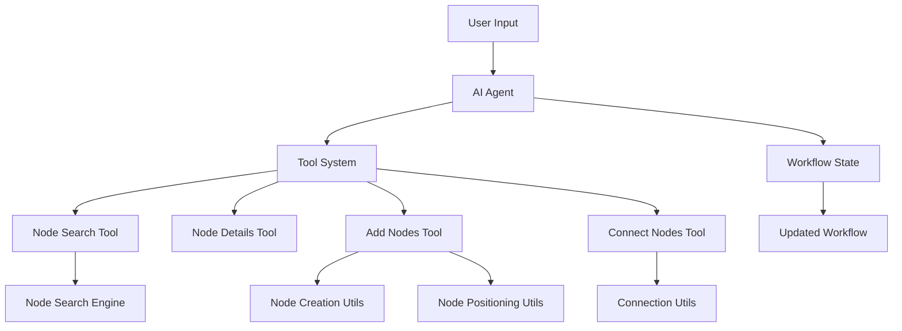
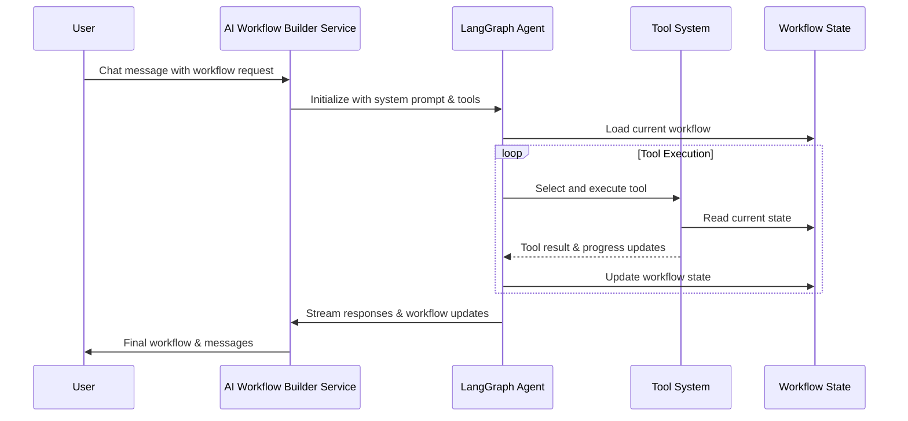

# AI Workflow Builder

AI-powered workflow generation and manipulation service for n8n using LangChain and LangGraph.

## Overview

The AI Workflow Builder enables users to create and modify n8n workflows using natural language. It provides an intelligent agent that can search for nodes, add them to workflows, connect them appropriately, and provide detailed information about node capabilities.

## Architecture

### Core Components



### Data Flow



## Project Structure

```
src/
├── ai-workflow-builder-agent.service.ts  # Main service orchestrating the AI agent
├── workflow-state.ts                      # State management for workflow manipulation
├── llm-config.ts                         # LLM model configurations
├── interfaces.ts                         # Core interfaces
├── tools/                                # Tool implementations
│   ├── base/                            # Base infrastructure for tools
│   │   ├── base-tool.ts                # Abstract base class for all tools
│   │   ├── progress-reporter.ts        # Progress reporting utilities
│   │   ├── response-builder.ts         # Response building utilities
│   │   ├── types.ts                    # Shared types and interfaces
│   │   └── index.ts                    # Barrel export
│   ├── engines/                         # Business logic engines
│   │   └── node-search-engine.ts       # Node searching logic
│   ├── types/                           # Tool-specific types
│   │   └── node.types.ts               # Node-related types and schemas
│   ├── utils/                           # Utility functions
│   │   ├── node-creation.utils.ts      # Node creation helpers
│   │   ├── node-positioning.utils.ts   # Node positioning algorithms
│   │   └── connection.utils.ts         # Connection validation and creation
│   ├── test-utils/                      # Testing utilities
│   │   ├── fixtures.ts                 # Test node type fixtures
│   │   ├── mock-context.ts             # Mock context creation
│   │   └── node-mocks.ts               # Node mocking utilities
│   ├── node-search.tool.ts             # Search for n8n nodes
│   ├── node-details.tool.ts            # Get detailed node information
│   ├── add-node.tool.ts                # Add nodes to workflow
│   └── connect-nodes.tool.ts           # Connect nodes in workflow
└── utils/                               # General utilities
    └── node-helpers.ts                  # Node type checking utilities
```

## Tools

### 1. Node Search Tool (`search_nodes`)

Searches for n8n nodes by name or finds sub-nodes that output specific connection types.

**Features:**
- Name-based search with fuzzy matching
- Sub-node search by connection type
- Batch searching for multiple queries
- Relevance scoring

**Example:**
```typescript
{
  queries: [
    { queryType: "name", query: "http" },
    { queryType: "subNodeSearch", connectionType: "ai_languageModel" }
  ]
}
```

### 2. Node Details Tool (`get_node_details`)

Retrieves detailed information about a specific node type including properties, inputs, and outputs.

**Features:**
- Full node metadata retrieval
- Optional parameter information
- Connection capabilities
- Formatted output for LLM consumption

**Example:**
```typescript
{
  nodeName: "n8n-nodes-base.httpRequest",
  withParameters: false,
  withConnections: true
}
```

### 3. Add Nodes Tool (`add_nodes`)

Adds one or more nodes to the workflow canvas with automatic positioning.

**Features:**
- Batch node creation
- Automatic unique naming
- Smart positioning (main nodes vs sub-nodes)
- Error handling for invalid node types

**Example:**
```typescript
{
  nodes: [
    { nodeType: "n8n-nodes-base.httpRequest", name: "Get API Data" },
    { nodeType: "@n8n/n8n-nodes-langchain.lmChatOpenAi", name: "OpenAI Model" }
  ]
}
```

### 4. Connect Nodes Tool (`connect_nodes`)

Creates connections between nodes with automatic validation and correction.

**Features:**
- Connection validation
- Auto-swap for AI connections (ensures sub-nodes are sources)
- Support for multiple connection types
- Index-based connection for complex nodes

**Example:**
```typescript
{
  sourceNodeId: "node_123",
  targetNodeId: "node_456",
  connectionType: "main",
  sourceOutputIndex: 0,
  targetOutputIndex: 0
}
```

## Key Design Patterns

### 1. Base Tool Infrastructure

All tools extend `BaseWorkflowBuilderTool` which provides:
- Zod schema validation
- Consistent error handling
- Progress reporting
- State management
- LangChain tool creation

```typescript
export abstract class BaseWorkflowBuilderTool<TInput, TOutput> {
  protected abstract schema: z.ZodType;
  protected abstract name: string;
  protected abstract description: string;
  protected abstract execute(
    input: TInput,
    context: ToolContext
  ): Promise<ToolResult<TOutput>>;
}
```

### 2. Progress Reporting

Tools use a progress reporter for real-time updates:

```typescript
const batchReporter = context.reporter.createBatchReporter('Adding nodes');
batchReporter.init(nodes.length);
for (const node of nodes) {
  batchReporter.next(node.name);
  // Process node...
}
batchReporter.complete();
```

### 3. State Management

Workflow state is managed through LangGraph's state system:

```typescript
const WorkflowState = Annotation.Root({
  messages: Annotation<BaseMessage[]>({
    reducer: messagesStateReducer,
    default: () => [],
  }),
  workflowJSON: Annotation<WorkflowJSON>({
    reducer: (x, y) => y ?? x,
    default: () => ({ nodes: [], connections: {} }),
  }),
  // ... other state fields
});
```

## Connection Rules

### Main Connections
- Data flows from source node output to target node input
- Example: `HTTP Request → Set`

### AI Sub-node Connections
- Sub-nodes are ALWAYS the source (provide capabilities)
- Main nodes are ALWAYS the target (consume capabilities)
- Connection types:
  - `ai_languageModel`: LLM providers → AI agents/chains
  - `ai_tool`: Tool nodes → AI agents
  - `ai_memory`: Memory nodes → Conversational nodes
  - `ai_embedding`: Embedding nodes → Vector stores
  - `ai_document`: Document loaders → Processing nodes
  - `ai_textSplitter`: Text splitters → Document processors

## Usage

### Service Initialization

```typescript
const service = new AiWorkflowBuilderService(
  licenseService,
  nodeTypes,
  globalConfig,
  n8nVersion
);
```

### Chat Interaction

```typescript
const stream = service.chat({
  question: "Add an HTTP request node and connect it to OpenAI",
  currentWorkflowJSON: existingWorkflow,
  workflowId: "workflow_123"
}, user);

for await (const chunk of stream) {
  // Handle streaming responses
}
```

## Testing

The package includes comprehensive test coverage:

- Unit tests for all tools
- Integration tests for the service
- Mock utilities for testing
- Fixtures for common node types

Run tests:
```bash
npm test
```

## Configuration

### Environment Variables

- `N8N_AI_OPENAI_API_KEY`: OpenAI API key (when not using proxy)
- `N8N_AI_ANTHROPIC_KEY`: Anthropic API key (when not using proxy)

### LLM Models

The service uses:
- **Simple tasks**: GPT-4.1 mini
- **Complex tasks**: Anthropic Claude Sonnet 4

Models can be configured through the proxy or environment variables.

## Best Practices

1. **Always search before adding**: Use the search tool to verify node types exist
2. **Get node details**: Understand node inputs/outputs before connecting
3. **Batch operations**: Add multiple nodes in one call for efficiency
4. **Let auto-positioning work**: The system handles node placement intelligently
5. **Trust auto-correction**: Connection validation ensures proper data flow

## Contributing

When adding new tools:

1. Extend `BaseWorkflowBuilderTool`
2. Define clear Zod schemas
3. Implement proper error handling
4. Add progress reporting
5. Write comprehensive tests
6. Update this documentation

## License

[Your License Here]