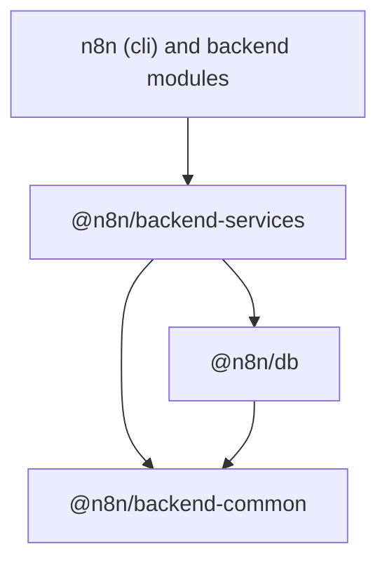

# @n8n/backend-services

Backend services and HTTP error classes that many backend modules share.

## Why this package exists

Backend modules live in `packages/cli/src/modules/<name>` today. Most of them
import a small set of services from the rest of `cli`. A module cannot move
into its own workspace package while those imports point at `@/...` paths in
`cli`.

This package is the home for that shared set. It sits above `@n8n/db` and
below `n8n` (`cli`) in the dependency graph:



`@n8n/backend-common` holds the foundation that `@n8n/db` also needs (logger,
license state, module registry, locks). `@n8n/backend-services` holds business
and infrastructure services that need the persistence layer or that only
`cli` and the modules consume.

## What lives here

| Export | Purpose |
| --- | --- |
| `ResponseError` and its subclasses (`BadRequestError`, `NotFoundError`, `ForbiddenError`, ...) | Errors that map to an HTTP status code in a REST response |
| `UrlService` | Instance, editor and webhook base URLs from `GlobalConfig` |
| `CacheService` | Memory or Redis cache with hash support |
| `RedisClientService` | Redis client factory with reconnect handling |
| `ProtectedResourceRegistry` | Registry of OAuth 2.1 protected resources served by the instance |
| `EventService` and `EventMap` | Typed event bus. See [Events](#events) |
| `RoleService`, `RoleCacheService`, `RoleDeletionCheckProxy` | Role and scope resolution |
| `userHasScopes`, `ProjectScopeService` | Scope checks behind `@GlobalScope` and `@ProjectScope` |
| `ScopedResourceResolverRegistry` | Lets a module report which project owns a resource that `@ProjectScope` checks |
| `WorkflowFinderService`, `CredentialsFinderService`, `FolderFinderService` | Scope-aware lookups of workflows, credentials and folders |

## Events

`EventService` extends `TypedEmitter<EventMap>`. This package declares only
the events that its own services emit. Every other owner adds its events to
the same interface:

```ts
declare module '@n8n/backend-services' {
	interface EventMap {
		'my-feature-enabled': { userId: string };
	}
}
```

`cli` does this in `packages/cli/src/events/event-map.ts`. A backend module
in its own package will do the same for its events.

## Rules for adding code

- The code must not import from `n8n` (`cli`). If it needs a `cli` seam,
  define a narrow DI port here and bind it in `cli` at bootstrap.
- At least two backend modules must use the code. A service that one module
  uses belongs to that module.
- Keep the file layout of `cli` (`errors/`, `services/`). A move with `git mv`
  keeps the history readable.
- Add each new export to `src/index.ts`. Consumers import from the package
  root only.
