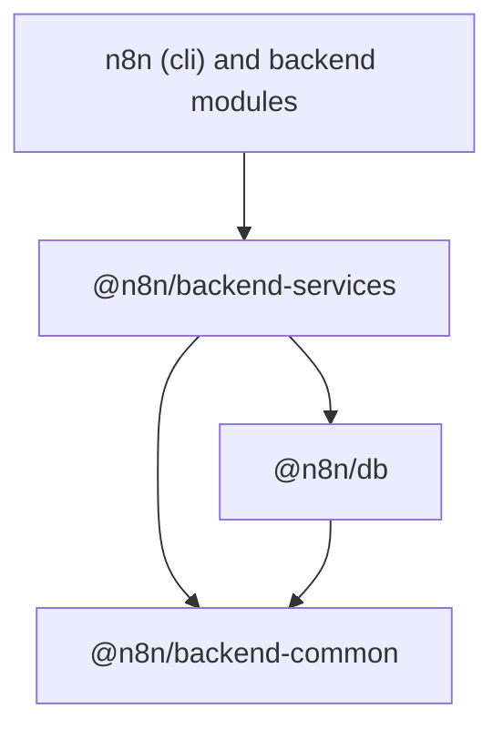

# @n8n/backend-services

Backend services and HTTP error classes that many backend modules share.

## Why this package exists

Backend modules live in `packages/cli/src/modules/<name>` today. Most of them
import a small set of services from the rest of `cli`. A module cannot move
into its own workspace package while those imports point at `@/...` paths in
`cli`.

This package is the home for that shared set. It sits above `@n8n/db` and
below `n8n` (`cli`) in the dependency graph:

`@n8n/backend-common` holds the foundation that `@n8n/db` also needs (logger,
license state, module registry, locks). `@n8n/backend-services` holds business
and infrastructure services that need the persistence layer or that only
`cli` and the modules consume.

## What lives here

Nothing yet. The next PRs move the response errors, `UrlService`, `CacheService`,
`RedisClientService`, `ProtectedResourceRegistry`, `EventService`, `RoleService`,
the finder services and the scope checks here, one area at a time.

## Compatibility with cli

The package config mirrors `packages/cli`, so a file moved from `cli` compiles,
lints and tests here without edits:

| Concern | Setup | Mirrors |
| --- | --- | --- |
| TypeScript | `common.go` + `backend.go`, `lib` es2023, `strictFunctionTypes`, `strictPropertyInitialization` and `useUnknownInCatchVariables` off | `packages/cli/tsconfig.json` |
| Lint | `oxlint --type-aware`, then the ESLint guardrails pass. `eslint.config.mjs` is the policy twin that code-health and the guardrails read | `packages/cli/oxlint.config.mts`, `eslint.guardrails.config.mjs` |
| Tests | Vitest with the decorators config, one fork per file, the same `N8N_USER_FOLDER` and `N8N_ENCRYPTION_KEY` setup | `packages/cli/vitest.config.base.ts`, `test/setup-test-folder.ts` |

Two things do not carry over on purpose:

- There is no `@/` path alias. Vitest inlines this package from `src/` in
  every consumer, and an alias would not resolve there. Use relative imports
  inside the package.
- `cli` turns a set of rules down to `warn` for its whole tree. This package
  keeps the shared backend layer as is. Fix such findings when you move a file.

## Rules for adding code

- The code must not import from `n8n` (`cli`). If it needs a `cli` seam,
  define a narrow DI port here and bind it in `cli` at bootstrap.
- At least two backend modules must use the code. A service that one module
  uses belongs to that module.
- Keep the file layout of `cli` (`errors/`, `services/`). A move with `git mv`
  keeps the history readable.
- Add each new export to `src/index.ts`. Consumers import from the package
  root only.
- Keep `oxlint.config.mts` and `eslint.config.mjs` in step. A ratchet
  allowlist for a moved TypeORM leak goes into both.
