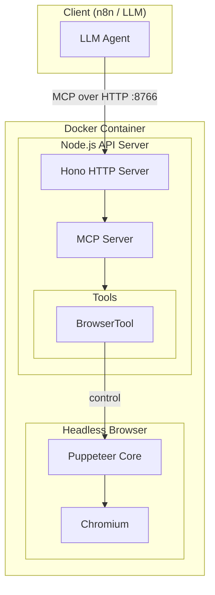
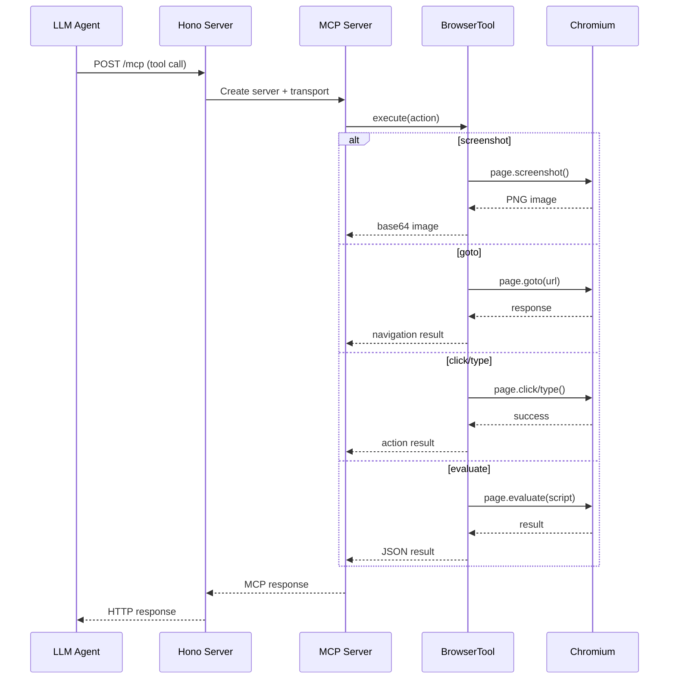

# Browser Use API

MCP server for LLM-driven browser automation. Runs in an isolated Docker container with headless Chromium and Puppeteer.

## Architecture



### Request Flow



## Quick Start

```bash
cd packages/@n8n/browser-use
docker build -t browser-use-api:latest .
docker run -p 8766:8766 -it browser-use-api:latest
```

Or use Docker Compose:

```bash
docker-compose up -d
```

## Endpoints

| Endpoint | Method | Description |
|----------|--------|-------------|
| `/health` | GET | Health check |
| `/mcp` | ALL | MCP Streamable HTTP endpoint |

## Tools

### browser

Browser automation tool with Puppeteer. Supports the following actions:

#### Navigation
- **goto** - Navigate to a URL
- **goBack** - Go back in history
- **goForward** - Go forward in history
- **reload** - Reload current page

#### Interaction
- **click** - Click an element by selector
- **type** - Type text into an element
- **hover** - Hover over an element
- **select** - Select option(s) from a dropdown
- **scroll** - Scroll the page (up/down/left/right)
- **press** - Press a keyboard key

#### Extraction
- **screenshot** - Capture screenshot (viewport, full page, or element)
- **content** - Get page HTML content
- **text** - Get text content of page or element
- **attribute** - Get attribute value of an element
- **evaluate** - Execute JavaScript in page context

#### Wait
- **waitForSelector** - Wait for element to appear
- **waitForNavigation** - Wait for navigation to complete
- **waitForTimeout** - Wait for specified milliseconds

#### Script
- **script** - Execute custom Puppeteer script with access to page and browser objects

## Environment Variables

| Variable | Default | Description |
|----------|---------|-------------|
| `PORT` | 8766 | API server port |
| `HOST` | 0.0.0.0 | Server host binding |
| `PUPPETEER_EXECUTABLE_PATH` | /usr/bin/chromium | Path to Chromium executable |
