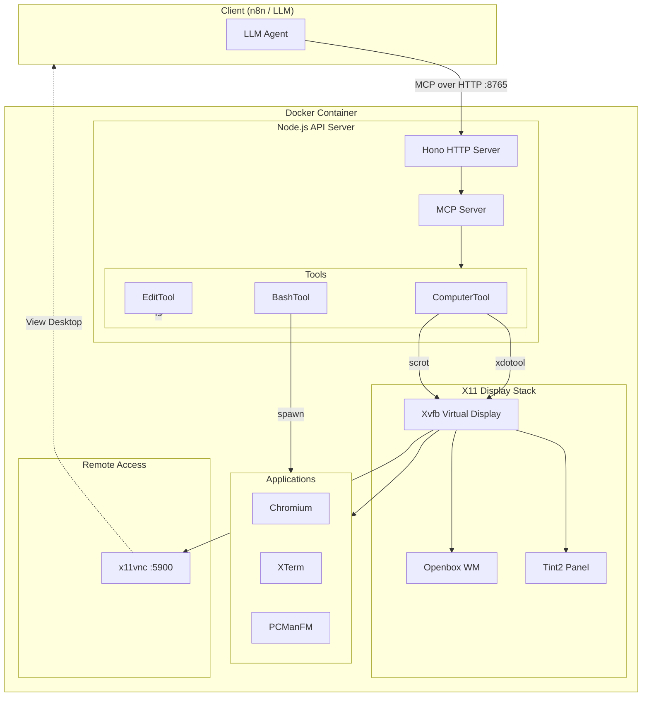
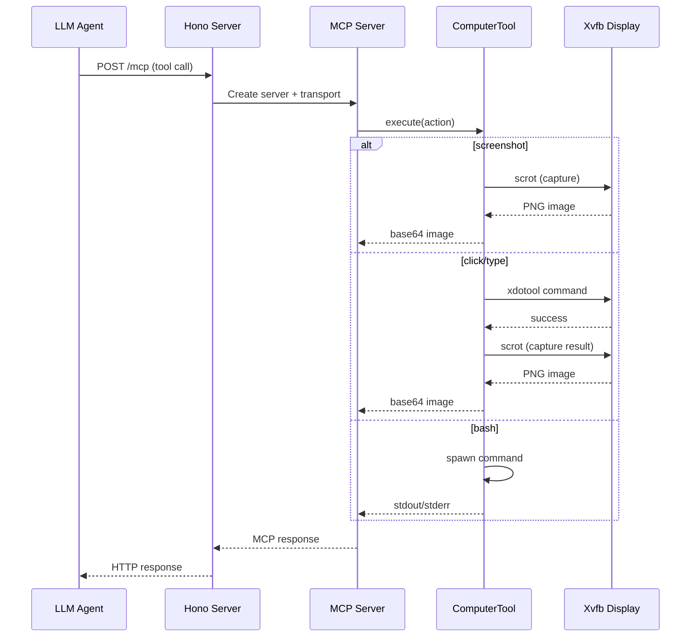

# Computer Use API

MCP server for LLM-driven computer control. Runs in an isolated Docker container with X11 virtual display and Chromium browser.

## Architecture



### Request Flow



## Quick Start

```bash
cd packages/@n8n/computer-use
docker build -t computer-use-api:latest .
docker run -p 8765:8765 -p 5900:5900 -it computer-use-api:latest
```

Or use Docker Compose:

```bash
docker-compose up -d
```

## Endpoints

| Endpoint | Method | Description |
|----------|--------|-------------|
| `/health` | GET | Health check |
| `/mcp` | ALL | MCP Streamable HTTP endpoint |

## Tools

- **computer** - Screen, keyboard, mouse control
- **bash** - Command execution with persistent sessions
- **str_replace_editor** - File viewing and editing

## View Display

Connect with VNC viewer to see what's happening:

```bash
vncviewer localhost:5900
```

## Environment Variables

| Variable | Default | Description |
|----------|---------|-------------|
| `PORT` | 8765 | API server port |
| `WIDTH` | 1280 | Screen width |
| `HEIGHT` | 800 | Screen height |
