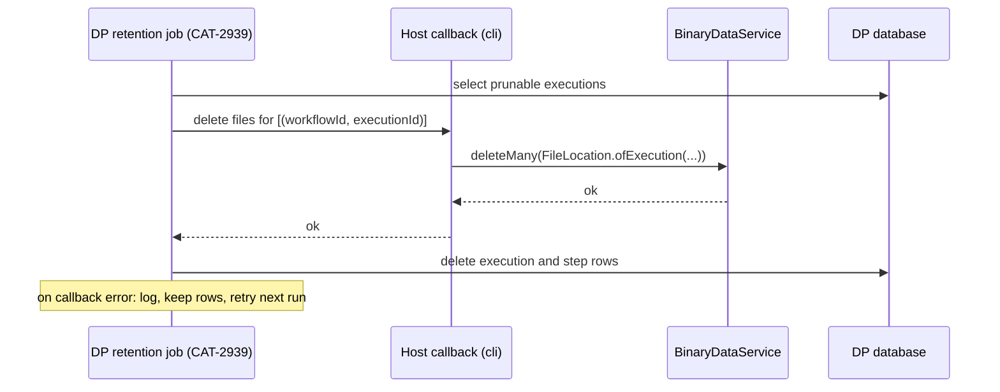

# Delete binary files with the execution that wrote them

Date: 2026-09-25

Status: Active

Decision Owner: Catalysts team

## Context

A node that produces a file writes it to the binary data store at a location that is execution-specific for each run. The location is identified by the pair `(workflowId, executionId)`, and `FileLocation.ofExecution()` in `n8n-core` builds it. In the `filesystem` mode (which is the default) every file produced during a run is stored under one directory named after that pair.

In engine v1, the execution row in the CP database is the reference for deletion. The pruning service soft-deletes old rows. Later, `ExecutionPersistence.hardDelete()` deletes the rows and calls `BinaryDataService.deleteMany()` with the execution locations. The blob manager deletes the directory of each location by prefix. Only the filesystem byte store implements prefix deletion. For `s3` and `azure` the call deletes nothing, and bucket lifecycle rules are the only deletion path.

In engine v2, the DP stores the execution and its steps in its own database and they are not tracked in the CP database. The node-engine-compatibility layer runs a v1 node with the v2 execution id & workflow id under `additionalData`, so a v2 run writes files using the same location pattern as v1, but no job deletes them. The engine package has no pruning code yet: CAT-2939 (execution pruning and retention on the DP) is in Backlog. CAT-4584 and CAT-4721 made the Respond to Webhook node work with binary bodies on v2, so a v2 run in `filesystem` mode would already leave files on disk with no owner.

There are three constraints for the design:
1. The engine package must not import `n8n-core` or `n8n-workflow`. The engine calls host capabilities through `ExternalDependencies`, which today has two optional members: the `v1-node` step executor and the lifecycle event callback.
2. Lifecycle events are best effort. The batching publisher drops a batch that fails or times out, and drops new events past a pending cap. Reliable deletion needs at-least-once delivery, instead.
3. The DP exposes `POST /api/workflow-executions/search`. It takes a workflow filter that accepts all workflows, `createdBefore`, a status list, a cursor and a page limit of 100. The CP has a client method for it, but the endpoint lists executions that exist and does not report executions that were pruned.

The four binary data modes differ.

1. `default` keeps the bytes as base64 inside the items, so on v2 they are inside the step outputs and are deleted with the step rows. Their size is the subject of CAT-4006, CAT-4247 and CAT-3042.
2. `filesystem` needs the writer and the deleter to see the same disk. CAT-4721 already states this for the reader.
3. `s3` and `azure` need the same bucket and credentials on both sides to read a file. Deletion is not affected today, because the call deletes nothing in these modes.
4. `database` stores the bytes in the CP database, so a deleter outside the CP process needs CP database access.

## Decision

1. **Each execution owns its files.** For v2, a binary file only belongs to the execution (no other refs to it), so when the execution is deleted, its files need to be deleted accordingly. There should be no separate per-file bookkeeping.
2. **The DP decides when to delete.** The DP owns the lifetime of a v2 execution, so its retention job (CAT-2939) is the only component that knows when an execution is pruned. The job selects the prunable executions and triggers the (idempotent) deletion of their files before it deletes the rows.
3. **The host performs the deletion.** The DP stays unaware of the store. A new callback is added to `ExternalDependencies`, that receives a list of `(workflowId, executionId)` pairs and deletes the files at those locations. In integrated mode, `packages/cli` implements it with `BinaryDataService.deleteMany()` and `FileLocation.ofExecution()`, the same call the v1 hard delete makes. The callback is optional, since a host that runs no v1 nodes writes no files and can leave it out. Every other host supplies it with a `BinaryDataService` for the store its nodes write to.
4. **At least once, and idempotent.** The job deletes the rows of an execution only after the callback has returned for it. When the callback throws, the job logs the error, keeps the rows, and retries that execution on its next run. A repeat call is safe: prefix deletion in the filesystem byte store removes the directory with `force`, so a missing directory is not an error. This is stricter than v1, which logs a failed hard delete and does not retry the files, because v2 has no CP row to retry from.
5. **Per mode.** `default` needs no call, and the host can return early when the configured mode is `default`. `filesystem` runs the same call as v1 and deletes the directory of the run. `s3` and `azure` run the same call, but it deletes nothing today, so those modes depend on bucket lifecycle rules as in v1. `database` deletes the rows of the run through the database manager. The `database` mode is supported in integrated mode only. An out-of-process DP in `database` mode waits for the decision on binary data access from an out-of-process DP.
6. **Files written before this is implemented** stay in the store until an operator deletes them. Engine v2 is behind a module flag and is in its internal release phase, so no migration or sweep is planned.

## Alternatives Considered

1. **A control plane job that lists old executions through the search endpoint and deletes their files.** This needs no engine change, and the client method exists. It was not chosen because the endpoint lists live executions and cannot name pruned ones. The CP job would need its own retention window, shorter than the DP window, so that it always runs before the DP prunes. Two windows in two configurations must stay aligned, and one missed CP run before a DP prune leaks the files for good. The job would also page through every old execution of every workflow on each run, one hundred at a time, to find the ones it has not handled.
2. **An `execution:pruned` lifecycle event, deleted on receipt by the control plane.** This fits the relay that exists. It is the second choice because the publisher drops batches by design when the host is slow or down. Deletion needs at-least-once delivery, so the event channel would need a durable outbox and acknowledgements first. That is a larger change than one host callback, and it would change the guarantee of every other event. If the event channel becomes durable later, this option can replace the callback without a change to ownership.
3. **The data plane deletes the files with its own store client.** This is rejected because the engine must not depend on `n8n-core`, and a second store implementation would have to track every mode and every byte store.
4. **Bucket lifecycle rules only.** This is rejected because the `filesystem` and `database` modes have no such rule, and `filesystem` is the default install.

## Consequences

1. `ExternalDependencies` will have one optional member. CAT-2939 must call it and order the deletions as described. This decision must be agreed before CAT-2939 is implemented.
2. A slow or failing store slows pruning. An execution whose files cannot be deleted is kept, with its rows, until the store recovers. The job must bound the batch it retries so that one bad execution does not stop the others.
3. An out-of-process DP needs a `BinaryDataService` in its host. That requires the split of `BinaryDataConfig` from `InstanceSettings` and the pending decision on binary data access from an out-of-process DP.
4. Files written by v2 runs before the callback exists are not deleted. This is accepted for the internal release.
5. Files written before an execution exists, for example by a webhook or a trigger that accepts an upload, are addressed under a temporary execution id in v1 and renamed when the row exists. That flow is not covered here and belongs to the ticket that accepts files on v2.
6. The retention note in ADR-20260904 ("Retention is unsolved") stays open for the workflow snapshot. This decision covers binary files only.

## Links

Documentation: https://linear.app/n8n/issue/CAT-4727

Related tickets: https://linear.app/n8n/issue/CAT-2939, https://linear.app/n8n/issue/CAT-4584, https://linear.app/n8n/issue/CAT-4721

Related ADRs: ADR-20260904-store-the-workflow-revision-that-ran-with-the-execution
