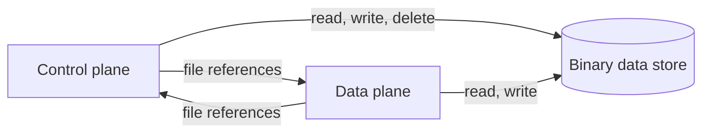

# Share the binary data store between the planes

Date: 2026-10-02

Status: Active

Decision Owner: Catalysts

Source: https://linear.app/n8n/issue/CAT-4824

## Context

Every binary helper that a node uses gets `BinaryDataService` from the dependency container, in
`binary-helper-functions.ts` in `n8n-core`. This works because the data plane (DP) runs in the
control plane (CP) process today. The DP host in its own process is the `n8n engine` command in
`packages/cli`. It has the container, but it never set up the storage managers of its
`BinaryDataService`, so a node on it could not read or write a file.

There are four constraints:

1. The engine package must not import `n8n-core`. Only the node-engine-compatibility layer and the
   host use `BinaryDataService`.
2. `BinaryDataConfig.initialize()` reads the signing secret from the CP database, and only the CP
   commands call it. The constructor itself needs no CP database: `InstanceSettings` generates a
   local key when the process has no encryption key, as `n8n engine` requires. So the DP host can
   create the configuration, but it can never get the CP signing secret.
3. `createBinarySignedUrl()` signs a token with that secret. No node in this repository calls it.
   It is part of `BinaryHelperFunctions` in `n8n-workflow`, so community nodes can call it.
4. The `database` mode stores the bytes in the CP database.

The first version of this ADR took `serve.ts` in the engine package for the DP host. That entry
point runs no v1 nodes, so it needs no store. Decisions 4 and 5 were corrected after the
implementation of CAT-4857 showed this.

## Decision

1. **The planes share the store.** Each process that runs a node has its own `BinaryDataService`,
   configured for the same store. The planes send each other only file references
   (`<mode>:<fileId>`), never file bytes. This is how v1 queue mode works between main and workers.
2. **The supported modes follow from decision 1.** `s3` and `azure` work in every topology, because
   every process can reach the bucket. `filesystem` works when every host mounts the same volume at
   the same path. `database` is supported only when the DP runs in the CP process. A DP host in
   its own process refuses `database` mode at start.
3. **Engine v2 does not sign URLs.** On engine v2, `createBinarySignedUrl()` throws an error that
   says the operation is not supported. This applies in every topology, so the behaviour does not
   change with the deployment model. The method stays in the interface, and v1 keeps it as it is.
   The signing secret is not given to the DP.
4. **The DP host sets up the store at start, without the CP database.** `n8n engine` registers the
   `filesystem`, `s3` and `azure` managers and never calls `BinaryDataConfig.initialize()`. It
   refuses `s3` and `azure` when no bucket or container is configured, for the same reason it
   refuses `database` mode: the service would otherwise keep every file inline and fail every read.
5. **The helpers keep the container.** Every process that runs a node has one `BinaryDataService`
   singleton, and the DP host sets it up before the first run. No change in `n8n-core` is needed.

## Alternatives Considered

1. **The CP serves every read and write over HTTP routes, as it does for credentials.** This needs
   no shared store. It was rejected because every file goes through the CP twice, and large files
   need streaming routes on the CP server. It stays the fallback for a topology with no shared
   store, and it is not planned.
2. **The CP signs URLs for the DP.** The DP would send the file id and the execution id over the
   action-scoped CP routes, and the CP would check that the file belongs to that execution before
   it signs. It was rejected because no node in this repository calls `createBinarySignedUrl()`,
   so the route and the client would add code that no node uses. It stays the option if a node
   needs signed URLs on engine v2.
3. **The DP gets the signing secret and signs URLs itself.** It was rejected because a DP that
   holds the secret can sign a URL for any file of any execution.
4. **The DP connects to the CP database in `database` mode.** It was rejected because the DP would
   need the CP database credentials. With SQLite, a DP on another host cannot open the database.
5. **The engine reads and writes files itself.** It was rejected for the reason in
   ADR-20260925-delete-binary-files-with-the-execution-that-wrote-them: the engine must not depend
   on `n8n-core`.

## Consequences

1. Two code changes follow, each in its own ticket: the store setup on the DP host (CAT-4857) and
   the unsupported error for `createBinarySignedUrl()`.
2. Until these changes are merged, a DP that runs nodes which use files must run in the CP process.
3. The DP host checks no license for `s3` and `azure`, because it has no license: the certificate
   is read from the CP database. The CP still refuses an unlicensed mode at start. The design of a
   license on the DP is CAT-4858, and the check is CAT-4859.
4. An operator who runs `filesystem` mode on more than one host must provide a shared mount. v1
   queue mode has the same requirement.
5. A DP host in its own process that is configured for `database` mode fails at start. Such a host
   has no CP database connection, so every file read and write fails in that mode. Without the
   check, the error shows only when a run handles its first file. That run fails in the middle,
   after earlier nodes have already called external services. A workflow that uses no files never
   shows the error, so the wrong configuration can stay unnoticed for a long time.
6. A community node that calls `createBinarySignedUrl()` fails on engine v2, with an error that
   names the operation. The same node keeps working on v1.
7. This decision answers the open question in decision 6 and consequence 3 of
   ADR-20260925-delete-binary-files-with-the-execution-that-wrote-them.

## Links

RFC: -

Documentation: https://linear.app/n8n/issue/CAT-4824

Related ADRs: ADR-20260925-delete-binary-files-with-the-execution-that-wrote-them
