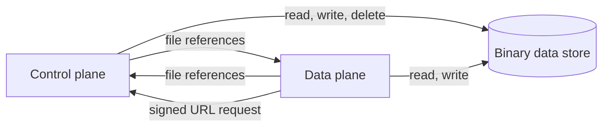

# Share the binary data store between the planes

Date: 2026-10-02

Status: Active

Decision Owner: Catalysts

Source: https://linear.app/n8n/issue/CAT-4824

## Context

Every binary helper that a node uses gets `BinaryDataService` from the dependency container, in
`binary-helper-functions.ts` in `n8n-core`. This works because the data plane (DP) runs in the
control plane (CP) process today. The standalone engine entry point, `serve.ts`, creates no
`BinaryDataService`. A DP in its own process cannot read or write a file.

There are four constraints:

1. The engine package must not import `n8n-core`. Only the node-engine-compatibility layer and the
   host use `BinaryDataService`.
2. The `BinaryDataConfig` constructor takes `InstanceSettings` to derive the signing secret, and
   `initialize()` reads the secret from the CP database. So a process cannot create the
   configuration without the encryption key and the CP database, even when it only reads and
   writes files.
3. `createBinarySignedUrl()` signs a token with that secret.
4. The `database` mode stores the bytes in the CP database.

## Decision

1. **The planes share the store.** Each process that runs a node has its own `BinaryDataService`,
   configured for the same store. The planes send each other only file references
   (`<mode>:<fileId>`), never file bytes. This is how v1 queue mode works between main and workers.
2. **The supported modes follow from decision 1.** `s3` and `azure` work in every topology, because
   every process can reach the bucket. `filesystem` works when every host mounts the same volume at
   the same path. `database` is supported only when the DP runs in the CP process. A DP host in
   its own process refuses `database` mode at start.
3. **Only the CP signs URLs.** A DP asks the CP for a signed URL over the action-scoped CP routes,
   with the file id and the execution id. The CP checks that the file belongs to that execution
   before it signs. The signing secret is not given to the DP.
4. **The storage configuration is split from the signing secret.** A DP builds its
   `BinaryDataService` from the storage settings only, without `InstanceSettings` and without the CP
   database.
5. **The helpers get the service from `additionalData`.** The DP runtime sets its
   `BinaryDataService` on `additionalData`, the same way it sets `credentialsHelper`. When
   `additionalData` has no service, the helpers use the container. Thus v1 and integrated mode keep
   the process singleton.

## Alternatives Considered

1. **The CP serves every read and write over HTTP routes, as it does for credentials.** This needs
   no shared store. It was rejected because every file goes through the CP twice, and large files
   need streaming routes on the CP server. It stays the fallback for a topology with no shared
   store, and it is not planned.
2. **The DP gets the signing secret and signs URLs itself.** This saves one CP call for each URL.
   It was rejected because a DP that holds the secret can sign a URL for any file of any execution.
3. **The DP connects to the CP database in `database` mode.** It was rejected because the DP would
   need the CP database credentials. With SQLite, a DP on another host cannot open the database.
4. **The engine reads and writes files itself.** It was rejected for the reason in
   ADR-20260925-delete-binary-files-with-the-execution-that-wrote-them: the engine must not depend
   on `n8n-core`.

## Consequences

1. Three code changes follow, each in its own ticket: the service on `additionalData`, the split of
   `BinaryDataConfig`, and the CP route and DP client for signed URLs.
2. Until these changes are merged, a DP that runs nodes which use files must run in the CP process.
3. An operator who runs `filesystem` mode on more than one host must provide a shared mount. v1
   queue mode has the same requirement.
4. A DP host configured with the wrong mode fails at start. A DP host in its own process has no
   CP database connection, so every file read and write fails in `database` mode. Without the
   check, the error shows only when a run handles its first file. That run fails in the middle,
   after earlier nodes have already called external services. A workflow that uses no files never
   shows the error, so the wrong configuration can stay unnoticed for a long time.
5. A signed URL created on a DP costs one call to the CP.
6. This decision answers the open question in decision 6 and consequence 3 of
   ADR-20260925-delete-binary-files-with-the-execution-that-wrote-them.

## Links

RFC: -

Documentation: https://linear.app/n8n/issue/CAT-4824

Related ADRs: ADR-20260925-delete-binary-files-with-the-execution-that-wrote-them
