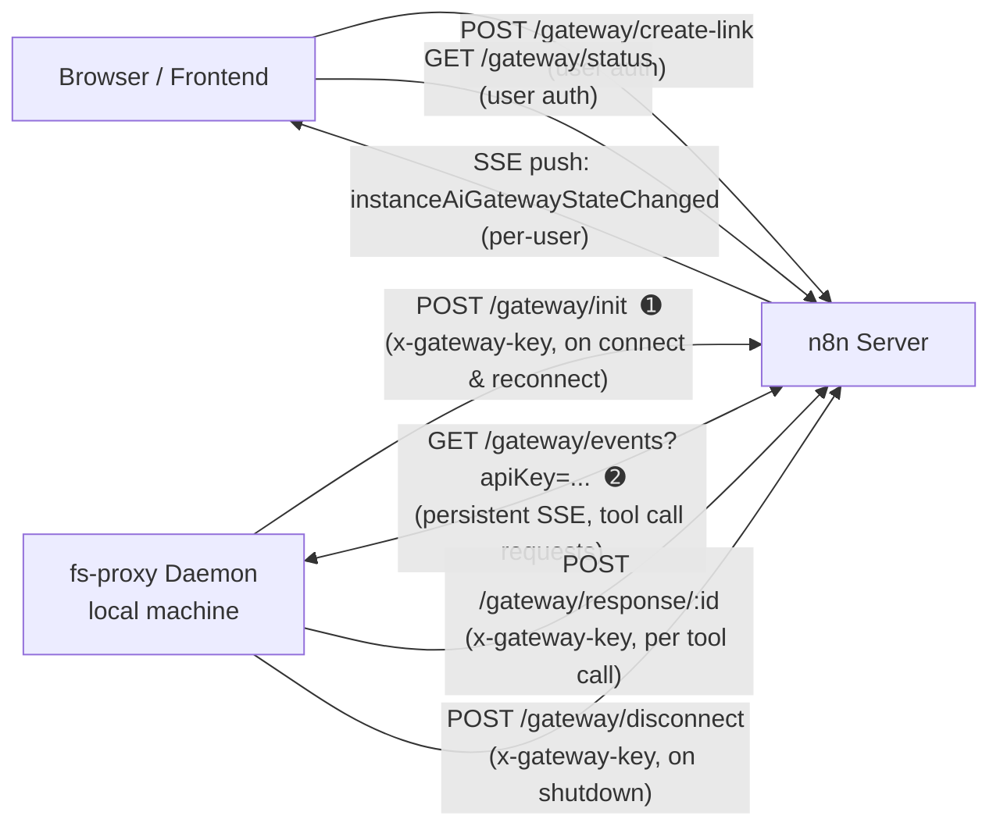
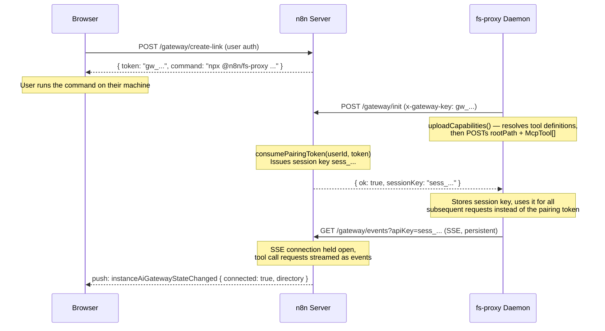
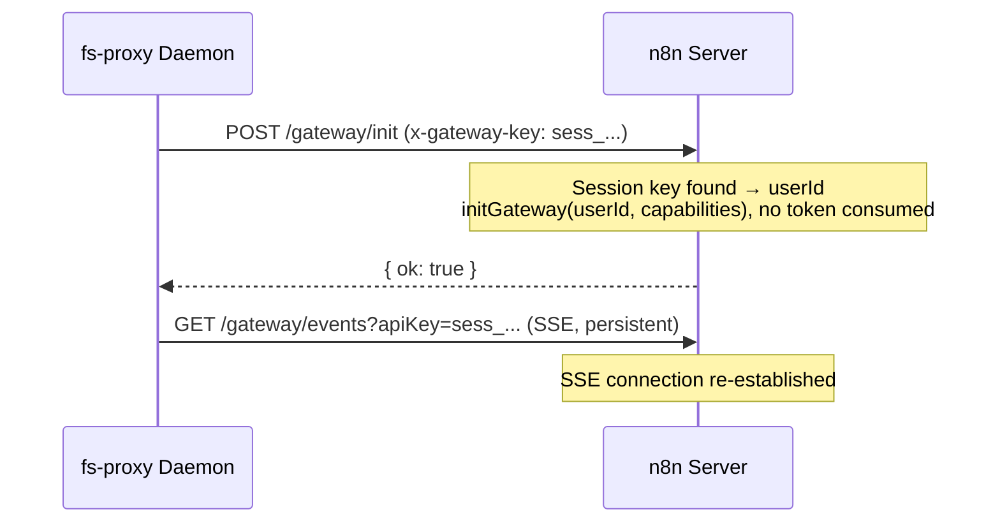
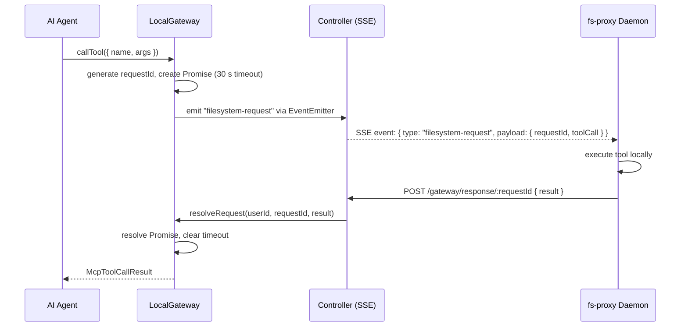

# Local Gateway — Backend Technical Specification

> Feature behaviour is defined in [local-gateway.md](./local-gateway.md).
> This document covers the backend implementation in
> `packages/cli/src/modules/instance-ai`.

---

## Table of Contents

1. [Component Overview](#1-component-overview)
2. [Authentication Model](#2-authentication-model)
3. [HTTP API](#3-http-api)
4. [Gateway Lifecycle](#4-gateway-lifecycle)
5. [Per-User Isolation](#5-per-user-isolation)
6. [Tool Call Dispatch](#6-tool-call-dispatch)
7. [Disconnect & Reconnect](#7-disconnect--reconnect)
8. [Module Settings](#8-module-settings)

---

## 1. Component Overview

The local gateway involves three runtime processes:

- **n8n server** — hosts the REST/SSE endpoints and orchestrates the AI agent.
- **fs-proxy daemon or local-gateway app** — runs on the user's local machine; executes tool calls.
- **Browser (frontend)** — initiates the connection and displays gateway status.



> **➊ → ➋ ordering**: the daemon always calls `POST /gateway/init` before opening the SSE
> stream. The numbers indicate startup sequence, not request direction.

### Key classes

| Class | File | Responsibility |
|---|---|---|
| `LocalGatewayRegistry` | `filesystem/local-gateway-registry.ts` | Per-user state: tokens, session keys, timers, gateway instances |
| `LocalGateway` | `filesystem/local-gateway.ts` | Single-user MCP gateway: tool call dispatch, pending request tracking |
| `InstanceAiService` | `instance-ai.service.ts` | Thin delegation layer; exposes registry methods to the controller |
| `InstanceAiController` | `instance-ai.controller.ts` | HTTP endpoints; routes daemon requests to the correct user's gateway |

---

## 2. Authentication Model

The gateway uses two distinct authentication schemes for the two sides of the
connection.

### User-facing endpoints

Standard n8n session or API-key auth (`@Authenticated` / `@GlobalScope`).
The `userId` is taken from `req.user.id`.

### Daemon-facing endpoints (`skipAuth: true`)

These endpoints are not protected by the standard auth middleware. Instead,
they verify a **gateway API key** passed in one of two ways:

- `GET /gateway/events` — `?apiKey=<key>` query parameter (required for
  `EventSource`, which cannot set headers).
- All other daemon endpoints — `x-gateway-key` request header.

The key is resolved to a `userId` by `validateGatewayApiKey()` in the
controller:

```
1. If N8N_INSTANCE_AI_GATEWAY_API_KEY env var is set and matches → userId = 'env-gateway'
2. Otherwise look up the key in LocalGatewayRegistry.getUserIdForApiKey()
   - Matches pairing tokens (TTL: 5 min, one-time use)
   - Matches active session keys (persistent until explicit disconnect)
3. No match → ForbiddenError
```

Timing-safe comparison (`crypto.timingSafeEqual`) is used for the env-var
path to prevent timing attacks.

---

## 3. HTTP API

All paths are prefixed with `/api/v1/instance-ai`.

### User-facing

| Method | Path | Auth | Description |
|---|---|---|---|
| `POST` | `/gateway/create-link` | User | Generate a pairing token; returns `{ token, command }` |
| `GET` | `/gateway/status` | User | Returns `{ connected, connectedAt, directory }` for the requesting user |

### Daemon-facing (`skipAuth`)

| Method | Path | Auth | Description |
|---|---|---|---|
| `GET` | `/gateway/events` | API key (`?apiKey`) | SSE stream; emits tool call requests to the daemon |
| `POST` | `/gateway/init` | API key (`x-gateway-key`) | Daemon announces capabilities; swaps pairing token for session key |
| `POST` | `/gateway/response/:requestId` | API key (`x-gateway-key`) | Daemon delivers a tool call result or error |
| `POST` | `/gateway/disconnect` | API key (`x-gateway-key`) | Daemon gracefully terminates the connection |

#### POST `/gateway/create-link` — response

```typescript
{
  token: string;    // gw_<nanoid(32)> — pairing token for /gateway/init
  command: string;  // "npx @n8n/fs-proxy <baseUrl> <token>"
}
```

#### GET `/gateway/status` — response

```typescript
{
  connected: boolean;
  connectedAt: string | null;  // ISO timestamp
  directory: string | null;    // rootPath advertised by daemon
}
```

#### POST `/gateway/init` — request body

```typescript
// InstanceAiGatewayCapabilities
{
  rootPath: string;   // Filesystem root the daemon exposes
  tools: McpTool[];   // MCP tool definitions the daemon supports
}
```

Response: `{ ok: true, sessionKey: string }` on first connect.
Response: `{ ok: true }` when reconnecting with an active session key.

#### POST `/gateway/response/:requestId` — request body

```typescript
{
  result?: {
    content: Array<
      | { type: 'text'; text: string }
      | { type: 'image'; data: string; mimeType: string }
    >;
    isError?: boolean;
  };
  error?: string;
}
```

---

## 4. Gateway Lifecycle

### 4.1 Initial connection



### 4.2 Reconnection with existing session key

After the initial handshake the daemon persists the session key in memory.
On reconnect (e.g. after a transient network drop):



`generatePairingToken()` also short-circuits: if an active session key
already exists for the user it is returned directly, so a new pairing token
is never issued while a session is live.

### 4.3 Token & key lifecycle

```
generatePairingToken(userId)
│  Existing session key?  ──yes──▶  return session key
│  Valid pairing token?   ──yes──▶  return existing token
│  Otherwise             ──────▶  create gw_<nanoid>, register in reverse lookup

consumePairingToken(userId, token)
│  Validates token matches & is within TTL (5 min)
│  Deletes pairing token from reverse lookup
│  Creates sess_<nanoid>, registers in reverse lookup
└─▶ returns session key

clearActiveSessionKey(userId)
   Deletes session key from reverse lookup
   Nulls state (daemon must re-pair on next connect)
```

---

## 5. Per-User Isolation

All gateway state is held in `LocalGatewayRegistry`, which maintains two
maps:

```
userGateways: Map<userId, UserGatewayState>
apiKeyToUserId: Map<token|sessionKey, userId>   ← reverse lookup
```

`UserGatewayState` contains:

```typescript
interface UserGatewayState {
  gateway: LocalGateway;
  pairingToken: { token: string; createdAt: number } | null;
  activeSessionKey: string | null;
  disconnectTimer: ReturnType<typeof setTimeout> | null;
  reconnectCount: number;
}
```

**Isolation guarantees:**

- Daemon endpoints resolve a `userId` from `validateGatewayApiKey()` and
  operate exclusively on that user's `UserGatewayState`. No endpoint accepts
  a `userId` from the request body.
- `getGateway(userId)` creates state lazily; `findGateway(userId)` returns
  `undefined` if no state exists (used in `executeRun` to avoid allocating
  state for users who have never connected).
- Pairing tokens and session keys are globally unique (`nanoid(32)`) and
  never shared across users.
- `disconnectAll()` on shutdown iterates `userGateways.values()` and tears
  down every gateway in isolation.

---

## 6. Tool Call Dispatch

When the AI agent needs to invoke a local tool the call flows through
`LocalGateway`:



If the daemon does not respond within 30 seconds the promise rejects and
the agent receives a tool-error event.

If the gateway disconnects while requests are pending, `LocalGateway.disconnect()`
rejects all outstanding promises immediately with `"Local gateway disconnected"`.

---

## 7. Disconnect & Reconnect

### Explicit disconnect (user or daemon-initiated)

`POST /gateway/disconnect`:
1. `clearDisconnectTimer(userId)` — cancels any pending grace timer.
2. `disconnectGateway(userId)` — marks gateway disconnected, rejects pending
   tool calls.
3. `clearActiveSessionKey(userId)` — removes session key from reverse lookup.
   The daemon must re-pair on the next connect.
4. Push notification sent to user: `instanceAiGatewayStateChanged { connected: false }`.

### Unexpected SSE drop (daemon crash / network loss)

Both sides react independently when the SSE connection drops.

**Daemon side** (`GatewayClient.connectSSE` — `onerror` handler):

1. Closes the broken `EventSource`.
2. Classifies the error:
   - **Auth error** (HTTP 403 / 500) → calls `reInitialize()`: re-uploads
     capabilities via `POST /gateway/init`, then reopens SSE. This handles
     the case where the server restarted and lost the session key.
     After 5 consecutive auth failures the daemon gives up and calls
     `onPersistentFailure()`.
   - **Any other error** → reopens SSE directly (session key is still valid).
3. Applies exponential backoff before each retry: `1s → 2s → 4s → … → 30s (cap)`.
4. Backoff and auth retry counter reset to zero on the next successful `onopen`.

**Server side** (`startDisconnectTimer` in `LocalGatewayRegistry`):

1. Starts a grace period before marking the gateway disconnected:
   - Grace period uses exponential backoff: `min(10s × 2^reconnectCount, 120s)`
   - `reconnectCount` increments each time the grace period expires.
2. If the daemon reconnects within the grace period:
   - `clearDisconnectTimer(userId)` cancels the timer.
   - `initGateway(userId, capabilities)` resets `reconnectCount = 0`.
3. If the grace period expires:
   - `disconnectGateway(userId)` marks the gateway disconnected and rejects
     pending tool calls.
   - The session key is **kept** — the daemon can still re-authenticate
     without re-pairing.
   - `onDisconnect` fires, sending `instanceAiGatewayStateChanged { connected: false }`.

```
Server grace period:
reconnectCount:  0       1       2       3    ...  n
grace period:   10 s   20 s   40 s   80 s  ...  120 s (cap)

Daemon retry delay:
retry:           1       2       3       4    ...  n
delay:           1 s     2 s     4 s     8 s  ...   30 s (cap)
```

---

## 8. Module Settings

`InstanceAiModule.settings()` returns global (non-user-specific) values to
the frontend. Gateway connection status is **not** included because it is
per-user.

```typescript
{
  enabled: boolean;                       // Model is configured and usable
  localGateway: boolean;                  // Local filesystem path is configured
  localGatewayDisabled: boolean;          // Admin/user opt-out flag
  localGatewayFallbackDirectory: string | null;  // Configured fallback path
}
```

Per-user gateway state is delivered via two mechanisms:
- **Initial load** — `GET /gateway/status` (called on page mount).
- **Live updates** — targeted push notification `instanceAiGatewayStateChanged`
  sent only to the affected user via `push.sendToUsers(..., [userId])`.
