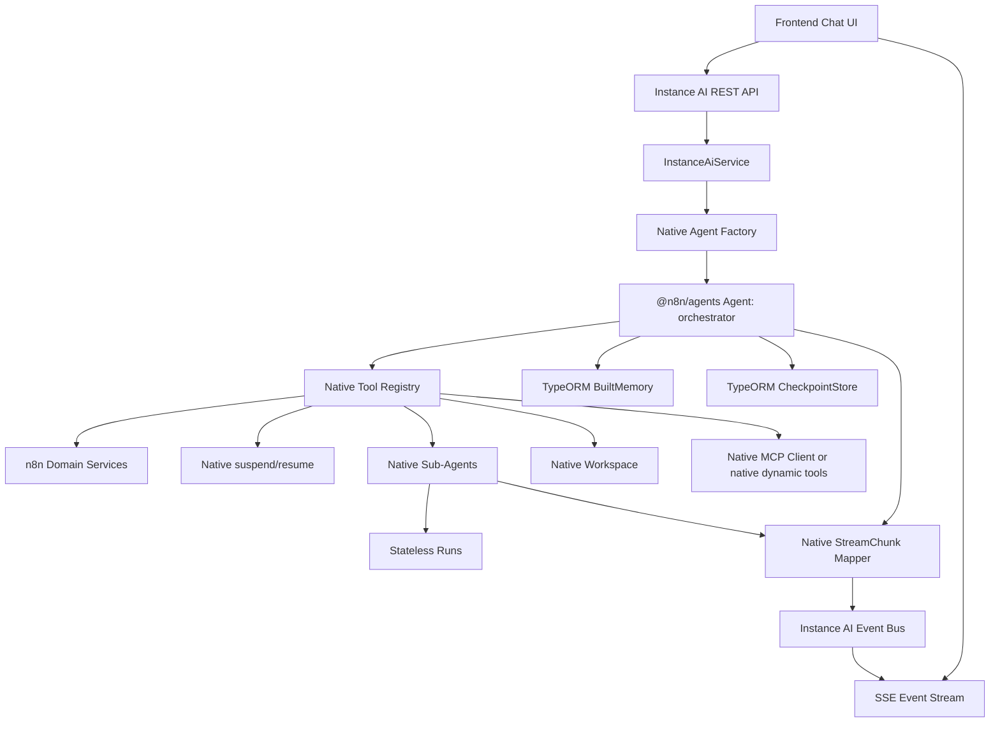

# Instance AI Native Agents Rewrite

Status: Draft
Last updated: 2026-05-05

## Goal

Rewrite `@n8n/instance-ai` to run exclusively on the native n8n agents
framework in `packages/@n8n/agents`.

This is a full runtime rewrite, not an incremental compatibility migration.
Mastra must be removed from Instance AI entirely. Existing Instance AI runtime
data does not need to be preserved. The migration may introduce fresh tables,
drop obsolete Instance AI tables, or truncate existing Instance AI data if that
produces a cleaner native agents persistence model.

The external product contract should remain stable: the chat API, SSE protocol,
frontend reducer, task UI, HITL confirmations, and domain behavior should keep
working unless a deliberate `@n8n/api-types` change is called out in this spec.

## Hard Requirements

- No `@mastra/*` imports in `packages/@n8n/instance-ai`.
- No `@mastra/*` imports in `packages/cli/src/modules/instance-ai`.
- Remove Mastra dependencies from `packages/@n8n/instance-ai/package.json`.
- Orchestrator agents and sub-agents use `@n8n/agents` `Agent`.
- Tools are rewritten to native `@n8n/agents` `Tool` definitions.
- HITL uses native tool `suspend()` / `resume()` and `CheckpointStore`.
- Streams use native `StreamResult` and `StreamChunk`.
- Memory uses native `BuiltMemory` plus n8n TypeORM-backed storage.
- Runtime checkpoints use a native TypeORM-backed `CheckpointStore`.
- Workspace integration uses `@n8n/agents` `Workspace`, `BaseFilesystem`, and
  `BaseSandbox`, with concrete providers owned by Instance AI or moved into
  `@n8n/agents` if they become generally useful.
- Model config uses `@n8n/agents` `ModelConfig` and AI SDK v6-compatible model
  instances.

## Non-Goals

- Preserve old Mastra chat messages, checkpoints, workflow snapshots, or
  observational memory.
- Keep a Mastra-shaped tool compatibility adapter.
- Recreate Mastra `ToolSearchProcessor` in the first rewrite.
- Recreate Mastra observational memory in the first rewrite.
- Migrate old semantic recall embeddings.

## Target Architecture



Instance AI remains the product orchestration package. `@n8n/agents` becomes
the execution engine.

## Cutover Strategy

The merged implementation should have one runtime path: native agents.

Development can use temporary local branches or intermediate commits, but the
final branch should not contain:

- a Mastra/native runtime feature flag
- a Mastra fallback path
- a Mastra-shaped tool adapter
- storage abstractions whose only purpose is preserving old Mastra data

Because Instance AI runtime data may be reset, the cutover is a schema and code
replacement. The migration should leave the database in a native-agents-ready
state and the application should create fresh threads, messages, checkpoints,
and run snapshots after upgrade.

## Component Mapping

| Current Instance AI area | Native agents target | Notes |
| --- | --- | --- |
| `agent/instance-agent.ts` | `new Agent('n8n-instance-ai')` | Replace Mastra agent, Mastra registration, MCP client wiring, and tool search. |
| `agent/sub-agent-factory.ts` | Native `Agent` | Keep Instance AI `agentId` as product metadata outside the native agent name. |
| `agent/register-with-mastra.ts` | Delete | Native checkpoints replace Mastra workflow snapshot registration. |
| `tools/*` | Native `Tool` definitions | Rewrite directly with `new Tool(name)`. Shared helpers are allowed only for product concepts, not Mastra-shaped configs. |
| Tool HITL | `Tool.suspend(schema).resume(schema)` | Replace `ctx.agent.suspend` with native `ctx.suspend`; replace `ctx.agent.resumeData` with native `ctx.resumeData`. |
| Tool output shaping | `Tool.toModelOutput()` and `Tool.toMessage()` | Preserve truncation and custom message behavior where needed. |
| `tools/orchestration/delegate.tool.ts` | Native sub-agent streaming | `maxSteps` becomes `maxIterations`; no Mastra registration. |
| `tools/orchestration/build-workflow-agent.tool.ts` | Native builder agent | Builder sub-runs use native stream and HITL resume. |
| `runtime/stream-runner.ts` | Native stream runner | Use `BuiltAgent.stream()` and `BuiltAgent.resume('stream', ...)`. |
| `runtime/resumable-stream-executor.ts` | Native stream executor | Read `ReadableStream<StreamChunk>`, accumulate text deltas, publish canonical Instance AI events. |
| `stream/map-chunk.ts` | Native chunk mapper | Map native `StreamChunk` to `InstanceAiEvent`. |
| `memory/memory-config.ts` | Native `Memory` builder | Use `BuiltMemory`, `lastMessages`, optional semantic recall, no working memory initially. |
| `storage/*` | Native storage abstractions | Replace Mastra-memory-backed metadata storage with TypeORM-backed services. |
| `workspace/*` | Native `Workspace` providers | Rewrite local, Daytona, and n8n-sandbox adapters against agents workspace interfaces. |
| `mcp/*` | Native `McpClient` or dynamic native tools | Keep schema sanitization only where still required by providers. |
| `compaction/*` | Native `Agent.generate()` | Keep operational summarization, but do not depend on observational memory. |
| `tracing/*` | Native telemetry plus Instance AI spans | Prefer `@n8n/agents` telemetry and events; keep product-level LangSmith spans if they provide missing detail. |

## Native Type Surface

Replace Mastra-facing types in `src/types.ts` with native types.

```ts
import type {
	BuiltMemory,
	BuiltTool,
	CheckpointStore,
	ModelConfig,
	Workspace,
} from '@n8n/agents';

export type InstanceAiToolRegistry = Record<string, BuiltTool>;

export interface InstanceAiMemoryConfig {
	memory: BuiltMemory;
	checkpointStore: CheckpointStore;
	embedderModel?: string;
	lastMessages?: number;
	semanticRecallTopK?: number;
	threadTtlDays?: number;
}
```

`OrchestrationContext` should use:

- `modelId: ModelConfig`
- `domainTools: InstanceAiToolRegistry`
- `mcpTools?: InstanceAiToolRegistry`
- `workspace?: Workspace`
- no `storage: MastraCompositeStore`
- no Mastra `Memory`
- no Mastra `ToolsInput`

Sub-agents are stateless. If they need conversation context, pass explicit text
or a small `ThreadMessageReader` service, not a memory instance that persists
sub-agent turns.

## Tool Rewrite Rules

All tools should be native tools.

```ts
const askUserTool = new Tool('ask-user')
	.description('Ask the user for information needed to continue.')
	.input(askUserInputSchema)
	.output(askUserOutputSchema)
	.suspend(askUserSuspendSchema)
	.resume(askUserResumeSchema)
	.handler(async (input, ctx) => {
		if (ctx.resumeData === undefined) {
			return await ctx.suspend(buildAskUserPayload(input));
		}

		return normalizeAskUserResume(ctx.resumeData);
	});
```

Rules:

- Keep existing tool names unless there is a deliberate prompt and event
  migration.
- Keep Zod schemas as the source of truth.
- Use `ctx.suspend()` for all confirmations, questions, plan reviews,
  credential flows, domain access decisions, and resource decisions.
- Use `ctx.resumeData` for resumed tool execution.
- Use `toModelOutput()` for large or sensitive tool results.
- Use `toMessage()` only when Instance AI needs a custom stored message.
- Do not add a helper that accepts Mastra-style `{ id, inputSchema, execute }`
  configs.

## Stream And Event Mapping

Instance AI keeps its canonical event protocol. Only the runtime chunk source
changes.

| Native `StreamChunk` | Instance AI event |
| --- | --- |
| `text-delta` | `text-delta` |
| `reasoning-delta` | `reasoning-delta` |
| `message` with `tool-call` content | `tool-call` |
| `message` with `tool-result` content | `tool-result` or `tool-error` |
| `tool-call-suspended` | `confirmation-request` |
| `finish` | Usage accounting and run finalization |
| `error` | `error` and failed run finalization |

The public Instance AI `runId` and native agents `runId` are different
concepts:

- Instance AI `runId`: product-level run identifier used by SSE and UI state.
- Native `agentRunId`: native agents checkpoint/resume identifier.

Rename all internal `mastraRunId` fields to `agentRunId`.

## Persistence Model

Data loss for existing Instance AI runtime data is acceptable. The rewrite
should use fresh native agents persistence and avoid translating old Mastra
records.

### Tables To Keep Or Recreate

| Table | Target use |
| --- | --- |
| `instance_ai_threads` | Native `BuiltMemory` threads. Keep `id`, `resourceId`, `title`, `metadata`, timestamps. |
| `instance_ai_messages` | Native `AgentDbMessage` persistence. Recreate or alter as needed. |
| `instance_ai_resources` | Optional native working memory storage. Working memory remains disabled initially. |
| `instance_ai_run_snapshots` | UI agent tree snapshots. Recreate empty if the migration resets all Instance AI data. |
| `instance_ai_iteration_logs` | Workflow-loop attempt history. Recreate empty if the migration resets all Instance AI data. |
| `ai_builder_temporary_workflow` | Keep behavior, but account for its FK to `instance_ai_threads` during destructive migrations. |

### Tables To Remove Or Stop Using

| Table | Replacement |
| --- | --- |
| `instance_ai_workflow_snapshots` | New native `instance_ai_checkpoints` table. |
| `instance_ai_observational_memory` | No replacement in the first rewrite. Keep compaction instead. |

### New Tables

#### `instance_ai_checkpoints`

Backs `@n8n/agents` `CheckpointStore`.

| Column | Type | Notes |
| --- | --- | --- |
| `key` | varchar primary | Opaque key passed by native agents. |
| `runId` | varchar indexed | Native `agentRunId` when available. |
| `threadId` | uuid nullable indexed | Useful for cleanup and debugging. |
| `resourceId` | varchar nullable indexed | User/resource owner. |
| `state` | text or json | Serialized `SerializableAgentState`. |
| timestamps | standard | Required for TTL cleanup. |

`load(key)` must be atomic enough that two concurrent resume attempts cannot
both receive and execute the same checkpoint. Prefer transaction plus row lock
where supported, followed by delete.

#### `instance_ai_embeddings`

Optional table for native semantic recall. This can be skipped in the first
implementation if semantic recall is disabled until a vector strategy is chosen.

| Column | Type | Notes |
| --- | --- | --- |
| `id` | varchar primary | Embedding row id. |
| `messageId` | varchar indexed | Associated message. |
| `threadId` | uuid nullable indexed | Thread scope. |
| `resourceId` | varchar nullable indexed | Resource scope. |
| `scope` | varchar | `thread` or `resource`. |
| `model` | varchar | Embedder model id. |
| `text` | text | Source text used for embedding. |
| `vector` | text or blob | JSON vector unless a DB-native vector type is introduced. |

## Migration Strategy

Add a new common DB migration for the native agents rewrite.

The migration may reset Instance AI data. It must not affect non-Instance-AI
tables.

Recommended approach:

1. Delete rows from `ai_builder_temporary_workflow` to release thread FKs.
2. Delete rows from existing Instance AI runtime tables.
3. Drop obsolete Instance AI tables:
   - `instance_ai_workflow_snapshots`
   - `instance_ai_observational_memory`
4. Recreate or alter `instance_ai_messages` for native `AgentDbMessage`
   storage.
5. Create `instance_ai_checkpoints`.
6. Optionally create `instance_ai_embeddings`.
7. Keep or recreate `instance_ai_run_snapshots` and `instance_ai_iteration_logs`
   empty.

No backfill is required. Old chats, suspended runs, observations, and semantic
recall state may be lost.

## Backend Storage Adapters

Implement these in `packages/cli/src/modules/instance-ai/storage/`:

- `TypeORMAgentMemory implements BuiltMemory`
- `TypeORMAgentCheckpointStore implements CheckpointStore`
- Optional `TypeORMAgentEmbeddingStore` if semantic recall ships in the first
  rewrite

Delete or retire:

- `TypeORMCompositeStore`
- `TypeORMWorkflowsStorage`
- Mastra memory storage inheritance

Thread metadata remains the storage location for:

- task state
- planned task graph
- workflow loop state
- compaction metadata

Use a small native interface for metadata access instead of passing memory as a
Mastra object:

```ts
export interface ThreadMetadataStore {
	get(threadId: string): Promise<Record<string, unknown>>;
	patch(threadId: string, patch: Record<string, unknown>): Promise<void>;
}
```

## Workspace Rewrite

`@n8n/agents` provides workspace interfaces and base classes, not the concrete
Instance AI providers.

Rewrite:

- Daytona filesystem and sandbox provider
- local filesystem and sandbox provider
- n8n-sandbox filesystem and sandbox provider
- builder sandbox factory
- workspace snapshot restore flow

The first rewrite may keep concrete providers in `@n8n/instance-ai`. Move them
to `@n8n/agents` only if they become generic SDK functionality.

## MCP Rewrite

External MCP servers should use native `McpClient` when possible.

Local gateway tools and dynamically discovered tools should become native
`BuiltTool`s. JSON Schema input from MCP should continue to be converted to Zod
before being registered as native tools.

## Tracing

Use native agents telemetry and lifecycle events as the default integration
point.

Keep Instance AI product-level LangSmith spans only where native telemetry does
not expose enough structure for:

- product run
- orchestrator turn
- sub-agent run
- tool execution
- background task
- workflow build loop

## Testing Plan

Unit tests:

- native tool definitions for HITL tools
- native stream chunk to Instance AI event mapping
- native resume flow with checkpoint persistence
- TypeORM `BuiltMemory`
- TypeORM `CheckpointStore`
- thread metadata storage
- service run state registry using `agentRunId`

Integration tests:

- orchestrator run streams text and tool events
- HITL suspend, confirmation, resume
- delegated sub-agent run
- planned task approval and execution
- builder agent background task
- workspace filesystem and sandbox operations

Package checks:

```bash
pushd packages/@n8n/agents
pnpm test
pnpm typecheck
popd

pushd packages/@n8n/instance-ai
pnpm test
pnpm typecheck
popd

pushd packages/cli
pnpm test instance-ai
pnpm typecheck
popd
```

Run broader checks before PR:

```bash
pnpm test:affected
pnpm typecheck
```

## Implementation Milestones

1. Native type surface and dependency removal plan
   - Replace Mastra imports in public Instance AI types.
   - Define native tool registry, memory config, checkpoint config, and
     orchestration context.
   - Update docs and prompts that refer to Mastra runtime behavior.

2. Native persistence
   - Add native TypeORM entities and migration.
   - Implement `BuiltMemory`.
   - Implement `CheckpointStore`.
   - Replace thread metadata storage that currently depends on Mastra memory.

3. Native tools
   - Rewrite domain tools directly with `Tool`.
   - Rewrite HITL tools with native suspend/resume.
   - Rewrite dynamic local gateway and MCP-discovered tools as native tools.

4. Native agent factories and runtime
   - Rewrite orchestrator and sub-agent factories.
   - Rewrite stream runner, resume flow, and event mapper.
   - Rename `mastraRunId` to `agentRunId`.

5. Native workspace, MCP, and tracing
   - Rewrite workspace providers.
   - Replace Mastra MCP usage.
   - Move tracing to native telemetry/events where possible.

6. Cleanup and verification
   - Delete retired Mastra storage and registration files.
   - Remove Mastra dependencies.
   - Run targeted tests and typechecks.
   - Verify no `@mastra/*` imports remain.

## Implementation TODO

- [ ] Replace Mastra types in `packages/@n8n/instance-ai/src/types.ts`.
- [ ] Remove Mastra dependencies from `packages/@n8n/instance-ai/package.json`.
- [ ] Rewrite orchestrator factory with native `Agent`.
- [ ] Rewrite sub-agent factory with native `Agent`.
- [ ] Delete Mastra registration logic.
- [ ] Rewrite all tools to native `Tool`.
- [ ] Rewrite orchestration tools for native streaming and resume.
- [ ] Rewrite stream runner and stream executor for native `StreamChunk`.
- [ ] Rename internal `mastraRunId` to `agentRunId`.
- [ ] Implement native chunk to Instance AI event mapper.
- [x] Implement TypeORM `BuiltMemory`.
- [x] Implement TypeORM `CheckpointStore`.
- [ ] Add fresh DB migration for native Instance AI persistence.
- [ ] Remove `TypeORMCompositeStore` from the active runtime path.
- [ ] Remove `TypeORMWorkflowsStorage` from the active runtime path.
- [ ] Remove observational memory runtime usage.
- [ ] Keep or replace compaction as the operational long-context mechanism.
- [ ] Rewrite workspace providers against native agents workspace interfaces.
- [ ] Replace Mastra MCP usage with native MCP or native dynamic tools.
- [ ] Update LangSmith tracing to native telemetry/events where possible.
- [ ] Update docs that mention Mastra runtime behavior.
- [ ] Add tests for the native runtime path.
- [ ] Verify no `@mastra/*` imports remain.

## Acceptance Criteria

- `rg "@mastra/" packages/@n8n/instance-ai packages/cli/src/modules/instance-ai`
  returns no active runtime imports.
- `packages/@n8n/instance-ai/package.json` has no Mastra dependencies.
- A new Instance AI thread can run from user message to streamed final answer.
- HITL confirmation suspends and resumes through native `CheckpointStore`.
- Delegated sub-agents run on native `Agent`.
- Planned tasks and workflow loop still persist thread-scoped state.
- Existing Instance AI frontend can consume the SSE stream without reducer
  changes.
- Old Instance AI data may be absent after migration, but non-Instance-AI data
  is untouched.
