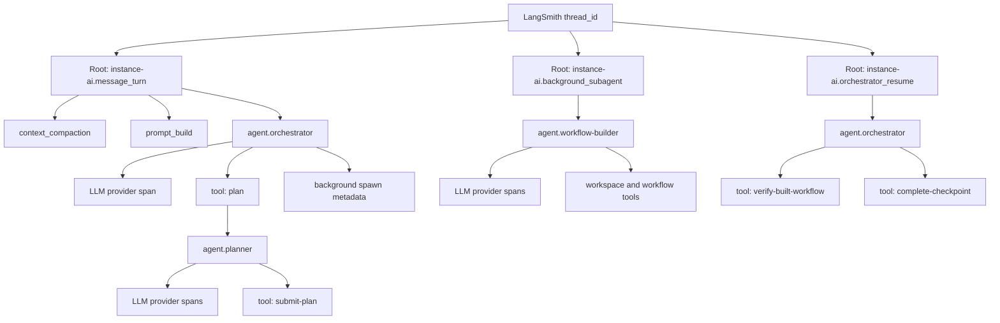

# Instance AI Tracing Specs

Status: planning clean Instance AI tracing rewrite

Last updated: 2026-05-06

## Decision

Instance AI tracing will be rebuilt around a clean, activation-scoped
OpenTelemetry model owned by `@n8n/instance-ai`.

LangSmith is an export target for Instance AI traces, not the internal tracing
model. LangSmith-specific attribute names, token workarounds, thread grouping
policy, and trace-shaping rules must stay in `packages/@n8n/instance-ai`.
`packages/@n8n/agents` must remain provider/platform neutral, except for
generic telemetry primitives that any product can use.

The target live trace hierarchy has no LangSmith `RunTree` spans. Native AI SDK
model/tool telemetry and Instance AI product spans must share the same OTel
context tree.

## Design Principles

1. **Activation duration, not logical task lifetime**

   A span measures active work. It must not stay open while the orchestrator is
   waiting for user approval, a background task, or a future scheduler tick.

2. **One thread, multiple root operations**

   A LangSmith thread is a chronological group of root traces linked by
   `thread_id`. A complex Instance AI request can therefore contain:

   - a user message activation,
   - one or more detached background task activations,
   - one or more orchestrator resume/checkpoint activations.

3. **Inline sub-agents are children, detached sub-agents are roots**

   A planner or delegate that runs synchronously inside the current orchestrator
   activation is a child span. A builder, data-table, research, or delegate task
   that runs after the orchestrator returns is a separate root trace linked back
   with spawning metadata.

4. **Leaf LLM spans own token usage**

   Product spans must not carry prompt/completion usage that duplicates child LLM
   spans. Token and cost rollups should come from native AI SDK provider spans,
   with Instance AI applying LangSmith export fixes only in the Instance AI
   LangSmith adapter.

5. **Tool definitions are both agent and LLM request metadata**

   We need to know which tools were assigned to which agent. That belongs on the
   agent activation span as a compact tool manifest. We also need to know which
   exact tools were available to each model call. That belongs on every LLM span
   that sends tools to the provider, using the provider-facing tool definitions
   from that request. Individual tool executions remain native `ai.toolCall`
   spans.

6. **Trace replay is separate from observability**

   Replay records deterministic Instance AI events and tool I/O. It must not
   depend on LangSmith IDs, OTel span IDs, or the shape of the LangSmith UI.

7. **Do not hide provider semantics**

   The LangSmith trace should show native LLM inputs, messages, available tools,
   tool calls, provider metadata, finish reasons, token usage, and cache usage
   whenever recording policy allows it.

## Non-Goals

- Preserve the Mastra-era trace tree.
- Preserve the current hybrid `RunTree` plus OTel implementation.
- Keep a compatibility layer that manually reconstructs LLM steps in LangSmith.
- Make `@n8n/agents` aware of Instance AI thread IDs, agent roles, task IDs, or
  LangSmith-specific token correction.
- Use LangSmith trace shape as product state.
- Keep orchestration spans open during background waits.

## Current Instance AI Execution Inventory

The tracing rewrite must cover every current model operation and non-model
execution path below.

| Area | Current code path | Model operation | Target trace shape |
| --- | --- | --- | --- |
| Foreground orchestrator | `createInstanceAgent()` -> `streamAgentRun()` | `Agent.stream()` | Child agent activation under `message_turn` or `orchestrator_resume` root |
| Context compaction | `generateCompactionSummary()` | `Agent.generate()` with no tools | Root-level child under `message_turn` or `orchestrator_resume`, before `agent.orchestrator`; internal root only when run out of band |
| Thread title | `generateTitleForRun()` | `generateTitleFromMessage()` | Internal OTel operation; export to LangSmith only when `include_internal=true` or on error |
| Inline planner | `plan` tool / `createPlanWithAgentTool()` | `Agent.stream()` with planner tools | Child `agent.planner` activation under the current orchestrator activation |
| Inline delegate | `delegate` tool / `createDelegateTool()` | `createSubAgent().stream()` | Child `agent.<role>` activation under the current orchestrator activation |
| Browser credential setup | `browser-credential-setup` tool | `Agent.stream()` plus resume/nudge loops | Quick credential checks stay inline; browser/user-wait flows use detached `background_subagent` plus `orchestrator_resume` |
| Detached builder | `build-workflow-with-agent` / planned build task | `Agent.stream()` in sandbox or tool mode | Separate `background_subagent` root linked to the spawn tool call |
| Detached data-table agent | `manage-data-tables-with-agent` / planned task | `Agent.stream()` | Separate `background_subagent` root |
| Detached research agent | `research-with-agent` / planned task | `Agent.stream()` | Separate `background_subagent` root |
| Detached custom delegate | planned delegate task | `createSubAgent().stream()` | Separate `background_subagent` root |
| Planned checkpoint | service-created follow-up turn | Orchestrator `Agent.stream()` | Separate `orchestrator_resume` root with `resume_reason=planned_checkpoint` |
| Background completion handoff | service-created follow-up turn | Orchestrator `Agent.stream()` | Separate `orchestrator_resume` root with `resume_reason=background_task_completed` |
| Workflow loop | `WorkflowLoopRuntime`, `verify-built-workflow`, `report-verification-verdict` | Mostly deterministic tools | Tool spans and product state spans only, no LLM span unless orchestrator chooses one |
| Builder memory compaction | `compactBuilderMemoryThread()` | Currently deterministic storage compaction | Product span only if useful; if it later calls an LLM, trace as an internal child of builder root |

## Target Trace Model



### Root Trace Kinds

`message_turn`

- Triggered by a user chat message.
- Contains active foreground orchestrator work for that message.
- Ends as `completed`, `failed`, `cancelled`, or `suspended`.
- If it schedules background tasks and returns, it ends immediately after the
  scheduling result is persisted and emitted.

`orchestrator_resume`

- Triggered by a tool approval, plan approval, background-task completion,
  planned checkpoint, replan, or correction handoff.
- Contains only active continuation work.
- Does not inherit the duration of the suspended or background operation that
  caused it.

`background_subagent`

- Triggered when a background task actually starts executing, not when the
  orchestrator merely requests it.
- Used by workflow builder, data-table manager, researcher, and detached
  delegate workers.
- Linked to the spawning activation by metadata, not by OTel parentage.

`internal_operation`

- Used for optional internal LLM calls that are not part of a user-visible
  agent activation, such as title generation.
- Hidden from normal debugging views by tags/metadata unless explicitly enabled.

### Agent Activation Spans

Agent activation spans describe the Instance AI actor that is running. They are
product spans, not model spans.

Recommended names:

- `instance-ai.agent.orchestrator`
- `instance-ai.agent.planner`
- `instance-ai.agent.workflow-builder`
- `instance-ai.agent.data-table-manager`
- `instance-ai.agent.web-researcher`
- `instance-ai.agent.delegate`
- `instance-ai.agent.credential-setup-browser-agent`

Each agent activation span must include:

- agent role and agent id,
- model id,
- execution mode,
- max iteration budget,
- assigned tool manifest,
- memory/checkpoint summary,
- prompt section summary.

The full system prompt can be recorded only when recording policy allows it.
The compact tool manifest should always be safe to record after schema
redaction.

### Native AI SDK Spans

Native model and tool spans should be kept as close as possible to what
`@n8n/agents` and AI SDK produce:

- `ai.streamText.doStream`
- `ai.generateText.doGenerate`
- `ai.toolCall`

Every LLM request span must include the exact tool definitions sent to the
model for that request when tools are present. This must not rely on the parent
agent activation span alone, because LangSmith renders available tool specs from
the LLM run itself.

Required on LLM request spans when tools are present:

- tool name,
- tool description,
- JSON input schema after redaction and size limiting,
- provider tool kind when applicable, for example custom tool, server tool, or
  hosted tool,
- tool choice and parallel-tool-use settings when available,
- stable manifest reference or schema hash linking back to the agent activation
  manifest.

Required on all LLM request spans when recording policy allows it:

- system and conversation messages sent to the provider,
- model/provider identifiers,
- tool calls emitted by the model,
- tool results observed by the following turn,
- finish reason,
- raw provider response metadata,
- token/cache usage.

The noisy wrapper spans, for example `ai.streamText`, may be filtered in the
Instance AI LangSmith exporter only if doing so does not hide messages, tool
definitions, tool calls, response metadata, or token usage.

## Activation and Waiting Semantics

The orchestrator must not look like it ran for 10 minutes because it waited for
a background builder.

Expected flow for complex build:

```text
Root A: instance-ai.message_turn
  agent.orchestrator
    LLM calls plan/build-workflow-with-agent
    tool call schedules builder task
  status=suspended_or_waiting_for_background

Root B: instance-ai.background_subagent
  agent.workflow-builder
    LLM calls
    workspace/file/submit/verify tools
  status=completed

Root C: instance-ai.orchestrator_resume
  agent.orchestrator
    consumes <background-task-completed>
    verifies, checkpoints, or summarizes
  status=completed
```

The wait itself lives in task storage and event history, not in an open span.

Long user waits follow the same rule. A trace can end with
`status=suspended` and metadata describing the pending tool call. The resumed
activation starts a new root trace with resume metadata.

Browser credential setup follows the detached/resume rule when it opens a
browser, waits for user action, or can run long. Fast credential discovery and
validation can remain inline tool work under the orchestrator activation.

Planned checkpoint follow-ups use `trace_kind=orchestrator_resume` with
`resume_reason=planned_checkpoint`. A separate root kind is not needed. The
LangSmith display name may be specialized, for example
`instance-ai.orchestrator_resume.checkpoint`, as long as the trace kind remains
`orchestrator_resume`.

## Thread and Link Metadata

Every root and child span exported to LangSmith must carry thread metadata so
filtering, token counting, and cost aggregation include the full thread.

Required on every span:

- `thread_id`
- `conversation_id`
- `message_group_id`
- `run_id`
- `trace_kind`
- `activation_id`
- `instance_ai.trace_version`

Required on agent activation spans:

- `agent_role`
- `agent_id`
- `execution_mode`
- `model_id`
- `available_tools`
- `tool_count`

Required on LLM request spans with tools:

- `llm.available_tools`: the provider-facing tool definitions sent in this
  request,
- `llm.available_tool_names`: compact ordered names for scanning/filtering,
- `llm.tool_manifest_ref`: reference to the parent agent activation manifest,
- `llm.tool_schema_hash`: hash of the redacted provider-facing tool definition
  set.

Required on detached background roots:

- `task_id`
- `task_kind`
- `planned_task_id`, when applicable
- `work_item_id`, when applicable
- `parent_checkpoint_id`, when applicable
- `spawned_by_trace_id`
- `spawned_by_span_id`
- `spawned_by_activation_id`
- `spawned_by_agent_role`
- `spawned_by_tool_call_id`, when available
- `originating_message_group_id`

Required on resume roots:

- `resume_reason`
- `resumed_from_trace_id`, when available
- `resumed_from_span_id`, when available
- `resumed_from_activation_id`, when available
- `pending_tool_call_id`, when applicable
- `completed_task_id`, when applicable
- `checkpoint_task_id`, when applicable

LangSmith-specific copies, for example `langsmith.metadata.thread_id`, are
created only in the Instance AI LangSmith adapter.

## Tool Manifest Contract

Every agent activation span should expose a compact assigned-tool manifest.
This is the primary answer to "which tools were assigned to which agent?"

Manifest fields:

- `name`
- `description`
- `source`: `domain`, `orchestration`, `mcp`, `local-mcp`, `workspace`,
  `provider`
- `category`: `workflow`, `execution`, `credential`, `node`, `data-table`,
  `workspace`, `research`, `planning`, `browser`, `filesystem`, `other`
- `input_schema`, redacted and size limited
- `approval`: whether the tool can suspend
- `side_effect`: `none`, `read`, `write`, `execute`, `network`, `browser`

The manifest is recorded once per agent activation. LLM provider spans must also
show the request-specific tool schemas that were actually sent to the provider.
This makes the LLM run self-describing in LangSmith while keeping the agent
activation as the stable debugging surface for assigned tools.

The two copies serve different purposes:

- agent activation manifest: compact inventory of tools assigned to the agent;
- LLM request tools: exact provider-facing definitions available to that model
  invocation.

The LLM request tool set can be smaller than the agent manifest if the runtime
uses dynamic tool filtering. It must never be larger without also updating the
agent activation manifest or recording a clear reason, for example provider
hosted tools injected after agent construction.

Schema redaction and size limiting must happen before exporting either copy.
The redacted schema hash should be stable across the agent manifest and all LLM
request spans using the same effective tool definitions.

## Token and Cost Policy

### Source of Truth

For LangSmith display, leaf LLM spans are the source of token and cost usage.
Product spans do not duplicate child token counts.

For internal billing/debugging, provider raw usage is preferred when available.
For Anthropic, raw billing buckets are:

- `usage.input_tokens`
- `usage.output_tokens`
- `usage.cache_creation_input_tokens`
- `usage.cache_read_input_tokens`

### LangSmith Adapter Correction

The current inflation pattern happens when LangSmith sees an AI SDK Anthropic
span where `ai.usage.promptTokens` already includes repeated iteration/cache
accounting, then LangSmith adds Anthropic cache details from provider metadata.

Instance AI should correct this only in its LangSmith export transform:

- for Anthropic spans with raw provider usage, set `ai.usage.promptTokens` and
  `ai.usage.inputTokens` to raw non-cache `usage.input_tokens`;
- set `ai.usage.completionTokens` and `ai.usage.outputTokens` to raw
  `usage.output_tokens`;
- preserve `ai.response.providerMetadata` so LangSmith can derive cache details
  once;
- do not set product-span usage fields;
- do not change `@n8n/agents` usage normalization for generic consumers.

If raw provider metadata is missing, the adapter should not guess. It should
leave AI SDK usage intact and mark the span with
`instance_ai.usage_source=ai_sdk`.

## Package Boundaries

`@n8n/agents` owns generic primitives only:

- accepting a built telemetry provider/tracer,
- passing telemetry to AI SDK,
- native `ai.toolCall` spans for local tool execution,
- provider flush/shutdown hooks,
- optional generic runtime spans for non-Instance-AI consumers,
- generic model/tool metadata that is not LangSmith or Instance AI specific.

`@n8n/agents` must not own:

- Instance AI trace kinds,
- LangSmith thread metadata,
- Anthropic billing corrections for LangSmith,
- Instance AI agent role naming,
- background task linking,
- Instance AI redaction policy.

`@n8n/instance-ai` owns:

- activation/root trace creation,
- OTel context propagation across orchestrator, sub-agents, tools, and
  resumptions,
- LangSmith exporter configuration and transform,
- thread metadata and root naming,
- detached task linking,
- tool manifest construction,
- recording/redaction policy,
- feedback/snapshot IDs,
- trace replay integration.

`@n8n/ai-utilities` may own shared helpers only if they are not LangSmith
specific:

- safe JSON serialization,
- schema summarization,
- redaction primitives,
- payload size limiting,
- generic tool manifest helpers.

## Refactor Plan

### 1. Split tracing into explicit modules

Replace the current single large tracing module with focused pieces:

- `tracing/trace-context.ts`
  - Instance AI trace context types.
  - Activation context AsyncLocalStorage.
  - No LangSmith imports.

- `tracing/product-spans.ts`
  - Start/finish/fail product OTel spans.
  - Context propagation helpers.
  - Snapshot ID derivation.

- `tracing/tool-manifest.ts`
  - Tool assignment summarization and schema redaction.

- `tracing/langsmith-adapter.ts`
  - LangSmith telemetry/exporter construction.
  - LangSmith attribute mapping.
  - Anthropic usage normalization for LangSmith.
  - Wrapper span filtering.

- `tracing/tool-replay.ts`
  - Trace replay tool recording and replay hooks.
  - No LangSmith dependencies.

### 2. Remove live RunTree tracing

Delete normal-path `RunTree` usage from Instance AI:

- no `RunTree` imports in live tracing/runtime files,
- no `withRunTree` compatibility API,
- no manual LLM-step RunTree reconstruction,
- no synthetic LangSmith tool runs,
- no RunTree parent overrides.

Feedback should use OTel-derived LangSmith run IDs or metadata lookup.

### 3. Rework root creation around activations

Foreground:

- create `message_turn` root at the start of the user-message activation;
- create `agent.orchestrator` as a child;
- end the root before returning from the activation, including when waiting for
  background work.

Resume:

- create `orchestrator_resume` root for approvals, checkpoint follow-ups,
  background completions, and replans;
- link to the cause via metadata.
- for checkpoint follow-ups, set `resume_reason=planned_checkpoint` instead of
  introducing a dedicated trace kind.

Background:

- do not create a background root before `spawnBackgroundTask()` has accepted
  the task;
- create the root inside the background task's execution function when the task
  starts running;
- update the managed task/snapshot with trace IDs after root creation;
- never create phantom roots for duplicate or limit-reached spawn attempts.
- use the same background root model for long browser credential setup flows.

### 4. Make agent activation wrapping consistent

All model operations should run under an explicit Instance AI agent activation
span:

- orchestrator foreground/resume/checkpoint,
- planner,
- inline delegate,
- quick inline browser credential checks,
- detached builder,
- detached data-table manager,
- detached researcher,
- detached delegate,
- detached browser credential setup flows that open a browser or wait for user
  action.

Context compaction should be a root-level child under the current
`message_turn` or `orchestrator_resume` root, before `agent.orchestrator`.
Compaction prepares the orchestrator input; it is not part of the orchestrator
agent activation duration.

Title generation should use an internal OTel span. It is exported to LangSmith
only when `include_internal=true` or when title generation fails.

### 5. Rely on native AI SDK LLM/tool spans

Remove manual LLM step hooks from `resumable-stream-executor` once native spans
cover the same information.

The stream consumer should still produce Instance AI SSE events and work
summaries, but it should not be responsible for reconstructing LangSmith LLM
runs.

### 6. Preserve HITL visibility without long spans

HITL suspensions and resumptions need product side-effect spans:

- `instance-ai.hitl.suspend`
- `instance-ai.hitl.resume`

They should include:

- pending tool call ID,
- tool name,
- approval/input kind,
- request ID,
- sanitized decision summary.

The suspended activation root ends after the suspension is persisted. The
resume activation is a new root linked by metadata.

### 7. Normalize LangSmith usage in Instance AI only

Implement the Anthropic token correction in `tracing/langsmith-adapter.ts`.
Regression tests should validate that a span with raw Anthropic usage exports
non-cache input as `promptTokens/inputTokens` and lets cache details remain
provider-derived.

### 8. Redaction and payload policy

Keep detailed traces useful locally and safe by default:

- credentials, bearer tokens, cookies, API keys, decrypted node parameters, and
  auth headers are always redacted;
- workflow JSON, execution data, and workspace file contents are summarized by
  default;
- tool schemas are allowed after size limiting;
- tool inputs/outputs are recorded only according to environment policy;
- token usage and provider metadata needed for billing must not be removed by
  redaction.

### 9. Validate against real LangSmith threads

Before committing the implementation, validate with live LangSmith traces:

- one simple foreground message,
- one inline planner run with plan approval,
- one detached workflow builder with orchestrator handoff,
- one checkpoint follow-up,
- one HITL suspend/resume,
- one browser credential setup flow if browser tools are enabled.

Each validation run must inspect at least one LLM span directly and confirm
LangSmith shows the available tool definitions on that LLM run, not only on the
parent agent activation span.

## Acceptance Criteria

- `packages/@n8n/instance-ai` live tracing has no `RunTree` dependency.
- `@n8n/agents` contains no Instance AI-specific LangSmith mapping or Anthropic
  billing workaround.
- A simple user message creates one `message_turn` root trace.
- Inline planner/delegate/browser agents appear as child agent activation spans,
  not separate thread steps.
- Detached builder/data-table/research/delegate tasks appear as
  `background_subagent` root traces with clear linking metadata.
- The orchestrator activation duration excludes background wait time.
- Background roots are created only for tasks that actually start.
- Orchestrator resume/checkpoint work appears as `orchestrator_resume` roots.
- Each agent activation shows the assigned tool manifest.
- Native LLM spans show messages, request-specific tool definitions, tool
  choice, tool calls, finish reason, and provider usage when recording policy
  allows it.
- Tool definitions on LLM spans include name, description, redacted JSON input
  schema, provider tool kind, and a stable manifest/schema hash.
- LangSmith renders available tools on the LLM node for orchestrator, planner,
  and workflow-builder model calls.
- LangSmith token totals for Anthropic threads are in line with Anthropic
  billing buckets: non-cache input, cache creation, cache read, and output are
  not double counted.
- Product spans do not duplicate child LLM token usage.
- Trace replay works with LangSmith disabled.
- Feedback can be attached to OTel-only product roots.

## Test Plan

Unit coverage:

- trace kind/root metadata construction;
- OTel parentage for foreground and inline sub-agent spans;
- detached task root creation only after accepted task start;
- resume root metadata for approval, background completion, checkpoint, and
  replan causes;
- tool manifest generation and schema redaction;
- LLM request tool metadata generation from the provider-facing tool set;
- LangSmith adapter mapping for LLM request tools so definitions render on the
  LLM run, not only as opaque metadata;
- LangSmith adapter Anthropic usage normalization;
- redaction preserves token/provider usage fields;
- trace replay does not import or require LangSmith.

Integration coverage:

- local OTel exporter test for a foreground orchestrator run;
- local OTel exporter test for inline planner;
- local OTel exporter test for detached builder root and handoff resume;
- stream/HITL test proving spans close before wait and resume starts a new
  root;
- background task duplicate/limit test proving no phantom LangSmith roots.

Live validation:

- run a real Anthropic thread and compare LangSmith token/cost display against
  Anthropic usage buckets;
- verify LangSmith thread view contains roots with `trace_kind` values that
  distinguish user turns from background and resume activations;
- verify agent activation spans expose tool manifests;
- verify LLM spans expose the exact available tool definitions for at least the
  orchestrator, planner, and workflow-builder.

## Settled Design Decisions

- Title generation is always instrumented as an internal OTel operation, but it
  is exported to LangSmith only when `include_internal=true` or when the title
  operation fails.
- Context compaction is a root-level preparation span under the current
  `message_turn` or `orchestrator_resume` root. It runs before
  `agent.orchestrator` and is not counted as orchestrator activation time.
- Browser credential setup stays inline only for quick credential checks.
  Browser flows that open a browser, wait for user action, or can run long use
  the detached `background_subagent` plus `orchestrator_resume` model.
- Planned checkpoint follow-ups use `trace_kind=orchestrator_resume` with
  `resume_reason=planned_checkpoint`. We do not add a dedicated
  `planned_checkpoint` root kind.
