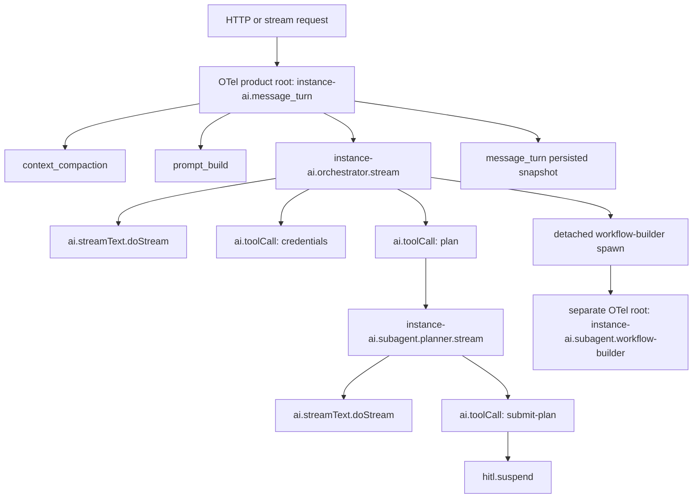

# Instance AI Tracing Specs

Status: planning OTel-canonical rewrite

Last updated: 2026-05-05

## Decision

Instance AI live tracing will use OpenTelemetry as the single canonical trace
model.

We will stop mixing LangSmith `RunTree` spans with OTel spans for normal
execution. Product concepts such as message turns, orchestrator work,
sub-agent work, HITL, background jobs, and selected local tool executions must
be represented as OTel spans. Native AI SDK spans for model calls, provider
requests, messages, tool calls, and token usage stay in the same OTel tree.

`RunTree` should not be used as a live trace hierarchy once this migration is
complete. If LangSmith feedback or legacy replay needs a compatibility path,
that path must be isolated and must not parent or reshape OTel spans.

## Why

The hybrid implementation proved useful but has the wrong shape:

- RunTree spans show Instance AI product semantics.
- OTel spans show the real AI SDK and provider semantics.
- LangSmith does not reliably roll up token usage or child spans across those
  two ingestion models.
- Attempts to force-parent native OTel spans under RunTree spans caused native
  LLM spans to disappear.

The correct model is to make product tracing use the same OTel tracer and
context as native LLM telemetry.

## Goals

1. A foreground message turn has one canonical OTel trace tree.
2. Inline work, including orchestrator LLM calls and inline planner calls, is
   parented by OTel context propagation.
3. Detached/background sub-agents may remain separate OTel trace roots, but
   they must carry thread and spawning metadata.
4. LangSmith shows real AI SDK LLM/provider spans with messages, tool schemas,
   tool choice, tool calls, response summaries, timings, cost, and token usage.
5. Product spans remain visible for Instance AI concepts that providers do not
   know about: message turns, context compaction, prompt building, HITL,
   workflow build orchestration, workspace edits, validation, replay
   boundaries, and background jobs.
6. Feedback remains attachable to a stable persisted trace/run identifier.
7. Direct LangSmith credentials and AI service proxy routing both keep working.
8. Trace replay remains deterministic and independent from LangSmith run shape.
9. Redaction and input/output recording controls are explicit and enforced
   before detailed payloads are exported.

## Non-Goals

- Preserve the Mastra-era LangSmith tree shape.
- Preserve the temporary hybrid RunTree plus OTel shape.
- Rebuild provider-level LLM traces manually.
- Roll product analytics or audit logging into LangSmith tracing.
- Store full workflow JSON, file contents, credentials, or decrypted node
  parameters in tracing payloads by default.

## Current State

Implemented so far:

- `@n8n/agents` can build LangSmith OTel telemetry.
- Native AI SDK spans are visible in LangSmith when not forced into RunTree
  parentage.
- `@n8n/agents` creates runtime root spans around generate/stream loops.
- `@n8n/agents` emits AI-SDK-compatible `ai.toolCall` spans for local tool
  execution.
- Instance AI can create native telemetry with thread metadata and service
  proxy headers.
- Normal Instance AI execution no longer disables AI SDK telemetry.
- The LangSmith OTel processor filters noisy AI SDK wrapper spans so provider
  request spans such as `ai.streamText.doStream` can appear directly under the
  agent root.
- Instance AI product roots and child spans now use the same OTel
  tracer/provider as native agent telemetry in normal execution.
- Normal foreground and detached trace creation no longer creates RunTree spans.
- Agent tree snapshots persist OTel trace/span IDs alongside derived LangSmith
  IDs for feedback anchoring.

Still wrong:

- Live LangSmith validation has proved feedback against an OTel-only product
  root; full provider-span validation with a real model turn is still pending.
- Some fallback RunTree compatibility code remains for legacy/replay-only
  paths and should be deleted after rollout validation.
- Detached sub-agent linking captures spawning trace/span metadata and model
  tool-call IDs when a detached task is spawned from a local tool handler.

## Hybrid Reference Notes

The last working hybrid traces showed RunTree product nodes such as
`message_turn`, `orchestrator`, `context_compaction`, `prompt_build`, and
`subagent:planner` beside native OTel nodes such as `ai.streamText.doStream`.
This proved product semantics and native AI SDK telemetry could both be
exported, but LangSmith displayed them as split turn/root groups and did not
roll token usage up to the product roots.

The failure mode to avoid is forcing native OTel spans under RunTree IDs. In
that shape, LangSmith can lose or separate provider spans, and the trace no
longer shows the complete system/user/tool/provider turn under a single OTel
context. Regression coverage now asserts normal Instance AI trace creation does
not create RunTree spans.

## Target Architecture



The foreground trace is rooted by `instance-ai.message_turn`. The root span is
created before context compaction, prompt building, and the first LLM call.

Inline sub-agents inherit the active OTel context and remain inside the
foreground trace.

Detached/background sub-agents can be separate OTel trace roots. They are not
children in the live OTel tree if they run outside the request lifecycle, but
they must be queryable by the same thread ID and linked to the spawning span via
metadata.

## Canonical Trace Shapes

Foreground message turn:

```text
instance-ai.message_turn                 chain
  instance-ai.context_compaction         chain
  instance-ai.prompt_build               chain
  instance-ai.orchestrator.stream        chain
    ai.streamText.doStream               llm
    ai.toolCall                          tool  credentials
    ai.streamText.doStream               llm
    ai.toolCall                          tool  plan
      instance-ai.subagent.planner.stream chain
        ai.streamText.doStream           llm
        ai.toolCall                      tool  templates
        ai.toolCall                      tool  credentials
        ai.streamText.doStream           llm
        ai.toolCall                      tool  submit-plan
          instance-ai.hitl.suspend       chain/tool
```

Resume after HITL, same process:

```text
instance-ai.message_turn
  instance-ai.orchestrator.resume
    ai.toolCall                          tool  submit-plan:resume
    ai.streamText.doStream               llm
```

Resume after HITL, different process:

```text
instance-ai.message_turn.resume          chain
  instance-ai.orchestrator.resume        chain
    ai.toolCall                          tool  submit-plan:resume
    ai.streamText.doStream               llm
```

The resumed root must include `resumed_from_trace_id`,
`resumed_from_span_id`, `message_group_id`, and `pending_tool_call_id`.

Detached workflow builder:

```text
instance-ai.subagent.workflow-builder    chain
  ai.streamText.doStream                 llm
  ai.toolCall                            tool  credentials
  ai.toolCall                            tool  workspace_write_file
  ai.toolCall                            tool  workspace_execute_command
  ai.toolCall                            tool  workspace_str_replace_file
  ai.toolCall                            tool  submit-workflow
  ai.toolCall                            tool  executions
```

## RunTree Policy

RunTree is not part of the target live trace hierarchy.

Rules:

- Do not create RunTree spans for `message_turn`, `orchestrator`,
  `subagent:*`, `tool:*`, or `hitl:*` in normal execution.
- Do not set OTel span parents to RunTree run IDs.
- Do not set RunTree trace IDs on native OTel spans to merge two ingestion
  models.
- Do not use RunTree ordering as replay input.
- Do not wrap local tools in RunTree just to make them visible in LangSmith.

Allowed compatibility uses:

- A temporary feedback adapter may query or derive the OTel product root run ID
  for `Client.createFeedback`.
- A temporary migration flag may emit both systems for comparison, but the
  dual-emission mode must be disabled by default and must not be the production
  target.

## Feedback Anchoring

Instance AI still needs stable IDs for feedback and persisted snapshots.

Target snapshot fields:

- `traceId`: OTel trace ID
- `spanId`: OTel span ID for `instance-ai.message_turn`
- `langsmithTraceId`: LangSmith trace UUID, if known or derivable
- `langsmithRunId`: LangSmith run UUID for the product root, if known or
  derivable
- `threadId`
- `messageId`
- `messageGroupId`
- `agentRunId`

Implementation options, in preferred order:

1. Create the OTel product root with explicit LangSmith IDs using supported
   LangSmith OTel attributes, then persist those IDs.
2. Persist the OTel trace/span IDs and derive the LangSmith IDs using the same
   conversion LangSmith applies during OTel ingestion.
3. Persist OTel IDs and resolve the LangSmith run by metadata lookup before
   creating feedback.

The migration must prove feedback against a live OTel-only trace before RunTree
feedback anchoring is removed.

## Metadata Contract

Every Instance AI OTel root and child span must include the stable thread
metadata needed for LangSmith thread views and debugging.

Required metadata attributes:

- `langsmith.metadata.thread_id`
- `thread_id`
- `conversation_id`
- `message_id`
- `message_group_id`
- `run_id`
- `agent_role`
- `execution_mode`
- `instance_ai.trace_version = otel-v2`

Optional metadata attributes:

- `workflow_id`
- `project_id`
- `user_id`, when safe to store
- `agent_id`
- `task_id`
- `planned_task_id`
- `work_item_id`

Detached sub-agent metadata:

- `spawned_by_trace_id`
- `spawned_by_span_id`
- `spawned_by_run_id`, if available
- `spawned_by_agent_role`
- `spawned_by_tool_call_id`
- `subagent_role`
- `subagent_task_id`

Resume metadata:

- `resumed_from_trace_id`
- `resumed_from_span_id`
- `resumed_from_run_id`, if available
- `pending_tool_call_id`
- `resume_action`

The metadata builder belongs in Instance AI. The generic attribute conversion
and redaction helpers can move to `@n8n/ai-utilities` if they are not
LangSmith-specific.

## Span Naming

Use stable, searchable names.

Product chain spans:

- `instance-ai.message_turn`
- `instance-ai.message_turn.resume`
- `instance-ai.context_compaction`
- `instance-ai.prompt_build`
- `instance-ai.orchestrator.stream`
- `instance-ai.orchestrator.generate`
- `instance-ai.orchestrator.resume`
- `instance-ai.subagent.<role>.stream`
- `instance-ai.subagent.<role>.generate`
- `instance-ai.background.<kind>`

Product tool or side-effect spans:

- `instance-ai.hitl.suspend`
- `instance-ai.hitl.resume`
- `instance-ai.tool.workspace_edit`
- `instance-ai.tool.workflow_validation`
- `instance-ai.tool.workflow_submit`
- `instance-ai.tool.daytona`
- `instance-ai.tool.background_task`

Native AI SDK spans:

- `ai.streamText.doStream`
- `ai.generateText.doGenerate`
- `ai.toolCall`

The noisy AI SDK wrapper spans such as `ai.streamText` may be filtered from
LangSmith export as long as provider request spans, tool spans, and product
root spans remain correctly parented.

## Span Kinds and Inputs

Use LangSmith-compatible span attributes:

- Product orchestration spans: `langsmith.span.kind = chain`
- Local execution spans: `langsmith.span.kind = tool`
- Native provider spans: emitted by AI SDK and translated as `llm`
- Root or named spans: `langsmith.trace.name`
- Thread grouping: `langsmith.metadata.thread_id`

Product span inputs and outputs must be summaries, not raw large payloads.

Examples:

- Context compaction input: message counts, token estimates, compaction mode.
- Prompt build output: prompt section names and total estimated tokens.
- Workspace edit output: file path, operation type, replacements, diff summary.
- Workflow submission output: workflow ID, node count, validation summary.
- HITL output: pending tool call ID, tool name, safe user decision summary.

## Native LLM Telemetry

All normal Instance AI model calls must use native `@n8n/agents` telemetry.

Required behavior:

- `AgentRuntime` passes `experimental_telemetry` to AI SDK calls.
- `functionId` is stable and role-specific, for example
  `instance-ai.orchestrator` or `instance-ai.subagent.planner`.
- Runtime root spans are created with the same active OTel context as the
  product span that invoked them.
- Provider spans show messages, tool schemas, tool choice, finish reason,
  timing, response metadata, cost, and token usage when recording policy allows
  it.
- Local tools executed by `@n8n/agents` emit AI-SDK-compatible `ai.toolCall`
  spans.
- The telemetry provider is flushed at turn end, before suspension persistence,
  and after detached task completion.

Normal execution must never set
`experimental_telemetry: { isEnabled: false }` when LangSmith tracing is
enabled.

## Tool Tracing

Tool tracing has two layers in OTel:

1. Model-facing tool calls

   These come from AI SDK telemetry. They describe what the model saw and chose.

2. n8n-side tool execution

   These are local handler spans. They describe what n8n did.

Default local tool execution should use `ai.toolCall` spans with:

- `ai.operationId = ai.toolCall`
- `ai.toolCall.name`
- `ai.toolCall.id`
- `ai.toolCall.args`, when input recording is enabled
- `ai.toolCall.result`, when output recording is enabled
- `ai.telemetry.metadata.*`

Add additional product side-effect spans only when a normal `ai.toolCall` span
is not enough. Workspace edits, Daytona operations, workflow submission,
workflow validation, and HITL are valid examples.

## Service Proxy Support

Instance AI must support two LangSmith routing modes:

1. Direct LangSmith credentials.
2. AI service proxy routing with per-request auth headers.

`@n8n/agents` owns generic LangSmith OTLP exporter construction. Instance AI
owns request-scoped proxy header creation and safe routing decisions.

Security requirement: if a LangSmith API key is resolved by the engine, user
controlled endpoint overrides must not be able to redirect that key.

## Redaction and Recording Policy

Native telemetry can expose system prompts, messages, tool schemas, tool
arguments, and outputs. This is useful for debugging and risky in production.

Required policy:

- Self-hosted deployments remain opt-in for LangSmith tracing.
- Production recording defaults must be explicitly reviewed.
- Credentials, API keys, bearer tokens, cookies, decrypted node parameters, and
  auth headers must never be exported.
- Workflow JSON and workspace file contents should be summarized by default.
- Tool schemas may be exported.
- Tool arguments and tool outputs must pass through redaction before export.
- Redaction must preserve token usage attributes.

Recommended defaults:

| Environment | Tracing | Record inputs | Record outputs |
| --- | --- | --- | --- |
| Local development | opt-in | true | true |
| Internal dogfood | enabled by config | true with redaction | true with redaction |
| Cloud production | controlled rollout | to be decided | to be decided |
| Self-hosted | opt-in | false by default | false by default |

## Trace Replay

Replay must be independent from LangSmith and independent from OTel span IDs.

Replay records stable Instance AI events:

- message turn start/end
- model request summary
- model response summary
- tool call request
- local tool execution result
- HITL suspend/resume
- detached task lifecycle
- workflow submission and validation summary

Replay may emit replay-tagged OTel traces for debugging, but replay correctness
must not require LangSmith to be available.

## Package Responsibilities

`@n8n/agents` owns:

- generic telemetry builder APIs
- LangSmith OTLP tracer/provider construction
- LangSmith OTel span filtering
- mapping telemetry into AI SDK `experimental_telemetry`
- runtime root spans around generate/stream loops
- AI-SDK-compatible local `ai.toolCall` spans
- provider flush and shutdown hooks
- generic telemetry integration hooks

`@n8n/instance-ai` owns:

- product OTel trace context creation
- thread metadata construction
- product span helpers for message turns, context compaction, prompt building,
  HITL, background tasks, workflow build loops, and selected side-effect tools
- feedback snapshot persistence
- service proxy request metadata and headers
- detached sub-agent linking metadata
- trace replay events

`@n8n/ai-utilities` may own:

- shared redaction helpers
- JSON-safe telemetry value conversion
- safe payload summary helpers
- LangSmith-independent metadata utilities

## Migration Plan

1. Document and freeze the current hybrid behavior

   - [x] Keep examples of a working hybrid trace with native LLM spans.
   - [x] Keep examples of the failure mode when OTel spans are forced under
     RunTree parent IDs.
   - [x] Add a short note in tests or fixtures explaining why RunTree/OTel
     parent mixing is forbidden.

2. Add an OTel product tracing adapter

   - [x] Create an Instance AI adapter that starts active OTel spans using the
     same tracer/provider as native agent telemetry.
   - [x] Support `withSpan`, `startSpan`, `finishSpan`, `failSpan`, and
     metadata merging.
   - [x] Ensure active context propagates into `@n8n/agents` runtime calls.
   - [x] Ensure spans flush before response close, suspension persistence, and
     detached task completion.

3. Replace RunTree message turn roots

   - [x] Create `instance-ai.message_turn` as an OTel root span.
   - [x] Persist OTel trace/span IDs in the agent tree snapshot.
   - [x] Add metadata required by LangSmith thread view.
   - [x] Remove RunTree creation from the normal foreground path.

4. Replace RunTree product child spans

   - [x] Convert `orchestrator`, `context_compaction`, and `prompt_build` to
     OTel spans.
   - [x] Convert inline `subagent:*` spans to OTel spans under active context.
   - [x] Convert HITL suspend/resume spans to OTel spans.
   - [x] Convert selected side-effect-heavy tools to OTel product spans.

5. Preserve detached/background sub-agent linking

   - [x] Create detached sub-agent roots as separate OTel traces when they run
     outside the foreground context.
   - [x] Add spawning metadata: trace ID, span ID, tool call ID, task ID, and
     agent role.
   - [ ] Confirm thread queries show detached roots alongside foreground turns.

6. Rework feedback anchoring

   - [x] Choose explicit LangSmith IDs, derived OTel IDs, or metadata lookup.
   - [x] Prove `Client.createFeedback` works against an OTel-only product root.
   - [x] Persist the chosen IDs in the snapshot.
   - [x] Remove RunTree as a feedback dependency.

7. Remove RunTree live tracing

   - [x] Remove normal-path `RunTree` root creation.
   - [x] Remove normal-path manual RunTree tool wrappers.
   - [ ] Keep only temporary compatibility code behind an explicit flag, if
     needed for rollout.
   - [ ] Delete compatibility code after validation.

8. Decouple replay from tracing

   - [x] Ensure replay records stable Instance AI events, not span IDs.
   - [x] Ensure replay tests pass with LangSmith disabled.
   - [ ] Optionally emit replay-tagged OTel spans for debugging only.

9. Add regression coverage

   - [x] Unit test metadata construction.
   - [x] Unit test OTel product span parentage.
   - [x] Unit test feedback ID persistence.
   - [x] Unit test redaction preserving token usage.
   - [ ] Local exporter test proving one foreground message turn contains
     product spans, native provider spans, and local tool spans.
   - [ ] Live LangSmith validation behind explicit credentials.

## Acceptance Criteria

- Foreground message turns are visible as OTel root spans named
  `instance-ai.message_turn`.
- Orchestrator LLM calls are children of the foreground message turn in the OTel
  tree.
- Inline planner work is inside the foreground OTel tree.
- Detached workflow-builder work is queryable by the same thread ID and linked
  by spawning metadata.
- LangSmith shows native provider spans without the noisy `ai.streamText`
  wrapper span.
- LangSmith shows system/user/assistant/tool messages, available tools, tool
  choice, timing, cost, and token usage when recording policy allows it.
- Product root spans and native spans include `langsmith.metadata.thread_id`.
- Product root spans can receive feedback without RunTree.
- HITL suspend/resume remains visible and resumable across process boundaries.
- Trace replay works with LangSmith disabled.
- No normal execution path creates RunTree spans after the migration flag is
  removed.

## Open Questions

1. Which feedback anchoring strategy should we use: explicit LangSmith span IDs,
   derived OTel IDs, or metadata lookup?
2. Should inline sub-agent root spans be named as independent
   `instance-ai.subagent.<role>.stream` spans, or should they stay nested under
   the parent `ai.toolCall` span only?
3. What is the production default for recording prompt messages and tool
   arguments after redaction?
4. How long do we keep a dual-emission migration flag, if at all?
5. Should the product OTel span helper live in Instance AI only, or become a
   generic helper in `@n8n/agents`?

## Implementation Notes

- Prefer OTel active context propagation over explicit parent ID attributes.
- Do not cross-parent OTel spans to RunTree run IDs.
- Do not force OTel spans into an existing RunTree trace ID.
- Keep span names stable and searchable.
- Keep telemetry flush best-effort and non-blocking for user responses where
  possible.
- Keep product span payloads small and redacted.
- Use tags for coarse filtering: `instance-ai`, `foreground`, `background`,
  `hitl`, `detached-subagent`, `replay`.
