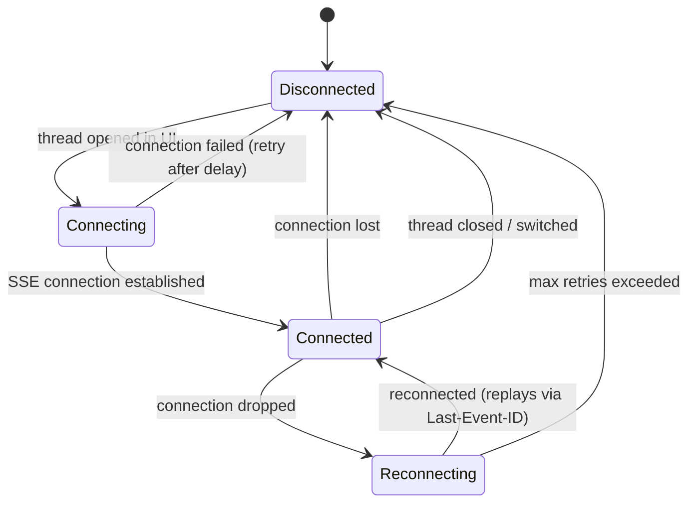

# Frontend Contract & Implementation Plan

This document defines the contract between backend and frontend for the deep
agent architecture. It serves as the source of truth for TypeScript types,
event ordering, state management, and rendering rules.

## Current State

The frontend today uses NDJSON-over-POST with a flat message model:

```
POST /instance-ai/chat/:threadId → NDJSON stream → done
```

- Messages are flat: `{ content, reasoning, toolCalls[] }`
- Tool calls are a flat array per message
- No agent identity — everything comes from "the agent"
- No event persistence — page refresh loses everything
- No run lifecycle — abort via `AbortController` on the fetch

## Target State

SSE event bus with multi-agent tree model:

```
POST /instance-ai/chat/:threadId → { runId }
GET  /instance-ai/events/:threadId → SSE stream (all agent events)
POST /instance-ai/chat/:threadId/cancel → idempotent cancel
```

- Events carry `agentId` — frontend builds an agent activity tree
- Run lifecycle events bracket the entire interaction
- Sub-agent events nest under their parent in the tree
- Events persisted — reconnect replays missed events
- One active run per thread

---

## 1. TypeScript Types

These types should live in `@n8n/api-types` for shared frontend/backend use.

### Event Types

```typescript
/**
 * All possible event types in the Instance AI streaming protocol.
 */
type InstanceAiEventType =
  // Run lifecycle
  | 'run-start'
  | 'run-finish'
  // Agent lifecycle
  | 'agent-spawned'
  | 'agent-completed'
  // Content
  | 'text-delta'
  | 'reasoning-delta'
  // Tool execution
  | 'tool-call'
  | 'tool-result'
  | 'tool-error'
  // Confirmation (HITL)
  | 'confirmation-request'
  // Errors
  | 'error';
```

### Event Schema

Every SSE event follows this shape. The SSE frame includes an integer `id:`
field managed by the server (not part of the JSON payload).

```typescript
/**
 * Base event shape. All events carry runId and agentId.
 */
interface InstanceAiEventBase {
  type: InstanceAiEventType;
  runId: string;     // correlates all events in a single user message → response cycle
  agentId: string;   // which agent produced this event
}

/**
 * Union of all event types with their payloads.
 */
type InstanceAiEvent =
  | RunStartEvent
  | RunFinishEvent
  | AgentSpawnedEvent
  | AgentCompletedEvent
  | TextDeltaEvent
  | ReasoningDeltaEvent
  | ToolCallEvent
  | ToolResultEvent
  | ToolErrorEvent
  | ConfirmationRequestEvent
  | ErrorEvent;
```

### Event Payloads

```typescript
// --- Run lifecycle ---

interface RunStartEvent extends InstanceAiEventBase {
  type: 'run-start';
  payload: {
    messageId: string;   // correlates with the user message that triggered this run
  };
}

interface RunFinishEvent extends InstanceAiEventBase {
  type: 'run-finish';
  payload: {
    status: 'completed' | 'cancelled' | 'error';
    reason?: string;     // e.g. "user_cancelled", error message
  };
}

// --- Agent lifecycle ---

interface AgentSpawnedEvent extends InstanceAiEventBase {
  type: 'agent-spawned';
  // agentId = the NEW sub-agent's ID
  payload: {
    parentId: string;    // orchestrator's agentId
    role: string;        // free-form role (e.g. "workflow builder")
    tools: string[];     // tool names the sub-agent received
  };
}

interface AgentCompletedEvent extends InstanceAiEventBase {
  type: 'agent-completed';
  // agentId = the sub-agent that completed
  payload: {
    role: string;
    result: string;      // synthesized answer
    error?: string;      // if the sub-agent errored
  };
}

// --- Content ---

interface TextDeltaEvent extends InstanceAiEventBase {
  type: 'text-delta';
  payload: {
    text: string;
  };
}

interface ReasoningDeltaEvent extends InstanceAiEventBase {
  type: 'reasoning-delta';
  payload: {
    text: string;
  };
}

// --- Tool execution ---

interface ToolCallEvent extends InstanceAiEventBase {
  type: 'tool-call';
  payload: {
    toolCallId: string;
    toolName: string;
    args: Record<string, unknown>;
  };
}

interface ToolResultEvent extends InstanceAiEventBase {
  type: 'tool-result';
  payload: {
    toolCallId: string;
    result: unknown;
  };
}

interface ToolErrorEvent extends InstanceAiEventBase {
  type: 'tool-error';
  payload: {
    toolCallId: string;
    error: string;
  };
}

// --- Errors ---

interface ErrorEvent extends InstanceAiEventBase {
  type: 'error';
  payload: {
    content: string;
  };
}
```

### Key changes from current types

| Current | New | Why |
|---|---|---|
| No `agentId` | Every event has `agentId` | Multi-agent tree rendering |
| No `runId` | Every event has `runId` | Correlate events to the triggering message |
| `done` event | `run-start` + `run-finish` | Explicit lifecycle with status |
| Implicit orchestrator | `run-start` declares `agentId` | Frontend knows which agent is root |
| No sub-agent lifecycle | `agent-spawned` / `agent-completed` | Tree construction |

### Why `runId`

This was a gap in the original design. Without `runId`:
- The frontend can't associate events with a specific user message
- Historical event replay can't reconstruct which events belong to which
  message/response pair
- Thread persistence (loading past conversations) breaks — you'd see a flat
  stream of events with no message boundaries

`runId` is generated by the backend when POST `/chat/:threadId` is called.
The POST response returns it: `{ runId: "run_abc123" }`. All events in that
run carry the same `runId`.

---

## 2. Event Ordering Contract

### Run lifecycle

Every run follows this sequence. Events within the run can interleave
between agents, but the lifecycle brackets are guaranteed:

```
run-start {agentId: orchestrator}
  ├── [orchestrator events]
  ├── tool-call {toolName: "delegate", agentId: orchestrator}
  │   ├── agent-spawned {agentId: sub-agent, parentId: orchestrator}
  │   ├── [sub-agent events in order]
  │   └── agent-completed {agentId: sub-agent}
  ├── tool-result {toolCallId: delegate-call, agentId: orchestrator}
  ├── [more orchestrator events]
  └── ...
run-finish {agentId: orchestrator, status: "completed"}
```

### Guaranteed ordering rules

1. `run-start` is always the first event in a run
2. `run-finish` is always the last event in a run
3. `agent-spawned` always arrives after the `delegate` `tool-call` and before
   any sub-agent events
4. All sub-agent events arrive between `agent-spawned` and `agent-completed`
5. `agent-completed` always arrives before the `delegate` `tool-result`
6. Within a single agent, events are strictly ordered (no reordering)
7. Events from different agents may interleave (if parallel delegation is
   added in the future), but each agent's events maintain their order

### Sequence: simple query (no delegation)

```
← run-start        {runId: "r1", agentId: "a1"}
← reasoning-delta  {runId: "r1", agentId: "a1", payload: {text: "Let me..."}}
← tool-call        {runId: "r1", agentId: "a1", payload: {toolCallId: "tc1", toolName: "list-workflows"}}
← tool-result      {runId: "r1", agentId: "a1", payload: {toolCallId: "tc1", result: [...]}}
← text-delta       {runId: "r1", agentId: "a1", payload: {text: "You have 3..."}}
← run-finish       {runId: "r1", agentId: "a1", payload: {status: "completed"}}
```

### Sequence: delegation

```
← run-start        {runId: "r1", agentId: "a1"}
← tool-call        {runId: "r1", agentId: "a1", payload: {toolName: "plan", ...}}
← tool-result      {runId: "r1", agentId: "a1", payload: {toolCallId: "tc1", ...}}
← tool-call        {runId: "r1", agentId: "a1", payload: {toolName: "delegate", toolCallId: "tc2", ...}}
← agent-spawned    {runId: "r1", agentId: "a2", payload: {parentId: "a1", role: "workflow builder", ...}}
← tool-call        {runId: "r1", agentId: "a2", payload: {toolName: "create-workflow", ...}}
← tool-result      {runId: "r1", agentId: "a2", payload: {result: {id: "wf-123"}, ...}}
← agent-completed  {runId: "r1", agentId: "a2", payload: {result: "Created wf-123"}}
← tool-result      {runId: "r1", agentId: "a1", payload: {toolCallId: "tc2", result: "Created wf-123"}}
← text-delta       {runId: "r1", agentId: "a1", payload: {text: "Done! ..."}}
← run-finish       {runId: "r1", agentId: "a1", payload: {status: "completed"}}
```

### Sequence: cancellation

```
← run-start        {runId: "r1", agentId: "a1"}
← tool-call        {runId: "r1", agentId: "a1", payload: {toolName: "delegate", ...}}
← agent-spawned    {runId: "r1", agentId: "a2", payload: {...}}
← tool-call        {runId: "r1", agentId: "a2", payload: {toolName: "create-workflow", ...}}
  ... user clicks cancel ...
← agent-completed  {runId: "r1", agentId: "a2", payload: {error: "cancelled"}}
← tool-error       {runId: "r1", agentId: "a1", payload: {toolCallId: "tc2", error: "cancelled"}}
← run-finish       {runId: "r1", agentId: "a1", payload: {status: "cancelled", reason: "user_cancelled"}}
```

---

## 3. API Endpoints

### Send Message

```
POST /instance-ai/chat/:threadId
Content-Type: application/json

Request:  { "message": "Build me a Slack workflow" }
Response: { "runId": "run_abc123" }

Errors:
  409 Conflict — a run is already active on this thread
  400 Bad Request — empty message
```

### Event Stream

```
GET /instance-ai/events/:threadId
Accept: text/event-stream
Last-Event-ID: 42          (optional, for replay)

Response: SSE stream

id: 43
data: {"type":"run-start","runId":"run_abc123","agentId":"agent-001","payload":{"messageId":"msg_xyz"}}

id: 44
data: {"type":"text-delta","runId":"run_abc123","agentId":"agent-001","payload":{"text":"Let me..."}}

...
```

### Cancel Run

```
POST /instance-ai/chat/:threadId/cancel
Response: 200 OK

Idempotent. If no active run, returns 200 (no-op).
```

---

## 4. SSE Connection Lifecycle



### Rules

- **Connect** when the chat panel opens on a thread (or immediately on page
  load if the chat was open)
- **Stay connected** while the chat panel is open, even between runs (idle
  state is fine — no events flow, connection stays open)
- **Reconnect** automatically on connection drop. Native `EventSource`
  handles auto-reconnect and sends `Last-Event-ID` automatically on
  reconnection. The server replays missed events before switching to live.
- **Disconnect** when switching threads (close old connection, open new one
  for the target thread)
- **Disconnect** when the chat panel is closed
- **Replay on open**: When opening a thread (including thread switch), omit
  `lastEventId` to replay the full event history from the beginning. The
  `?lastEventId` query parameter is only used for manual reconnection
  within the same thread (e.g., page reload while chat was open), not for
  thread switches. See `switchThread()` below which deletes the per-thread
  cursor to force full replay.

### SSE client implementation

Use native `EventSource` for simplicity. It handles auto-reconnect and
`Last-Event-ID` on reconnection natively. For initial connections that need
replay (thread switch, page reload), pass `lastEventId` as a query
parameter:

```typescript
function connectSSE(state: InstanceAiStoreState, threadId: string): EventSource {
  const lastEventId = state.lastEventIdByThread[threadId];
  const url = lastEventId != null
    ? `/instance-ai/events/${threadId}?lastEventId=${lastEventId}`
    : `/instance-ai/events/${threadId}`;
  return new EventSource(url);
}

function switchThread(state: InstanceAiStoreState, threadId: string): void {
  // 1. Close current SSE connection
  closeSSE();
  // 2. Clear messages and run state
  state.messages = [];
  state.activeRunId = null;
  // 3. Switch thread
  state.currentThreadId = threadId;
  // 4. Connect WITHOUT lastEventId — replay full history from the beginning.
  //    We intentionally ignore lastEventIdByThread here because we cleared
  //    messages. Using a stored cursor would skip events and show an empty
  //    thread. The lastEventIdByThread entry is updated as replayed events
  //    arrive, so it stays current for subsequent auto-reconnects.
  delete state.lastEventIdByThread[threadId];
  connectSSE(state, threadId);
}
```

The backend SSE endpoint must support both:
- `Last-Event-ID` header (auto-reconnect, handled by browser)
- `?lastEventId` query parameter (manual reconnect, handled by frontend)

### Frontend state

```typescript
type SSEConnectionState = 'disconnected' | 'connecting' | 'connected' | 'reconnecting';
```

Show a subtle reconnecting indicator in the chat header when
`state === 'reconnecting'`.

---

## 5. Store Data Structure

### State

```typescript
interface InstanceAiStoreState {
  // Thread
  currentThreadId: string;
  threads: ThreadSummary[];

  // SSE connection (per-thread)
  sseState: SSEConnectionState;
  lastEventIdByThread: Record<string, number>;  // thread-scoped, not global

  // Active run
  activeRunId: string | null;

  // Messages for the current thread (cleared and reloaded on thread switch)
  messages: InstanceAiMessage[];
}

interface ThreadSummary {
  id: string;
  title: string;
  createdAt: string;
}
```

### Message Model

```typescript
interface InstanceAiMessage {
  id: string;                          // user msg: client-generated UUID; assistant msg: runId
  runId?: string;                      // only on assistant messages — correlates with events
  role: 'user' | 'assistant';
  createdAt: string;

  // User messages: content is the user's text, everything else is empty
  // Assistant messages: populated from events
  content: string;                     // accumulated text-deltas
  reasoning: string;                   // accumulated reasoning-deltas
  isStreaming: boolean;                // true while run is active

  // The agent activity tree for this response (assistant messages only)
  agentTree?: AgentNode;              // root = orchestrator
}
```

### Agent Tree Model

```typescript
/**
 * One node in the agent activity tree. The root node is the orchestrator.
 * Sub-agent nodes are children, nested one level deep.
 */
interface AgentNode {
  agentId: string;
  role: string;                        // "orchestrator" for root, free-form for sub-agents
  tools?: string[];                    // tools available to this agent (from agent-spawned)
  status: 'active' | 'completed' | 'cancelled' | 'error';

  // Content produced by this agent
  textContent: string;                 // accumulated text-deltas for this agent
  reasoning: string;                   // accumulated reasoning-deltas for this agent
  toolCalls: ToolCallState[];          // tool calls made by this agent

  // Sub-agents (one level deep — sub-agents can't have children)
  children: AgentNode[];

  // Result (populated on agent-completed)
  result?: string;
  error?: string;
}

interface ToolCallState {
  toolCallId: string;
  toolName: string;
  args: Record<string, unknown>;
  result?: unknown;
  error?: string;
  isLoading: boolean;

  // For special tools, the frontend renders dedicated UI
  // instead of raw JSON. See section 7.
  renderHint?: 'plan' | 'delegate' | 'default';

  // HITL confirmation (populated by confirmation-request event)
  confirmation?: {
    requestId: string;
    severity: 'destructive' | 'warning' | 'info';
    message: string;
  };
}
```

### Building the tree from events

All event routing uses `event.runId` to find the correct assistant message,
not "current message" heuristics. This ensures correctness during replay
and historical loading where multiple messages exist.

The outer `onSSEMessage` handler tracks `lastEventId` per thread and
delegates to the reducer:

```typescript
function onSSEMessage(state: InstanceAiStoreState, sseEvent: MessageEvent): void {
  // Track last event ID per thread (for reconnection)
  if (sseEvent.lastEventId) {
    state.lastEventIdByThread[state.currentThreadId] = Number(sseEvent.lastEventId);
  }
  const event: InstanceAiEvent = JSON.parse(sseEvent.data);
  handleEvent(state, event);
}
```

```typescript
function handleEvent(state: InstanceAiStoreState, event: InstanceAiEvent): void {
  // Mid-run replay guard: if we receive events for a runId that has no
  // message yet (e.g., reconnect missed the run-start), create the message
  // on the fly so subsequent events aren't dropped.
  if (event.type !== 'run-start' && !findMessageByRunId(state, event.runId)) {
    // Mid-run replay: we missed run-start (e.g., reconnect after it was sent).
    // Create a placeholder. If the first replayed event is agent-spawned, we
    // use its parentId as the root (which is the orchestrator). Otherwise we
    // use the event's own agentId (most likely the orchestrator). This keeps
    // the tree functional — events will either match the root or create
    // children, and findAgentNode handles both cases.
    const rootAgentId = event.type === 'agent-spawned'
      ? event.payload.parentId   // sub-agent event tells us the parent
      : event.agentId;           // most events are from orchestrator
    state.messages.push({
      id: event.runId,
      runId: event.runId,
      role: 'assistant',
      createdAt: new Date().toISOString(),
      content: '',
      reasoning: '',
      isStreaming: true,
      agentTree: {
        agentId: rootAgentId,
        role: 'orchestrator',
        status: 'active',
        textContent: '',
        reasoning: '',
        toolCalls: [],
        children: [],
      },
    });
  }

  switch (event.type) {
    case 'run-start': {
      state.activeRunId = event.runId;
      // Assistant message ID = runId (not the user's messageId)
      const msg: InstanceAiMessage = {
        id: event.runId,
        runId: event.runId,
        role: 'assistant',
        createdAt: new Date().toISOString(),
        content: '',
        reasoning: '',
        isStreaming: true,
        agentTree: {
          agentId: event.agentId,
          role: 'orchestrator',
          status: 'active',
          textContent: '',
          reasoning: '',
          toolCalls: [],
          children: [],
        },
      };
      state.messages.push(msg);
      break;
    }

    case 'text-delta': {
      const msg = findMessageByRunId(state, event.runId);
      const node = findAgentNode(msg, event.agentId);
      if (node) node.textContent += event.payload.text;
      // Also accumulate on the message level for simple rendering
      if (msg?.agentTree && event.agentId === msg.agentTree.agentId) {
        msg.content += event.payload.text;
      }
      break;
    }

    case 'reasoning-delta': {
      const msg = findMessageByRunId(state, event.runId);
      const node = findAgentNode(msg, event.agentId);
      if (node) node.reasoning += event.payload.text;
      if (msg?.agentTree && event.agentId === msg.agentTree.agentId) {
        msg.reasoning += event.payload.text;
      }
      break;
    }

    case 'tool-call': {
      const msg = findMessageByRunId(state, event.runId);
      const node = findAgentNode(msg, event.agentId);
      if (node) {
        node.toolCalls.push({
          toolCallId: event.payload.toolCallId,
          toolName: event.payload.toolName,
          args: event.payload.args,
          isLoading: true,
          renderHint: getRenderHint(event.payload.toolName),
        });
      }
      break;
    }

    case 'tool-result': {
      const msg = findMessageByRunId(state, event.runId);
      const node = findAgentNode(msg, event.agentId);
      const tc = node?.toolCalls.find(t => t.toolCallId === event.payload.toolCallId);
      if (tc) {
        tc.result = event.payload.result;
        tc.isLoading = false;
      }
      break;
    }

    case 'tool-error': {
      const msg = findMessageByRunId(state, event.runId);
      const node = findAgentNode(msg, event.agentId);
      const tc = node?.toolCalls.find(t => t.toolCallId === event.payload.toolCallId);
      if (tc) {
        tc.error = event.payload.error;
        tc.isLoading = false;
      }
      break;
    }

    case 'agent-spawned': {
      const msg = findMessageByRunId(state, event.runId);
      const parent = findAgentNode(msg, event.payload.parentId);
      if (parent) {
        parent.children.push({
          agentId: event.agentId,
          role: event.payload.role,
          tools: event.payload.tools,
          status: 'active',
          textContent: '',
          reasoning: '',
          toolCalls: [],
          children: [],  // no nesting beyond one level
        });
      }
      break;
    }

    case 'agent-completed': {
      const msg = findMessageByRunId(state, event.runId);
      const node = findAgentNode(msg, event.agentId);
      if (node) {
        node.status = event.payload.error ? 'error' : 'completed';
        node.result = event.payload.result;
        node.error = event.payload.error;
      }
      break;
    }

    case 'confirmation-request': {
      const msg = findMessageByRunId(state, event.runId);
      const node = findAgentNode(msg, event.agentId);
      // Match by toolCallId — unambiguous even with multiple loading tool calls
      const tc = node?.toolCalls.find(t => t.toolCallId === event.payload.toolCallId);
      if (tc) {
        tc.confirmation = {
          requestId: event.payload.requestId,
          severity: event.payload.severity,
          message: event.payload.message,
        };
      }
      break;
    }

    case 'error': {
      const msg = findMessageByRunId(state, event.runId);
      if (msg) msg.content += '\n\n*Error: ' + event.payload.content + '*';
      break;
    }

    case 'run-finish': {
      const msg = findMessageByRunId(state, event.runId);
      if (msg) {
        msg.isStreaming = false;
        if (msg.agentTree) {
          const { status } = event.payload;
          msg.agentTree.status = status === 'completed' ? 'completed'
            : status === 'cancelled' ? 'cancelled'
            : 'error';
        }
      }
      state.activeRunId = null;
      break;
    }
  }
}

/**
 * Find the assistant message for a given runId.
 * Assistant messages use runId as their id.
 */
function findMessageByRunId(
  state: InstanceAiStoreState,
  runId: string,
): InstanceAiMessage | undefined {
  return state.messages.find(m => m.runId === runId);
}

/**
 * Find an agent node anywhere in a message's tree by agentId.
 */
function findAgentNode(
  msg: InstanceAiMessage | undefined,
  agentId: string,
): AgentNode | undefined {
  if (!msg?.agentTree) return undefined;
  if (msg.agentTree.agentId === agentId) return msg.agentTree;
  return msg.agentTree.children.find(c => c.agentId === agentId);
}

/**
 * Determine render hint for special tools.
 */
function getRenderHint(toolName: string): ToolCallState['renderHint'] {
  if (toolName === 'plan') return 'plan';
  if (toolName === 'delegate') return 'delegate';
  return 'default';
}
```

---

## 6. Rendering Rules

### Agent Activity Tree

The `AgentActivityTree.vue` component renders the `AgentNode` tree:

```
AgentNode (orchestrator, root)
├── reasoning (collapsible, if non-empty)
├── toolCalls[] (rendered per renderHint)
│   ├── renderHint: 'plan' → PlanCard component
│   ├── renderHint: 'delegate' → DelegateCard + child AgentNode
│   └── renderHint: 'default' → standard ToolCall component
├── children[] (sub-agent nodes, collapsible sections)
│   └── AgentNode (sub-agent)
│       ├── header: role label + tool badges
│       ├── toolCalls[] (standard rendering)
│       ├── textContent (if any)
│       └── result/error summary (on completion)
└── textContent (final response text, rendered as markdown)
```

### Rendering states per agent node

| `status` | Visual |
|---|---|
| `active` | Animated indicator, tool calls show loading spinners |
| `completed` | Section collapses to summary line, expand for detail |
| `cancelled` | Cancelled indicator, incomplete tool calls marked as cancelled |
| `error` | Error indicator, error message shown |

### Sub-agent section behavior

- **While active**: expanded, showing tool calls as they arrive
- **On completion**: collapses to a one-line summary showing role + result
- **User can expand/collapse** manually at any time
- **Default after completion**: collapsed

### Graceful degradation

When there are no sub-agents (simple queries), the tree has only the root
node. This should render identically to the current flat tool call list —
no visual "tree" UI unless sub-agents are present.

---

## 7. Special Tool Rendering

### Plan Tool

When `toolName === 'plan'`, render a `PlanCard` instead of raw JSON.

**On `tool-call`**: Show a plan card skeleton (loading state).

**On `tool-result`**: Populate the card with:
- Goal (text)
- Current phase (highlighted badge)
- Iteration count
- Step list with status indicators:
  - `pending` → grey dot
  - `in_progress` → blue animated dot
  - `completed` → green checkmark
  - `failed` → red X
  - `skipped` → grey strikethrough

**On subsequent plan updates** (another `tool-call` + `tool-result` for
`plan` with `action: "update"`): Update the existing card in place. Match by
`toolName === 'plan'` — there is only one active plan per run.

**Compact mode**: Just phase + iteration count. Expandable to full step list.

### Delegate Tool

When `toolName === 'delegate'`, render a `DelegateCard`.

**On `tool-call`**: Show "Delegating to: {args.role}" with:
- Role label (prominent)
- Tool badges (from `args.tools`)
- Briefing text (collapsible, default collapsed)
- Loading indicator

**Between `tool-call` and `tool-result`**: The sub-agent's `AgentNode`
appears as a child. Its events render inside a nested section below the
delegate card.

**On `tool-result`**: Show the synthesized result. The sub-agent section
collapses to summary.

---

## 8. Error Handling

### SSE connection errors

| Scenario | Frontend behavior |
|---|---|
| Connection fails to establish | Show error banner, retry with backoff |
| Connection drops mid-run | Show "Reconnecting..." indicator, auto-reconnect with `Last-Event-ID` |
| Max retries exceeded | Show persistent error: "Connection lost. Refresh to retry." |
| Server returns 401/403 | Redirect to login |

### Event-level errors

| Scenario | Frontend behavior |
|---|---|
| `error` event | Append error message to the orchestrator's content |
| `tool-error` event | Show error on the specific tool call |
| `agent-completed` with `error` | Show error on the sub-agent node, mark as errored |
| `run-finish` with `status: "error"` | Mark message as errored, re-enable input |
| Unknown `agentId` in event | Log warning, ignore event (defensive) |
| Malformed event (JSON parse failure) | Log warning, skip event |

### Run state errors

| Scenario | Frontend behavior |
|---|---|
| POST returns 409 | Toast: "Agent is still working on your previous message" |
| POST returns 500 | Toast: "Failed to send message. Try again." |
| Cancel returns 500 | Toast: "Failed to cancel. Try again." |

---

## 9. Migration Path

The migration from current NDJSON to SSE should be done in two steps to
avoid a big-bang switch:

### Step 1: Backend serves both (transitional)

- New SSE endpoint exists alongside the old NDJSON POST
- NDJSON POST still works (returns stream as before)
- Events published to event bus AND written to NDJSON response
- Frontend can be switched to SSE independently

### Step 2: Frontend switches to SSE

- Replace `streamRequest()` with native `EventSource` (see section 4 for
  `lastEventId` query parameter pattern)
- Replace flat message model with agent tree model
- Old NDJSON code path removed
- POST endpoint returns `{ runId }` only

This allows backend and frontend to be deployed independently during the
transition.

---

## 10. Confirmation Events (HITL)

The confirmation protocol (AI-2104) adds one SSE event type for requesting
user approval on destructive/high-impact tool calls. The user's response is
a POST, not an SSE event.

```typescript
interface ConfirmationRequestEvent extends InstanceAiEventBase {
  type: 'confirmation-request';
  payload: {
    requestId: string;
    toolCallId: string;         // correlates to the tool-call that needs approval
    toolName: string;
    args: Record<string, unknown>;
    severity: 'destructive' | 'warning' | 'info';
    message: string;            // human-readable description of the action
  };
}
```

This type is included in the `InstanceAiEventType` union and `InstanceAiEvent`
union above.

**Frontend flow:**
1. `confirmation-request` arrives via SSE — render approval card on the
   matching tool call (matched by `payload.toolCallId`)
2. User clicks Approve/Deny → frontend sends
   `POST /instance-ai/confirm/:requestId` with `{ approved: boolean }`
3. Backend tool execution continues (or returns denial)
4. Normal `tool-result` or `tool-error` follows

---

## 11. Open Questions

- **Thread history API**: How does the frontend load past messages when
  opening a thread? Separate REST endpoint with paginated messages + their
  event trees? Or replay all events via SSE from the beginning?
- **Event retention**: How long are events kept in thread storage? Should
  old events be compacted? (Deferred to Production Readiness)
- **Parallel delegation**: Can the orchestrator delegate to multiple
  sub-agents simultaneously? If so, events from different sub-agents
  interleave. The tree model supports this (multiple children on the root
  node) but the rendering hasn't been designed for it yet.
- **`agentId` format**: Should be a short, human-readable ID (e.g.
  `agent-001`, `agent-002`) rather than a UUID. The frontend displays it in
  debugging contexts.
