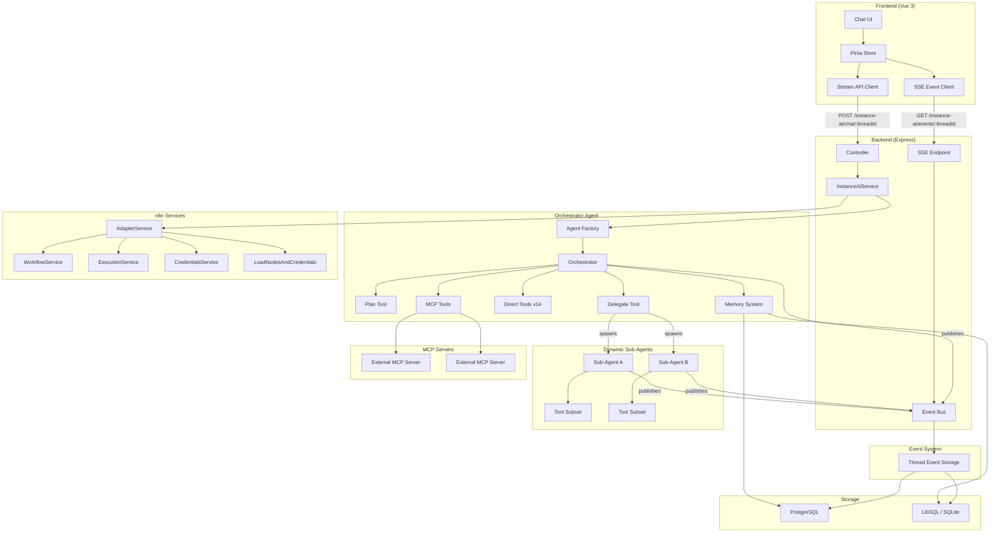
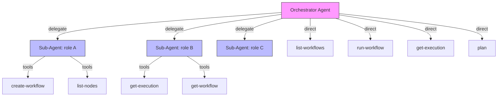

# Architecture

## Overview

Instance AI is an autonomous agent embedded in every n8n instance. It provides a
natural language interface to workflows, executions, credentials, and nodes — with
the goal that most users never need to interact with workflows directly.

The system follows the **deep agent architecture** — an orchestrator with explicit
planning, dynamic sub-agent delegation, observational memory, and structured
prompts. The LLM controls the execution loop; the architecture provides the
primitives.

The system is LLM-agnostic and designed to work with any capable language model.

## System Diagram

## Deep Agent Architecture

The system implements the four pillars of the deep agent pattern:

### 1. Explicit Planning

The orchestrator uses a `plan` tool to externalize its execution strategy.
Between phases of the autonomous loop, the orchestrator reviews and updates the
plan. This serves as a context engineering mechanism — writing the plan forces
structured reasoning, and reading it back prevents goal drift over long loops.

Plans are stored in thread-scoped storage (see ADR-017).

### 2. Dynamic Sub-Agent Composition

The orchestrator composes sub-agents on the fly via the `delegate` tool. Instead
of a fixed taxonomy (Builder, Debugger, Evaluator), the orchestrator specifies:

- **Role** — free-form description ("workflow builder", "credential validator")
- **Instructions** — task-specific system prompt
- **Tools** — subset of registered tools the sub-agent needs

Sub-agents are stateless (ADR-011), get clean context windows, and publish events
directly to the event bus (ADR-014). They cannot spawn their own sub-agents.

### 3. Observational Memory

Mastra's observational memory compresses old messages into dense observations via
background Observer and Reflector agents. Tool-heavy workloads (workflow
definitions, execution results) get 5–40x compression. This prevents context
degradation over 50+ step autonomous loops (see ADR-016).

### 4. Structured System Prompt

The orchestrator's system prompt covers delegation patterns, planning discipline,
loop behavior, and tool usage guidelines. Sub-agents get focused, task-specific
prompts written by the orchestrator.

## Agent Hierarchy

**Orchestrator** handles directly:
- Read-only queries (list-workflows, get-execution, list-credentials)
- Execution triggers (run-workflow)
- Planning (plan tool — always direct)

**Sub-agents** handle via delegation:
- Complex multi-step operations (building workflows, debugging failures)
- Tasks that benefit from clean context (no accumulated noise)

The orchestrator decides what to delegate based on complexity — simple reads
stay direct, complex operations go to focused sub-agents.

## Package Responsibilities

### `@n8n/instance-ai` (Core)

The agent package — framework-agnostic business logic.

- **Agent factory** — creates orchestrator instances with tools, memory, and MCP
- **Orchestration tools** — `plan` and `delegate` tools for the deep agent loop
- **Domain tools** — 16 native tools across 4 domains
- **Sub-agent factory** — creates stateless sub-agents with tool subsets
- **Memory system** — working memory, observational memory, semantic recall
- **Event bus interface** — publishing agent events to the thread channel
- **MCP client** — manages connections to external MCP servers
- **System prompt** — orchestrator behavior, delegation patterns, loop instructions
- **Types** — all shared interfaces and data models

This package has **no dependency on n8n internals**. It defines service interfaces
(`InstanceAiWorkflowService`, etc.) that the backend adapter implements.

### `packages/cli/src/modules/instance-ai/` (Backend)

The n8n integration layer.

- **Module** — lifecycle management, DI registration, settings exposure
- **Controller** — HTTP POST endpoint for messages, SSE endpoint for events
- **Service** — orchestrates agent creation, config parsing, storage setup
- **Adapter** — bridges n8n services to agent interfaces, enforces permissions
- **Event bus** — in-process EventEmitter (single instance) or Redis Pub/Sub
  (queue mode), with thread storage for event persistence and replay

### `packages/frontend/.../instanceAi/` (Frontend)

The chat interface.

- **Store** — thread management, message state, agent tree rendering
- **SSE client** — subscribes to event stream, handles reconnect with replay
- **API client** — POST request to send messages
- **Agent tree** — renders orchestrator + sub-agent events as a collapsible tree
- **Types** — message, tool call, agent event, and stream chunk definitions

## Key Design Decisions

### 1. Clean Interface Boundary

The `@n8n/instance-ai` package defines service interfaces, not implementations.
The backend adapter implements these against real n8n services. This means:

- The agent core is testable in isolation
- The agent core can be reused outside n8n (e.g., CLI, tests)
- Swapping the agent framework doesn't affect n8n integration

### 2. Agent Created Per Request

A new orchestrator instance is created for each `sendMessage` call. This is
intentional:

- MCP server configuration can change between requests
- User context (permissions) is request-scoped
- Memory is handled externally (storage-backed), not in-agent
- Sub-agents are created dynamically within the request lifecycle

### 3. Pub/Sub Streaming

The event bus decouples agent execution from event delivery:

- All agents (orchestrator + sub-agents) publish to a per-thread channel
- Frontend subscribes via SSE with `Last-Event-ID` for reconnect/replay
- All events carry `runId` (correlates to triggering message) and `agentId`
- SSE events use monotonically increasing per-thread `id` values for replay
- SSE supports both `Last-Event-ID` header and `?lastEventId` query parameter
- Events are persisted to thread storage regardless of transport
- No need to pipe sub-agent streams through orchestrator tool execution
- One active run per thread (additional `POST /chat` is rejected while active)
- Cancellation via `POST /instance-ai/chat/:threadId/cancel` (idempotent)

### 4. Module System Integration

Instance AI uses n8n's module system (`@BackendModule`). This means:

- It can be disabled via `N8N_DISABLED_MODULES=instance-ai`
- It only runs on `main` instance type (not workers)
- It exposes settings to the frontend via the module `settings()` method
- It has proper shutdown lifecycle for MCP connection cleanup

## Security Model

- **Permission scoping** — all operations go through n8n's permission system via the adapter
- **Credential safety** — tool outputs never include decrypted secrets (ADR-010)
- **Memory isolation** — working memory is user-scoped; messages, observations,
  plans, and event history are thread-scoped
- **Sub-agent containment** — sub-agents cannot spawn their own sub-agents,
  can only use native domain tools from the registered pool (no MCP tools), and
  have low `maxSteps`
- **Module gating** — disabled by default unless `N8N_INSTANCE_AI_MODEL` is set
