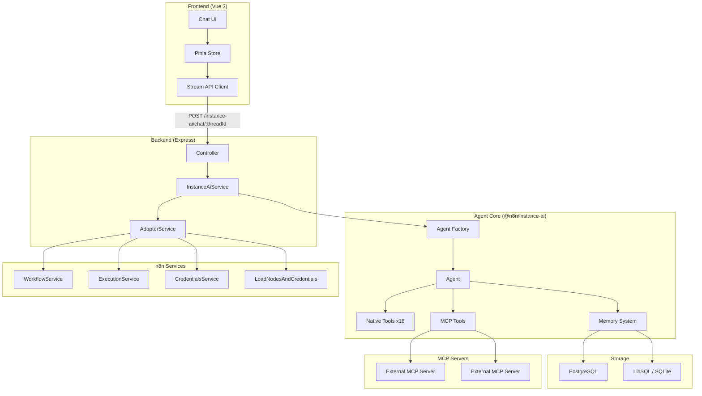

# Architecture

## Overview

Instance AI is an autonomous agent embedded in every n8n instance. It provides a
natural language interface to workflows, executions, credentials, and nodes — with
the goal that most users never need to interact with workflows directly.

The system is LLM-agnostic and designed to work with any capable language model.

## System Diagram

## Package Responsibilities

### `@n8n/instance-ai` (Core)

The agent package — framework-agnostic business logic.

- **Agent factory** — creates agent instances with tools, memory, and MCP
- **Tool definitions** — 18 native tools across 4 domains
- **Memory system** — multi-tier with working memory, semantic recall
- **MCP client** — manages connections to external MCP servers
- **System prompt** — agent behavior and guidelines
- **Types** — all shared interfaces and data models

This package has **no dependency on n8n internals**. It defines service interfaces
(`InstanceAiWorkflowService`, etc.) that the backend adapter implements.

### `packages/cli/src/modules/instance-ai/` (Backend)

The n8n integration layer.

- **Module** — lifecycle management, DI registration, settings exposure
- **Controller** — HTTP streaming endpoint (`POST /instance-ai/chat/:threadId`)
- **Service** — orchestrates agent creation, config parsing, storage setup
- **Adapter** — bridges n8n services to agent interfaces, enforces permissions

### `packages/frontend/.../instanceAi/` (Frontend)

The chat interface.

- **Store** — thread management, message state, streaming chunk handling
- **API client** — stream request wrapper with abort support
- **Types** — message, tool call, and stream chunk definitions

## Key Design Decisions

### 1. Clean Interface Boundary

The `@n8n/instance-ai` package defines service interfaces, not implementations.
The backend adapter implements these against real n8n services. This means:

- The agent core is testable in isolation
- The agent core can be reused outside n8n (e.g., CLI, tests)
- Swapping the agent framework doesn't affect n8n integration

### 2. Agent Created Per Request

A new agent instance is created for each `sendMessage` call. This is intentional:

- MCP server configuration can change between requests
- User context (permissions) is request-scoped
- Memory is handled externally (storage-backed), not in-agent

### 3. Streaming-First

The entire pipeline is streaming from agent to browser:

- Agent produces an async iterable of chunks
- Controller writes each chunk as newline-delimited JSON
- Frontend processes chunks incrementally
- No buffering at any layer (nginx buffering explicitly disabled)

### 4. Module System Integration

Instance AI uses n8n's module system (`@BackendModule`). This means:

- It can be disabled via `N8N_DISABLED_MODULES=instance-ai`
- It only runs on `main` instance type (not workers)
- It exposes settings to the frontend via the module `settings()` method
- It has proper shutdown lifecycle for MCP connection cleanup

## Security Model

- **Permission scoping** — all operations go through n8n's permission system via the adapter
- **Credential safety** — tool outputs never include decrypted secrets
- **Thread isolation** — memory is scoped to `(userId, threadId)` pairs
- **Module gating** — disabled by default unless `N8N_INSTANCE_AI_MODEL` is set
