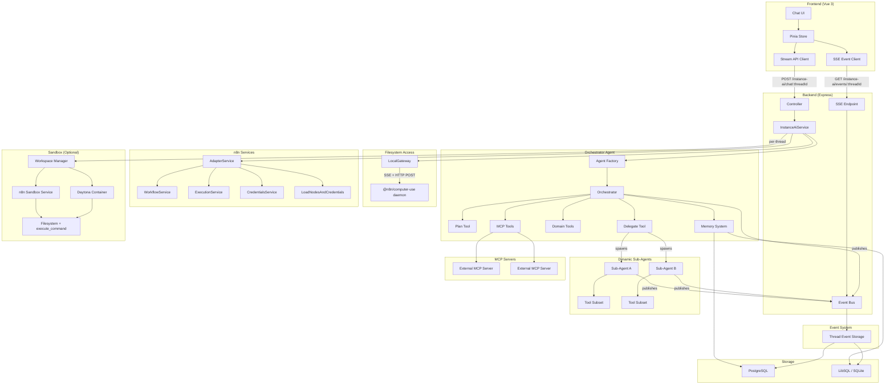
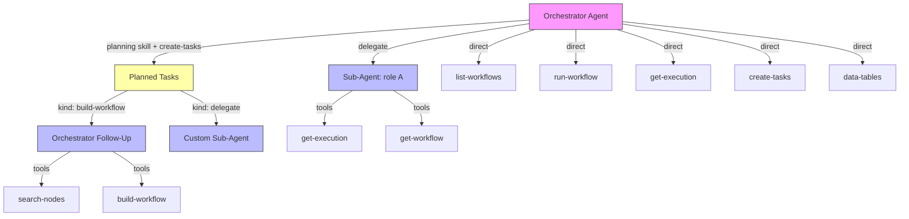

# Architecture

## Overview

Instance AI is an autonomous agent embedded in every n8n instance. It provides a
natural language interface to workflows, executions, credentials, and nodes — with
the goal that most users never need to interact with workflows directly.

The system follows the **deep agent architecture** — an orchestrator with explicit
planning, dynamic sub-agent delegation, observational memory, and structured
prompts. The LLM controls the execution loop; the architecture provides the
primitives.

The system is LLM-agnostic and designed to work with any capable language model.

## System Diagram



## Deep Agent Architecture

The system implements the four pillars of the deep agent pattern:

### 1. Explicit Planning

The orchestrator loads the `planning` skill to externalize its execution
strategy for work that needs dependency coordination: multiple workflows, shared
artifacts, cross-workflow data contracts, or ambiguous business process design.
After normal discovery, it calls `create-tasks` to persist the task graph for
user approval. Clear single-workflow builds, including new and one-off
workflows, go directly to the builder and do not create a plan merely to obtain
verification.

Plans are stored in thread-scoped storage (see ADR-017).

### 2. Dynamic Sub-Agent Composition

The orchestrator composes sub-agents on the fly via the `delegate` tool. Instead
of a fixed taxonomy (Builder, Debugger, Evaluator), the orchestrator specifies:

- **Role** — free-form description ("workflow builder", "credential validator")
- **Instructions** — task-specific system prompt
- **Tools** — subset of registered tools the sub-agent needs

Sub-agents are stateless (ADR-011), get clean context windows, and publish events
directly to the event bus (ADR-014). They cannot spawn their own sub-agents.

### 3. Observational Memory

Mastra's observational memory compresses old messages into dense observations via
background Observer and Reflector agents. Tool-heavy workloads (workflow
definitions, execution results) get 5–40x compression. This prevents context
degradation over 50+ step autonomous loops (see ADR-016).

### 4. Structured System Prompt

The orchestrator's system prompt covers delegation patterns, planning discipline,
loop behavior, and tool usage guidelines. Sub-agents get focused, task-specific
prompts written by the orchestrator.

## Agent Hierarchy



**Orchestrator** handles directly:
- Read-only queries (list-workflows, get-execution, list-credentials)
- Execution triggers (run-workflow)
- Planning (`planning` skill + `create-tasks` — always direct)
- Verification and credential application (verify-built-workflow, apply-workflow-credentials)

**Single-task delegation** (`delegate`):
- Complex multi-step operations that are not handled by a planned build follow-up
- Tasks that benefit from clean context (no accumulated noise)

**Multi-task plans** (`planning` skill + `create-tasks`):
- Dependency-aware task graphs with parallel execution
- Each task dispatched to a preconfigured executor (build-workflow, checkpoint, or delegate)
- User approves the plan before execution starts
- Workflow runtime verification is tracked separately as a workflow-loop
  obligation, so routine "verify workflow" checkpoints are not required

The orchestrator decides what to delegate based on complexity — simple reads
stay direct, complex operations go to focused sub-agents.

## Package Responsibilities

### `@n8n/instance-ai` (Core)

The agent package — framework-agnostic business logic.

- **Agent factory** (`agent/`) — creates orchestrator instances with tools, memory, MCP, and tool search
- **Sub-agent factory** (`agent/`) — creates stateless sub-agents with mandatory protocol and tool subsets
- **Orchestration tools** (`tools/orchestration/`) — `create-tasks`, `delegate`, `update-tasks`, `cancel-background-task`, `correct-background-task`, `verify-built-workflow`, `report-verification-verdict`, `apply-workflow-credentials`
- **Domain tools** (`tools/`) — native tools across workflows, executions, credentials, nodes, data tables, workspace, and web research
- **Knowledge base** (`knowledge-base/`, `workspace/`) — best-practices guides and curated templates materialized in the builder sandbox for workspace tools to read
- **Runtime** (`runtime/`) — stream execution engine, resumable streams with HITL suspension, background task manager, run state registry
- **Planned tasks** (`planned-tasks/`) — task graph coordination, dependency resolution, scheduled execution
- **Workflow loop** (`workflow-loop/`) — deterministic build→verify→debug state machine for workflow builder agents
- **Workflow builder** (`workflow-builder/`) — TypeScript SDK code parsing, validation, patching, and prompt sections
- **Workspace** (`workspace/`) — sandbox provisioning (n8n sandbox service / Daytona), filesystem abstraction, snapshot management
- **Memory** (`memory/`) — title generation, memory configuration
- **Storage** (`storage/`) — iteration logs, task storage, planned task storage, workflow loop storage, agent tree snapshots
- **MCP client** (`mcp/`) — manages connections to external MCP servers, schema sanitization for Anthropic compatibility
- **Domain access** (`domain-access/`) — domain gating and access tracking for external URL approval
- **Stream mapping** (`stream/`) — Mastra chunk → canonical event translation, HITL consumption
- **Event bus interface** (`event-bus/`) — publishing agent events to the thread channel
- **Tracing** (`tracing/`) — LangSmith integration for step-level observability
- **System prompt** (`agent/`) — dynamic context-aware prompt based on instance configuration
- **Types** (`types.ts`) — all shared interfaces, service contracts, and data models

This package has **no dependency on n8n internals**. It defines service interfaces
(`InstanceAiWorkflowService`, etc.) that the backend adapter implements.

### `packages/cli/src/modules/instance-ai/` (Backend)

The n8n integration layer.

- **Module** — lifecycle management, DI registration, settings exposure. Only runs on `main` instance type.
- **Controller** — REST endpoints for messages, SSE events, confirmations, threads, credits, and gateway
- **Service** — orchestrates agent creation, config parsing, storage setup, planned task scheduling, background task management
- **Adapter** — bridges n8n services to agent interfaces, enforces RBAC permissions
- **Memory service** — thread lifecycle, message persistence, expiration
- **Settings service** — admin settings (model, MCP, sandbox), user preferences
- **Event bus** — in-process EventEmitter (single instance) or Redis Pub/Sub
  (queue mode), with thread storage for event persistence and replay (max 500 events or 2 MB per thread)
- **Filesystem** — `LocalGateway` (remote daemon via SSE protocol).
  See `docs/filesystem-access.md`
- **Entities** — TypeORM entities for thread, message, memory, snapshots, iteration logs
- **Repositories** — data access layer (7 TypeORM repositories)

### `packages/@n8n/api-types` (Shared Types)

The contract between frontend and backend.

- **Event schemas** — `InstanceAiEvent` discriminated union, `InstanceAiEventType` enum
- **Agent types** — `InstanceAiAgentStatus`, `InstanceAiAgentKind`, `InstanceAiAgentNode`
- **Task types** — `TaskItem`, `TaskList` for progress tracking
- **Confirmation types** — approval, text input, questions, plan review payloads
- **DTOs** — request/response shapes for REST API
- **Push types** — gateway state changes, credit metering events
- **Reducer** — `AgentRunState`, `InstanceAiMessage` for frontend state machine

### `packages/frontend/.../instanceAi/` (Frontend)

The chat interface.

- **Store** — thread management, message state, agent tree rendering, SSE connection lifecycle
- **Reducer** — event reducer that processes SSE events into agent tree state
- **SSE client** — subscribes to event stream, handles reconnect with replay
- **API client** — REST client for messages, confirmations, threads, memory, settings
- **Agent tree** — renders orchestrator + sub-agent events as a collapsible tree
- **Components** — input, workflow preview, tool call steps, task checklist, credential setup modal, domain access approval, debug/memory panels

## Key Design Decisions

### 1. Clean Interface Boundary

The `@n8n/instance-ai` package defines service interfaces, not implementations.
The backend adapter implements these against real n8n services. This means:

- The agent core is testable in isolation
- The agent core can be reused outside n8n (e.g., CLI, tests)
- Swapping the agent framework doesn't affect n8n integration

### 2. Agent Created Per Request

A new orchestrator instance is created for each `sendMessage` call. This is
intentional:

- MCP server configuration can change between requests
- User context (permissions) is request-scoped
- Memory is handled externally (storage-backed), not in-agent
- Sub-agents are created dynamically within the request lifecycle

### 3. Pub/Sub Streaming

The event bus decouples agent execution from event delivery:

- All agents (orchestrator + sub-agents) publish to a per-thread channel
- Frontend subscribes via SSE with `Last-Event-ID` for reconnect/replay
- All events carry `runId` (correlates to triggering message) and `agentId`
- SSE events use monotonically increasing per-thread `id` values for replay
- SSE supports both `Last-Event-ID` header and `?lastEventId` query parameter
- Events are persisted to thread storage regardless of transport
- No need to pipe sub-agent streams through orchestrator tool execution
- One active run per thread (additional `POST /chat` is rejected while active)
- Cancellation via `POST /instance-ai/chat/:threadId/cancel` (idempotent)

### 4. Module System Integration

Instance AI uses n8n's module system (`@BackendModule`). This means:

- It can be disabled via `N8N_DISABLED_MODULES=instance-ai`
- It only runs on `main` instance type (not workers)
- It exposes settings to the frontend via the module `settings()` method
- It has proper shutdown lifecycle for MCP connection cleanup

## Runtime & Streaming

The agent runtime is built on Mastra's streaming primitives with added
resumability, HITL suspension, and background task management.

### Stream Execution

```
streamAgentRun() → agent.stream() → executeResumableStream()
  ├─ for each chunk: mapMastraChunkToEvent() → eventBus.publish()
  ├─ on suspension: wait for confirmation → agent.resumeStream() → loop
  └─ return StreamRunResult {status, mastraRunId, text}
```

The `executeResumableStream()` loop consumes Mastra chunks, translates them to
canonical `InstanceAiEvent` schema, publishes to the event bus, and handles HITL
suspension/resume cycles. Two control modes:

- **Manual** — returns suspension to caller (used by the orchestrator's main run)
- **Auto** — waits for confirmation and resumes automatically (used by background sub-agents)

### Background Task Manager

Long-running tasks (workflow builds and delegated work) run as
background tasks with concurrency limits (default: 5 per thread). Features:

- **Correction queueing** — users can steer running tasks mid-flight via
  `correct-background-task`
- **Cancellation** — three surfaces converge: stop button, "stop that" message,
  or `cancelRun` (global stop)
- **Message enrichment** — running task context is injected into the orchestrator's
  messages so it can reference task IDs

### Run State Registry

In-memory registry of active, suspended, and pending runs per thread. Manages:

- Active run tracking (one per thread)
- Suspended run state (awaiting HITL confirmation)
- Pending confirmation resolution
- Timeout sweeping for stale suspensions

## Planned Tasks & Workflow Loop

### Planned Task System

The `planning` skill guides discovery and `create-tasks` creates
dependency-aware task graphs for multi-step work. Each task has a `kind` that
determines its executor:

| Kind | Executor | Tools |
|------|----------|-------|
| `build-workflow` | Builder agent | search-nodes, build-workflow, get-node-type-definition, etc. |
| `delegate` | Custom sub-agent | Orchestrator-specified subset |
| `checkpoint` | Orchestrator follow-up | Semantic or cross-workflow validation that standard runtime verification cannot cover |

Standalone data-table work bypasses planned tasks: the orchestrator loads the
`data-table-manager` skill and uses `data-tables` / `parse-file` directly. A
single workflow with a workflow-local table can use the direct builder path;
planning is reserved for shared schema work or real dependency coordination.

Build and delegate tasks run detached as background agents. Checkpoint tasks run
as orchestrator follow-ups when the plan includes an exceptional semantic check.
Dependencies are respected — a task only starts when all its `deps` have
succeeded. The plan is shown to the user for approval before execution begins.

### Workflow Loop State Machine

The workflow builder follows a deterministic state machine for the
build→verify→debug cycle:

```
build → submit → verify → (success | needs_patch | needs_rebuild | failed_terminal)
                              ↓           ↓               ↓
                           finalize    patch+submit    rebuild+submit
                                          ↓               ↓
                                        verify          verify
```

Workflow-loop storage also derives a `WorkflowVerificationObligation` from each
builder outcome. The service uses this obligation as the completion gate for both
direct and planned workflow builds:

- `ready_to_verify` schedules an internal workflow-verification follow-up.
- `verified` reuses structured `verify-built-workflow` evidence.
- `needs_setup` routes to `workflows(action="setup")`.
- `not_verifiable` is a warning/manual-test completion state, not "verified".
- `blocked` carries the build or verification blocker.

The `report-verification-verdict` tool feeds results into the state machine,
which returns guidance for the next action. Same failure signature twice triggers
a terminal state to prevent infinite loops.

## Tool Search & Deferred Tools

To keep the orchestrator's context lean, tools are stratified into two tiers:

- **Core tools** (always-loaded): `create-tasks`, `delegate`, `ask-user`, `web-search`,
  `fetch-url` — these are directly available to the LLM
- **Deferred tools** (behind ToolSearchProcessor): all other domain tools —
  discovered on-demand via `search_tools` and activated via `load_tool`

This follows Anthropic's guidance on tool search for agents with large tool sets.
The processor is configurable via `disableDeferredTools` flag.

## MCP Integration

External MCP servers are owned by `McpClientManager` (`mcp/mcp-client-manager.ts`).
The cli's `InstanceAiService` holds one manager instance and passes it to
`createInstanceAgent` via options; the agent factory calls
`mcpManager.getRegularTools(mcpServers)`. Tool descriptions are:

1. **Schema-sanitized** for Anthropic compatibility (ZodNull → optional,
   discriminated unions → flattened objects, array types → recursive element fix)
2. **Name-checked** against reserved domain tool names (prevents malicious
   shadowing of tools like `run-workflow`)
3. **Separated** from domain tools in the orchestrator's tool set
4. **Cached** by config hash inside the manager — the underlying `MCPClient`
   instances are tracked so `mcpManager.disconnect()` (called during service
   shutdown) closes SSE / stdio connections cleanly.

The local Computer Use server is separate from external MCP configuration. Its
browser tools are available directly to the orchestrator and are guided by the
`credential-setup-with-computer-use` skill when credential setup requires a
browser.

## Tracing & Observability

LangSmith integration provides step-level observability:

- **Agent runs** — root trace spans with metadata (agent_id, thread_id, model)
- **LLM steps** — per-step traces with messages, reasoning, tool calls, usage,
  finish reason
- **Sub-agent traces** — child spans under parent agent runs
- **Synthetic tool traces** — internal tools tracked separately from
  LLM-invoked tools

## Domain Access Gating

The `DomainAccessTracker` manages per-domain approval for external URL access.
When the agent calls `fetch-url`, the domain is checked against the tracker.
Unapproved domains trigger a HITL confirmation with `domainAccess` payload,
allowing the user to approve or deny access to specific hosts.

## Security Model

- **Permission scoping** — all operations go through n8n's RBAC permission system via the adapter (`userHasScopes()`)
- **Credential safety** — tool outputs never include decrypted secrets; credential setup uses the n8n frontend UI where secrets are handled securely
- **HITL confirmation** — destructive operations (delete, publish, restore) require user approval via the suspension protocol
- **Domain access gating** — external URL fetches require per-domain user approval
- **Memory isolation** — messages, observations, plans, and event history are
  thread-scoped. Cross-user isolation is enforced.
- **Sub-agent containment** — sub-agents cannot spawn their own sub-agents,
  can only use native domain tools from the registered pool (no MCP tools), and
  have low `maxSteps`. A mandatory protocol prevents cascading delegation.
- **MCP tool isolation** — MCP tools are name-checked against reserved domain tool
  names to prevent malicious shadowing. Schema sanitization prevents schema-based attacks.
- **Sandbox isolation** — when enabled, code execution runs in isolated Daytona
  containers (not on the host). File writes are path-traversal protected (must
  stay within workspace root). Shell paths are quoted to prevent injection.
  See `docs/sandboxing.md` for details.
- **Filesystem safety** — read-only interface, 512KB file size cap, binary
  detection, default directory exclusions (node_modules, .git, dist), symlink
  escape protection when basePath is set, 30s timeout per gateway request.
  See `docs/filesystem-access.md` for the full security model.
- **Web research safety** — SSRF protection blocks private IPs, loopback, and non-HTTP(S) schemes.
  Post-redirect SSRF check prevents open-redirect attacks. Fetched content is treated as untrusted.
- **Module gating** — disabled by default unless `N8N_INSTANCE_AI_MODEL` is set
