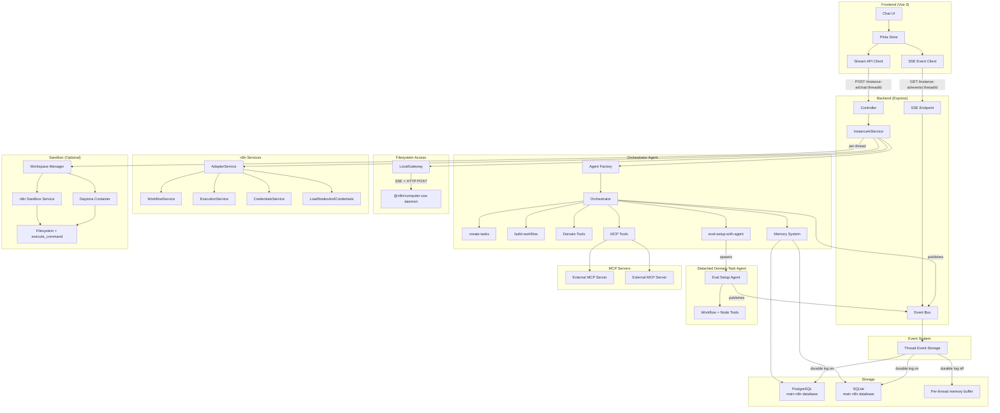
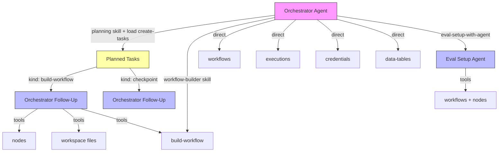

# Architecture

## Overview

Instance AI is an autonomous agent embedded in every n8n instance. It provides a
natural language interface to workflows, executions, credentials, and nodes — with
the goal that most users never need to interact with workflows directly.

The system follows the **deep agent architecture** — an orchestrator with explicit
planning, orchestrator-led workflow building, a specialized eval-setup background
agent, observational memory, and structured prompts. The LLM controls the
execution loop; the architecture provides the primitives.

The system is LLM-agnostic and designed to work with any capable language model.

## System Diagram


```mermaid
graph TB
    subgraph Frontend ["Frontend (Vue 3)"]
        UI[Chat UI] --> Store[Pinia Store]
        Store --> SSE[SSE Event Client]
        Store --> API[Stream API Client]
    end

    subgraph Backend ["Backend (Express)"]
        API -->|POST /instance-ai/chat/:threadId| Controller
        SSE -->|GET /instance-ai/events/:threadId| EventEndpoint[SSE Endpoint]
        Controller --> Service[InstanceAiService]
        EventEndpoint --> EventBus[Event Bus]
    end

    subgraph Orchestrator ["Orchestrator Agent"]
        Service --> Factory[Agent Factory]
        Factory --> OrcAgent[Orchestrator]
        OrcAgent --> CreateTasks[create-tasks]
        OrcAgent --> BuildTool[build-workflow]
        OrcAgent --> DirectTools[Domain Tools]
        OrcAgent --> MCPTools[MCP Tools]
        OrcAgent --> Memory[Memory System]
        OrcAgent --> EvalSetupTool[eval-setup-with-agent]
    end

    subgraph BackgroundAgent ["Detached Domain-Task Agent"]
        EvalSetupTool -->|spawns| EvalSetupAgent[Eval Setup Agent]
        EvalSetupAgent --> EvalTools[Workflow + Node Tools]
    end

    subgraph EventSystem ["Event System"]
        OrcAgent -->|publishes| EventBus
        EvalSetupAgent -->|publishes| EventBus
        EventBus --> ThreadStorage[Thread Event Storage]
    end

    subgraph Filesystem ["Filesystem Access"]
        Service --> Gateway[LocalGateway]
        Gateway -->|SSE + HTTP POST| Daemon["@n8n/computer-use daemon"]
    end

    subgraph n8n ["n8n Services"]
        Service --> Adapter[AdapterService]
        Adapter --> WorkflowService
        Adapter --> ExecutionService
        Adapter --> CredentialsService
        Adapter --> NodeLoader[LoadNodesAndCredentials]
    end

    subgraph Storage ["Storage"]
        Memory --> PostgreSQL[PostgreSQL<br/>main n8n database]
        Memory --> SQLite[SQLite<br/>main n8n database]
        ThreadStorage -->|durable log on| PostgreSQL
        ThreadStorage -->|durable log on| SQLite
        ThreadStorage -->|durable log off| InMemory[Per-thread memory buffer]
    end

    subgraph Sandbox ["Sandbox (Optional)"]
        Service -->|per-thread| WorkspaceManager[Workspace Manager]
        WorkspaceManager --> N8nSandbox[n8n Sandbox Service]
        WorkspaceManager --> DaytonaSandbox[Daytona Container]
        N8nSandbox --> SandboxFS[Filesystem + execute_command]
        DaytonaSandbox --> SandboxFS[Filesystem + execute_command]
    end


    subgraph MCP ["MCP Servers"]
        MCPTools --> ExternalServer1[External MCP Server]
        MCPTools --> ExternalServer2[External MCP Server]
    end
```

## Deep Agent Architecture

The system implements the four pillars of the deep agent pattern:

### 1. Explicit Planning

The orchestrator loads the `planning` skill to externalize its execution
strategy for work that needs dependency coordination: multiple workflows, shared
artifacts, cross-workflow data contracts, or ambiguous business process design.
After normal discovery, it calls `create-tasks` to persist the task graph for
user approval. Clear single-workflow builds, including new and one-off
workflows, go directly to the builder and do not create a plan merely to obtain
verification.

Plans are stored in thread-scoped storage.

### 2. Orchestrator-Led Execution

Most work runs in the orchestrator itself: workflow building via the
`workflow-builder` skill and `build-workflow`, data-table operations, web
research, credential setup with Computer Use, and MCP tools.

The only detached domain-task agent launched by an orchestration tool is the
**eval-setup agent**
(`eval-setup-with-agent`). It patches workflows with EvaluationTrigger and
Evaluation nodes after the user approves an eval proposal. It receives a
focused tool subset, publishes events directly to the event bus, and cannot
spawn further agents.

### 3. Observational Memory

`@n8n/agents` observational memory compresses old messages into observations
through background Observer and Reflector agents. This limits the raw history
that the orchestrator must send to the model during a long loop.

### 4. Structured System Prompt

The orchestrator's system prompt covers planning discipline, loop behavior, and
tool usage guidelines. The eval-setup background agent gets a focused, task-specific
prompt.

## Agent Hierarchy


```mermaid
graph TD
    O[Orchestrator Agent] -->|planning skill + load create-tasks| S3[Planned Tasks]
    O -->|workflow-builder skill| T10[build-workflow]
    O -->|direct| T1[workflows]
    O -->|direct| T2[executions]
    O -->|direct| T3[credentials]
    O -->|direct| T5[data-tables]
    O -->|eval-setup-with-agent| S5[Eval Setup Agent]

    S3 -->|kind: build-workflow| S4[Orchestrator Follow-Up]
    S3 -->|kind: checkpoint| S6[Orchestrator Follow-Up]

    S4 -->|tools| T8[nodes]
    S4 -->|tools| T9[workspace files]
    S4 -->|tools| T10
    S5 -->|tools| T11[workflows + nodes]

    style O fill:#f9f,stroke:#333
    style S3 fill:#ffa,stroke:#333
    style S4 fill:#bbf,stroke:#333
    style S5 fill:#bbf,stroke:#333
    style S6 fill:#bbf,stroke:#333
```

**Orchestrator** handles directly:
- Read-only queries (`workflows`, `executions`, `credentials` read actions)
- Execution triggers (`executions(action="run")`)
- Planning (`planning` skill + deferred `create-tasks`)
- Workflow building (`workflow-builder` skill + workspace files + `build-workflow`)
- Verification and credential application (verify-built-workflow, apply-workflow-credentials)
- Data-table work (`data-table-manager` skill + `data-tables` / `parse-file`)

**Planned tasks** (`planning` skill + `create-tasks`):
- Dependency-aware task graphs with parallel execution
- `build-workflow` tasks run as orchestrator follow-ups with the workflow-builder skill
- `checkpoint` tasks run as orchestrator follow-ups for semantic or cross-workflow validation
- User approves the plan before execution starts
- Workflow runtime verification is tracked separately as a workflow-loop
  obligation, so routine "verify workflow" checkpoints are not required

**Eval setup** (`eval-setup-with-agent`):
- Detached background agent that patches eval nodes into an existing workflow
- Triggered after `evals(action="propose")` returns `shouldDelegateToEvalSetupAgent: true`

## Package Responsibilities

### `@n8n/instance-ai` (Core)

The agent package — framework-agnostic business logic.

- **Agent factory** (`agent/`) — creates orchestrator instances with tools, memory, MCP, and tool search
- **Sub-agent support** (`tools/orchestration/`, `agent/`) — creates the eval-setup background agent and its shared briefing and persistence protocol
- **Orchestration tools** (`tools/orchestration/`) — `create-tasks`, `task-control`, `complete-checkpoint`, `eval-setup-with-agent`, `eval-data`, `verify-built-workflow`, `report-verification-verdict`, `apply-workflow-credentials`, `build-agent`, `get-session`
- **Domain tools** (`tools/`) — native tools across workflows, executions, credentials, nodes, data tables, workspace, and web research
- **Knowledge base** (`knowledge-base/`, `workspace/`) — best-practices guides and curated templates materialized in the builder sandbox for workspace tools to read
- **Runtime** (`runtime/`) — stream execution engine, resumable streams with HITL suspension, background task manager, run state registry
- **Planned tasks** (`planned-tasks/`) — task graph coordination, dependency resolution, scheduled execution
- **Workflow loop** (`workflow-loop/`) — deterministic build→verify→debug state
  machine for workflow builds
- **Workflow builder** (`workflow-builder/`) — TypeScript SDK source files, parsing, validation, and prompt sections
- **Workspace** (`workspace/`) — sandbox provisioning (n8n sandbox service / Daytona), filesystem abstraction, snapshot management
- **Memory** (`memory/`) — title generation, memory configuration
- **Storage** (`storage/`) — iteration logs, task storage, planned task storage, workflow loop storage, agent tree snapshots
- **MCP client** (`mcp/`) — manages connections to external MCP servers, schema sanitization for Anthropic compatibility
- **Domain access** (`domain-access/`) — domain gating and access tracking for external URL approval
- **Stream mapping** (`stream/`) — agent chunk → canonical event translation, HITL consumption
- **Event bus interface** (`event-bus/`) — publishing agent events to the thread channel
- **Tracing** (`tracing/`) — LangSmith integration for step-level observability
- **System prompt** (`agent/`) — dynamic context-aware prompt based on instance configuration
- **Types** (`types.ts`) — all shared interfaces, service contracts, and data models

This package does not import CLI or backend service internals. It defines
service interfaces (`InstanceAiWorkflowService`, etc.) that the backend adapter
implements. It still depends on shared n8n packages such as `n8n-workflow`.

### `packages/cli/src/modules/instance-ai/` (Backend)

The n8n integration layer.

- **Module** — lifecycle management, DI registration, settings exposure. Only runs on `main` instance type.
- **Controller** — REST endpoints for messages, SSE events, confirmations, threads, credits, and gateway
- **Service** — orchestrates agent creation, config parsing, storage setup, planned task scheduling, background task management
- **Adapter** — bridges n8n services to agent interfaces, enforces RBAC permissions
- **Memory service** — thread lifecycle, message persistence, expiration
- **Settings service** — admin settings (model, MCP, sandbox), user preferences
- **Event bus** — in-process EventEmitter (single instance) or Redis Pub/Sub
  (queue mode). The durable log is the default replay store. With the durable
  log disabled, replay uses a 500-event or 2 MB in-memory buffer per thread.
- **Filesystem** — `LocalGateway` (remote daemon via SSE protocol).
  See `docs/filesystem-access.md`
- **Persistence** — 13 TypeORM entity/repository pairs for threads, messages,
  resources, observations, observation cursors and locks, checkpoints, run
  snapshots, event-log entries, pending confirmations, iteration logs, thread
  grants, and MCP registry connections

### `packages/@n8n/api-types` (Shared Types)

The contract between frontend and backend.

- **Event schemas** — `InstanceAiEvent` discriminated union and
  `InstanceAiEventType` string-union type
- **Agent types** — `InstanceAiAgentStatus`, `InstanceAiAgentKind`, `InstanceAiAgentNode`
- **Task types** — `TaskItem`, `TaskList` for progress tracking
- **Confirmation types** — approval, text input, questions, plan review payloads
- **DTOs** — request/response shapes for REST API
- **Push types** — gateway state changes, credit metering events
- **Reducer** — `AgentRunState`, `InstanceAiMessage` for frontend state machine

### `packages/frontend/.../instanceAi/` (Frontend)

The chat interface.

- **Store** — thread management, message state, agent tree rendering, SSE connection lifecycle
- **Reducer** — event reducer that processes SSE events into agent tree state
- **SSE client** — subscribes to event stream, handles reconnect with replay
- **API client** — REST client for messages, confirmations, threads, memory, settings
- **Agent tree** — renders orchestrator + sub-agent events as a collapsible tree
- **Components** — input, workflow preview, tool-call steps, task checklist,
  credential setup, domain access approval, and debug panels

## Key Design Decisions

### 1. Clean Interface Boundary

The `@n8n/instance-ai` package defines service interfaces, not implementations.
The backend adapter implements these against real n8n services. This means:

- The agent core is testable in isolation
- The agent core can be reused outside n8n (e.g., CLI, tests)
- Swapping the agent framework doesn't affect n8n integration

### 2. Agent Created Per Request

A new orchestrator instance is created for each `sendMessage` call. This is
intentional:

- MCP server configuration can change between requests
- User context (permissions) is request-scoped
- Memory is handled externally (storage-backed), not in-agent
- Background agents (eval-setup) are created within the request lifecycle

### 3. Pub/Sub Streaming

The event bus decouples agent execution from event delivery:

- All agents (orchestrator + eval-setup background agent) publish to a per-thread channel
- Frontend subscribes via SSE with `Last-Event-ID` for reconnect/replay
- All events carry `runId` (correlates to triggering message) and `agentId`
- Durable SSE facts use monotonically increasing per-thread `id` values for replay
- SSE supports both `Last-Event-ID` header and `?lastEventId` query parameter
- Event storage depends on `N8N_INSTANCE_AI_DURABLE_LOG`: on (the default),
  coalesced step-level facts are appended to the `instance_ai_events` table
  (the durable replay source, ids survive restarts) while token deltas remain
  live-only and are not retained; off (the rollback switch until Gate B), events
  live only in a bounded in-memory buffer (500 events / 2 MB per thread,
  FIFO-evicted, ids reset on restart)
- No need to pipe sub-agent streams through orchestrator tool execution
- One active run per thread (additional `POST /chat` is rejected while active)
- Cancellation via `POST /instance-ai/chat/:threadId/cancel` (idempotent)

### 4. Module System Integration

Instance AI uses n8n's module system (`@BackendModule`). This means:

- It can be disabled via `N8N_DISABLED_MODULES=instance-ai`
- It only runs on `main` instance type (not workers)
- It exposes settings to the frontend via the module `settings()` method
- It has proper shutdown lifecycle for MCP connection cleanup

## Runtime & Streaming

The agent runtime is built on `@n8n/agents` streaming primitives with added
resumability, HITL suspension, and background task management.

### Stream Execution

```
streamAgentRun() → agent.stream() → executeResumableStream()
  ├─ for each chunk: mapAgentChunkToEvent() → eventBus.publish()
  ├─ on suspension: wait for confirmation → agent.resumeStream() → loop
  └─ return StreamRunResult {status, agentRunId, text}
```

The `executeResumableStream()` loop consumes agent chunks, translates them to
canonical `InstanceAiEvent` schema, publishes to the event bus, and handles HITL
suspension/resume cycles. Two control modes:

- **Manual** — returns suspension to caller (used by the orchestrator's main run)
- **Auto** — waits for confirmation and resumes automatically (used by the eval-setup background agent)

### Background Task Manager

Long-running eval-setup tasks run as background tasks with concurrency limits
(default: 5 per thread). Features:

- **Correction queueing** — users can steer running tasks mid-flight via
  `task-control(action="correct-task")`
- **Cancellation** — three surfaces converge: stop button, "stop that" message,
  or `cancelRun` (global stop)
- **Message enrichment** — running task context is injected into the orchestrator's
  messages so it can reference task IDs

### Run State Registry

In-memory registry of active, suspended, and pending runs per thread. Manages:

- Active run tracking (one per thread)
- Suspended run state (awaiting HITL confirmation)
- Pending confirmation resolution
- Timeout sweeping for stale suspensions

## Planned Tasks & Workflow Loop

### Planned Task System

The `planning` skill guides discovery and `create-tasks` creates
dependency-aware task graphs for multi-step work. Each task has a `kind` that
determines its executor:

| Kind | Executor | Tools |
|------|----------|-------|
| `build-workflow` | Orchestrator follow-up with workflow-builder skill | `nodes`, workspace file tools, `build-workflow`, etc. |
| `checkpoint` | Orchestrator follow-up | Semantic or cross-workflow validation that standard runtime verification cannot cover |

Standalone data-table work bypasses planned tasks: the orchestrator loads the
`data-table-manager` skill and uses `data-tables` / `parse-file` directly. A
single workflow with a workflow-local table can use the direct builder path;
planning is reserved for shared schema work or real dependency coordination.

Build-workflow tasks run as orchestrator follow-ups. Checkpoint tasks run
as orchestrator follow-ups when the plan includes an exceptional semantic check.
Dependencies are respected — a task only starts when all its `deps` have
succeeded. The plan is shown to the user for approval before execution begins.

### Workflow Loop State Machine

The workflow builder follows a deterministic state machine for the
build→verify→debug cycle:

```
build → submit → verify → (success | needs_patch | needs_rebuild | failed_terminal)
                              ↓           ↓               ↓
                           finalize    patch+submit    rebuild+submit
                                          ↓               ↓
                                        verify          verify
```

Workflow-loop storage also derives a `WorkflowVerificationObligation` from each
builder outcome. The service uses this obligation as the completion gate for both
direct and planned workflow builds:

- `ready_to_verify` schedules an internal workflow-verification follow-up.
- `verified` reuses structured `verify-built-workflow` evidence.
- `needs_setup` routes to `workflows(action="setup")`.
- `not_verifiable` is a warning/manual-test completion state, not "verified".
- `blocked` carries the build or verification blocker.

The `report-verification-verdict` tool feeds results into the state machine,
which returns guidance for the next action. Same failure signature twice triggers
a terminal state to prevent infinite loops.

## Tool Search & Deferred Tools

To keep the orchestrator's context lean, tools are stratified into two tiers:

- **Core tools** (always-loaded when registered, as selected by
  `ALWAYS_LOADED_TOOL_NAMES` in `tools/tool-ids.ts`): `ask-user`, `workflows`,
  `executions`, `credentials`, `data-tables`, `nodes`, `build-workflow`,
  `research`, and `n8n-docs`. `verify-built-workflow`, `parse-file`, `agents`,
  `build-agent`, and `mcp-servers` are also direct when their required runtime
  context or feature is available.
- **Deferred tools** (behind ToolSearchProcessor): everything else, including
  `create-tasks` and the rest of the orchestration surface — discovered
  on-demand via `search_tools` and activated via `load_tool`

Two entries in the always-loaded set are pinned for reasons worth knowing before
changing the list. `n8n-docs` sits next to `research` because the research tool
directs the model to n8n's own docs for n8n questions; deferring docs priced that
route at `search_tools` + `load_tool` while web search stayed one call away.
`mcp-servers` is pinned because it exists for the case where nothing is
connected, which is exactly when `search_tools` surfaces no MCP tool and the
model concludes the integration is unavailable.

This follows Anthropic's guidance on tool search for agents with large tool sets.
The processor is configurable via `disableDeferredTools` flag.

## MCP Integration

External MCP servers are owned by `McpClientManager` (`mcp/mcp-client-manager.ts`).
The cli's `InstanceAiService` holds one manager instance and passes it to
`createInstanceAgent` via options; the agent factory calls
`mcpManager.getRegularTools(mcpServers)`. Tool descriptions are:

1. **Schema-sanitized** for Anthropic compatibility (ZodNull → optional,
   discriminated unions → flattened objects, array types → recursive element fix)
2. **Name-checked** against reserved domain tool names (prevents malicious
   shadowing of tools like `workflows` or `executions`)
3. **Separated** from domain tools in the orchestrator's tool set
4. **Cached** by config hash inside the manager — the underlying `MCPClient`
   instances are tracked so `mcpManager.disconnect()` (called during service
   shutdown) closes SSE / stdio connections cleanly.

The embedded Agent Builder receives the same per-run, approval-wrapped MCP tool
registry as the orchestrator. Builder-native tool names remain reserved, so an
MCP connector cannot shadow configuration or lifecycle tools. Specialized
background agents such as eval setup remain isolated from MCP tools.

The local Computer Use server is separate from external MCP configuration. Its
browser tools are available directly to the orchestrator and are guided by the
`credential-setup-with-computer-use` skill when credential setup requires a
browser.

## Tracing & Observability

LangSmith integration provides step-level observability:

- **Agent runs** — root trace spans with metadata (agent_id, thread_id, model)
- **LLM steps** — per-step traces with messages, reasoning, tool calls, usage,
  finish reason
- **Sub-agent traces** — child spans under parent agent runs
- **Synthetic tool traces** — internal tools tracked separately from
  LLM-invoked tools

## Domain Access Gating

The `DomainAccessTracker` manages per-domain approval for external URL access.
When the agent calls `research(action="fetch-url")`, the domain is checked
against the tracker.
Unapproved domains trigger a HITL confirmation with `domainAccess` payload,
allowing the user to approve or deny access to specific hosts.

## Security Model

- **Permission scoping** — all operations go through n8n's RBAC permission system via the adapter (`userHasScopes()`)
- **Credential safety** — tool outputs never include decrypted secrets; credential setup uses the n8n frontend UI where secrets are handled securely
- **HITL confirmation** — action policies can require approval for destructive
  operations such as delete, publish, and restore. Approval uses the suspension
  protocol.
- **Domain access gating** — external URL fetches require per-domain user approval
- **Memory isolation** — messages, observations, plans, and event history are
  thread-scoped. Cross-user isolation is enforced.
- **Sub-agent containment** — the eval-setup background agent cannot spawn further
  agents, receives only its wired tool subset (no MCP tools), and has a bounded
  `maxIterations`. A mandatory protocol prevents cascading delegation.
- **MCP tool isolation** — MCP tools are name-checked against reserved domain tool
  names to prevent shadowing. Schema sanitization converts unsupported shapes
  for provider compatibility.
- **Sandbox isolation** — when enabled, code execution runs through the n8n
  sandbox service or Daytona, not on the n8n host. Workspace paths are scoped
  to the provider root. See `docs/sandboxing.md` for details.
- **Computer Use safety** — the local gateway advertises only the capabilities
  enabled by its permission configuration. Read access defaults to `allow`.
  Write and browser access default to `ask`. Shell and computer control default
  to `deny`. Resource rules and path scoping are enforced in the daemon. Gateway
  calls have a 60-second server-side timeout. See `docs/filesystem-access.md`.
- **Web research safety** — SSRF protection blocks private IPs, loopback, and non-HTTP(S) schemes.
  Post-redirect SSRF check prevents open-redirect attacks. Fetched content is treated as untrusted.
- **Module gating** — `InstanceAiSettingsService.isInstanceAiEnabled()` gates
  chat and the main UI. `isSetupCompleted()` also gates member-facing entry
  points. It treats cloud and proxied deployments as configured. For direct
  self-managed deployments, it evaluates model, sandbox, and search setup.
